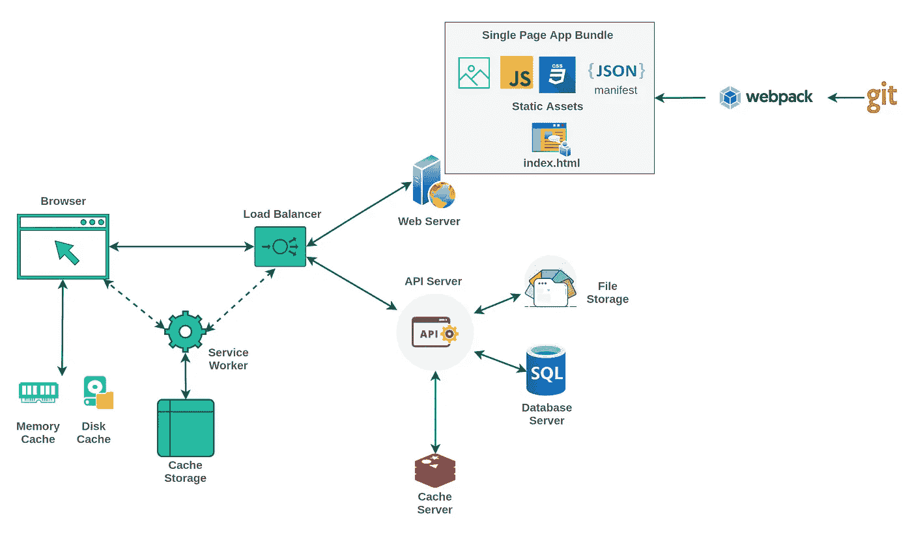
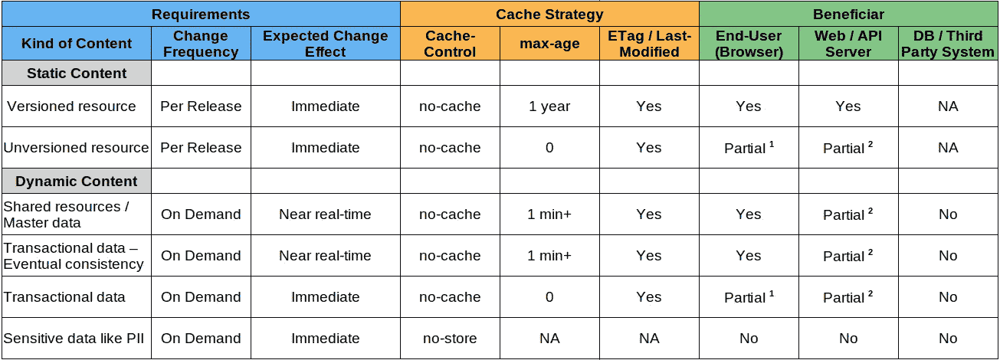
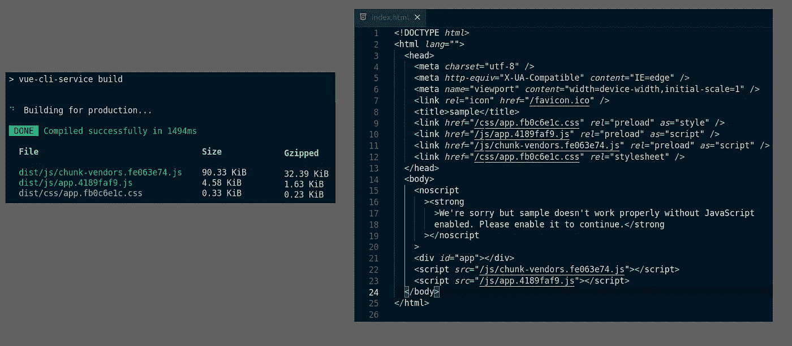
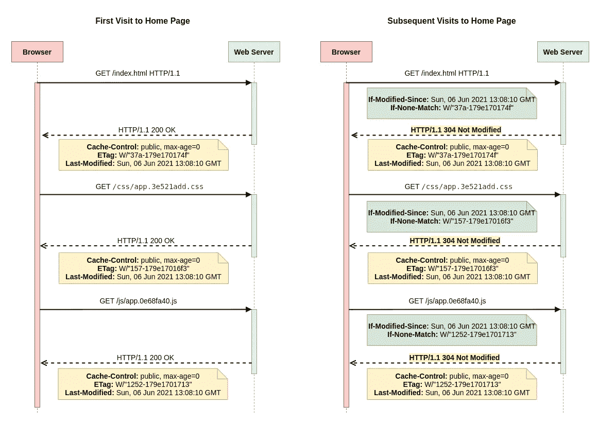
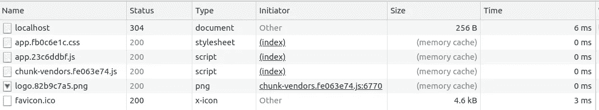
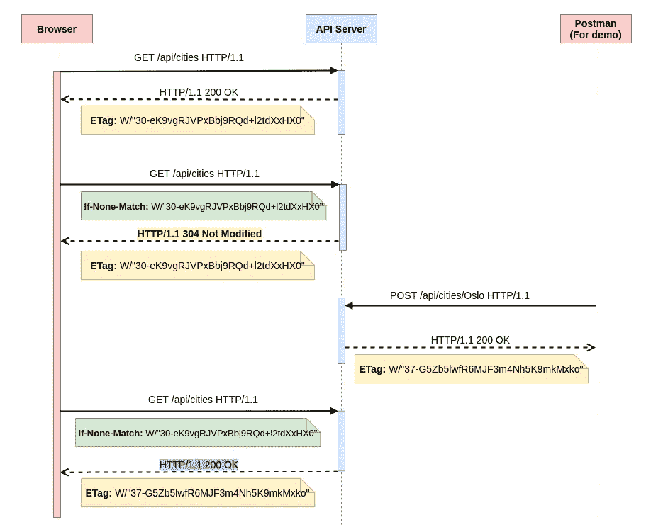

# Web 缓存解决方案的 360 度视图—第 1 部分

> 原文：<https://javascript.plainenglish.io/360-view-of-web-cache-solution-part-1-2210cb3024b4?source=collection_archive---------19----------------------->



必须根据内容的种类、更改频率以及与完成的事务相关的用户体验/期望来选择缓存策略。

缓存任何数据的好处应根据以下标准进行评定

1.  防止不必要的网络呼叫
2.  防止后端服务器(Web/API 服务器、数据库服务器和任何其他第三方系统)出现不必要的负载
3.  防止不必要的数据传输

**TL；博士**



*   *Partial 1 —每次刷新时，浏览器进行网络调用并传递 ETag。网络调用已经发生，只有当 ETag 与* *不同时，* ***数据才会被传输，因此浏览器得到部分好处。***
*   *Partial 2 —在每次调用时，Web/API 服务器需要* ***构建响应*** *并计算 ETag。网络调用已经发生，只有当 ETag 不同时，数据才被传输，因此 Web/API 服务器部分受益。*

为了获得更好的响应时间，实现 ETag 并选择一个好的 max-age (expiration)。如果您的目标是降低 DB 服务器或第三方系统的负担，那么在环境中包含一个缓存服务器。缓存服务器为你节省了一些钱，也提高了你的应用声誉。

Web 应用程序涉及以下几种内容

*   **静态资产**如 JS、CSS、图片、字体等。通常在新版本中会发生变化。更改频率取决于您的发布周期。这些资产可以被缓存几天甚至几年。
*   像 HTML(服务器端)和 API 响应这样的动态内容会经常改变。主数据是变化缓慢的实体，可以缓存几分钟。事务实体必须同步到分钟或秒钟。

浏览器和中间缓存(CDN 或代理服务器)使用以下 HTTP 头来实现更好的缓存管理。

*   **缓存控制** —无存储、无缓存、公共/私有、必须重新验证和最大年龄(过期)
*   **缓存验证头** — ETag(如果不匹配)和 Last-Modified(如果修改-自)

[](https://developer.mozilla.org/en-US/docs/Web/HTTP/Caching) [## HTTP 缓存- HTTP | MDN

### 通过重用以前获取的资源，网站和应用程序的性能可以显著提高…

developer.mozilla.org](https://developer.mozilla.org/en-US/docs/Web/HTTP/Caching) 

**(任何单页应用程序的)静态资产**

Webpack 帮助为每个包创建一个内容散列，并将它们包含在包文件名中。这些**版本化的资源**可以被缓存一年，而不用担心过时的问题。资源名称及其公共路径都包含在 HTML 文件中。

为了避免在重新生成包文件的过程中出现不必要的变化，我们需要识别并分割包。例如，特定于供应商的块、特定于路由(lazyload)的块等，应该作为一个单独的包来创建。，有关更多详细信息，请参考[网络包指南](https://webpack.js.org/guides/caching/)



Vue CLI build output for production based on the default configuration

**网络服务器**

为了简单起见，让我们使用**快速服务器**托管捆绑的资源。这些概念适用于 Nginx 和任何其他 web 服务器。

```
const *express* = *require*('express');
const *app* = *express*();
const *port* =3000;*app.use*(*express.static*('dist'));*app.listen*(port, () => {
*console.log*(`Example app listening at [http://localhost:${port}`);](http://localhost:${port}`);)
});
```

当我们访问主页时，将在 Chrome 浏览器中观察到以下行为。

*   第一次访问主页时，将下载所有静态资源
*   在随后的访问中，浏览器使用 ETag 检查 Web 服务器上的内容是否发生了变化。



Chrome browser network flow

**快递服务器(默认)**

*   为所有 HTTP 响应自动生成弱 [**ETag**](https://www.npmjs.com/package/etag)
*   在 HTTP 响应中发送所有静态资产的[](https://github.com/pillarjs/send/blob/master/index.js)

******Chrome 浏览器******

*   ****每当**最后修改的**在缓存的响应中可用时，发送 **If-Modified-Since******
*   ****每当 **ETag** 在缓存响应中可用时，发送 **If-None-Match******

****最终用户将不会从这种方法中获益，除非响应涉及几兆字节或更多。相反，防止不必要的网络调用可以提供更大的好处。****

******为除 HTML 文件之外的所有资产设置 maxAge******

****Express Server for Static Assets****

****对于给定的等于 1 年的 maxAge，浏览器将开始缓存并阻止网络调用。版本化的资源 URL 避免了过时问题。****

********

****Browser picks the response from the memory cache****

******API 服务器******

****为了简单起见，我们用 **Express Server** 来发布 API。这个概念适用于 SpringBoot、PHP 或任何其他框架/语言。****

****Sample Router — Cities****

```
*****// Vue code fragment*** *created*() {
  *axios.get*("/api/cities")*.then*((resp) => {
    *console.log*(`Response recieved: ${*resp.*status}`, resp);
    this*.cities.push*(*resp.*data);
  });
},**
```

********

****Chrome browser network flow****

******快递服务器(默认)******

*   ****为所有 HTTP 响应自动生成弱 [**ETag**](https://www.npmjs.com/package/etag)****
*   ****除非生成了响应有效负载，否则 Express 服务器不会自动生成 ETag。在生产场景中，只有在进行数据库或第三方系统调用后，有效负载才可用。****

******Chrome 浏览器******

*   ****每当 **ETag** 在缓存响应中可用时，发送【如果不匹配则 消息****
*   ******If-None-Match** 没有在 Axios 调用中明确添加，而是默认情况下浏览器发送额外的头****
*   ****即使浏览器收到 HTTP 304 作为响应，Axios 调用也会收到 HTTP 200 以及从浏览器缓存中选取的有效负载****

****总的来说，这个流程为 Web 服务器和最终用户提供了有限的好处。对数据库服务器/第三方系统没有任何好处。****

****我们需要根据陈旧性的接受程度引入 **maxAge** (没有一刀切)。这个设置可以减轻后端服务器的负担。****

```
***// sample code 
router.get*('/cities', (_, res) => {
  *res.set*('Cache-control', 'public, **max-age=300**');
  *res.json*(cities);
});**
```

> ******缓存控制** : **无缓存**对于那些在每次使用前都需要服务器重新验证的资源。
> **Cache-Control:不存储**不应该缓存的资源。
> **和 ETag 或 Last-Modified 头**可以帮助您更有效地重新验证过期的缓存资源。****
> 
> ******来源:** [用 HTTP 缓存防止不必要的网络请求](https://web.dev/http-cache/)****

******结论******

****从应用程序开发的一开始，缓存策略就应该包含在您的架构和设计考虑中。当实施适合您的时间和预算时，可以进行实施。希望分享的信息提供一个视角。通过评论分享你的想法或建议。****

****如果你喜欢这个想法，我将在第 2 部分分享我关于缓存服务器和服务工作者的想法，直到快乐编码。****

******延伸阅读******

*   ****[“使用 HTTP 缓存防止不必要的网络请求”，作者杰夫·波斯尼克和伊利亚·格里戈利克](https://web.dev/http-cache/)****
*   ****[“缓存最佳实践”，作者杰克·阿奇博尔德](https://jakearchibald.com/2016/caching-best-practices/)****
*   ****[“利用长期缓存”作者 Ivan Akulov](https://developers.google.com/web/fundamentals/performance/webpack/use-long-term-caching)****

*****更多内容请看*[*plain English . io*](http://plainenglish.io/)****