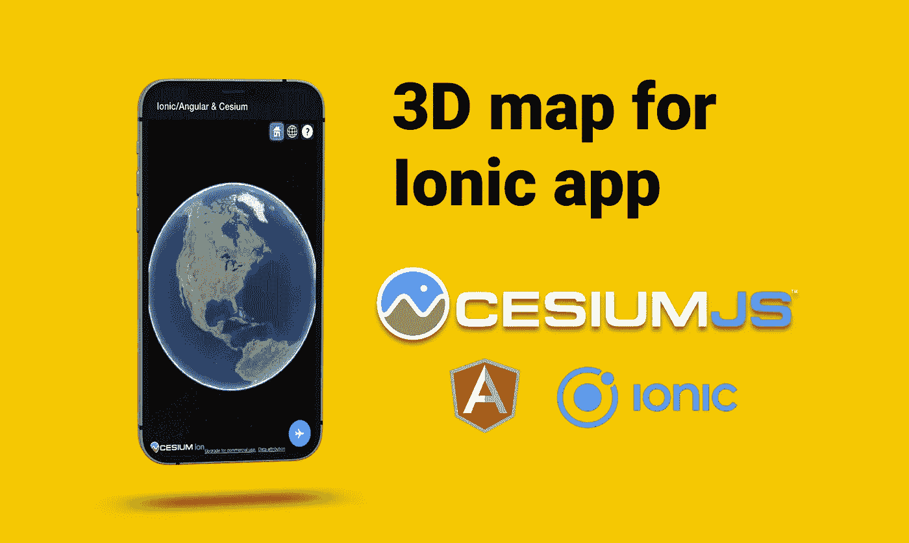
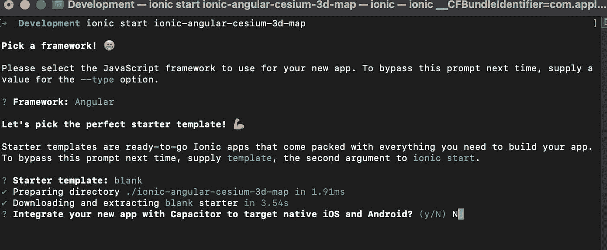
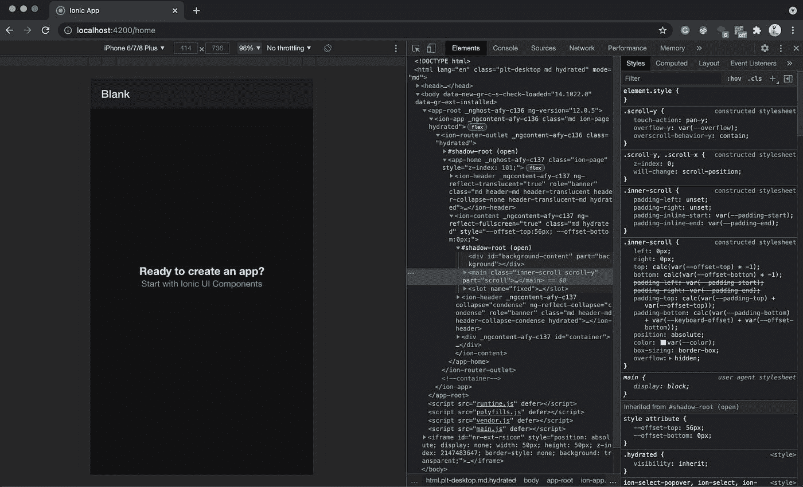
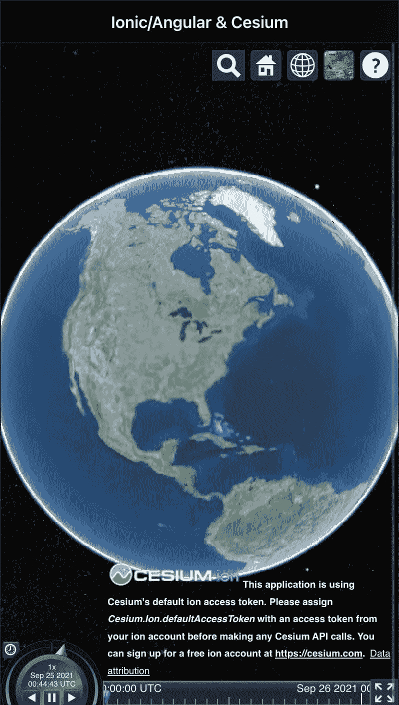
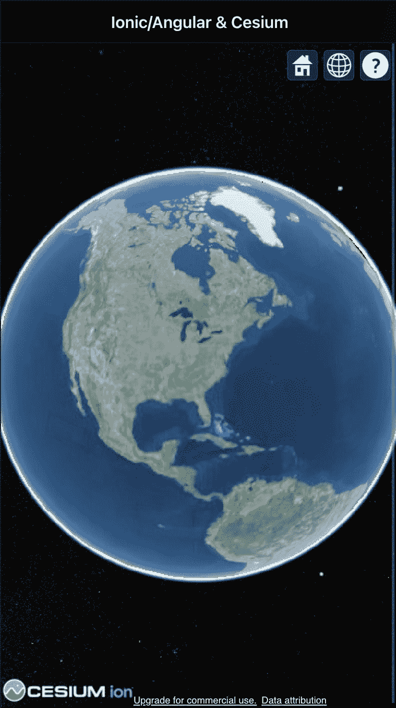
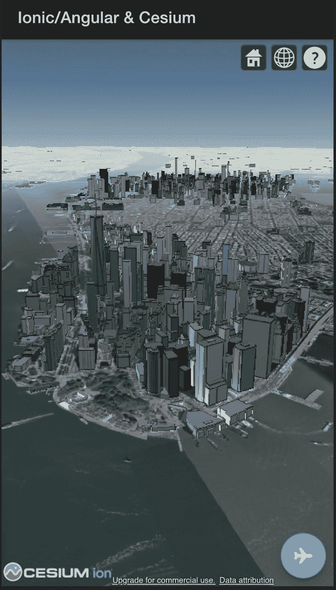

# 适用于 Ionic 应用的 3D 地图

> 原文：<https://javascript.plainenglish.io/3d-map-for-your-ionic-app-6ea2b41cc178?source=collection_archive---------6----------------------->

## 使用 CesiumJS 将 3D 地图添加到 Ionic 应用程序中



嗨，朋友们！👋

帕勒姆在这里，另一个分步指南。

在本文中，我们将创建一个 Ionic/Angular 应用程序，该应用程序使用 CesiumJS 来渲染 3D 地图，并在其上渲染一些 3D 图层来显示地形和建筑物。

3D 地图非常棒😎三维可视化数据可以让它更上一层楼。🤭

如果您只需编写一行代码就可以在浏览器中呈现 3D 地图，那会怎么样？

没错，使用 CesiumJS，你可以在你的 app 里轻松拥有一张 3D 地图。

快速预览一下最终结果是什么:

# 什么是 CesiumJS？

> CesiumJS 是一个开源的 JavaScript 库，用于创建具有最佳性能、精度、视觉质量和易用性的世界级 3D 地球仪和地图。

要了解 CesiumJS 的能力，请查看他们的一些[示例](https://sandcastle.cesium.com/)。

以下是你可以从本教程中学到的内容以及每个部分的难度:

*   使用 Ionic CLI 创建一个空白应用程序。
    您将学习如何使用 Ionic CLI 创建 Ionic/Angular 应用程序。(难度:简单)
*   使用 CesiumJS 渲染一个地图
    你将学习如何实现一个基本的地图整合与离子，铯&角。(难度等级:中级)
*   使用铯照相机
    你将学习如何使用铯照相机 flyTo 方法飞到目的地。(难度等级:中级)

下面是最后的演示链接:
[ionic-angular-铯-3d-map.vercel.app](https://ionic-angular-cesium-3d-map.vercel.app/)

而这里是 Git 回购:
[github.com/pazel-io/ionic-angular-cesium-3d..](https://github.com/pazel-io/ionic-angular-cesium-3d-map)

# 我们开始吧

# 1.使用 Ionic CLI 创建基础应用程序

如果您之前没有安装 Ionic CLI，请前往[ionicframework.com/docs/intro/cli](https://ionicframework.com/docs/intro/cli)并按照说明安装 CLI。

接下来，让我们通过运行`ionic start ionic-angular-cesium-3d-map`使用 CLI 创建一个应用程序。CLI 应提示您选择前端技术和更多选项。

我将与角和空白启动项目。

Ionic CLI 询问您是否喜欢电容集成，本教程不需要。选择选项后，CLI 将下载所有必需的 npm 软件包。(这可能需要几分钟)您最终会看到一些日志，表明设置已经完成。



让我们转到刚刚创建的新项目，并运行`ionic serve`。此命令将运行本地 web 服务器，并在默认浏览器中打开应用程序。(默认端口为 8100)



# 2.使用 CesiumJS 渲染地图

这里涉及到三个部分来实现它。

*   铯 JavaScript 文件
*   铯 CSS 文件
*   铯资产文件

从添加铯 npm 包开始`npm install --save cesium`

## 以角度配置铯

现在我们已经安装了铯，我们需要在我们的项目中包含它的文件(CSS 和必要的资产)。我们可以使用位于项目根目录下的 angular.json 来添加这些文件。打开 angular.json，在 styles 部分添加 CSS 文件，并在 assets 数组中添加整个 build 铯文件夹。

```
"assets": [
{
"glob": "**/*",
"input": "node_modules/cesium/Build/Cesium",
"output": "./assets/cesium"
},
],
"styles": [
"node_modules/cesium/Build/Cesium/Widgets/widgets.css",
"styles.css"
]
```

## 显示查看器

我们将使用主组件来托管铯原子观测器。铯所需要的只是有一个对指定用于呈现地图的 DOM 元素的引用。

在 Angular 中，最简单的方法是使用配置视图查询的`@ViewChild`属性装饰器。视图查询是在调用`ngAfterViewInit`回调之前设置的。

这是您需要添加到`home.component.html`中的内容

```
<div class="my-cesium" #myCesium></div>
```

这是访问`home.component.ts`中`myCesium`元素的代码。

```
@ViewChild('myCesium')
public myCesium: ElementRef;
```

下一件事是初始化铯观察器。为此我们使用了有角度的`AfterViewInit`钩子来确保我们的 ElementRef 首先被初始化。

接下来，您需要将 DOM 引用传递给`Cesium.Viewer`构造函数。

```
import * as Cesium from 'cesium';public ngAfterViewInit(): void {
    const viewer = new Cesium.Viewer(this.myCesium.nativeElement);
}
```

恭喜你。现在，您应该可以在主页上看到一个 3D globe，它带有一些默认的铯控件。



我们可以通过更多的配置来定制铯原子观测器。查看[铯文件](https://cesium.com/learn/ion-sdk/ref-doc/Viewer.html#.ConstructorOptions)获取选项的完整列表。

为了简化我的移动视图，我将禁用其中一些默认选项。下面是更新后的代码。

```
public ngAfterViewInit(): void {
    if (environment.cesiumAccessToken) {
    Cesium.Ion.defaultAccessToken = environment.cesiumAccessToken;
}
this.viewer = new Cesium.Viewer(this.myCesium.nativeElement, {
    //Use Cesium World Terrain
    terrainProvider: Cesium.createWorldTerrain(),
    //Hide the base layer picker
    baseLayerPicker: false,
    // homeButton: false,
    geocoder: false,
    timeline: false,
    animation: false,
    fullscreenButton: false,
});
}
```

有几件事需要注意

*   `terrainProvider`将地形数据添加到您的地球，以便您在查看表面时可以看到这些地形。相当整洁。
*   `defaultAccessToken`删除使用默认访问令牌时显示的消息。

您可以创建一个帐户，[免费获得访问令牌](https://cesium.com/ion/tokens)用于非商业用途。

这是结果



# 3.使用铯照相机

下一站，我们将向地球添加一些 3D 建筑数据，并从初始位置飞往建筑。

当我们创建铯查看器时，我们隐式地构建了一个[铯。场景](https://cesium.com/learn/ion-sdk/ref-doc/Scene.html)。

`Cesium.Scene`是铯虚拟场景中所有 3D 图形对象和状态的容器，它引用了[铯。相机](https://cesium.com/learn/ion-sdk/ref-doc/Camera.html)

`Cesium.Camera`让我们飞到一个地点。

```
this.viewer.scene.camera.flyTo({
    destination: Cesium.Cartesian3.fromDegrees(-74.019, 40.6912, 750),
    orientation: {
        heading: Cesium.Math.toRadians(20),
        pitch: Cesium.Math.toRadians(-20),
    },
})
```

在上面的代码中，我们告诉铯从当前位置飞到目的地。在本例中，目的地以度数(经度、纬度、高度)提供。我们也在设置摄像机的方向。

接下来，让我们添加一些 3D 建筑数据。铯已经有一个内置层，你也可以添加你的数据。

内置的一层被称为`Cesium OSM Buildings`层，这是一个全球基础层，包含来自 OpenStreetMap 数据的超过 3.5 亿座建筑物。它被用作 3D 瓦片，这是由铯创建的开放标准。

```
this.viewer.scene.primitives.add(Cesium.createOsmBuildings());
```

接下来，我们添加一个 Ionic Fab 按钮，让我们飞到目的地。

```
<ion-content [fullscreen]="true">
    <div class="my-cesium" #myCesium></div>
    <ion-fab vertical="bottom" horizontal="end" slot="fixed">
        <ion-fab-button (click)="letsGo()">
            <ion-icon name="airplane"></ion-icon>
        </ion-fab-button>
    </ion-fab>
</ion-content>
```

这是组件的代码

```
public letsGo() {
    const slow$ = of(this.viewer);
    slow$
        .pipe(
            take(1),
            tap(() => this.viewer.scene.camera.flyTo({
                destination: Cesium.Cartesian3.fromDegrees(-74.019, 40.6912, 750),
                orientation: {
                    heading: Cesium.Math.toRadians(20),
                    pitch: Cesium.Math.toRadians(-20),
                },
            })),
            delay(2000),
            tap(() => {
                if (!this.osmBuildingInit) {
                    this.viewer.scene.primitives.add(Cesium.createOsmBuildings());
                }
            }),
            tap(() => this.osmBuildingInit = true),
        )
        .subscribe();
}
```

我使用 RxJS 在飞行和添加建筑数据之间添加一些延迟，但是你可以一次完成。

现在，如果你点击 fab 按钮，你将飞到目的地，并看到一些三维建筑数据。



如果你对添加你的 3D 数据感兴趣，参考这篇铯文章[在 3D 城市中可视化一个提议的建筑](https://cesium.com/learn/cesiumjs-learn/cesiumjs-interactive-building/)

# 结论

就地图和地理空间数据而言，CesiumJS 是最先进的 3D 库之一。

我们学会了如何使用它来轻松地将 3D 地图体验集成到 Ionic 应用程序中。

这个例子使用的是 Angular，但是正如你所看到的，所有繁重的工作都是由铯完成的，所以你用什么样的 JS 框架和你的 Ionic 是你的偏好。

感谢阅读。像往常一样，如果你有任何问题，请在这里给我留言或在 Twitter 上给我发 DM。

# 资源

下面是演示:[使用 Vercel](https://ionic-angular-cesium-3d-map.vercel.app/) 部署的演示

这里是代码库:[离子角铯 3d 地图](https://github.com/pazel-io/ionic-angular-cesium-3d-map)

# 接触

推特:[_ 帕泽尔](https://twitter.com/_pazel)

*更多内容请看*[***plain English . io***](http://plainenglish.io/)