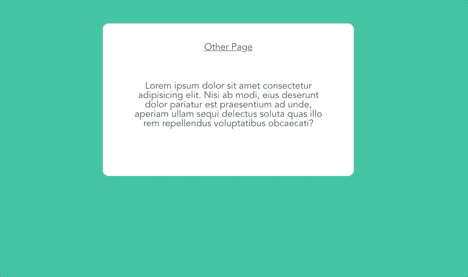
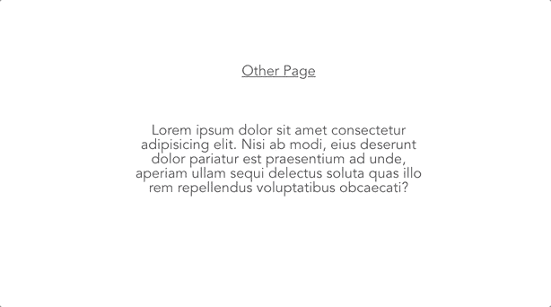
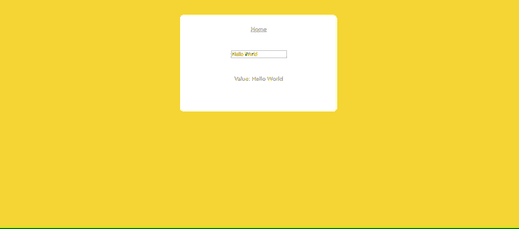
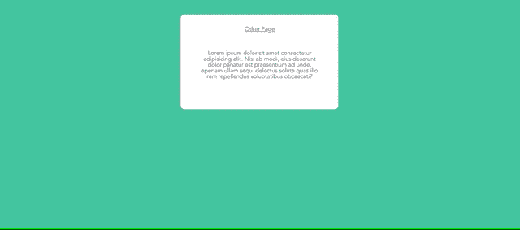

# Vue 路由器转变的 4 个令人惊叹的例子

> 原文：<https://javascript.plainenglish.io/4-awesome-examples-of-vue-router-transitions-edfd4db99b6a?source=collection_archive---------7----------------------->

Vue 路由器转换是为 Vue 应用程序添加一些特色的快速简单的方法。它们允许你在应用程序的不同页面之间添加[平滑动画/过渡](https://learnvue.co/2020/02/vuejs-animations-for-beginners/)。

如果使用得当，它们可以让你的应用感觉更现代、更专业，从而提升用户体验。

在本教程中，我们将了解使用 Vue 路由器转换的基本知识，然后我们将介绍几个基本示例，以给你一些关于从哪里开始的启发。

这是我们将要创建的四个页面过渡之一。



好吧——说得够多了。让我们直接开始吧。

## 将 Vue 路由器过渡添加到您的应用中

通常，您的 Vue 路由器设置如下所示

```
<template>
  <router-view />
</template>
```

在旧版本的 Vue 路由器中，我们可以简单地用`<transition>`组件包装`<router-view>`。

然而，在较新版本的 Vue 路由器中，我们必须使用 v 槽来析构我们的道具，并将它们传递给我们的内部槽。这个 slow 将包含一个被过渡组件包围的动态组件[。](https://learnvue.co/2020/01/an-overview-of-vuejs-dynamic-components/)

```
<router-view v-slot="{ Component }">
  <transition>
    <component :is="Component" />
  </transition>
</router-view>
```

## 每条路线有不同的过渡

默认情况下，用`<transition>`包装`<component>`会在应用程序的每条路线上添加相同的过渡。

有两种不同的方法可以为每条路线定制过渡。

## 将过渡移动到单个组件中

首先，我们可以将`<transition>`移入每个单独的组件，而不是用转换组件包装我们的动态组件。大概是这样的:

```
<template>
  <transition>
    <div class="wrapper">
      <!-- -->
    </div>
  </transition>
</template>
```

依此类推，我们希望每条路线都有一个过渡。这样，我们可以通过更改过渡的名称来自定义每条路线。

## 使用 v-bind 的动态转换

我们的另一个选择是将转换的名称绑定到一个变量。然后，我们可以根据我们的记忆动态地改变这个变量。

以下是来自 [Vue 路由器文档的示例。](https://router.vuejs.org/guide/advanced/transitions.html%23route-based-dynamic-transition)使用当前路线上的观察器动态设置`transitionName`变量。

```
<transition :name="transitionName">
  <component :is="Component" />
</transition>watch: {
  '$route' (to, from) {
    const toDepth = to.path.split('/').length
    const fromDepth = from.path.split('/').length
    this.transitionName = toDepth < fromDepth ? 'slide-right' : 'slide-left'
  }
}
```

现在我们已经了解了 Vue 路由器转换的基础知识，让我们来看看一些非常棒的例子。

## 1.Fade Vue 路由器转换

添加渐变页面过渡可能是我们可以添加到 Vue 应用程序中的最简单的事情之一。

我们可以通过改变元素的不透明度来达到这个效果。

首先，让我们创建名为 fade 的 Vue 路由器过渡。另一件要注意的事情是，我们将转换的模式设置为“out-in”。

有 3 种不同的过渡模式:

1.  默认-进入和离开转换同时发生
2.  in-out 新元素先过渡。然后，当前元素过渡出来。
3.  出入-当前元素首先过渡出。然后，新元素会过渡到。

为了让我们的新元素平滑地淡入，我们需要在开始新的过渡之前让当前元素消失。所以一定要用`mode="out-in"`。

```
<router-view v-slot="{ Component }">
  <transition name="fade" mode="out-in">
    <component :is="Component" />
  </transition>
</router-view>
```

`<transition>`给出了几个在动画周期中动态添加/删除的 CSS 类。

有 6 个不同的过渡类(3 个用于进入，3 个用于离开)。

*   `v-enter-from` / `v-leave-from`:过渡开始状态；过渡开始后移除
*   `v-enter-active` / `v-leave-active`:过渡活跃状态
*   `v-enter-to` / `v-leave-to`:过渡的结束状态

注意:当你给你的转换一个名字属性时，这些是默认的名字。类的格式是`name-enter-from`、`name-enter-active`等等。

我们的淡入淡出过渡将有像`fade-enter-from`这样命名的类。

我们希望进入和离开状态的不透明度为 0。然后，当我们的过渡是活跃的，我们希望不透明度动画。

我们甚至不需要将不透明度设置为 1，因为 fade-enter-from 和 fade-leave-to 类在动画过程中被删除了。这将导致我们的元素自动设置为默认的不透明度 1！

```
.fade-enter-active,
.fade-leave-active {
  transition: opacity 0.5s ease;
}

.fade-enter-from,
.fade-leave-to {
  opacity: 0;
}
```

有了一些虚拟组件，这就是我们的过渡看起来的样子。



## 2.幻灯片 Vue 路由器过渡

我们要构建的下一个过渡是页面幻灯片过渡。

模板将如下所示。因为我们希望进入和离开转换同时发生，所以我们**不想**为我们的转换设置一个特殊的模式。

```
<router-view v-slot="{ Component }">
  <transition name="slide">
    <component :is="Component" />
  </transition>
</router-view>
```

为了让我们的例子更容易看，我让每个组件的宽度为 100%,占用至少 1 vh。我也给了每个背景颜色。

```
.wrapper {
  width: 100%;
  min-height: 100vh;
}
```

最后，我们的过渡风格将动画显示组件的绝对位置，以便将它们滑入。如果你想要不同的滑动方向，你只需要改变你正在设置的 CSS 属性(上、下、左、右)。

```
.slide-enter-active,
.slide-leave-active {
  transition: all 0.75s ease-out;
}

.slide-enter-to {
  position: absolute;
  right: 0;
}

.slide-enter-from {
  position: absolute;
  right: -100%;
}

.slide-leave-to {
  position: absolute;
  left: -100%;
}

.slide-leave-from {
  position: absolute;
  left: 0;
}
```

这是我们的最终结果。


## 3.扩展 Vue 路由器过渡

创建缩放过渡与渐变过渡非常相似。我们再次希望将模式设置为`out-**in**`，这样我们可以确保动画的正确顺序。

```
<router-view v-slot="{ Component }">
  <transition name="scale" mode="out-in">
    <component :is="Component" />
  </transition>
</router-view>
```

然后，我们希望我们的样式改变元素的不透明度和`transform: scale`。

```
.scale-enter-active,
.scale-leave-active {
  transition: all 0.5s ease;
}

.scale-enter-from,
.scale-leave-to {
  opacity: 0;
  transform: scale(0.9);
}
```

我注意到让这个过渡看起来更干净的一点是给你的整个网页一个黑色的背景色。你可以通过设置你的 html，正文或者`#app`颜色为`#000000`来实现。

这是完成的音阶转换。



## 4.组合 Vue 路由器转换

当然——创造过渡的可能性是无穷无尽的。

然而，我认为重要的是不要过度过渡。它们应该是小而微妙的增强，而不是你应用程序中的主要干扰。

我认为一个很好的技术是结合一些更基本的过渡。

例如，让我们将幻灯片的放大和缩小合并成一个过渡。

```
<router-view v-slot="{ Component }">
  <transition name="scale-slide">
    <component :is="Component" />
  </transition>
</router-view>.scale-slide-enter-active,
.scale-slide-leave-active {
  position: absolute;
  transition: all 0.85s ease;
}

.scale-slide-enter-from {
  left: -100%;
}

.scale-slide-enter-to {
  left: 0%;
}

.scale-slide-leave-from {
  transform: scale(1);
}

.scale-slide-leave-to {
  transform: scale(0.8);
}
```

这是我们的成品！



我觉得挺好看的！

## 结论

这只是为了给你一个如何开始创建一些惊人的 Vue 路由器转换的想法，并希望激励你开始自己玩！

我很想看看你在下面的评论中有什么想法。

如果有任何问题，请告诉我！

[如果您有兴趣了解更多关于 Vue 3 的知识，请下载我的免费 Vue 3 备忘单，其中包含基本知识，如组合 API、Vue 3 模板语法和事件处理。](https://learnvue.co/vue-3-essentials-cheatsheet/)