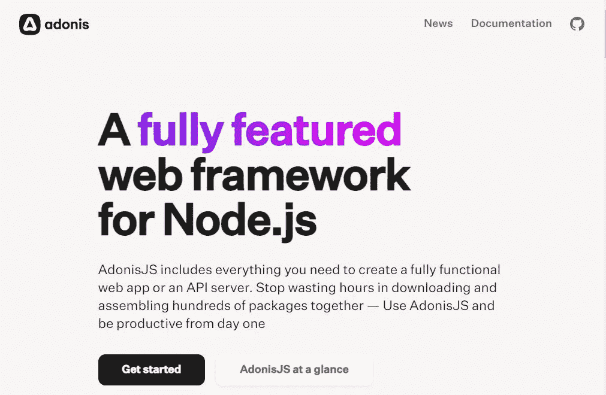
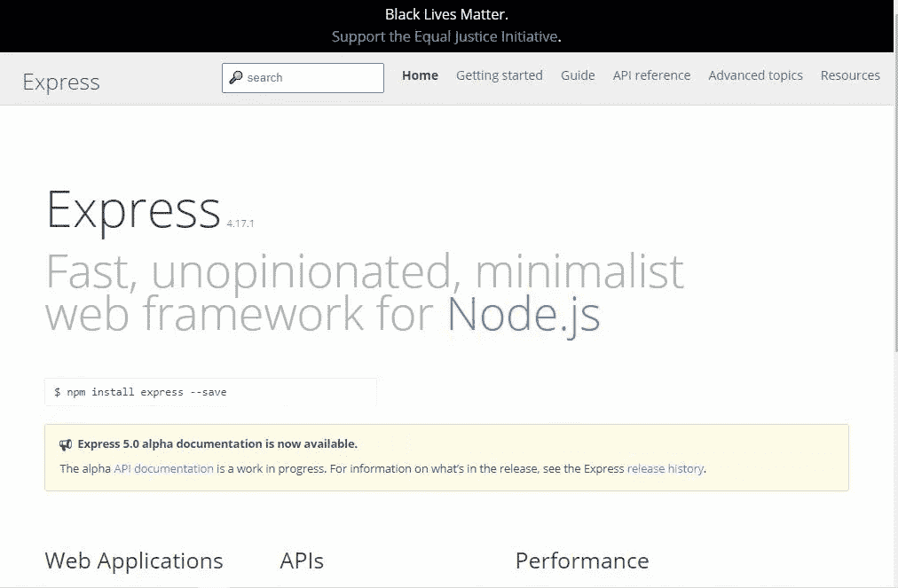
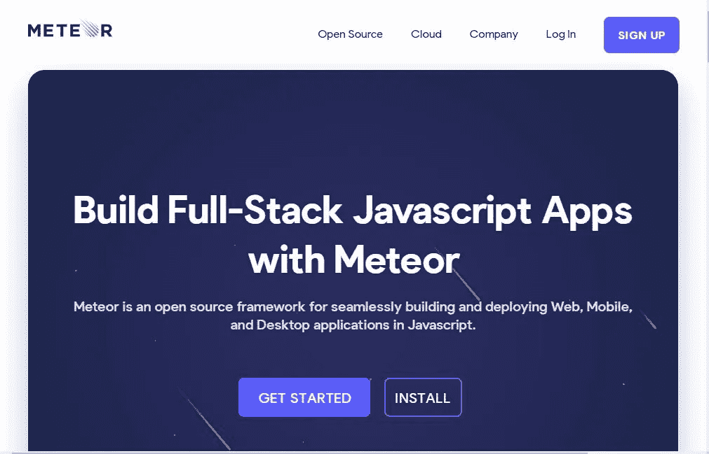

# 4 个后端 JavaScript 框架，看看你是不是前端开发人员

> 原文：<https://javascript.plainenglish.io/4-backend-javascript-frameworks-to-check-out-if-you-are-a-frontend-developer-bb09cfa6d25b?source=collection_archive---------16----------------------->

## 想学后端？然后查看这些框架。

Photo by [True Agency](https://unsplash.com/@trueagency?utm_source=medium&utm_medium=referral) on [Unsplash](https://unsplash.com?utm_source=medium&utm_medium=referral)

如果你是一个前端开发人员，有相当不错的后端语言可供你参考。如果你想转型并了解后端是如何工作的，后端技术是非常方便的。这也可能是你向全栈职业转型的更好机会。

如果你是一名前端开发人员，那么毫无疑问你已经熟悉了 JavaScript。

JavaScript 几乎驱动了移动和 web 开发的大多数平台。因为一种语言能够处理多种平台，包括移动开发，所以不那么麻烦。

Nodejs 的出现使得在服务器/后端运行 JavaScript 代码成为必要。

在本文中，我们将研究一些后端 JavaScript 框架。任何想进入后端的前端开发者都可以看看这些框架。

## 1.阿多尼斯

Adonisjs

Node.js 的全功能 web 框架。AdonisJS 包括创建全功能 web 应用程序或 API 服务器所需的一切。

Adonis 是开发后端应用程序最流行的 JavaScript 框架之一。据 NPM 称，AdonisJS 每周下载量超过 3000 次。

对于那些使用过 PHP laravel 的人来说，它的应用程序架构有点类似于 laravel。

AdonisJS 很容易掌握，使用起来也很可爱。

查看 Adonisjs 官方文档[**这里**](https://adonisjs.com) 。

## **2。快递**

Express

根据 express 文档，它是 Node.js 的一个快速、非个性化、极简的 web 框架。

Expressjs 是最常用的 JavaScript 框架之一。由此产生的统计数据并不在于大约 17，407，496 的周下载量。由此可见开发者对这个框架的喜爱程度。

Express 提供了一种简单的方法来构建后端服务器，并且易于遵循。

查看 express 文档 [**这里的**](https://expressjs.com) 来了解这个框架的更多信息。

## **3。流星**

Meteor

根据 Meteor 文档，它是一个用 JavaScript 无缝构建和部署 Web、移动和桌面应用程序的开源框架。

根据 NPM 的数据,《流星》每周有大约 570 次下载。

Meteor 将自己定义为一个全栈框架，这意味着它服务于移动、web 和桌面应用。

要了解更多关于 Meteor 的信息，请使用此 [**链接查看它的文档。**](https://www.meteor.com.)

## **4。Koa**

Koa framework

根据 Koa 的说法，它是 Express 背后的团队设计的一个新的 web 框架，旨在成为一个更小、更具表现力、更健壮的 web 应用程序和 API 的基础。通过利用异步函数，Koa 允许您放弃回调并显著提高错误处理能力。Koa 在其核心中没有捆绑任何中间件，它提供了一套优雅的方法，使得编写服务器变得快速而愉快。

使用此 [**链接**](https://koajs.com.) 查看 Koa 文档

## **出发前**

简单回顾一下，我们已经了解了一些最流行的后端 JavaScript 框架。

你还在等什么？去试试吧。

我希望这篇文章对你有所帮助。请在评论区告诉我，不要犹豫分享。

## **更多阅读:**

 [## 为什么你应该考虑为开源做贡献

### 为开源做贡献的好处。

javascript.plainenglish.io](/why-you-should-consider-contributing-to-open-source-f8210d48804d)  [## 学习算法和数据结构的 5 个平台

### 利用这些网站学习数据结构和算法。

javascript.plainenglish.io](/5-platforms-to-learn-algorithms-and-data-structures-3152238de56c) 

*更多内容请看*[*plain English . io*](http://plainenglish.io/)