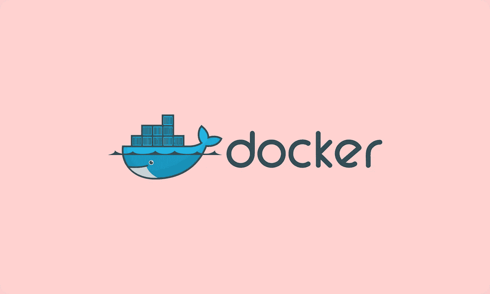
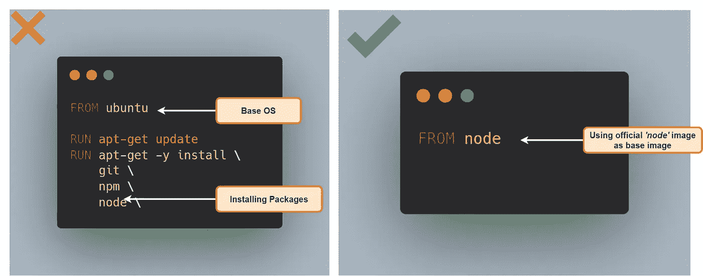
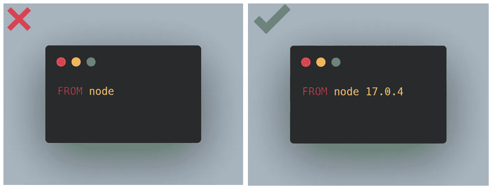
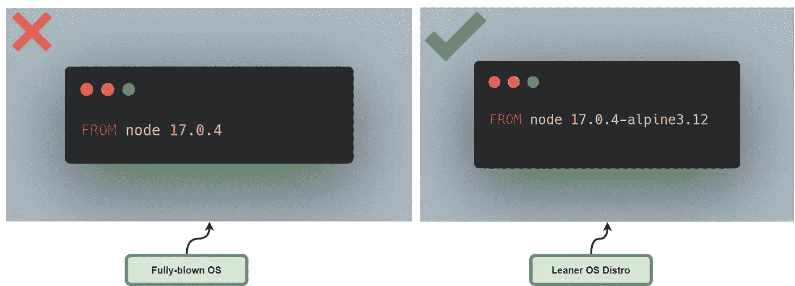
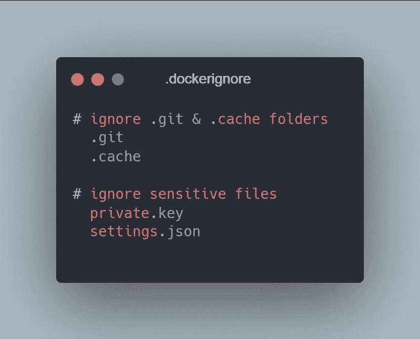

# Docker 的 4 个最佳实践

> 原文：<https://javascript.plainenglish.io/4-best-practices-for-docker-cf52573dafb8?source=collection_archive---------12----------------------->

## 利用 Docker 在生产中更好地构建

## 1.使用官方 Docker 图像作为基础图像

在处理一个新项目和设置一个新的 Docker 环境时，一定要确保使用一个正式的 Docker 映像作为基础映像。这使得你的 Docker 文件更加****轻量级*** 相比使用一个基本的 OS 系统镜像并自己安装所有需要的包。*

****例如:****

**

## *2.不要使用随机的最新标签*

*有时你可能会因为 Docker 中不同版本的包而陷入麻烦。*例如，*假设在之前的版本中，您使用的是**节点版本 16** ，但是后来当您将 Node 安装为基础映像时，您将获得更高的版本(**节点版本 17** )。*

*要解决这个问题，建议在安装包时避免使用*随机最新标签*。*

> *简单地说，总是试图固定 Docker 中的包或图像的版本。*

**

## *3.使用小尺寸图像*

*如果我们在 *Docker hub* 上查看，不同的**操作系统**有多个版本的官方映像，因此开发者最终会使用基于成熟操作系统的官方映像。*

*   *如果图像基于成熟的操作系统，如 **Ubuntu** 、 **CentOS** 等，它们将加载许多您不需要的操作系统功能，这会导致图像更大。*
*   *对于在生产级应用程序中工作的开发人员来说，大型映像可能会成为一个问题，因为该映像需要在**存储库**和**部署服务器** &上有更多的空间，而且当您必须从存储库中 ***拉*** 或 ***推*** 映像时，会花费更多的时间。*
*   *此外，这些图像具有更高的安全漏洞，这样您可能不得不在一开始就面临意想不到的安全问题。*

> *但是在基于小操作系统的映像中，它们只包含必要的工具(例如:Busybox)，所以建议使用基于更精简和更小的操作系统发行版的映像。*

**

## *4.使用。dockerignore 文件*

*使用**。dockignore** 文件与我们如何使用**非常相似。Git ignore*Git*中的**文件，因为有时候我们想在应用程序中排除一些文件和文件夹。在一个新的映像中使用 Docker 时，您不需要映像中的所有东西，例如自动生成的文件夹**(目标&构建)** **自述文件**等。*

*   *为了缩小图像尺寸，应该使用 ***。要在**根目录**下创建的*文件**列出所有你想忽略的文件和文件夹。*

****例如:****

*** [## 6 自学成才的开发人员的 UI/UX 设计原则

### 提升你的自学程序员之旅。

javascript.plainenglish.io](/6-ui-ux-design-principles-for-self-taught-developers-c6326f6d9c0d)  [## 面向专业开发人员的 3 个专业 Git 特性

### 面向专业开发人员的高级 Git 特性。

javascript.plainenglish.io](/3-pro-git-features-for-pro-developers-1b8c649e3f4e)  [## JavaScript 中的 Object.freeze()与 Object.seal()

### 理解 JavaScript 中的不变性

javascript.plainenglish.io](/object-freeze-vs-object-seal-in-javascript-4f66f7d24754) 

*更多内容看* [***说白了。*** *报名参加我们的*](http://plainenglish.io/) [***免费每周简讯这里***](http://newsletter.plainenglish.io/) ***。****