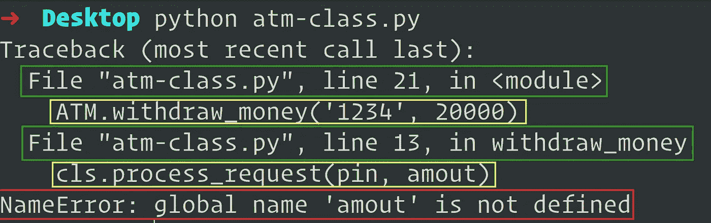

# 困扰初级开发人员的 4 个常见计算机编程术语

> 原文：<https://javascript.plainenglish.io/4-common-computer-programming-terms-that-confuse-entry-level-developers-475d253af46?source=collection_archive---------12----------------------->

## 编程术语、术语和行话对于有效的开发人员交流和协作是必不可少的。

Photo by [Startup Stock Photos](https://www.pexels.com/@startup-stock-photos?utm_content=attributionCopyText&utm_medium=referral&utm_source=pexels) from [Pexels](https://www.pexels.com/photo/two-women-sitting-in-front-of-computer-monitor-7374/?utm_content=attributionCopyText&utm_medium=referral&utm_source=pexels)

我喜欢成对编程。

我喜欢在跟踪和修复错误时这样做。我喜欢逻辑分析、解决问题，以及提出实用的、有时是非常优化的解决方案。

我更喜欢与初级开发人员结对编程，因为他们有时经验很少，刚刚开始尝试。

与入门级开发人员配对编程让我有机会体会到语言和无处不在的语言是多么重要。

技术术语、术语和行话是有效沟通的必要条件。这是你如何表达意图，并引出一个准确的反应或行动。

与初级开发人员一起工作，我有无数次的经验，我要求一个人执行某个动作。但是几秒钟后我注意到了犹豫和不作为。我又重复了一遍这个命令，然后又重复了几次，还是什么也没有，只是无所作为，伴随着死一般的沉默和茫然的凝视。

早期，我将这种犹豫和不作为解释为入门级开发人员缺乏理解或技能。但是我现在知道，他们的不作为、犹豫和茫然的眼神并不代表他们缺乏合理的知识或技能，不管他们使用的是什么编程语言。

这实际上是一次交流的中断。

许多初级开发人员了解他们选择的编程语言和语法。他们所缺乏的是其他重要的和值得称赞的通用编程术语、术语和行话。他们可以写类似于`author = Author('Samuel Mensah')`的东西，但不知道在编程术语中这是一个对象或类的实例化。

这意味着在成对编程会话中，当你要求开发人员实例化一个对象或类时，他们会冻结，不知道你的意思和对他们的期望。

在这篇文章中，我分享了一些术语，这些术语是我从一些开发人员那里学到的，大部分是初级开发人员感到困惑的。

注意:代码示例是用 Python 写的。

# 类实例化

这是一个类的实例的派生。当你创建一个类时，你创建了一个新的对象类型——我们也可以把它看作一个蓝图。

当您实例化该类时，您创建了一个具有不同数据属性和行为的不同对象。

存储在实例化对象的不同数据属性中的任何数据都是被实例化的对象所拥有和可用的。其他实例也有自己独特的属性。

类实例化创建了一个对象，也称为实例对象。

## 例子

# 函数/方法参数和自变量

一些开发人员混淆了这两个术语的含义:实参和形参。在代码审查和成对编程中，它们可以互换使用。但这两者有一些不同之处。

1.  参数是函数定义中列出的变量
2.  参数是在函数调用期间传递给函数的实际值
3.  参数决定了函数的签名(这实际上是一些开发人员碰到的下一个术语)
4.  在函数调用期间传递的参数被映射到参数，然后这些参数被用作函数中的局部变量。

上面的代码片段可以描述为

*   第 2–4 行是一个函数定义`send_money`，有三个参数`amount`、`currency_code`和`recipient_name`
*   第 8 行是对函数`send_money`的调用，传递给它三个参数`200`、`USD`和`Felix Otoo`

# 函数/方法签名

这也是另一个术语，让一些开发人员冻结，不确定你说的是什么意思。

函数或方法签名只是指一个函数，它有多少个参数，参数的顺序和这些参数的类型。

函数或方法签名松散地表示函数的身份。签名帮助您将一个函数或方法与另一个区别开来。

几乎所有的编程语言都不允许用同一个签名声明多个函数。我的意思是两个或更多的功能有相同的

1.  函数名
2.  参数数量
3.  参数排序
4.  参数类型

尽管这在许多语言中是不允许的，但 Java 和 C++等强类型语言支持重载的概念，重载基本上是两个或多个同名的函数，至少在以下一个方面有所不同:

*   参数数量
*   参数排序
*   参数类型

# 堆栈跟踪

嗯，这是另一个在软件开发生涯的早期阶段让开发人员感到困惑的术语。也可以称为**栈回溯**或**栈回溯**。

想象一下，告诉一个与 bug 作斗争的入门级开发人员共享程序执行的堆栈跟踪。有些人对术语**堆栈跟踪**感到惊讶，不知道它是什么意思。

简单地说，堆栈跟踪是从程序执行开始直到出现异常的函数调用的堆栈。

堆栈跟踪包含有价值的信息，有助于找到异常的罪魁祸首以及原因建议。
显示调用的函数，这些函数是从哪个文件调用的，以及导致异常的函数的调用顺序。

堆栈跟踪以自下而上的顺序打印，最后一个引发异常的函数调用在最底部。

Photo by Author: A stack trace report from running the ATM code

## 分解堆栈跟踪的内容

*   **红色边框内容**:通知开发者异常的原因；并且还通知异常的类型。在本例中，这是一个 NameError 异常。我们注意到异常的原因是一个未定义的变量`amout`。右边的变量应该是`amount`
*   **绿色边框内容**:通知开发者包含被调用函数的文件。它还通知被调用函数的行号。
*   **黄色边框内容**:这通知开发者被调用的确切函数和被传递的参数(如果有的话)。

## 最后的想法

计算机编程术语、术语和行话对于有效的交流非常重要。作为开发人员，我们必须在它们的基础上建立自己的词汇。

它不仅节省时间，还简化了高层次的协作和交流，而无需深究深层机制。

在需求分析、构思会议和评审会议等活动中，使用术语进行高层次的交流是非常重要的。

## 你可能也想看看这些

 [## 我所知道的每一个优秀的软件开发人员都会认真做的 6 件事

### 我认识的每个优秀的软件开发人员都会做这些事情

levelup.gitconnected.com](https://levelup.gitconnected.com/the-6-things-every-good-software-developer-i-know-religiously-does-fd6dd9c2c8f7)  [## angular:4 大前端开发者观点

### 前端开发人员对 Angular(重写)的主要看法。

javascript.plainenglish.io](/angular-top-4-front-end-developer-opinions-ef864876af59)  [## 请重构这些代码块

### 我知道它们有用，但是请让我们去掉这些代码的味道

levelup.gitconnected.com](https://levelup.gitconnected.com/please-refactor-these-blocks-of-code-c7d2b6f2e4ce) 

*更多内容请看*[*plain English . io*](http://plainenglish.io/)