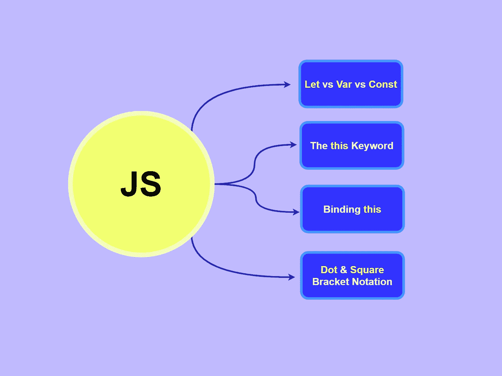
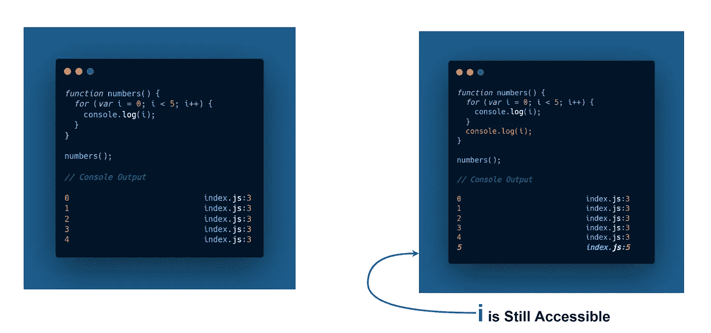
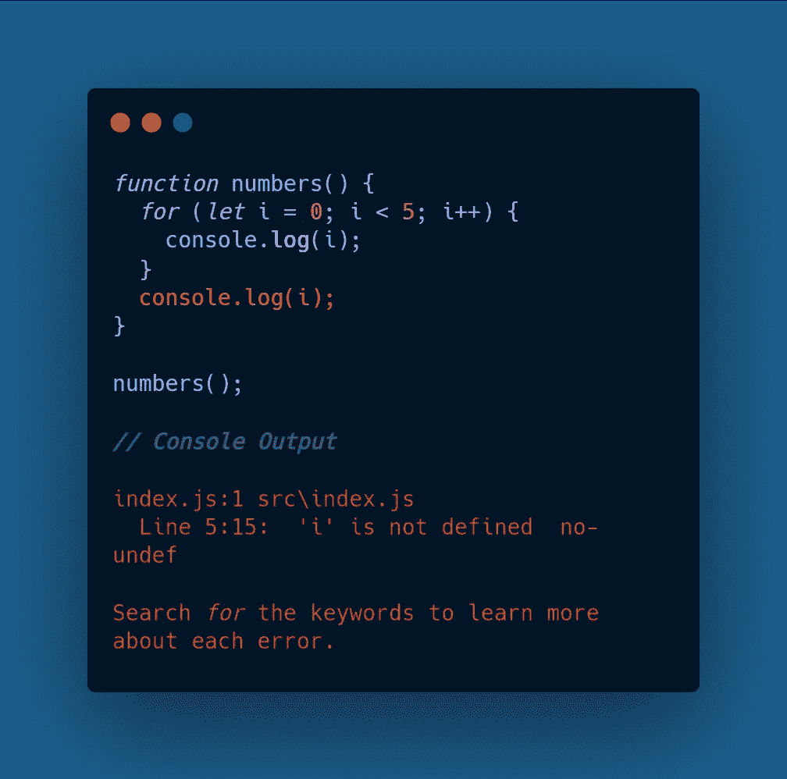
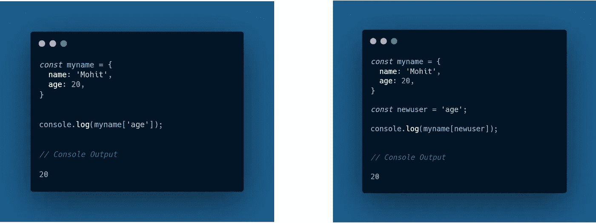
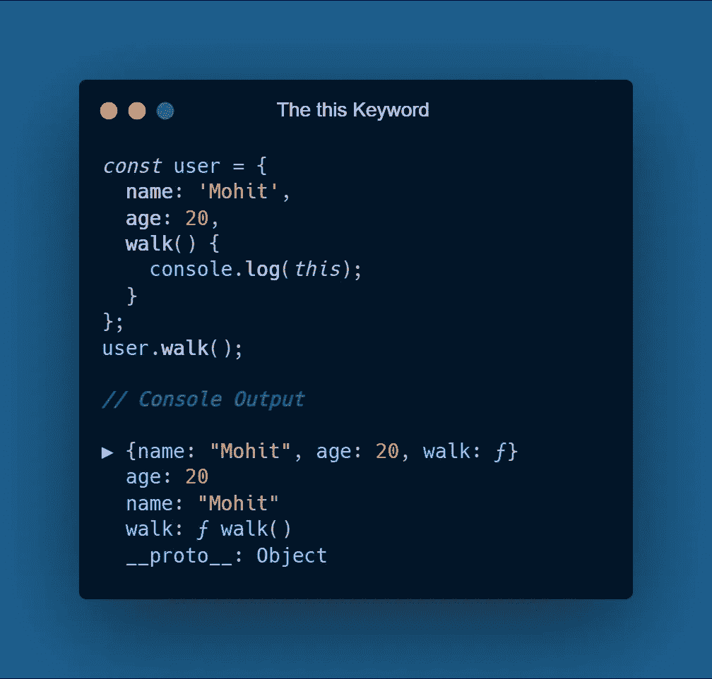
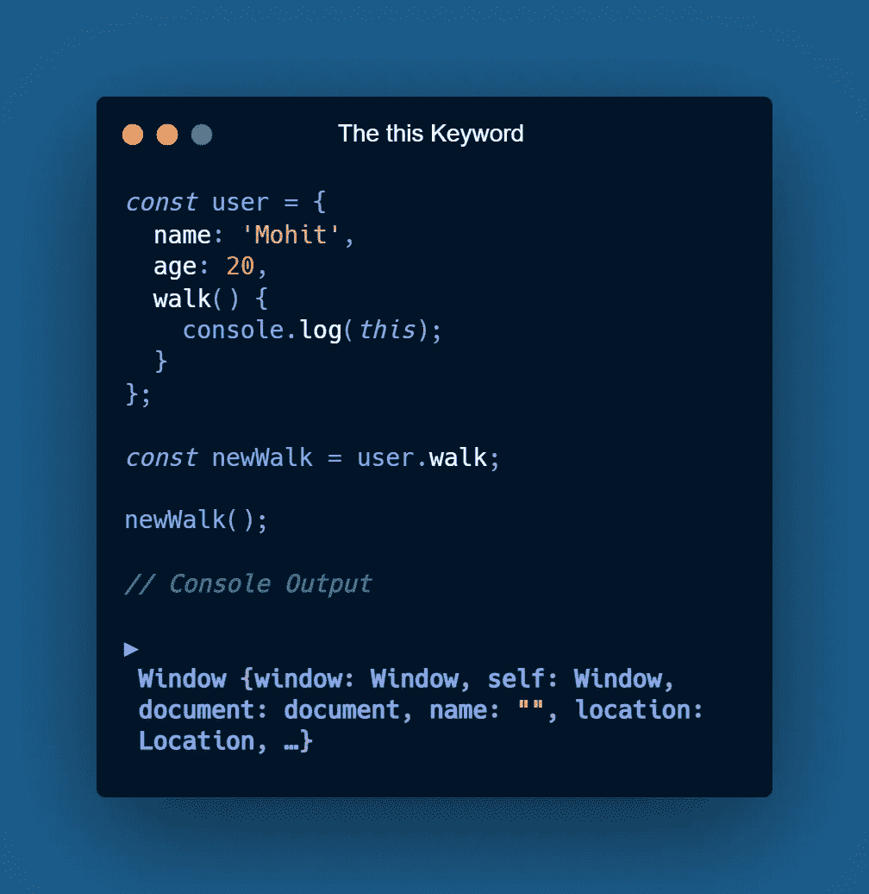
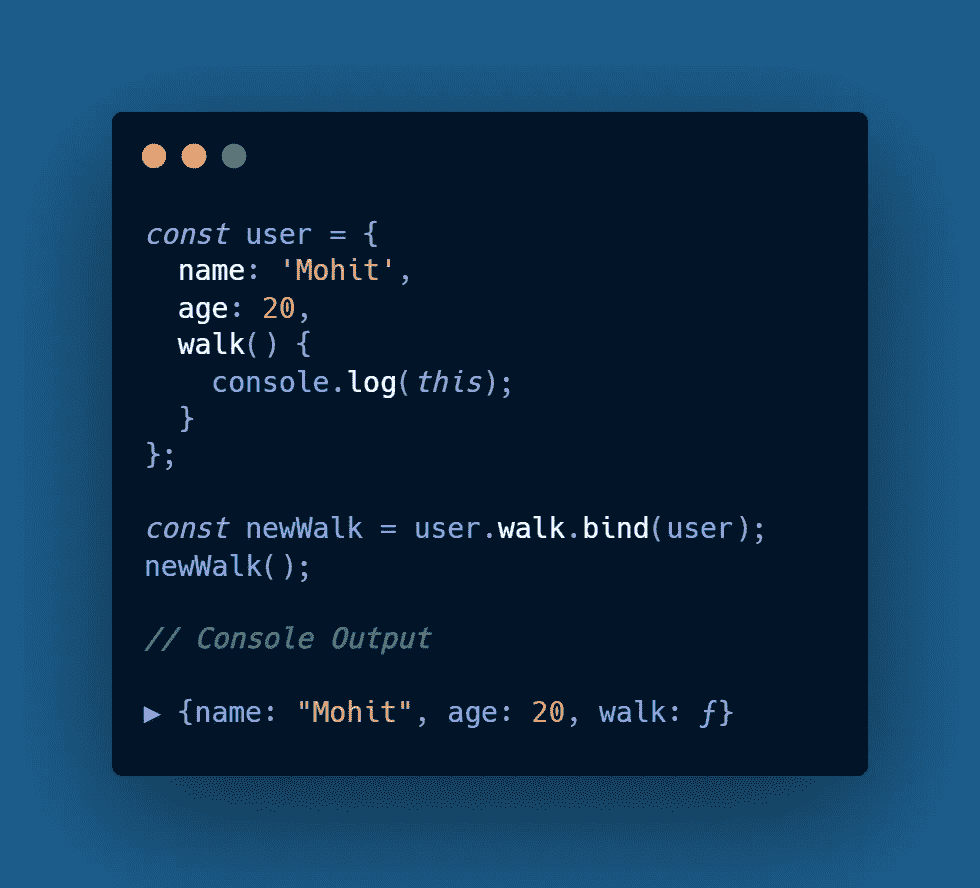

# 学习 JavaScript 时不应错过的 4 个概念

> 原文：<https://javascript.plainenglish.io/4-concepts-you-shouldnt-miss-while-learning-javascript-2906d2571f1e?source=collection_archive---------3----------------------->

## 刷新基本的 ES6 JavaScript 概念

# 1.let vs var vs const

这三个关键字都用于在 JavaScript 中声明变量，但是有些细微的差别有时会被开发人员忽略。所有这三个关键字在声明变量时扮演不同的角色，但是很多时候人们最终会对我们在 JavaScript 中声明变量的方式产生误解。

*   **Var:** 在使用 Var 关键字声明变量的时候，你只需要记住一个简单的概念，使用 Var 关键字声明的变量的*作用域*在块之外，这仅仅意味着在定义它们的块之外仍然可以访问一个变量。

***例如，*** 在下面给出的演示中，我们已经使用 Var 关键字声明了 **i** ，正如您可以观察到的，当我们在定义它的块之外记录 **i** 的输出时，我们仍然可以很容易地访问它 **(5 在日志结果**中获得)。

*   **Let & Const:** 在 **Let** 的情况下，你会注意到有一点小小的不同。现在，假设我们使用 let 给 **i** 变量赋值，并试图在定义它的块之外记录我们的结果，将会得到一个错误，因为 **i** 未定义**。同样，如果我们使用**常量**给 **i** 赋值，那么结果将与 **Let** 的情况相同，因为使用 *Let &常量*赋值的变量在它们的块之外是不可访问的。**

****

# **2.点和方括号符号**

**这两种符号都用于访问对象中的属性，但是在*方括号符号*的情况下，我们可以动态访问属性。**

*****例如:*****

*   **我们有一个名为 **myname** 的对象，它有两个属性( **name & age** )，使用方括号符号我们可以很容易地记录下 **age** 属性。**
*   **然而，在第二种情况下，我们有另一个名为 **newuser** 的常量，它引用了 **age** 属性&，之后 age 属性被记录在控制台上。当我们构建真实世界的应用程序时，第二个实现非常方便。例如，我们可以在从输入表单接收数据的同时动态访问对象。**

****

# **3.这个关键字**

**在 **JavaScript** 中最令人困惑的概念之一，如果你不知道它在不同条件下是如何工作的，这个关键字可能会相当令人困惑。正如你可能熟悉的**一样，这个**关键字传递一个对当前对象的引用，但是在 JavaScript 中它并不总是这样工作。**

*****例如:*****

*   **我们有一个名为 **user 的对象，**有三个键值对作为 **name、age、**和一个**方法**(或一个函数)，我们在控制台中记录 **this** 关键字。在这种情况下，您可以观察到**这个**关键字正在传递一个对对象的引用(在我们的例子中是**用户对象**),在这个对象中它被调用&我们在控制台上得到我们的**用户**对象。**

****

> ***注意，我在这里调用的***方法，就是* ***里面的对象*** *。****

*   ***但是当我们应用一些细微的变化时，就会得到不同的结果。我们添加了另一个名为 **newWalk** 的**常量**，它引用了**用户**对象中的*行走方法*。为了简单起见，我们可以说 newWalk 是一个调用**用户**对象中的 Walk 方法的函数。***
*   ***这一次，如果我们通过引用另一个方法( **walk** )来调用 **newWalk** 方法，那么您很可能会在控制台上获得**未定义的**。 **( *注意，在我的例子中，当我在禁用严格模式的 React 项目中运行这段代码时，我们获得了一个窗口对象)。******

******

# ***4.装订这个***

***在 JavaScript 中，我们可以使用 bind 方法来解决我们在上一节中讨论的问题，因为在这两种情况下我们都无法访问**用户**对象。使用 bind 方法，您可以简单地将一个对象绑定到一个函数。***

******例如，******

******

*   ***在前面的例子中，我们无法使用 **this** 关键字访问**用户**对象，使用 **bind** 方法可以快速解决所有问题。***
*   ***我们必须通过。**绑定**(一个你想要引用的对象)到你的函数&我们不再需要处理一个未定义的或者窗口对象，因为**这个**关键字现在总是引用**用户**对象***

*** [## 每个软件开发人员都应该知道的 9 条编程原则

### 很好地了解干净代码的编程原则

javascript.plainenglish.io](/9-programming-principles-every-software-developer-should-know-9fffe3c5258)  [## JavaScript 中的桥和门面设计模式

### 像专家一样使用 JavaScript 应用程序

javascript.plainenglish.io](/bridge-facade-design-pattern-in-javascript-a4cac70b9581)  [## 作为开发人员，你应该知道的 9 种数据结构和算法

### 让你成为更好的开发者的数据结构和算法

javascript.plainenglish.io](/9-data-structures-algorithms-you-should-know-as-a-developer-5e10946c95a0)  [## React 本机应用程序的 7 个最佳实践

### 反应本地最佳实践(第 1 部分)

javascript.plainenglish.io](/7-best-practices-for-react-native-applications-be1dd907e657)***