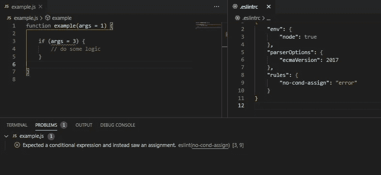
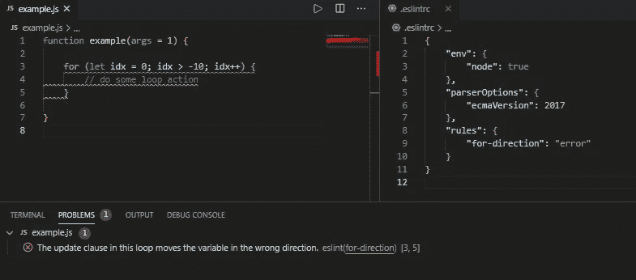
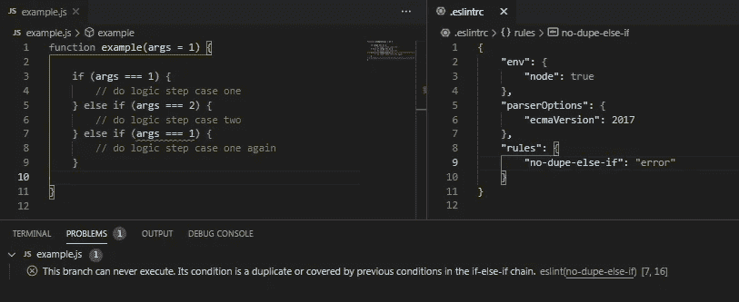
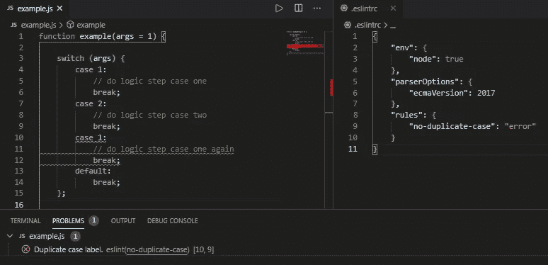

# 捕捉逻辑和语法错误的 4 条 ESLint 规则

> 原文：<https://javascript.plainenglish.io/4-eslint-rules-to-catch-logic-and-syntax-errors-d9e5be0487a2?source=collection_archive---------9----------------------->

棉绒有两个主要用途:一个是在项目中加强编码风格。另一个是保护应用程序和开发人员免受代码中逻辑和语法错误的影响。这里有几个 ESLint 规则，可以用来帮助处理 JavaScript 代码中的逻辑和语法错误。

Photo by [Luke Stackpoole](https://unsplash.com/@withluke?utm_source=medium&utm_medium=referral) on [Unsplash](https://unsplash.com?utm_source=medium&utm_medium=referral)

# 先决条件/假设

为了在您的 JavaScript 项目中使用 linter，您应该在本地机器上安装[节点](https://nodejs.org/en/download/)。

您还需要安装 [npm eslint](https://www.npmjs.com/package/eslint) 包，要么全局安装在您的机器上，要么安装在项目的节点模块中。要全局安装 eslint，请运行`npm install -g eslint`。要在您正在处理的项目中安装，运行`npm install --save-dev eslint`。

您还需要在 IDE 上安装一个 eslint 插件。对于 Visual Studio 代码， [ESLint](https://marketplace.visualstudio.com/items?itemName=dbaeumer.vscode-eslint) 是将 linter 集成到 IDE 中最流行的插件。

根据项目的不同，linter 规则存储在。eslintrc (rc 是 run 命令的缩写)文件。该文件可以有多种格式类型，但是在本文的最后，我们将向您展示一个。只有四个规则的 eslintrc 基本文件，JSON 格式。

# 1.无条件分配

[no-cond-assign](https://eslint.org/docs/rules/no-cond-assign) 规则用于捕捉一个逻辑错误，您可能会盯着它看几分钟而看不到代码中的问题。此规则不允许 if 条件包含变量赋值；因此，没有开发人员会犯忘记在条件中添加第二个等号来进行比较的错误。

虽然 JavaScript 允许条件赋值，但是条件赋值总是被计算为 true，这使得代码中的赋值和条件都是不透明的。更糟糕的是，如果变量的值根本不是赋值的话，它会导致意外地改变变量的值。下面的示例显示了实现的 linter 规则，以及在 VSCode 中如何显示错误。

no-cond-assign error in VSCode when rule is broken.

# 2.前进方向

[for-direction](https://eslint.org/docs/rules/for-direction) 规则用于捕捉循环逻辑，这些逻辑最终会在调试时暴露出来，但可能会节省您一些时间来思考为什么您的循环不会退出。

当 for 循环具有永远无法到达的停止条件时，此规则将引发错误。在下面的例子中，循环索引从零开始，当索引大于-10 时执行，每次迭代递增 1。这使得当指数小于或等于负十时停止条件成立。随着索引递增 1 并且从大于负 10 开始，停止条件将永远不会被满足。

for-direction error in VSCode when rule is broken.

# 3.无欺骗-否则-如果

[no-dupe-else-if](https://eslint.org/docs/rules/no-dupe-else-if) 规则用于捕捉 if/else 链中条件逻辑重复的 if/else 语句。这在较大的 if/else if 语句中以及发生重构时很方便。这可以从需求的变化或者简单的拼写错误中捕捉重复的条件；也就是说，下面的第二个 else/if 应该是负数，而你只是忘了加上负号。

下面你可以在 VS 代码的“Problems”标签中看到，第二个 else if 语句被标上了关于重复条件的描述。

no-dupe-else-if error in VSCode when rule is broken.

# 4.无重复案例

[无重复案例](https://eslint.org/docs/rules/no-duplicate-case)规则用于捕捉开关案例中的重复案例。在下面的例子中，重复的事例相对明显，因为语句只有几个事例，并且重复的事例接近相同的行。当案例变得更大时，它们可能开始没有独特的顺序，重复的案例可能以相隔 50 行结束，并且不容易识别。

no-duplicate-case error in VSCode when rule is broken.

与其他逻辑错误一样，上面的例子也用 VS 代码窗口中“Problems”选项卡中的问题描述进行了标记。

# 最终配置

正如本文开头提到的，如果您希望 linter 中只有这四个规则，那么这就是一个基本配置文件的样子。

Example .eslintrc configuration

# 结论

linter 是一个有用的工具，可以在逻辑和语法错误在应用程序中引起更大的错误之前捕捉到它们。随着您学习更多使用 ESLint 的规则和配置，您的 JavaScript 应用程序会变得更易于维护。想了解更多关于 [ESLint](https://eslint.org/) 的信息，他们有一个详细记录的网站，上面有你可以应用到你的申请中的不同规则。

希望这篇文章能够激发您对 ESLint 的兴趣，并且您将开始在您的 JavaScript 项目中更多地使用它。编码快乐！