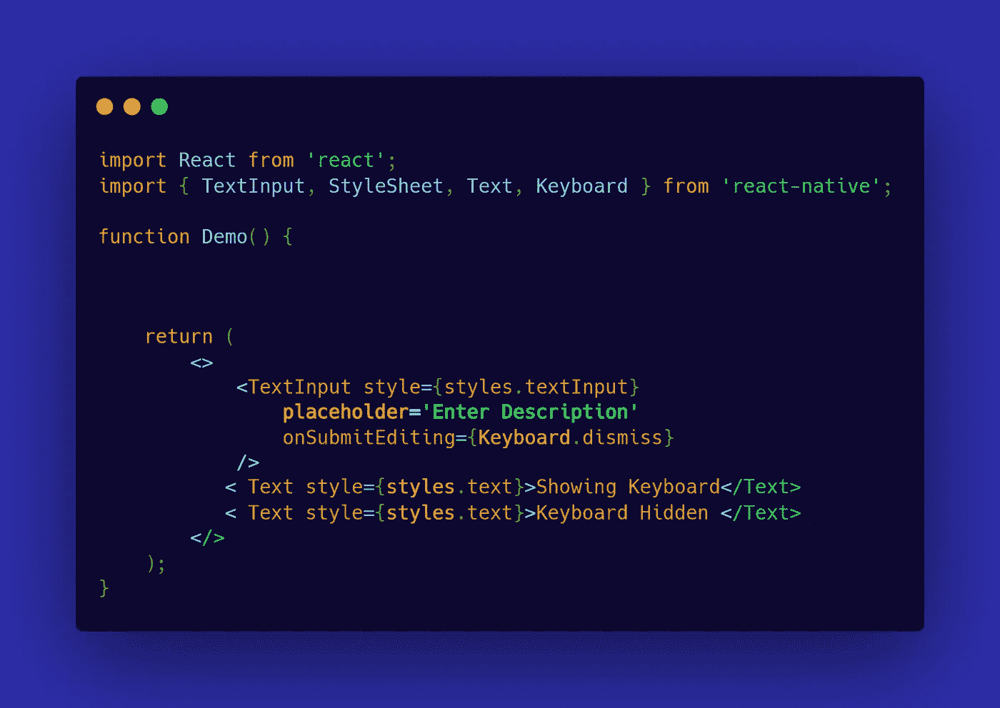
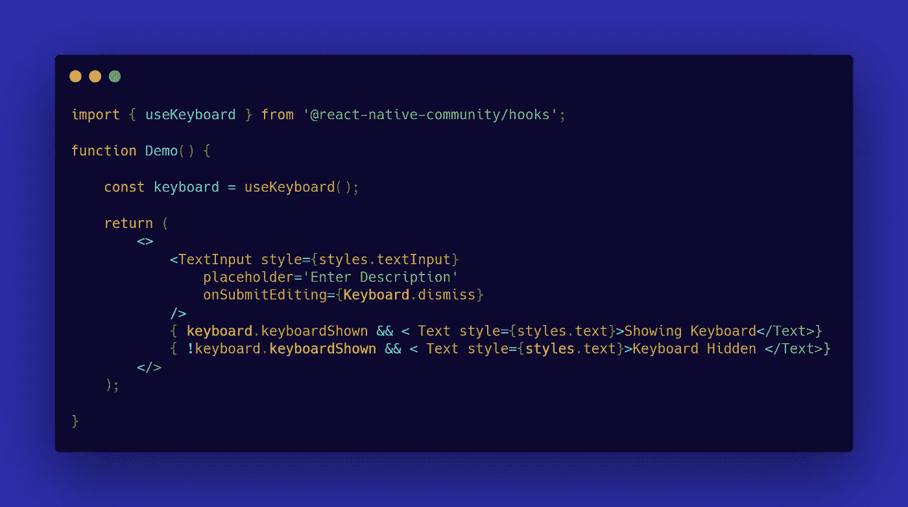
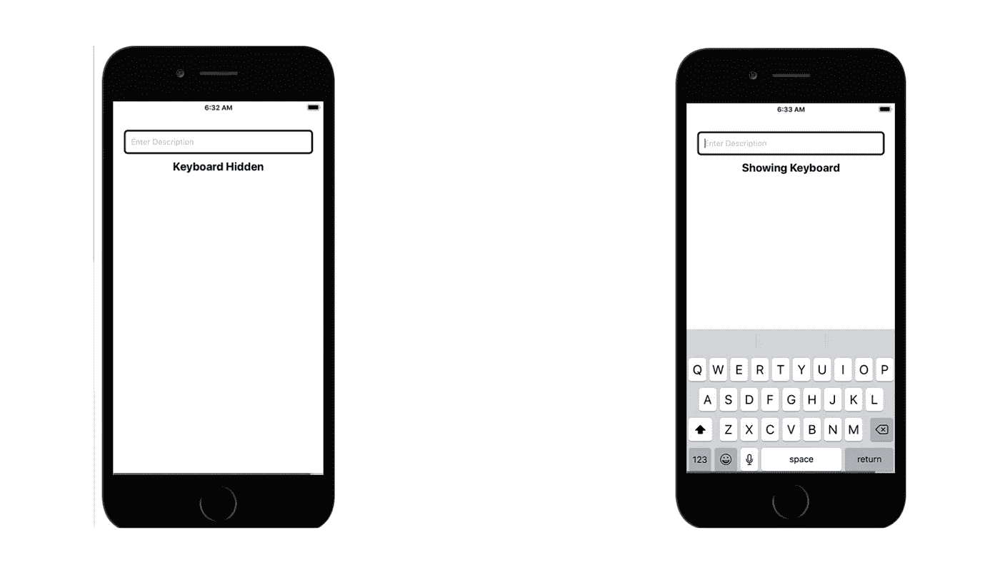
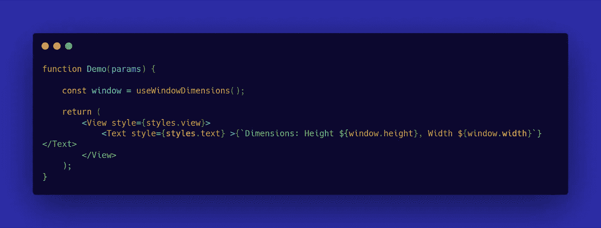
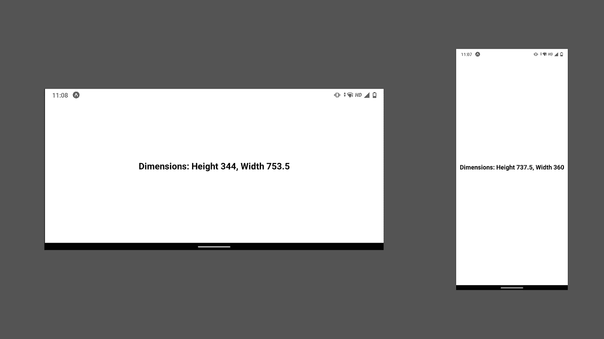
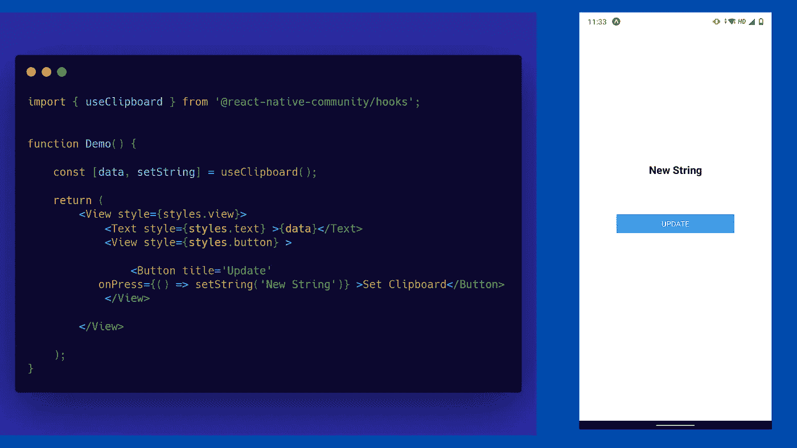
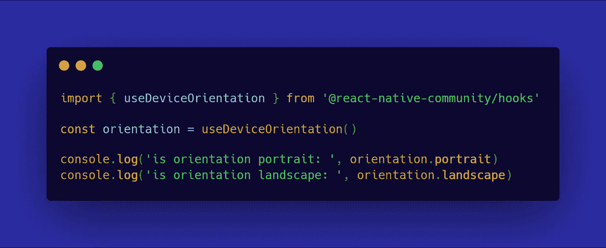

# 4 种必需的反应原生钩子

> 原文：<https://javascript.plainenglish.io/4-essential-react-native-hooks-9325322eabca?source=collection_archive---------10----------------------->

## 使用钩子对本机代码进行反应时，代码更清晰

## [1。使用键盘](https://snack.expo.io/@mohit199thd/usekeyboard-hook)

一个很好的处理键盘事件的 React Native 钩子，使用这个钩子我们可以定制我们的 **TextInput** 组件如何用几行代码处理键盘事件。

**例如:**

*   我们有一个函数组件，在其中，我们使用一个片段来呈现多个组件。
*   在那个片段里面，我们有一个 **TextInput** &多个 **Text** 组件。

使用 useKeyboard 钩子，我们可以访问许多键盘事件&在演示中，我们将使用**keyboard show**属性，这简单地意味着，每当我们在 **TextInput** 组件中提供文本时(或者当我们点击 TextInput 组件时键盘被抬起时)，我们就可以访问这些事件。

要实现此功能:

*   导入**使用键盘**挂钩。
*   现在使用函数组件中的钩子声明一个**常量**(*与我们在 React.js 中使用钩子的方法相同)。*
*   现在，我们必须对我们的**文本**组件应用条件渲染，这将让我们知道幕后发生了什么。
*   使用 **const** 变量(在演示中命名为**键盘**)我们可以访问所有的事件，当键盘被抬起时，keyboardShown 属性也处理事件。
*   使用条件渲染，我们现在可以简单地在我们的文本组件中渲染不同的文本，现在当我们抬起键盘的时候，我们可以看到在我们的文本组件中*显示键盘*。但是当键盘没有抬起时，它会在文本组件中显示*键盘隐藏*。

*请注意* ***在*** *道具提交后用于解散键盘。*

**useKeyboard**

## 2.useWindowDimensions

这个钩子可以让我们接触到设备的**高度**、**宽度**、**刻度、**和 **fontScale、**在某些情况下，当设备有不同的方向时，我们需要改变 React Native 中某个特定组件的外观，而 **useWindowDimensions** 在这种情况下就派上了用场。

要使用这个钩子，您可以从**“react-native”**导入它:

**例如:**

*   我们可以使用窗口对象访问设备的**高度**和**宽度**，并使用 ***美元符号*** 符号显示当前方向模式下设备的实际高度和宽度。
*   请注意，您可能需要通过配置 React 原生项目中的 **app.json** 文件来更改设备方向，因为在我的例子中，我无法手动切换设备方向。

> 注意:我们可以简单地记录**窗口的**对象，你可以看到你的设备的所有 4 个属性

## [3。使用剪贴板](https://snack.expo.io/@mohit199thd/useclipboard)

useClipboard 钩子给了我们改变剪贴板状态的能力，例如，当我们想要在剪贴板中为特定的用户交互提供默认数据时，我们可以使用这个钩子并且非常容易地更新剪贴板的状态。

**例如:**

*   这与我们如何使用 **useState** 钩子非常相似，因为数组中的第一个索引保存修改后的值，数组中的第二个索引是负责改变该值的函数。类似地，在**使用剪贴板**钩子中，我们定义了一个 const，并且**数据**保存稍后将被改变的字符串值，并且**设置字符串**是当我们按下按钮时改变其值的函数。

## 4.使用设备定位

允许您确定设备的方向，无论何时方向变为纵向或横向，挂钩都会更新值，我们再也不用担心事件侦听器了。

**例如:**

