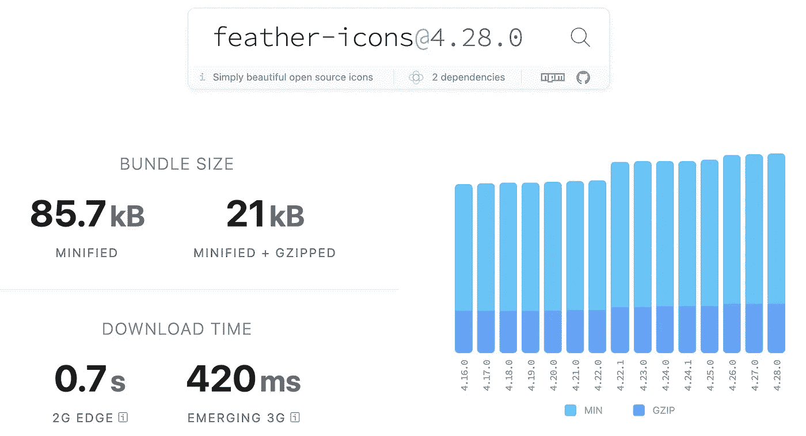
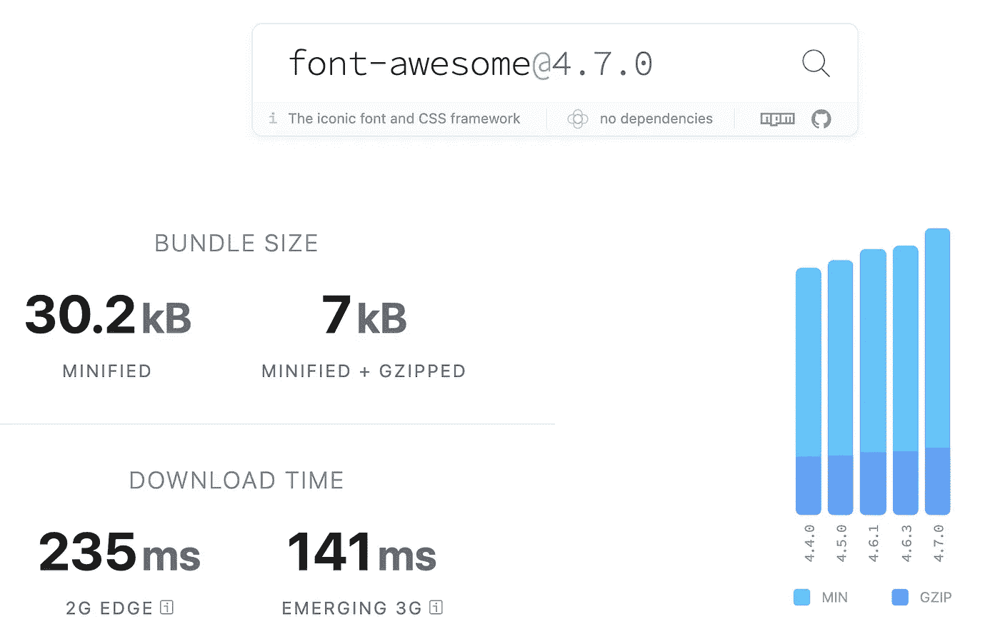
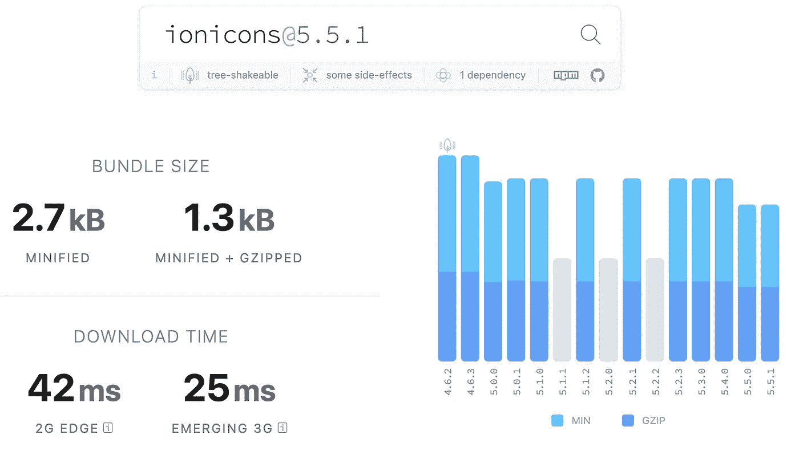
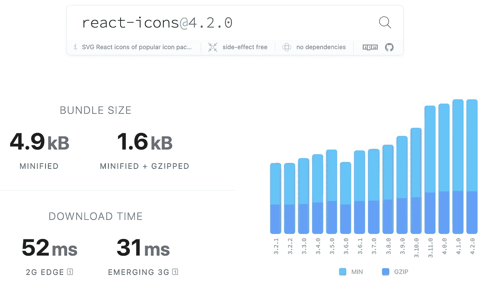

# 4 个免费图标库，增强您的网络应用

> 原文：<https://javascript.plainenglish.io/4-free-easy-to-use-icon-libraries-to-enchance-your-web-applications-aa27ed0480e?source=collection_archive---------15----------------------->

## 为什么图标在 web 应用程序设计中很重要，以及您可以在项目中使用的免费图标库。

Photo by [Harpal Singh](https://unsplash.com/@aquatium?utm_source=medium&utm_medium=referral) on [Unsplash](https://unsplash.com?utm_source=medium&utm_medium=referral)

这篇文章试图触及为什么图标在 web 应用程序设计中很重要，然后进一步提供一些你可以在你的项目中使用的开源(免费)库的例子。

## **人类是视觉生物**

人类大脑的一半直接或间接地致力于处理视觉信息。当我们谈论以人为中心的网站设计时，理解视觉线索的重要性以及它们如何影响人们使用网站是至关重要的。

## 核标准情报中心

图标大大有助于增强物理和数字世界的体验。最简单的例子是想想公共浴室，看一眼男人或女人的图标会比处理一个单词更容易理解应该走哪扇门。另一个很好的例子是路标——有些东西必须通过清晰的图标和图像而不是文字来传达。

在网站上，图标在很多不同的方面扮演着重要的角色，这取决于我们的网站给用户的体验类型。图标通过提供收集信息的复杂线索来帮助填写表格，它们有助于使网站或应用程序的导航更加直观(例如脸书应用程序导航栏/图标)，并且通常有助于保持我们网站和应用程序的 UI 不那么杂乱。

Photo by [Ernest Ojeh](https://unsplash.com/@namzo?utm_source=medium&utm_medium=referral) on [Unsplash](https://unsplash.com?utm_source=medium&utm_medium=referral)

# 图标库

## 1.羽毛(4.28.0 版)

一个简单的开源库，在构建交互式网站/应用程序时提供 286 个基本图标。该使用指南非常容易理解，可以在许多不同类型的应用程序中使用。每个图标可以表示为一个 SVG，所以不会有任何缩放或模糊的问题。Feather 并不是最轻量级的库，在 2G 网络上这个库的加载速度仍然很快，但是由于它是完全开源的，Feather 是一个很好的起点。

Feather: bundle size minified/GZipped + download time on website load

您可以在以下网址找到羽化图标的使用详情:

 [## 羽毛图标/羽毛

### Feather 是一个简单漂亮的开源图标的集合。每个图标都设计在一个 24x24 的网格上，重点是…

github.com](https://github.com/feathericons/feather#feather) 

## 2.字体真棒

这个库有两个不同的元素，一个是开源的，一个是付费的。它的开源部分有超过 1000 个图标，每个都是用 SVG 定义的。如果你刚刚开始，想要没有灵活性的基本图标(即预定义风格的字体)，这是一个完美的库。该图书馆还对他们的开源产品有其他限制，可以在[这里](https://fontawesome.com/plans)查看。

从使用的角度来看，该库也非常容易使用，能够下载 React 等框架的包装库，或者只是将脚本嵌入到 HTML 中，以便跨任何应用程序访问。

总的来说，这个库非常强大，正如我们在下面看到的，下载文件非常小，这意味着它可以快速有效地加载。

Font-Awesome: bundle size minified/GZipped + download time on website load

您可以在下面找到 font-awesome 的使用详情:

 [## 字体真棒

### 世界上最受欢迎和最容易使用的图标集刚刚得到了升级。更多图标。更多款式。更多选择。

fontawesome.com](https://fontawesome.com/) 

## 3.离子离子(推荐)

一个完全开源的图标集，包含 1，300 个图标，专为 web、iOS、Android 和桌面应用而设计。Ionicons 是为 [Ionic 框架](https://ionicframework.com/)打造的，所以图标既有材质设计也有 iOS 版本。

该组件将为每个图标动态加载一个 SVG，因此您的应用程序只请求您需要的图标。将该库应用于任何应用程序都非常简单，他们已经提供了如何实现的清晰说明。这是一个最有性能的图标库，它有很大的图标灵活性(编辑、整形和改变)。

Ionicons: bundle size minified/GZipped + download time on website load

您可以在下面找到 ionicons 的使用细节:

 [## ion-team/ion icons

### Ionicons 是一个完全开源的图标集，包含 1，300 个图标，专为 web、iOS、Android 和桌面应用程序设计…

github.com](https://github.com/ionic-team/ionicons) 

## 4.React 图标(建议 React 项目使用)

特别是对于 React 应用程序，这个库非常轻量级，在通过较慢的连接下载时性能很好。这个库非常强大，因为它充当了许多其他库的包装器，提供了大量的集合。这样做的一个缺点是，如果有人从两个集合中寻找两个不同的图标，风格可能会变得不同，导致用户界面不一致。

因为该库利用了 ES6，我们可以专门导入每个给定“组件”需要使用的图标，这非常高效。不幸的是，该库只与 React 兼容，因此限制了它的使用。

React-Icons: bundle size minified/GZipped + download time on website load

您可以在下面找到 react 图标的使用详情:

 [## 反应图标

### 使用 react-icons 可以轻松地在 React 项目中包含流行图标，React-icons 利用 ES6 导入允许您…

react-icons . githum . io](https://react-icons.github.io/react-icons/) 

总的来说，有很多不同的图标库，它们都有不同的优缺点——希望这篇文章有助于缩小您的选择范围。如果你有另一个你使用的库，你觉得可能比上面列出的更好，请在评论中提出来！

*更多内容尽在*[plain English . io](http://plainenglish.io/)