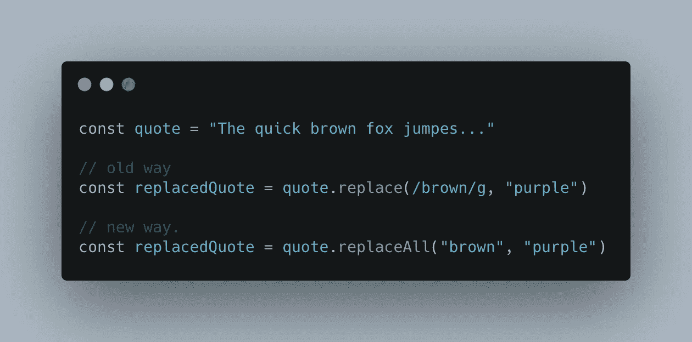
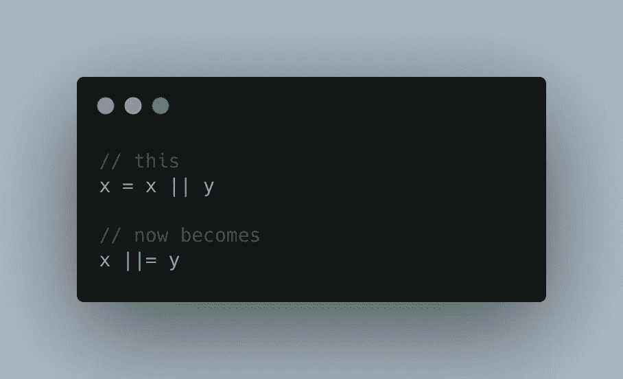
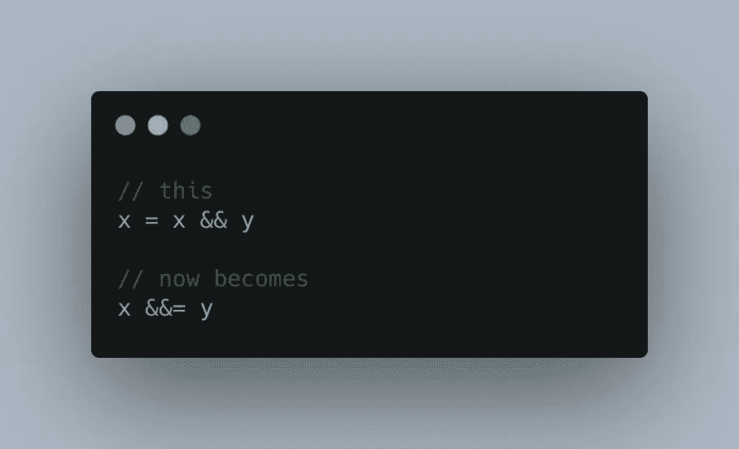
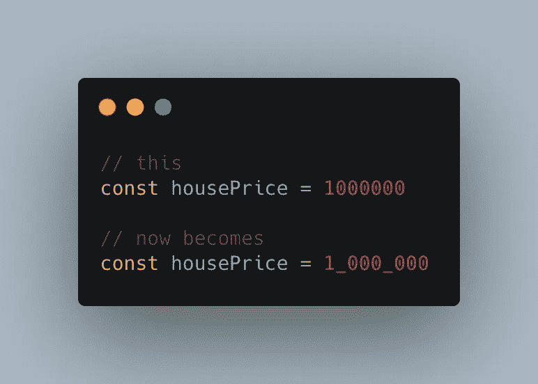
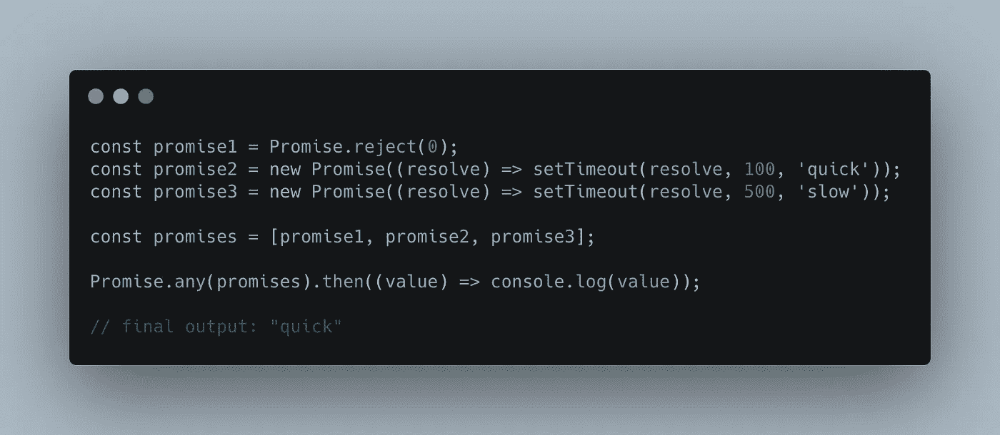

# 编写更简洁代码的 4 个 JavaScript 2021 Pro 技巧

> 原文：<https://javascript.plainenglish.io/4-javascript-2021-pro-tips-for-writing-cleaner-code-af7178afd362?source=collection_archive---------2----------------------->

## 通过 4 个简单的步骤，让您的 JavaScript 更上一层楼。

Photo credits: [Antonio Batinić](https://www.pexels.com/de-de/@antonio-batinic-2573434?utm_content=attributionCopyText&utm_medium=referral&utm_source=pexels) on [Pexels](https://www.pexels.com/de-de/foto/internet-technologie-computer-text-4164418/?utm_content=attributionCopyText&utm_medium=referral&utm_source=pexels)

JavaScript 是一种很棒的语言，但是如果你使用每年发布的最新特性，它会变得更好。2021 年，ES12 将成为王者，所以从今天开始，让我们看看它的最佳特性如何能够立即改进您的代码。

## 1.使用 replaceAll

以前，在使用 JavaScript 时，如果不使用全局 regexp ( `/regexp/g`)，就无法替换字符串中子字符串的所有实例。但是现在，多亏了`replaceAll`方法，事情发生了变化。

## 2.使用逻辑赋值运算符

这些新引入的运算符结合了赋值和逻辑运算的能力。

逻辑`x||=y`是这样工作的:如果`x`为真，它返回`x`。否则，它将`y`分配给`x`。

而`x&&=`仅在`x`为真时分配`y`

## 3.使用数字分隔符

这是我非常喜欢的一个功能。它是如此的琐碎，以至于我想知道为什么它从一开始就不是语言的一部分。使用数字分隔符，您可以分隔数字中的千位，使它们更具可读性:

## 4.使用 Promise.any()

一旦您传递给它的任何承诺被解析，方法`Promise.any()`就会被解析。与`Promise.race()`相反，当其中一个承诺拒绝时，它不会提前拒绝。

这种方法有用的一个例子？**从最快的服务器检索资源**。

## 结论

JavaScript 很神奇，但是如果你知道怎么做，它会变得更好。希望，我已经用这篇文章帮你做到了。

— *皮耶罗*

[***想在短短 6 个月内学会编码并获得一份令人惊叹的工作吗？点击这里获得我的免费书籍，告诉你如何做到这一点！***](https://astounding-motivator-3764.ck.page/b922e9420e)