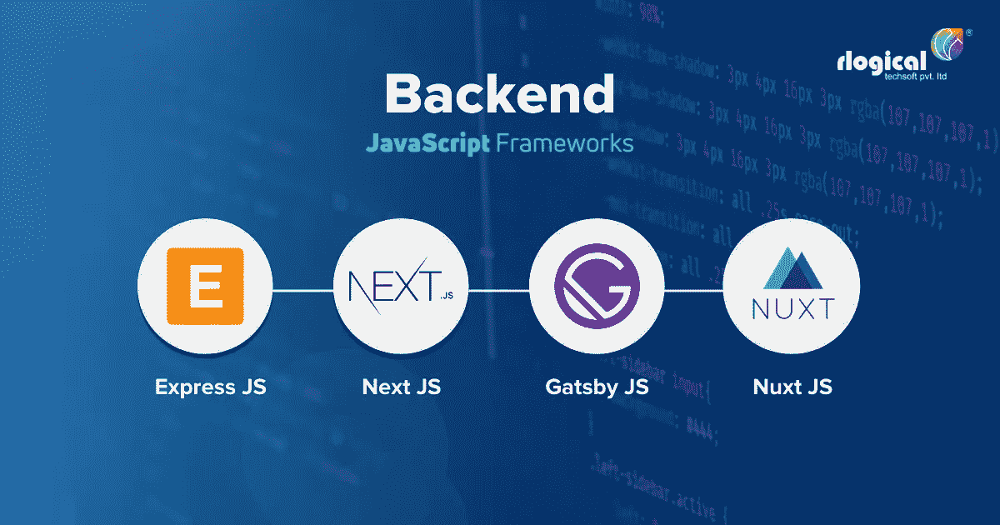

# 你应该为下一个 Web 应用考虑的 4 个 JavaScript 框架

> 原文：<https://javascript.plainenglish.io/4-javascript-frameworks-you-should-consider-for-your-next-web-app-6feceefc0ae0?source=collection_archive---------4----------------------->

## **各有利弊&各有利弊**

JavaScript 最近成功的一个重要原因是它的多功能性。使用 [JavaScript 进行前端客户端开发](https://www.rlogical.com/web-development/javascript/)和后端服务器端开发主要是因为 Node.js。将有可能从几个服务器端 JavaScript 框架中进行选择，最知名的选择恰好是 Express.js

但是，在做出选择之前，必须考虑几个基本方面，如 web 应用程序的可伸缩性、性能和灵活性。

## 在下面的段落中，我们提到了 4 个 JavaScript 框架及其优缺点。

# **1。Express.js**

Express.js 是一个面向 Node.js 的开源 web 框架，用于创建 web 应用和 API。这个框架最初是由 TJ Holowaychuk 在 2010 年创建的，后来在 2015 年被 IBM 收购。目前由 Node.js 基金会负责维护。使用 Express.js 的主要好处是首先是服务器端编码。使用 Node.js 编码可能需要几个小时的复杂任务可以在几分钟内完成，主要是因为 Express。除此之外，与 Node.js 提供的基本路由机制不同，Express 提供了一个强大的路由机制来处理极其动态的 URL。

## **优点**

**社区支持** — Express 恰好是一个拥有庞大社区银行的成熟框架。

**令人印象深刻的文档** — Express 附带全面的文档以及大量资源和教程。

**快速开发** —使用 Node.js 加速并简化 [**web 应用程序开发**](https://www.rlogical.com/web-development/)

**路由** —提供了一种健壮的路由机制，用于根据 HTTP 方法和 URL 定义路由。

**简单易学** —由于结构和语法简单，初学者学习 Express 相当容易。要做到这一点，您只需要了解节点基础知识和普通的 JavaScript。

## **缺点**

开发者有责任确保网络应用的安全性。Express 不提供安全解决方案。

对于初学者来说，学习 Express 可能有些困难，因为它具有不固执己见的特点。

# **2。Next.js**

基于 React， [Next.js](https://nextjs.org/) 恰好是一个端到端的服务器端框架。荷兰公司 Vercel 在 2017 年创造了它。即使《盖茨比》和《Next》都是基于 React，但这两部并不相同。虽然 Next 碰巧是一个 SSR 服务器端呈现器，但 Gatsby 是一个静态站点生成器。然而，重要的是要记住，Next 也提供静态发生器。使用 Next 的最大好处是热代码重载、自动代码分割、自动路由和内置的 SEO 处理。

## **优点**

**服务器端渲染** —下一个是 SSR，提供更快的性能，因为它不需要等待客户端的浏览器通过加载 JavaScript 来显示内容。SSR 甚至在客户端浏览器中下载和执行 JavaScript 代码之前就开始呈现 HTML。因此，在后台加载代码时，可以获得应用程序的初始呈现。

**SEO 友好** —传统的客户端渲染应用程序没有合适的 SEO 性能。搜索引擎爬虫很难索引这样的页面。然而，Next 凭借其服务器端渲染能力提供了出色的 SEO 性能。为优化 SEO 创建充满活力的 meta 标签是可能的。

**热代码重新加载** —一旦有任何修改，页面将由 Next 自动重新加载。

## **缺点**

Gatsby 被认为比 Next 更适合小型博客，与依赖 Next 的服务器端渲染相比，静态构建提供了更好的性能。

Nuxt 和 Gatsby 的性能指标优于 Next。

# **3。Gatsby.js**

萨姆·巴格瓦特和凯尔·马修斯在 2015 年创立了 [Gatsby.js](https://github.com/gatsbyjs/gatsby) 。Gatsby 恰好是一个基于 GraphQl 和 React 的当代灵活的静态站点生成器，用于创建 SEO 友好的高性能网站。这个框架允许用户从任何可用的数据源获取信息。但是，Gatsby 不执行服务器端呈现。相反，HTML 内容是在客户端构建时由 it 生成的。因此，Gatsby.js 提供了快速的性能，以及出色的 SEO 性能和完美的安全性。Gatsby 提供了一个更显著的好处，那就是有助于添加修改和关键功能的插件。

## **优点**

**快速性能** —在 Gatsby 的帮助下创建的网站通常比使用其他技术堆栈创建的普通网站快几倍。Gatsby 通过自动编译最合适的 web pack 配置来帮助优化您的网站的性能。

**SEO 友好** —搜索引擎爬虫可以读取由该框架生成的静态内容，没有任何障碍，如任何其他 JavaScript 框架。

**支持多个数据源**—Gatsby 通过 markdown 和其他远程信息源(如 WordPress、Netlify、Drupal、Contentful、Stripe、Trello 等)收集信息。

**高安全性** —该框架提供顶级的安全性，因为它不需要任何数据库或服务器。

## **缺点**

**不适合大型网站**——Gatsby 不适合电子商务商店等内容密集型网站。随着内容大小的增长，构建时间会显著增加。这将导致网站性能大幅下降。

**先决条件理解** —尽管学习和使用 Gatsby 非常容易，但是必须先理解 GraphQl 和 React。

# **4。Nuxt.js**

这个恰好是一个开源框架，用于创建高性能的 web 应用。人们可以认为它是 Vue 的增强剂。然而， [Nuxt.js](https://nuxtjs.org/) 将无法独立运行，因此，它将无法取代 Vue。此外，人们不能认为它是一个全面的后端框架。Nuxt.js 是官方 Vue 组件和库的组合——Vue、Vuex、Vue 路由器、Vue 服务器渲染器和 Vue meta，它还包含了 PostCSS 和 webpack babel 的专业知识。

## **优点**

**快速设置和开发** —在 Nuxt.js 中设置一个新项目只需要几分钟，这主要是因为 starter-template，可以通过命令行轻松创建。这个框架负责大部分初始配置和设置，这将使您能够直接执行编码。

**项目结构** —默认情况下，你的代码由 Nuxt 组织成一个可伸缩的、有逻辑的、易于理解的结构。

**代码分割** —这个框架使用性能最好的 web pack 配置生成应用程序的静态版本。因此，静态生成的每个页面都带有自己的 JS 文件。这样，JavaScript 代码可以被分割成更小的文件，从而提高速度和性能。

**Nuxt Community**—Nuxt Community 恰好是您启动时需要的几个 API、初学者工具包、模块和库的集合。

## **缺点**

将定制库与该框架集成可能有些困难。

使用 Nuxt 时，您可能会面临调试问题，这可能会非常令人沮丧，也很有挑战性。

## 结论

现在我们有了。你应该考虑在下一个 web 应用中尝试的 4 个 JavaScript 框架。你以前试过这些吗？你的想法是什么？留下评论继续对话。