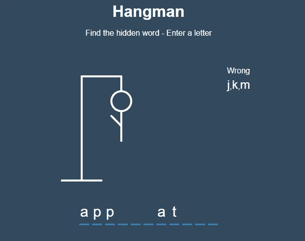
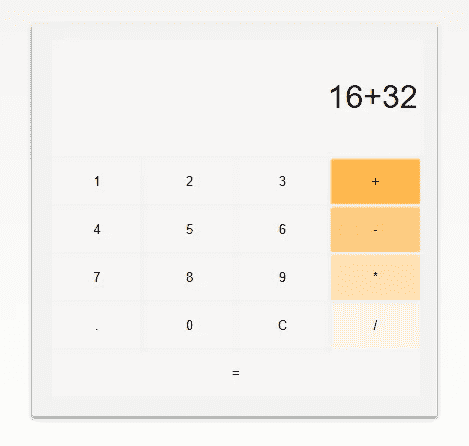
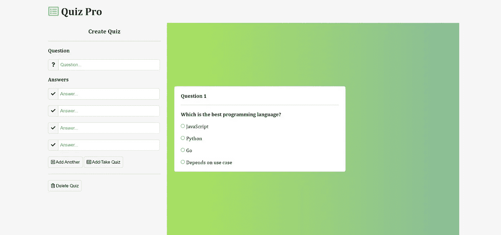
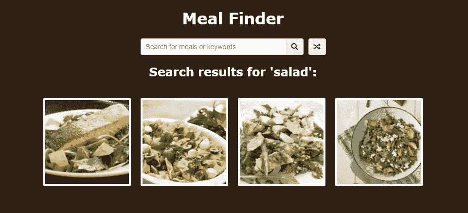
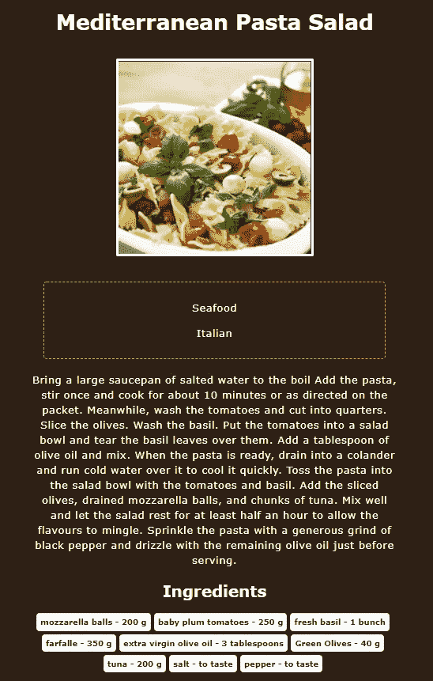

# 我计划在这个周末构建 4 个 JavaScript 项目来提升我的技能

> 原文：<https://javascript.plainenglish.io/4-javascript-projects-im-planning-to-build-this-weekend-4adc5813b33a?source=collection_archive---------15----------------------->

## 初级和中级项目，以提高我的 JavaScript 技能

Photo by [Vlada Karpovich](https://www.pexels.com/@vlada-karpovich?utm_content=attributionCopyText&utm_medium=referral&utm_source=pexels) from [Pexels](https://www.pexels.com/photo/woman-sitting-on-the-floor-using-a-laptop-4050299/?utm_content=attributionCopyText&utm_medium=referral&utm_source=pexels)

学习任何编程语言或技术的关键部分是将知识应用到实践中。很多时候我们认为我们理解了一些东西，但实际上，我们只知道理论，不知道如何应用它。所以，我想做几个项目来应用我在 JavaScript 中学到的东西。

一个项目有助于加强我们长时间记忆概念的思维路径。当我们努力做某件事时，我们的大脑学习得最好，因此，项目是我们应该做的。

在这篇文章中，我列出了一些我打算用来提升我的 JavaScript 技能的项目。我花了几个小时在广阔的互联网上搜索，整理了这个列表。我希望它也能帮助你。

# 1.绞刑吏

你可能玩过 hangman，它是经典游戏之一。在 hangman 中，你必须通过一次猜一个字母来找到正确的单词。

在这个项目中，我计划学习 DOM 操作、随机函数、事件处理程序和 SVG。

事件处理程序是 JavaScript 中最常用的方法之一。当用户与网页交互时，它们被触发。

Photo from [Brad Traversy](https://vanillawebprojects.com/projects/hangman/)

这里的目标是制作一个刽子手游戏，当用户输入一个不正确的字母时，它会显示为错误的，并出现这个人的一个身体部位。如果用户键入正确的字母，该字母在单词中出现的所有位置都会显示出来。当用户猜错 6 次或猜对单词时，游戏结束。

您可以进一步添加提示，使您的游戏更加有趣。

[链接到现场演示。](https://vanillawebprojects.com/projects/hangman/)

# 2.基本计算器

计算器是任何编程语言的基本项目之一。但是既然是用网站的语言，就要做一个干净的网站来用。

通过制作基本的计算器，我希望提高我在 **CSS 网格、事件处理程序和条件语句方面的技能。**

在很多情况下，CSS 和 JS 在用户交互方面是紧密结合的。

Photo from [Miguel Nunez](https://iamcodefoxx.github.io/Calculator/)

这里的目标是为计算器创建一个干净的用户界面。我打算只实现基本的算术运算，但你可以通过将它转换成一个复杂的/科学的计算器，使这个项目有点挑战性。您还将学习 JavaScript 中的数学函数。

[链接到现场演示。](https://iamcodefoxx.github.io/Calculator/)

# 3.测验网站

互联网上到处都是表格。您通过使用网站上的表单从用户那里获取数据。因此，与其制作一个简单的表单来接收用户名、电子邮件和密码；我发现这个测验网站会以有趣的方式教我们这些表格。

这个测验网站将教授**表单处理程序、事件处理程序、DOM 操作和输入法。**

Photo from [Miguel Nunez](https://iamcodefoxx.github.io/Quiz-App/)

这里的目标是建立一个网站，记录你输入的问题以及 4 个选项，其中一个是正确的。你可以添加尽可能多的问题。最后，当你有了所有的问题，你就可以参加测验了。该应用程序将显示你的分数以及正确和错误的选择。

您可以对测验网站进行大量的添加和修改。

[链接到现场演示。](https://iamcodefoxx.github.io/Quiz-App/)

# 4.膳食搜索网站

Meal finder 是一个网站，它将使用 API 通过搜索关键字向我们显示食物的图像和名称。

API 是网站开发的关键部分。

通过制作这个网站，我希望深入研究**获取、API 请求、异步 JavaScript 和 DOM 操纵。**

Photo from [Brad Traversy](https://vanillawebprojects.com/projects/meal-finder/)

这里的目标是使一个网站，将采取一个单一的输入关键字，并将显示尽可能多的结果，因为它可以获取。有一个额外的按钮来生成随机关键字。

此外，当用户点击任何一餐时，网站将显示配料和如何制作该餐的食谱。

Photo from [Brad Traversy](https://vanillawebprojects.com/projects/meal-finder/)

这就是这个周末我将度过的美好时光。

如果你是一个初学者，对项目的复杂性感到有点不知所措，不要担心。当你在舒适区之外打球时，你会成长。所以，让我们接受这个挑战，建立这些网站。

如果你喜欢这篇文章，媒体上还有很多这样的文章。你可以注册阅读它们，每月只需 5 美元。

[**这里是无限制访问媒体上所有内容的链接。如果你用这个链接注册，我会从中赚一小笔钱。**](https://arpitfalcon.medium.com/membership)

*更多内容请看*[***plain English . io***](http://plainenglish.io/)