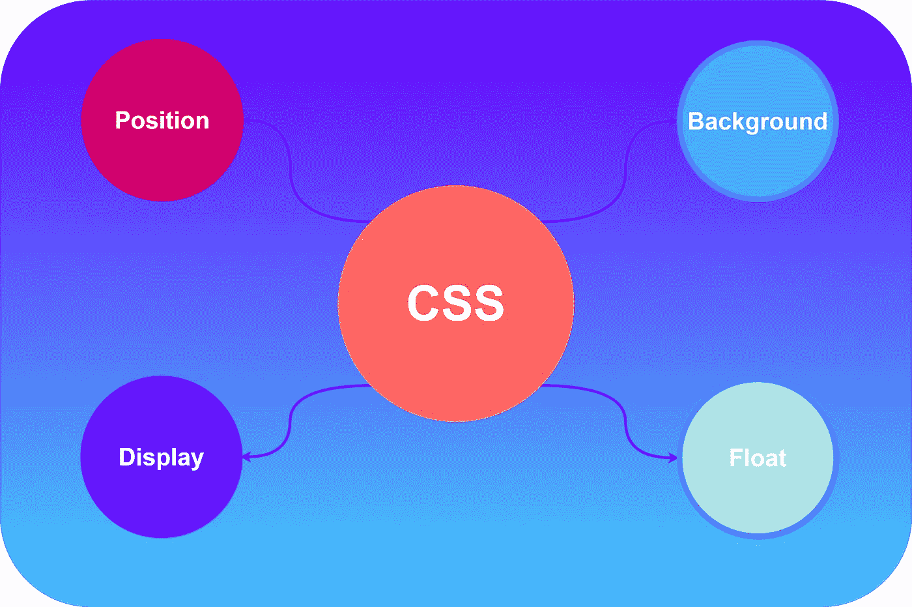
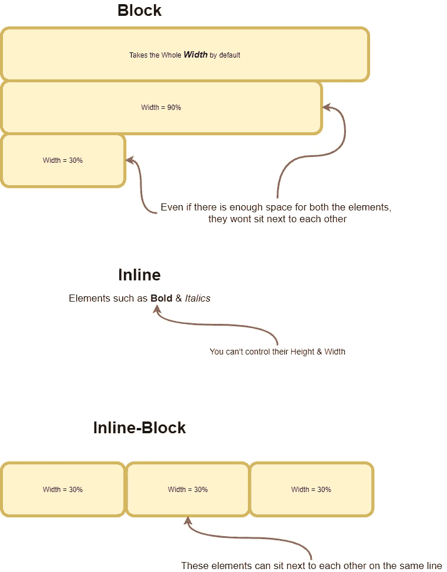
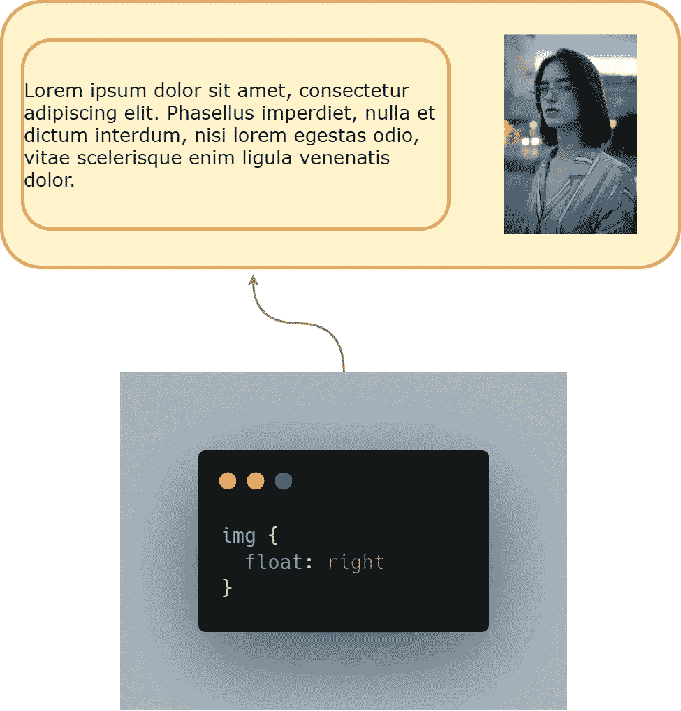
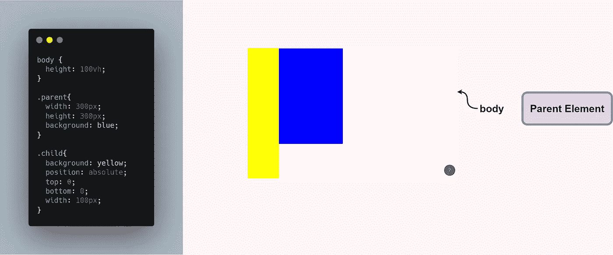
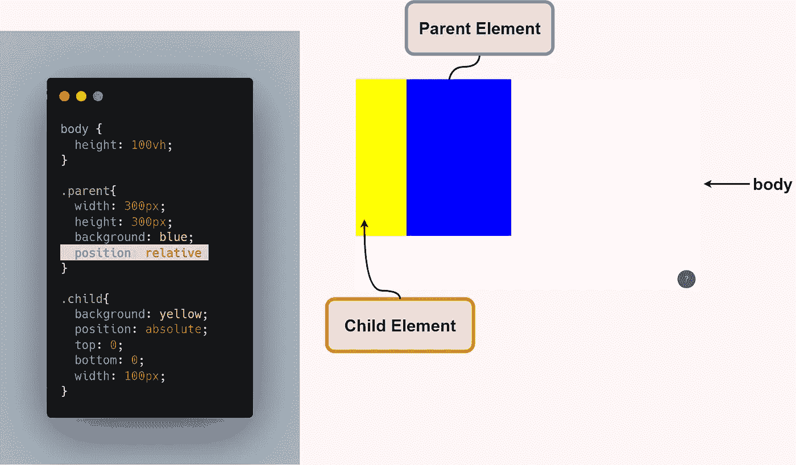

# 在 4 分钟内解释 4 个关键 CSS 属性

> 原文：<https://javascript.plainenglish.io/4-key-css-properties-explained-in-4-minutes-9567d1b5af86?source=collection_archive---------14----------------------->

## 基本 CSS 入门

## 1.显示

> 指定元素的显示行为

它需要许多不同的值，但是坦白地说，在大多数情况下，您将只使用 4 个值。

*   **Block:**CSS 中的块级元素尽可能多地占用可用空间，但不能放在同一水平线上。**块级**元素主要被开发人员用来简化布局过程，因为他们能够改变自己选择的元素的**宽度**和**高度**。
*   **inline:** 这是默认值，如果没有指定任何其他显示值，元素可以与 inline 元素并排放置在同一水平线上。*HTML 标签如 ***< strong >，< em >，< a >，*** 等都是内联元素的好例子，在这里我们无法控制它们的**宽度**和**高度。***
*   ***inline-block:** 你可以把这个看作是 block 元素和 inline 元素的组合值，在这里你可以设置它们的 **width** 和 **height** ，元素可以出现在同一水平线上而不会有任何问题。*
*   ***none:** 使用这个值可以隐藏网页中的元素。您可以在下拉菜单中使用它，当您将鼠标悬停在导航菜单上时，会在下拉菜单中显示附加信息。*

**

## *2.浮动*

> *float 属性用于定位和格式化内容*

*简而言之，float 属性管理目标 HTML 内容在父容器一侧边缘的位置。*

****例如，****

**

*浮动属性接受多个属性，但是您将使用其中的 3 个，即**右**、**左**、**无**。*

## *3.背景*

> *为元素添加背景效果*

*它只是指 HTML 元素的背景，大多数时候开发人员会对多个背景属性感到困惑。然而，如果你对 CSS 中背景是如何选择的有一个很好的清晰的解释，那么使用 HTML 元素就容易多了。*

****你需要知道的背景属性主要有 4 种:****

*   ***背景色:**应用元素背景的颜色，并采用**十六进制**或 **RGB** 值。*
*   ***背景-图像:**应用图像作为背景，使用路径 **URI** 或 **URL** 访问图像资产。*
*   ***背景-重复:**你可以使用这些值，如果**宽度**超过背景尺寸，使应用的背景重复。*
*   ***背景-位置:**可以控制背景相对于 HTML 元素的位置，这里需要两个值，分别是***X***&***Y .*****X**是从*左边*的偏移量， **Y** 是从*上边*的偏移量。*

## *4.位置*

> *此属性指定用于元素的定位方法的类型*

*如果你想掌握一些布局技巧，这个 CSS 属性是非常必要的，因为大多数时候开发人员会因为在 CSS 中定位元素而遭受很多痛苦，使用正确的位置值可以很容易地完成工作。*

****有 3 个值你会用到大部分时间:****

*   ***绝对:**绝对定位的元素寻找自身具有*相对、绝对、*或*固定*位置的父派生元素。*
*   ***相对:**具有相对位置的元素将相对于它们的正常位置进行定位。*
*   ***固定:**具有固定位置的元素相对于视口定位，然而**顶部、底部、左侧**和右侧**属性用于定位元素。***

****例如；****

*   *当**子**元素被定位为**绝对时，**我们可以用**顶部、左侧、底部**值控制其在整个**主体**元素中的位置。你可以称它为独立的子元素，其中 **body** 元素是父元素。*
*   *但是，当我们给我们的父元素 ***(蓝色容器)*** 提供一个**相对**位置时，所有具有绝对位置的元素都将落在新的父元素下。*

**

*   *您可以观察到，当我们将一个**相对**位置值传递给我们的**父**元素时，子元素的 ***高度*** 现在相对于父元素。*

*** [## 如何在 CSS 中创建阴影

### 为您的应用程序构建出色的视觉效果

javascript.plainenglish.io](/working-with-shadows-in-css-15ff0717cf71)  [## 2021 年你需要知道的 25 个 CSS 最佳实践

### 编写更好 CSS 的最佳实践

javascript.plainenglish.io](/25-css-best-practices-you-need-to-know-69f9192babdd)  [## Web 开发人员的 9 个专业 CSS 技巧

### 你需要知道的 CSS 技巧

javascript.plainenglish.io](/9-pro-css-tips-for-web-developers-508b8302ff6f) 

*更多内容看*[***plain English . io***](http://plainenglish.io)*