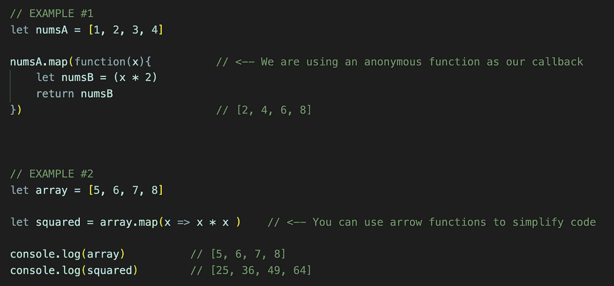
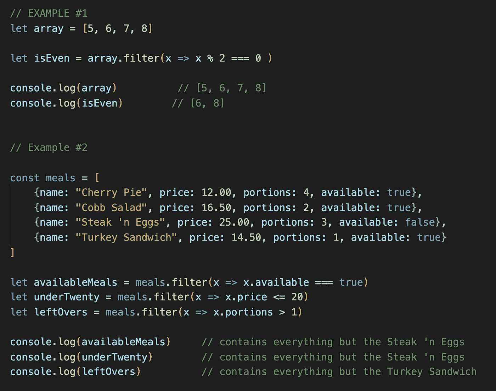
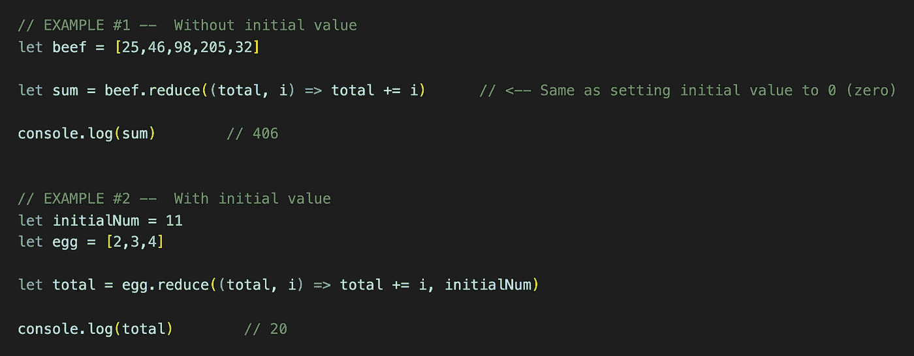
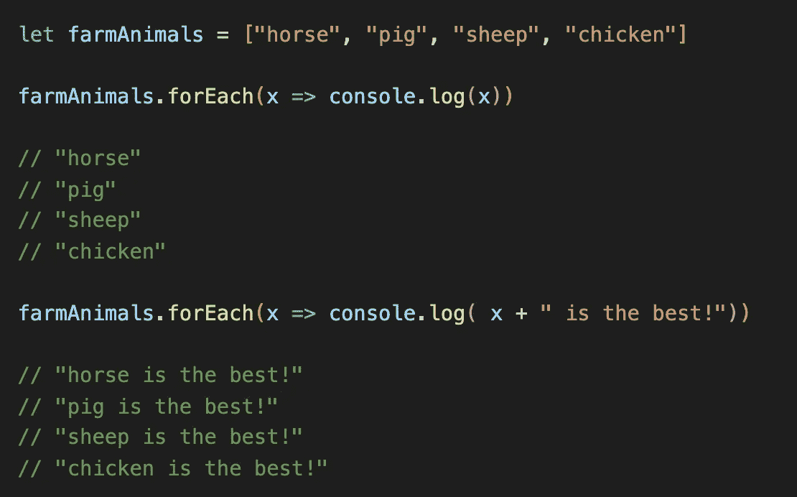

# JavaScript 中 4 个必须知道的高阶函数

> 原文：<https://javascript.plainenglish.io/4-must-know-higher-order-functions-in-javascript-411f85545881?source=collection_archive---------7----------------------->

高阶函数是 JavaScript 中听起来非常复杂的事情之一，但事实并非如此。根据定义，高阶函数只是一个要么**接受**要么**返回**的函数。就是这样！JavaScript 中一些最常见和最有用的函数是高阶函数，比如`.map()`、`.filter()`、`.reduce()`和`.forEach()`。在本文中，我们将更详细地探讨这些函数。

# 1.地图( )

这个 HOF 是 JavaScript 中最流行和最常用的函数之一。`.map()`函数接受一个回调函数作为参数，并返回一个新的数组对象。提醒一下，MDN web 文档将回调函数定义为:

> 回调函数是作为参数传递给另一个函数的函数，然后在外部函数中调用该函数来完成某种例程或操作。

在下面的代码中，我们可以看到两个`.map()` HOF 的例子。在第一个例子中，我们获取一个数字数组`numsA`，并使用`.map()`函数返回一个新的数组，其中的值加倍。你会注意到，在这个例子中，我们使用一个匿名函数作为回调函数。

在第二个例子中，我们使用 arrow 语法来改进代码，将四行代码减少到只有一行。此外，我们命名了我们的`.map()`函数的返回值，这允许我们随时调用我们的新 sqaured 数组。我们还看到我们原来的`array`对象保持不变。

Two examples of the .map() function written out. Screenshot by author.

# 2.过滤器( )

这个函数对于过滤数组值非常有用——你猜对了。这个 HOF 接受一个回调函数，并返回一个包含所有符合标准的值的新数组对象。

在下面的例子#1 中，我们使用`.filter()`函数创建一个新的数组`isEven`，它只包含来自我们原来的`array`对象的偶数。结果是一个包含值`6`和`8`的两项数组。

在例 2 中，我们多次使用`.filter()`函数来创建新的数组对象，这些数组对象基于饭菜的价格、可用性以及饭菜的份量。

Two examples of .filter() being used to create new array objects that meet the callback function criteria.

# 3.减少( )

`.reduce()`函数接收带有两个参数的回调函数，即`accumulator`和`current value`，以及一个`initial value`，并返回一个值。这个单一值是数组中所有数字的缩减值。这非常适合将数组中的所有值相加，尤其是如果您需要在相加之前修改这些数字。

`accumulator`参数用于函数将使用什么来保持累加值的累计。`current value`表示正在迭代的当前值。`initial value`是`accumulator`的起始总数。如果省略`initial value`，`.reduce()`功能会将第一个值指定为`initial value`并跳过它作为`current value`。这与将`initial value`置零基本相同。您当然可以将`initial value`设置为任何值，包括另一个变量。

最后，`.reduce()`方法还可以在回调函数中引入额外的参数，包括当前数组值的`index`。

# 4.forEach()

`.forEach()`方法是一个很好的高阶函数，可以代替 JavaScript 中典型的`while`和`for`循环。

