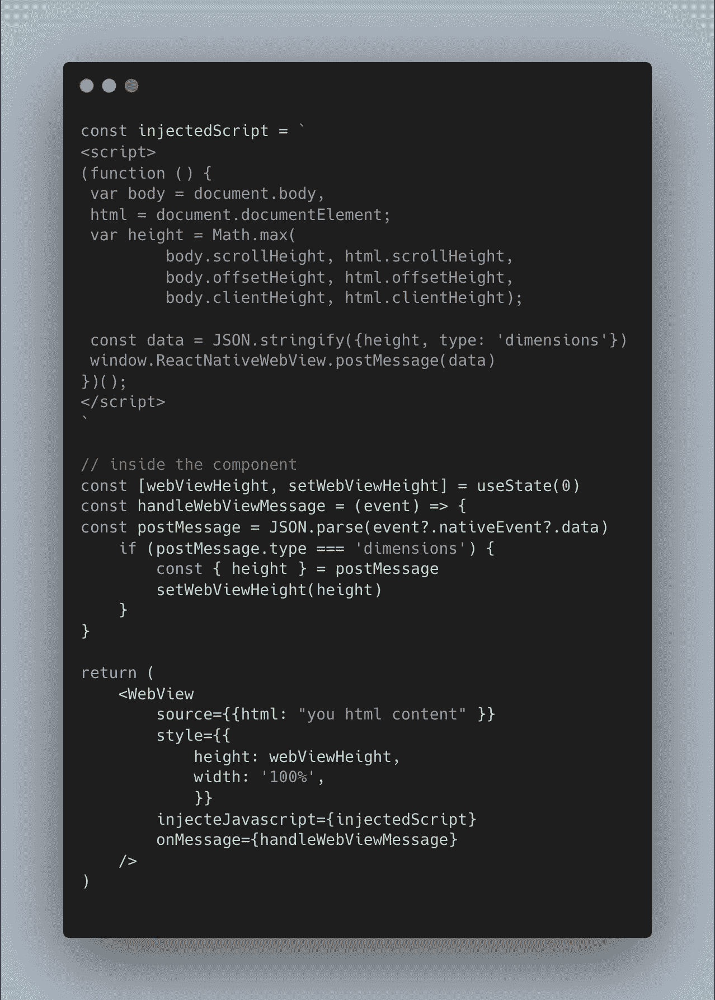

# 使用 React Native Webview 之前需要了解的 4 个问题

> 原文：<https://javascript.plainenglish.io/4-problems-that-you-need-to-know-before-using-react-native-webview-d1d6ef803347?source=collection_archive---------3----------------------->

在过去的一年里，我一直在开发一款使用 Webview 显示 Html 电子邮件的 react 原生应用程序，在这个过程中，我遇到了一些不常见的问题，我们花了很长时间才解决。

我在这篇文章中的目的是通过向您展示您可能遇到的问题以及如何解决它们来节省您的时间。

# 问题一:WebView 动态高度

React 本机 Webview 不能像“<view>”一样设置自己的高度，它可以根据内容进行缩放</view>

webview 拥有高度的唯一方法是为它提供一个特定的高度。

这里，我们在 webview 完成加载后使用***inject JavaScript****prop*注入了一个脚本，它将获取内容高度，然后更新 webview 高度。

# 问题 2: Webview 可能导致 android 中的应用崩溃

这个问题很难找到，当我们从一些屏幕导航时，应用程序出现了一些意外的崩溃，起初我们做了每个有经验的 react 本地开发人员都会做的事情，运行` *adb logcat* `命令，并花费数小时调试导致崩溃的原因。

幸运的是，我们发现[这个 GitHub 问题](https://github.com/react-navigation/react-navigation/issues/9061)修复了我们的问题，修复只是在包含 webview 的屏幕中禁用导航动画

还有其他 react-navigation 和 webview 崩溃修复可能对其他人有用，请查看此[react-native-YouTube-iframe 文档](https://lonelycpp.github.io/react-native-youtube-iframe/navigation-crash/)了解更多信息。

# 问题 3:在 webview [Android]中导入本地 HTML 文件

在 webview 中导入本地 HTML 文件在 expo 和 bare react native 之间有所不同。

在一个简单的 React 本地项目中，你只需要将文件添加到 android 资产中，并从那里导入它。
点击查看完整的解决方案[。](https://stackoverflow.com/a/61473740/7951454)

在 expo 项目中，由于我们无法访问 android 文件夹，您可以使用这种变通方法。

# 问题 4:在旧的 android 版本上测试 webview

如果您发现自己添加了一个包含 javascript 的自定义 HTML 文件，请确保在旧版本上测试 webview，因为在我的情况下，我使用了一些新的 javascript 功能，如可选链接，这导致了 android 版本 8 中 webview 的中断。

# 感谢阅读📚

我希望这篇文章可以帮助你面对一些意想不到的 webview 问题💪

Github | [推特](https://twitter.com/hartaniyassir/) ✈️

*更多内容看* [*说白了. io*](http://plainenglish.io/) *。报名参加我们的* [*免费每周简讯*](http://newsletter.plainenglish.io/) *。在我们的* [*社区*](https://discord.gg/GtDtUAvyhW) *获得独家写作机会和建议。*