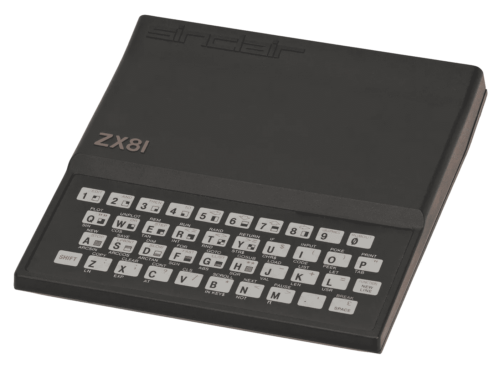

# 编码带给我快乐的 4 个原因

> 原文：<https://javascript.plainenglish.io/4-reasons-why-code-brings-me-joy-d3753c6e22a7?source=collection_archive---------19----------------------->

## 一部分是选择，一部分是上瘾。

The Sinclair ZX81, Image By Evan-Amos — Own work, CC BY-SA 3.0, [https://commons.wikimedia.org/w/index.php?curid=18300824](https://commons.wikimedia.org/w/index.php?curid=18300824)

我 10 岁就开始编程了。我祖父给了我一台 1 千字节内存的 ZX81。它可以插入电视，CPU 的时钟速度取决于电视的刷新率。

从那以后，在我做过的每一份工作中，我都在编写代码。即使编码不在我的工作范围内，即使现在我在管理层。有时这是不必要的，因为船沉得很快，所有的人都需要在甲板上。(是的，我已经看到了我的创业沉船的份额)。但大多数时候是由*选择*。因为对我来说，编码很有趣。原因如下。

# 理由 0:代码是一个探索的游戏，一个旅程

编码是关于学习的:学习新的语言、新的技术、新的技巧、新的做事方式。它是关于围绕回调、面向对象编程、异步行为、承诺、函数式编程(特别是自从钩子的到来)、数据库、浏览器、移动平台、游戏引擎……显然，这不仅仅是*关于那些。但有一种感觉是，这是一次进入创造了新的、奇怪的和令人兴奋的东西的聪明人(有时不那么聪明)头脑的旅程。乐趣就在旅程中，在发现创造所有这些新技术的想法和创造力的过程中。*

# 原因 1:代码是一个构造游戏

编码就是从稀薄的空气、电子和少量的想象力中创造出一些东西。创造陌生人会经历并希望理解和享受的新的美好事物是一种快乐。当然，按照这个标准，第一次迭代通常会失败得很惨，但是能够提炼和润色一些不完美的东西，使之成为一件美丽的事情也是很棒的。

# 原因二:代码是一个策略游戏

有时候，尽管你尽了最大努力，计算机拒绝屈从于你的意志，尤其是当你冒险进入一个充满新技术和新概念的陌生领域时。或者试图让浏览器以统一的方式运行。在这种情况下，学习如何横向思考，如何从不同的方向来解决问题，甚至绕过这个问题，都是值得的。有很多种方法可以剥下一只猫的皮，使一个 div 居中，或者查询一个数据库。

# 原因 3:代码是一个益智游戏

我喜欢看侦探小说。我喜欢试图找出谁是罪魁祸首，并揭开这一切背后的动机和心理互动的神秘面纱。代码对此有所衡量。尤其是在试图理解事情不运转的原因时，或者用切斯特顿的话来说，理解事情在不应该运转的时候运转的更黑暗的原因时。

# 代码是我的朝九晚五&我的副业

所有这些原因结合起来解释了为什么如此多的开发人员选择将他们的闲暇时间花在编码上:因为正如 Jane McGonigal 在她的书*现实被打破*中所述:“游戏让我们快乐，因为它们是我们为自己选择的努力工作，事实证明，几乎没有什么比良好的努力工作更让我们快乐。”编码是很好的艰苦工作，有看得见的结果，当你最终到达目的地时，有一种克服了旅途中的危险的感觉。

软件的本质意味着旅程总是在召唤。

*更多内容尽在*[***plain English . io***](http://plainenglish.io/)