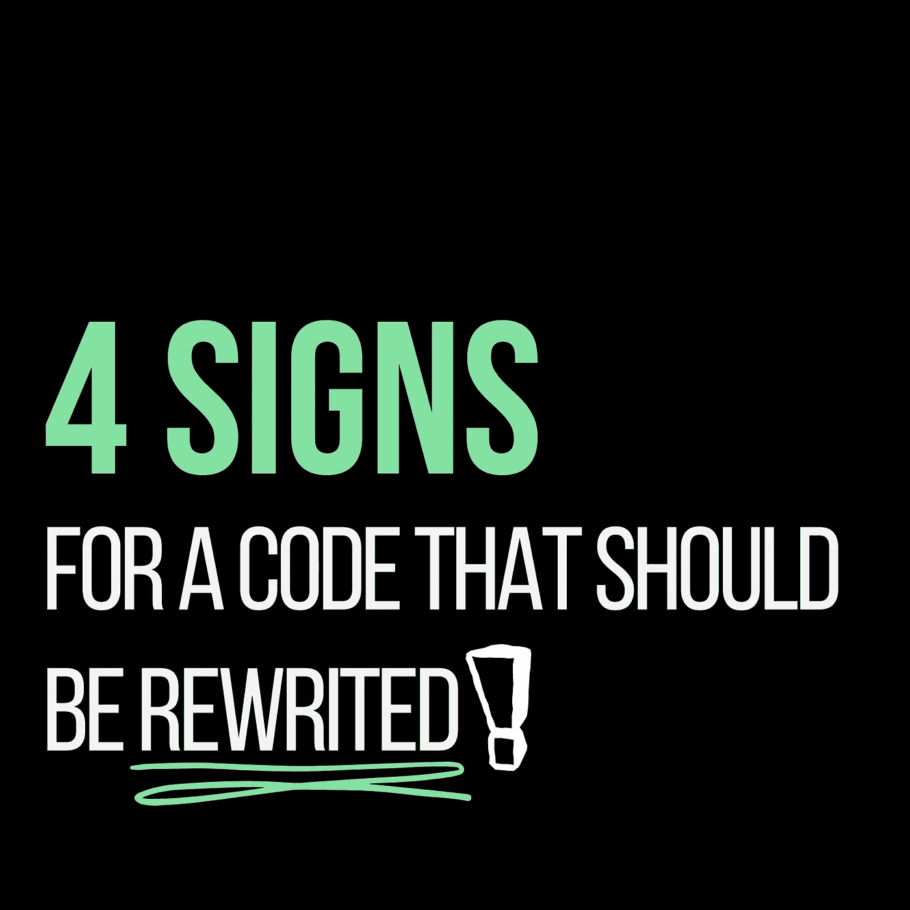

# 代码应该重写的 4 个迹象

> 原文：<https://javascript.plainenglish.io/4-signs-for-a-code-that-should-be-rewrited-402ee6f71435?source=collection_archive---------25----------------------->

## 如何判断是该重写一段代码还是整个应用程序？

By FAM

嗨，

说到软件开发领域，开发者经常会面对不是自己写的代码，尤其是在大公司工作的时候。

> 你可能已经经历过在一个大的应用程序上工作，从一个大公司到另一个大公司，仅仅是因为第一个公司的事情不顺利。

当然，客户不会接受从头开始，毕竟第一家公司的所有应用程序都花费了他的成本。这就是开发商沮丧之旅的开始。

这种情况我经历过几次。可以理解的是，你不可能抹去一切，从头开始。如果你站在客户的角度，你会明白的。

这通常是因为基础和设计是由没有经验的开发人员完成的。经理们不能理解你的沮丧。只有开发人员说计算机语言，因此阅读和理解代码，并看到它是多么健康。

我在某个时刻为此纠结过，想和大家分享一下我的 REX(体验归来)。

(**悄悄话:**对了，如果你也经历过这个，请分享给我们。互相学习真是太棒了，不是吗？)

# 问题是

我的问题是我不能告诉我的经理整个事情只是垃圾，我不想在这样的垃圾上工作。这是 99%的可能性重写整个事情。想象一下，你将如何说服客户放弃他迄今为止在应用程序上的所有投资，并在一个新的基础上开始。一个大的应用程序意味着很多钱💰💰💰💰💰💰。

# 有什么解决办法？

很简单:

*   要么从头开始
*   或者一直打补丁，直到一切都乱成一团！

第一种解决方案只是你开始所有事情时的一种罕见情况。但是，如果整个事情真的很糟糕，在某个时刻，整个应用程序将无法保持增长，该怎么办？

> 如何告诉我的经理？我如何说服我的经理重写代码？我该如何向客户解释整件事？在那之前，我怎么知道代码真的应该重写，这样我就可以建立一个论点来说服我的经理？真是进退两难，对吧？

嗯，我真的不知道这些问题的正确答案！但是，我发现了一些我参与过的糟糕项目中常见的迹象！

# 应该重写的代码的 4 个标志

这些迹象可以在使用该应用程序后收集，而不是立即收集。把它们记在心里对我来说真的很有用，我可以在说服的时候把具体的例子放在一边。

## 1.添加新功能需要太多时间

在我看来，代码不应该复杂。当它很复杂时，意味着它从一开始就没有设计好。当你需要做很大的改变来增加新的功能时，这意味着也许代码从一开始就不健康。

当然，这并不适用于所有情况。有时你需要创建一个完整的模块来增加新的功能。当你需要改变现有的东西，做回归测试的时候就成了问题。

## 2.简单的改变会在意想不到的地方破坏代码

简单的改变不应该影响意想不到的地方。我没有这方面的具体例子，但我肯定每个开发人员都经历过这种情况。

## 3.太多的精力去识别和修复错误

当修复一个程序中的错误是一个漫长的旅程时，这不是一个好兆头。这意味着这个应用程序就像意大利面一样。它应该由针对每个史诗或主题的模块、服务和组件来组织。

## 4.团队中没有人能理解这些代码

最具体的论点，也是我最喜欢的，是这个。评判永远是客观的。这取决于开发人员对好代码或坏代码的看法。开发人员如何编码，例如:

App 常量应该在一个单独的文件中声明，这样当需要更改时，一个修改就足够了。简单，不痛苦！

所以团队里有别人对你的评价和观点是超级重要的。这是你开始与经理进行说服战的必备标志。

气味代码的其他一些更具体的迹象:

 [## 如何辨别一个代码是不是坏的？显示气味代码的 8 种常见事物…

### 为了避免闻到代码的味道，你需要记住什么

medium.com](https://medium.com/geekculture/how-to-tell-if-a-code-is-bad-8-common-things-that-show-a-smelling-code-90aec5258715) 

## 你经历过吗？在下面评论你的经历😉

## 感谢您宝贵的时间，希望这对您有用！

亲爱的读者，我希望这是明确和有用的。我希望你无论在哪里都是安全的，你的家人也是！坚持住。明天会更好！

**让我们联系一下**[**LinkedIn**](https://www.linkedin.com/in/fatima-amzil-9031ba95/)**[**脸书**](https://www.facebook.com/The-Front-End-World)**[**insta gram**](https://www.instagram.com/the_frontend_world/)**[**Youtube**](https://www.youtube.com/channel/UCaxr-f9r6P1u7Y7SKFHi12g)**或**[**Twitter**](https://twitter.com/FatimaAMZIL9)**。********

****[www.fam-front.com](http://www.fam-front.com/)****

*****更多内容请看*[***plain English . io***](http://plainenglish.io/)****