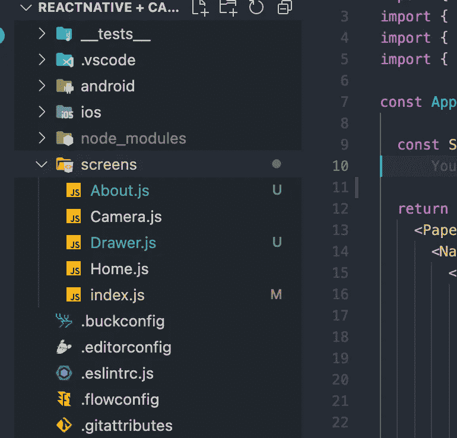

# 通过 4 个简单的步骤对本地导航做出反应

> 原文：<https://javascript.plainenglish.io/4-steps-for-navigations-in-react-native-c0e6304a2d09?source=collection_archive---------21----------------------->

## 在 React 本机应用程序中添加导航


## 在后台

最近，我在 React Native 中报道了一个关于相机模块的故事，在故事的结尾，我承诺要报道一个关于 React Native 中导航的新故事。

如果您没有使用任何库，那么在 React 中添加屏幕有点典型。然而，当你想处理嵌套很深的屏幕时，这就变得很困难了。React 本机文档本身表明您更喜欢 react 导航库来处理导航和屏幕。

## 入门指南

我们要做的库是反应导航。我强烈建议您通读文档部分，因为理解 react-navigation 对于开发应用程序至关重要。

以下是我们今天将要讨论和执行的要点—

*   在 react 本地应用程序中添加 react 导航模块
*   创建屏幕和屏幕架构
*   添加一些抽屉和底部标签

## 添加导航库

这个过程非常简单，只需添加软件包，就可以开始了。但是创建屏幕并将它们添加到堆栈中有点棘手。

在根目录下的`app.js`中，我们必须在其中创建堆栈和屏幕或者注册屏幕。整个 app.js 文件将负责声明屏幕。

```
yarn add @react-navigation/native @react-navigation/stack
```

导航库还有另一个依赖项，可以使用以下命令添加

```
yarn add react-native-screens react-native-safe-area 
```

## 添加屏幕

在目录根目录下的 screens 文件夹中，我们只需要添加我们的应用程序将拥有的所有屏幕。对于这个故事，我们有 3 个屏幕和一个抽屉，所以我在 screens 文件夹中为它们分别创建了一个文件。



Screens files inside the screens folder

## 在导航堆栈中声明屏幕

一旦创建了屏幕，我们只需要将它们声明到导航堆栈中。我们将只在`app.js`文件中这样做。

## 添加底部标签和抽屉

今天故事的最后一部分是添加底部标签和抽屉部分。这很简单，我们的主屏幕有一个底部标签，里面有两个屏幕和一个抽屉。React 导航提供了抽屉和底部标签库来声明底部标签和抽屉。

首先，使用以下命令安装底部标签和抽屉的库。

```
yarn add @react-navigation/bottom-tabs @react-navigation/drawer
```

安装后，使用底部标签声明底部标签堆栈屏幕，并对抽屉重复相同的过程。

另外，在某些情况下，您还需要安装依赖项

```
yarn add react-native-reanimated
```

## 最终产品

这是最终产品的外观。


Final Product Demo

```
[**Here is the entire code repository - Code**](https://github.com/shreyvijayvargiya/iHateReadingLogs/tree/main/TechLogsMobile/React%20Native%20Navigation%20)
```

## 结论

我希望你已经理解了故事背后的逻辑，以及如何在 react native 中添加屏幕。这使得所有注册的屏幕都在一个文件中。今天的故事就到这里，不要忘了跟着我，下次再见。

```
For more such stories visit our website 💻 [**iHateReading**](https://shreyvijayvargiya26.medium.com/www.ihatereading.in)
```

更多阅读

[](https://medium.com/nerd-for-tech/flatlist-is-still-underrated-796130a8b8f2) [## Flatlist 仍然被低估了

### 也许你使用 Flatlist 的方式是错误的，这里有一些提示和技巧

medium.com](https://medium.com/nerd-for-tech/flatlist-is-still-underrated-796130a8b8f2) [](/top-10-library-for-icons-in-react-22265f47094) [## 十大 React 图标库

### 汇编 React 中最常用的 10 个图标库

javascript.plainenglish.io](/top-10-library-for-icons-in-react-22265f47094) [](https://medium.com/nerd-for-tech/creating-fake-node-js-server-4525def1aea5) [## 创建假节点 JS 服务器

### 使用 json-server 开发假端点

medium.com](https://medium.com/nerd-for-tech/creating-fake-node-js-server-4525def1aea5) 

*更多内容看*[***plain English . io***](http://plainenglish.io/)