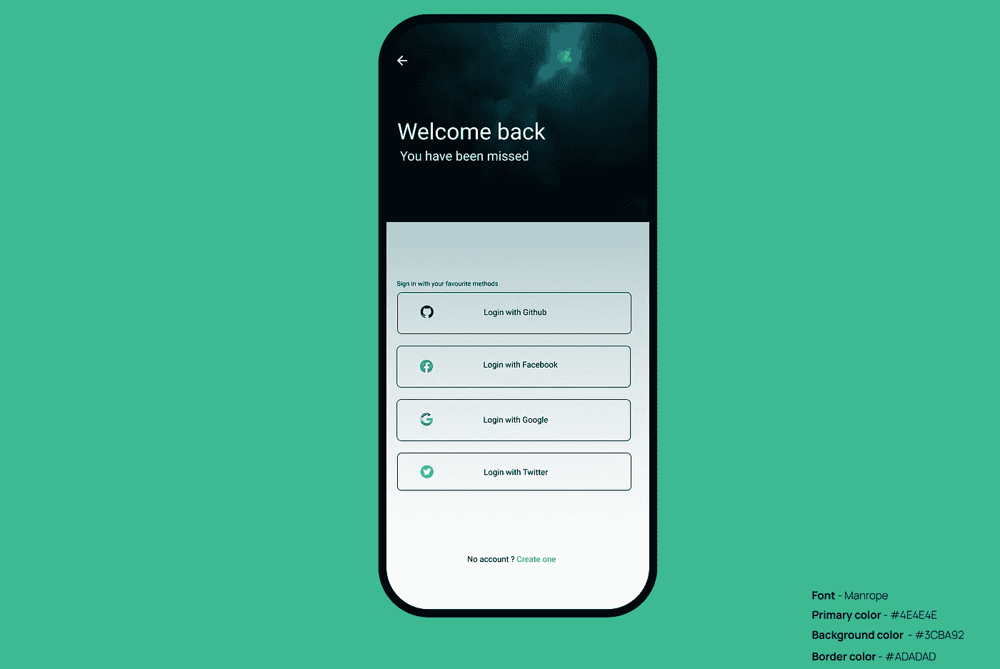
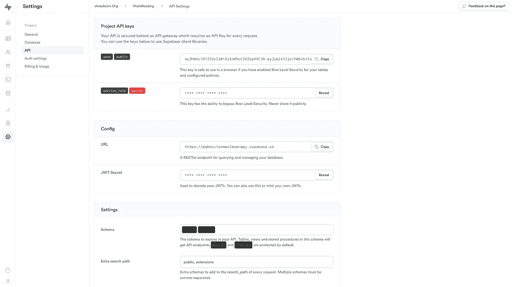
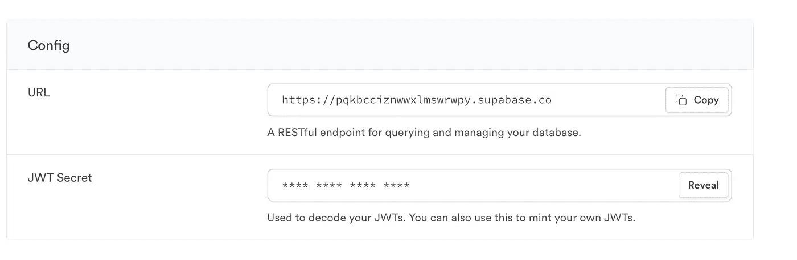
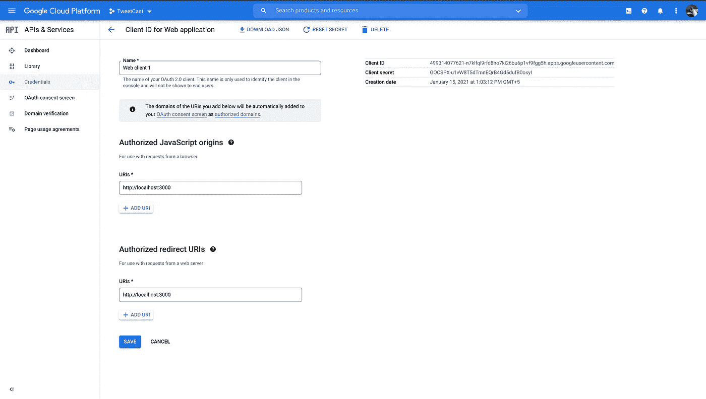
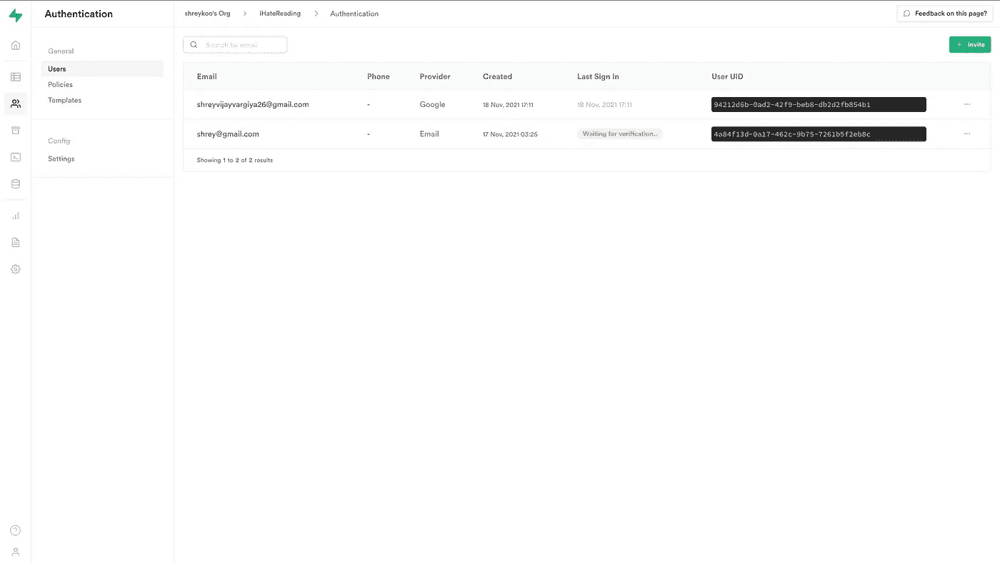

# 使用 Supabase 添加 Google 认证的 4 个步骤

> 原文：<https://javascript.plainenglish.io/4-steps-to-add-google-authentication-using-supabase-5245b242e8d5?source=collection_archive---------5----------------------->

只需 4 个步骤即可完成。



[Website](http://ihatereading.in/creativity)

## 在后台

Supabase 是一个开源的 Firebase 替代方案。我已经报道了一个故事，简要介绍了 Supabase，你可以在这里阅读 T4。在今天的故事中，正如我们所承诺的，我们将涉及 Supabase 的认证部分。

## 入门指南

使用 Supabase 的身份验证与使用 Firebase 的身份验证几乎相同。像 Firebase 一样，我们也通过提供 Supabase 项目 URL 和项目密钥来初始化 Supabase 实例。

要获取您的项目凭证，首先，您必须在 Supabase 仪表板中创建项目或数据库。一旦数据库准备好可以使用，转到左下侧边栏的设置页面，在配置部分下，您会找到所有的凭证。保存凭证，因为我们将需要它们来初始化 Supabase 实例。让我们开始聚会，按照 5 个步骤添加谷歌认证。



Settings page for all our project cerdentials.

## 在本地安装 Supabase

就像 Firebase 和其他第三方提供 npm 模块一样，Supabase 可以使用 npm 模块本地安装在存储库中。

```
yarn add @supabase/supabase-js
```

一旦安装完毕，我们就可以初始化或者连接我们的前端到我们的 Supabase 项目。

## 将前端连接到 Supabase

每个 Supabase 项目都有自己独特的项目 URL 和项目密钥。这些密钥对于识别用户以及将 Supabase 仪表板或项目连接到前端存储库非常重要。

```
import { createClient } from "@supabase/supabase-js";export const supabaseApp = createClient(YOUR_SUPABASE_DATABSE_URL, YOUR_SUPABASE_KEY);// you can store the YOUR_SUPABASE_DATABSE_URL & YOUR_SUPABASE_KEY in env files
```

我们的 Supabase 客户端现在连接到项目仪表板，确认一次，控制台`supabaseApp`并查看与仪表板中的细节匹配的细节。



Supabase URL and Key under Config section in the settings tab

## 在 Supabase Dashboard 中添加 Google 凭据

在 Supabase 仪表板的认证部分下，向下滚动一点并启用 google sign 方法。一旦启用，它将显示客户端 id 和客户端密码输入表单。

*   转到 Google developer console `[https://console.cloud.google.com/apis/dashboard?project=tweetcast-301807](https://console.cloud.google.com/apis/dashboard?project=tweetcast-301807)` 并在左侧菜单的凭证部分获取客户端的 OAuth 凭证。



Google developer console for adding callback URl and accessing client id and secret

*   这将给你谷歌客户端 id 和谷歌客户端秘密，作为回报，要求你提供一个网址和重定向网址。
*   URL 将始终是托管或访问前端的端点。例如，出于测试的目的，您的 URL 将是 [http://localhost:3000](http://localhost:3000) ，而对于重定向，则在您的项目 URL 上添加这个后缀`http://{YOUR_SUPABASE_PROJECT_URL}/auth/v1/callback`。

要详细了解添加谷歌客户端 id 和密码的步骤，请阅读[https://supabase.io/docs/guides/auth/auth-google](https://supabase.io/docs/guides/auth/auth-google)的说明。

## 在前端添加身份验证

高潮部分现在开始发挥作用，我们只需要在客户端添加几行代码和一个带有 Google 按钮的登录来完成任务。

```
const login = () => {
 const { users, error } = await supabaseApp.auth.signIn({
   provider: 'google'
 });
};
```

看了代码你会大吃一惊。从字面上看，这么多行代码将帮助您添加谷歌认证，这就像一个 cakewalk。

我没有什么要介绍的，用户可以自己管理关于用户认证的其他事情。

## 在项目仪表板中查看经过身份验证的用户

经过身份验证的用户被添加到身份验证表中。到达那里后，您可以查看包含用户 UID、电子邮件、电话、提供商等列的用户表。在整个 Supabase 项目中，每个用户都只使用 UID 来标识。



Authenticated users table in supabase project dashboard

## 结论

只需 4 个步骤，您就可以将广泛使用的验证机制 Google authentication 添加到您的项目中。下一次，我们将报道仅使用 Supabase 添加 GitHub 和其他第三方认证的新故事。下次再见，祝大家愉快！

```
For more such stories visit our website - 💻 [**iHateReading**](http://ihatereading.in)
```

*更多内容尽在*[***plain English . io***](http://plainenglish.io/)