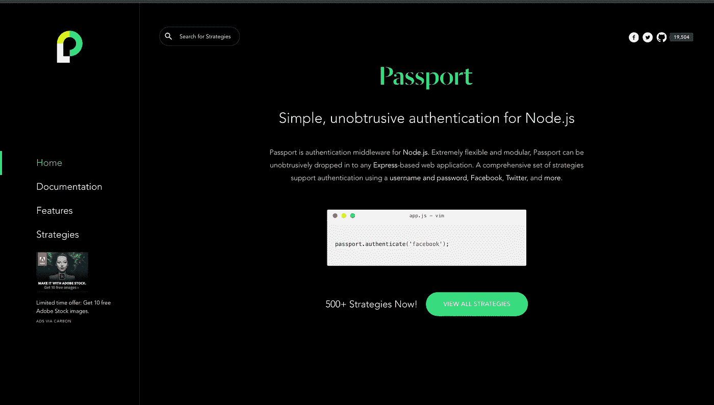

# 在 Node.js 中创建 Google 认证 API 的 4 个步骤

> 原文：<https://javascript.plainenglish.io/4-steps-to-create-google-authentication-api-in-node-js-e4bab8f744bc?source=collection_archive---------7----------------------->

使用 Passport.js + JWT &快递



[Screenshot of Passport.js website](http://www.passportjs.org/)

## 在后台

故事开始于我的朋友问我关于将 Passport.js 和 JSON Web Token (JWT)集成在一起的问题。他想创建一个 API 或端点，通过 Express 和 JWT 使用 Passport.js 提供 Google 身份验证。所以我想为什么不写一个故事来帮助市场上的许多开发人员，这样你就真的不必阅读 StackOverflow 或文档了？

## 入门指南

在我们开始之前，请记住，谷歌认证或脸书或 Github 需要一个客户端 ID 和客户端密码，您可以从他们相应的开发人员控制台或仪表板上获取。但总的来说，所有第三方 OAuth 都基于相同的客户端 id 和客户端机密原则工作。只需 4 个步骤，我们将使用 Passport.js 和 JWT 创建一个 Google 认证 API。

## 总流量

这将是整个流程—

*   通过向策略实例添加配置来初始化 passport。
*   创建一条路线`/v1/auth/google`，该路线将开始谷歌认证并为用户打开谷歌电子邮件选择模式。(基本上重定向到谷歌登录页面)
*   添加 passport google authentication 作为用于`/v1/auth/google`路线的中间件，作为中间件，我们将调用 passport authentication 方法，并向中间件函数提供我们的客户端 id 和秘密。
*   一旦 passport `_verify`回调被成功调用，它将返回包含用户电子邮件和用户名的配置文件。使用从 passport 中间件返回的用户配置文件详细信息，创建一个 JWT 令牌，如果需要的话，用一个令牌将用户详细信息存储在数据库中。
*   最后，在定制服务器中处理您在 google 开发人员控制台中提到的回调 URL。作为响应，这个回调 URL 将处理重定向或将令牌传递给客户端。

## 正在初始化 Passport.js

初始化非常简单，因为它只需要 3/4 步。

*   添加所需的 Passport.js npm 包，如`passport` & `passport-google-oauth20`
*   将 auth 策略和回调传递给 passport use 方法。
*   参数中添加的授权策略需要`clientId`、`clientSecret`、&、`callbackURL`
*   使用相应的方法序列化和反序列化 passport 发送的用户。
*   最后，添加这个确认的 passport 实例，并使用 express 中间件方法初始化它们。

在 middleware/passport 目录中添加以下代码。

Configuring passport by providing authentication strategy.

最后，通过添加以下代码，使用 express 中间件方法初始化导出的 passport。

让我解释一下我们在这里做什么—

*   我们基本上将认证策略传递给 passport use 方法，因为我们使用 google 认证，所以 clientId、clientSecret 和 callbackURL 是必需的。
*   然后，我们刚刚定义了回调函数，当 passport 端的一切都成功时，将调用该函数。
*   最后，我们刚刚添加了序列化和反序列化的方法
*   然后在`server.js`文件中，我们使用 express use 方法初始化导出的 passport 方法。

注意—请不要删除序列化和反序列化方法，因为我们需要它们来读取登录的用户数据。

## 为 Google 登录创建路径

这是一个基本的获取途径，我们不需要从客户端发送任何东西。这条路线的议程是调用 passport 中间件。

Basic GET route to call passport middleware

我们还提供了 passport 身份验证方法的范围和身份验证策略。

## 保存用户配置文件并创建 JWT 令牌

故事的高潮来了，现在一旦 passport 中间件被调用，我们得到了用户配置文件的细节，我们只需处理 JSON web token 和我们的数据库系统。如何处理令牌完全取决于您的选择，有些开发人员喜欢将令牌存储在数据库中，有些则不喜欢。我个人总是在用户成功登录后发送 cookie 中的令牌。

在 Passport.js 中，当调用 passport use 方法的回调时，它将返回我们已经安慰过的用户配置文件。这是我们将创建 JWT 令牌的地方，如果需要，可以将用户详细信息存储在数据库中。

Creating JWT token and sending the required details to the request object in the callback URL.

```
[If you are new to JWT then I recommend reading this story.](/most-secured-authentication-via-json-web-token-a45ae52a76df?source=your_stories_page----------------------------------------)
```

## 处理回调 URL

最后一部分是处理回调重定向 URL。如果您还记得，我们已经在 google 开发者控制台中添加了一个回调 URL，但是这个回调 URL 在我们的定制服务器中并不存在。在目前的情况下，一旦创建了令牌，用户就登录了，用户将被重定向到重定向回调 URL，现在作为开发人员，我们的工作是定义登录用户应该被抛出的实际方法或路由。

我将 cookie 中的令牌发送给用户，并在他/她成功登录后重定向他。只有当一切按计划进行并且用户使用 google 认证成功登录时，才会调用这个回调 URL。

在客户端，从 cookie 中获取令牌，并使用另一个 API 进行验证，以确认令牌的真实性，并确认用户已成功登录。

将令牌保存在 cookies 中有其自身的优点，它可以轻松处理跨多个标签和设备的用户会话。

## 结论

我把这个故事分为 4 个步骤，但实际上，我花了一些时间来理解这个想法，特别是如果你是这个节点和护照世界的新手。这就是为什么我试图用 4 个步骤来完成整个故事，这样你就可以同时记住这 4 个步骤。下次再见，祝大家愉快。

```
For more such stories, visit our website - 💻[iHateReading](http://ihatereading.in)
```

*更多内容看* [*说白了. io*](http://plainenglish.io/) *。在这里注册我们的* [*免费周报*](http://newsletter.plainenglish.io/) *。*