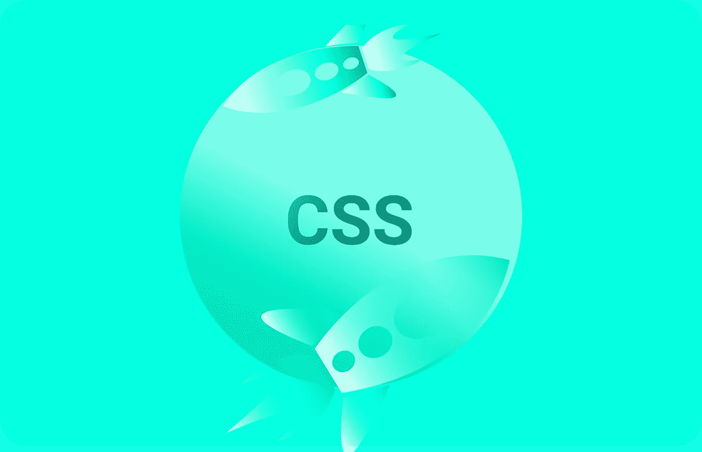
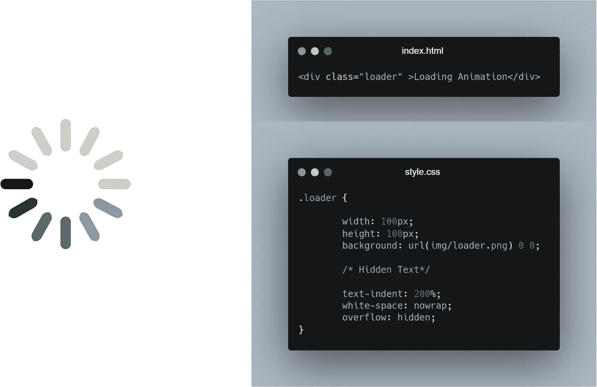
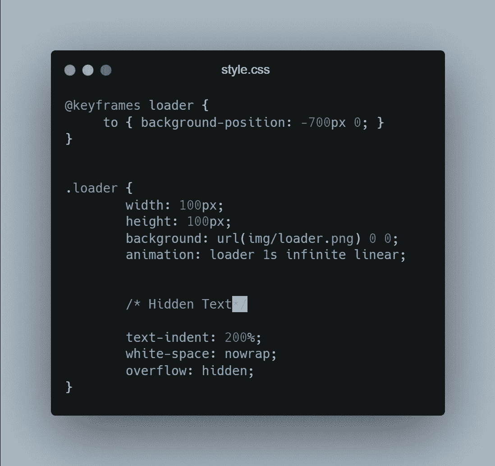
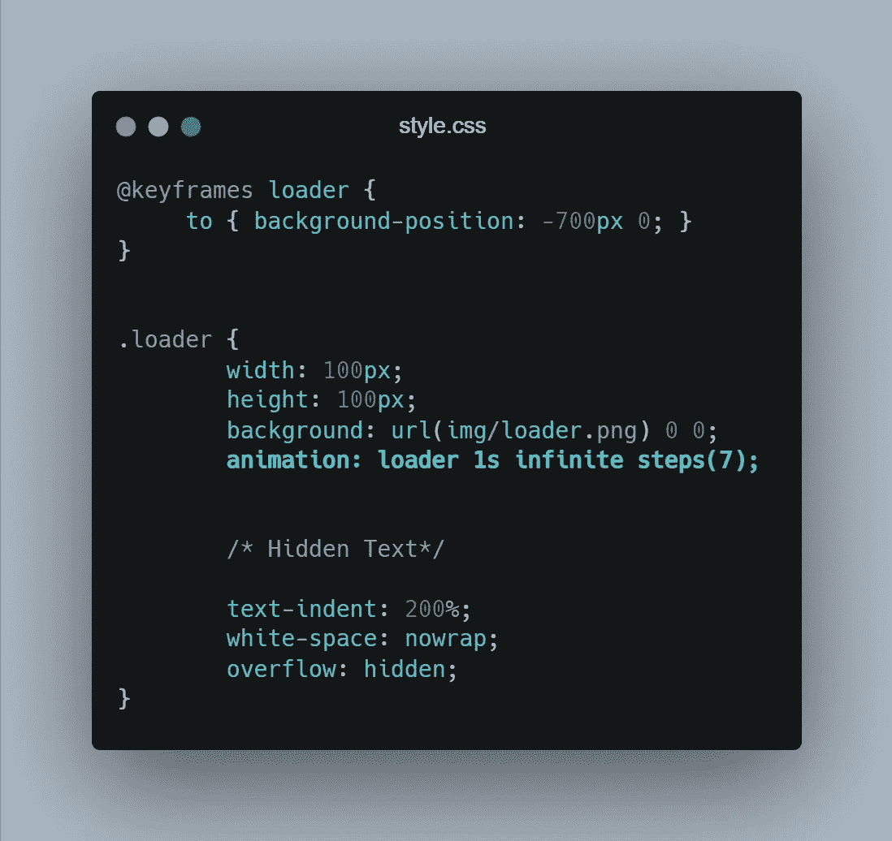
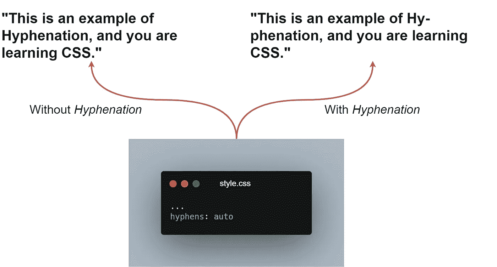
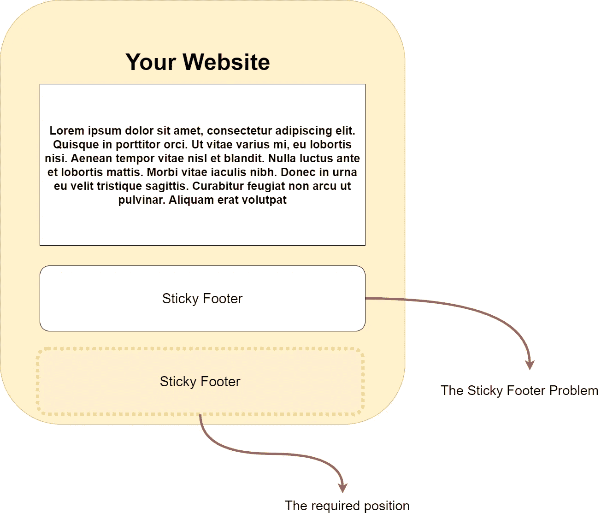
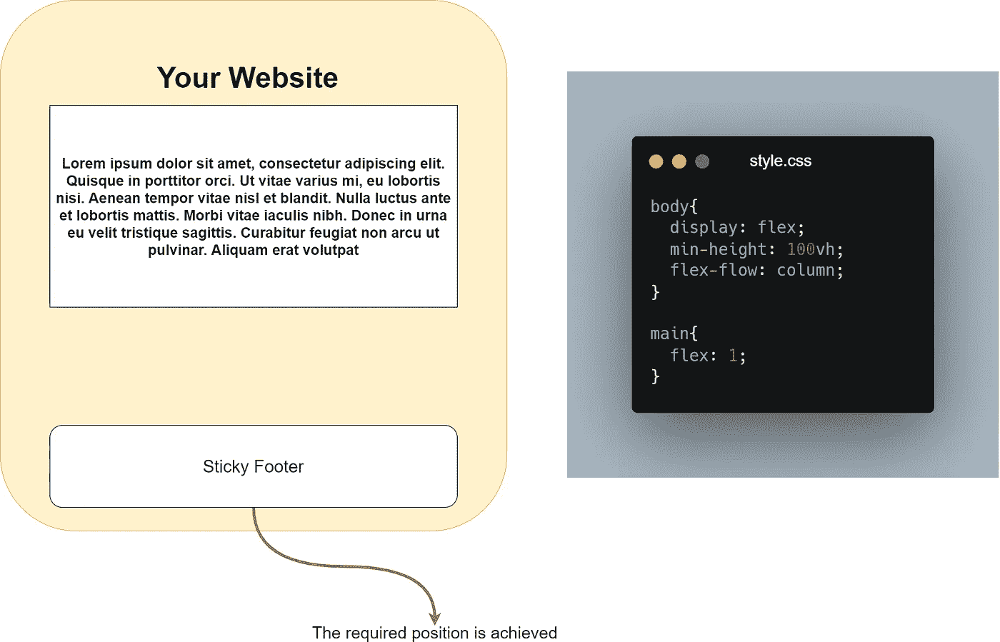
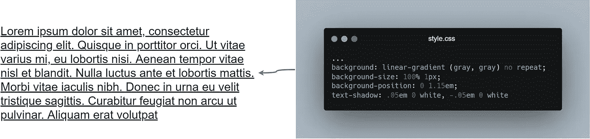

# 你不知道 CSS 能做的 4 件事

> 原文：<https://javascript.plainenglish.io/4-things-you-didnt-know-css-can-do-13b364296570?source=collection_archive---------1----------------------->

## 鲜为人知的 CSS 特性及示例

## 1.逐帧动画

有些时候，我们需要一个动画，这是很难实现的原始 CSS 元素的过渡属性。

***例如*** ，一个进度指示器或者一个移动的图标对于原始的 CSS 属性来说可能是一个很难实现的任务。在这种情况下，基于图像的**逐帧**动画是一个完美的选择，在这里你可以灵活地完成所有类型的挑战性任务。

> ***注意:*** *大多数情况下我们也可以使用 gif，但是使用 gif 有一定的局限性。它们限于 256 种调色板***并且它们不能有* ***alpha 透明度*** *当 GIF 下面有项目时，这就成了一个大问题。gif 对于可移植的任务来说是很棒的，但是不推荐用于实验。**

****例如:****

*   *比方说，我们有一个 PNG 文件中的所有动画帧，如果我们应用一些基本的 CSS 动画属性，我们的结果可能如下所示。*

**

*   *到目前为止，你可以观察到结果只显示了我们动画的第一帧，但是如果我们添加不同的**背景位置**值，我们会注意到 **-100px 0** 给了我们第二帧， **-200px 0** 给了我们第三帧，等等。*

**

*   *然而，我们的 CSS 中仍然缺少一些东西，为了得到最终的结果，我们必须使用***【steps()***计时函数，该函数将整个动画按我们指定的步数分成帧。*

**

*   *注意在 ***步骤()*** 计时功能中我已经使用了动画帧数(7)用于动画。*

## *2.用连字符号连接*

*如果你想让你的网站有更精确的排版，那么这个就是给你的。如果你想在你的应用程序中提供更多的可读性，CSS 中的连字符是你应该知道的一个基本特性，因为连字符允许单词被分解成具有较少空格调整的音节，从而产生看起来更自然的文本。*

> ****注:*** *在 CSS 文本三级中，引入了一个新属性:* ***连字符*** *表示接受值:* ***无，手动，*** *和* ***自动。****

****例如:****

*   *如果您简单地应用带有值**自动**的**连字符**属性，它将足够用于断字，然而，您需要已经通过**语言** HTML 属性声明了一种语言。*

**

## *3.粘性页脚*

*您一定遇到过 web 应用程序中的页脚问题，在这种情况下，具有任何块级样式的页脚在处理长内容时都可以很好地工作，但是当页面变短时就会中断。*

> *此问题出现在内容短于视窗高度减去页脚高度的较短页面上。*

**

***使用 Flexbox 作为灵活的解决方案***

*Flexbox 非常适合这种情况，你所需要的只是几行 CSS 和一些使用 Flexbox 的经验。*

****例如:****

*   *首先，您需要将 **display: flex** 应用到 **< body >** 元素，因为它是所有其他主块的父元素，为所有元素切换灵活的框布局。*
*   *在这一点上，你的页面看起来和 Flexbox 之前的差不多，为了使我们的方法有效，我们需要在**<>**的 **100vh** 上指定一个 **min-height** ，它将至少占据视口的整个高度。*
*   *在这一点上，变化并没有实现，因为我们身体中每个盒子的高度仍然是内在确定的。为了解决这个问题，我们必须将大于 0 **(在我们的例子中为 1)**的 **flex** 值应用到 **<主>** 容器。*

**

## *4.自定义下划线*

*CSS 一直是一个令人惊讶的学习技能，你可以用 CSS 做的事情的数量仍然是我们不知道的。在 CSS 中，你必须擅长文本属性，但是当涉及到使用其他东西使文本变得更好的时候，你可以用自己的方式使用 CSS。*

****例如:****

*   *只用很少几行 CSS 就可以实现文本中的下划线，但是要确保你没有使用任何那些**底部边框的技巧。因为该解决方案不会遵循我们对文本的所有预期。***

**

*   *请注意，我们使用了**文本阴影**属性来解决下划线如何穿过字母的下行线的问题，如 **p，l，q，**等。*

* [## 6 个 HTML 标签用于改进网络搜索引擎优化

### 改善网络搜索引擎优化的鲜为人知的 HTML 标签

javascript.plainenglish.io](/use-these-8-html-tags-for-improved-web-seo-ca9763c951b4)  [## 在 4 分钟内解释 4 个关键 CSS 属性

### 基本 CSS 入门

javascript.plainenglish.io](/4-key-css-properties-explained-in-4-minutes-9567d1b5af86)  [## 2021 年你需要知道的 25 个 CSS 最佳实践

### 编写更好 CSS 的最佳实践

javascript.plainenglish.io](/25-css-best-practices-you-need-to-know-69f9192babdd) 

*更多内容看*[***plain English . io***](http://plainenglish.io)*