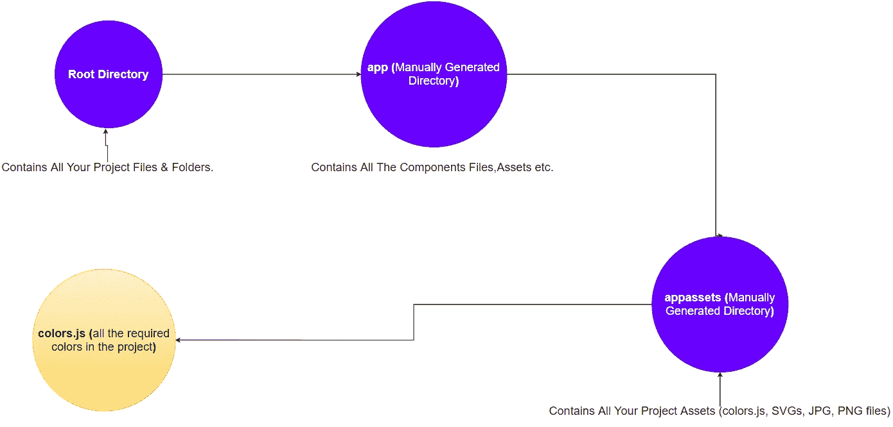
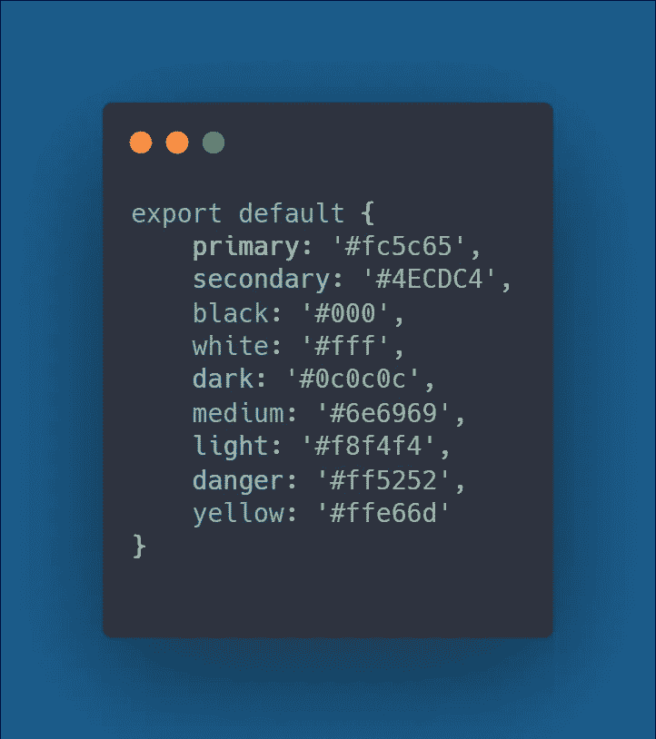
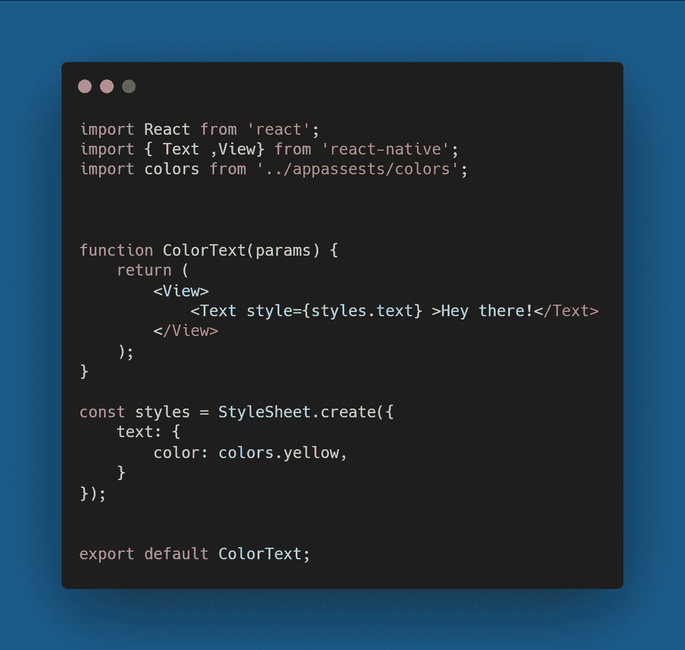
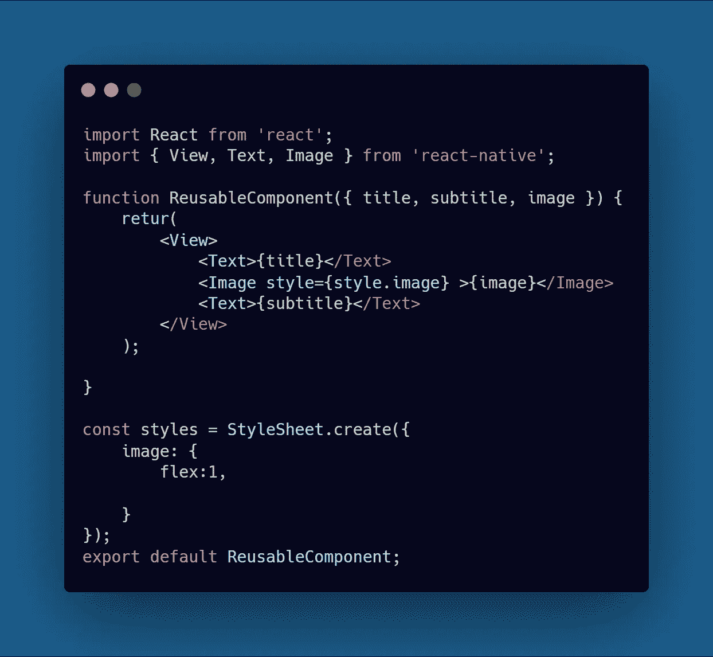
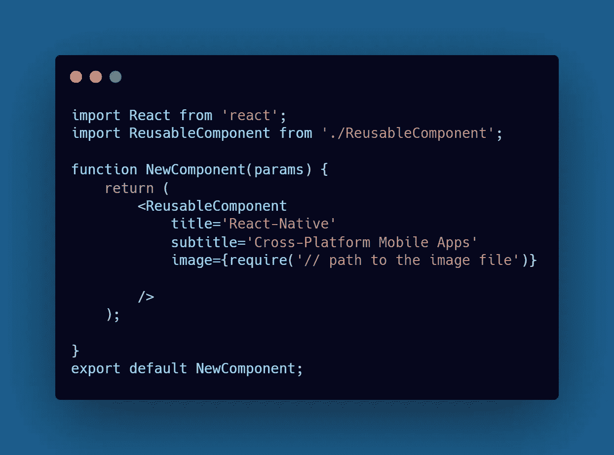
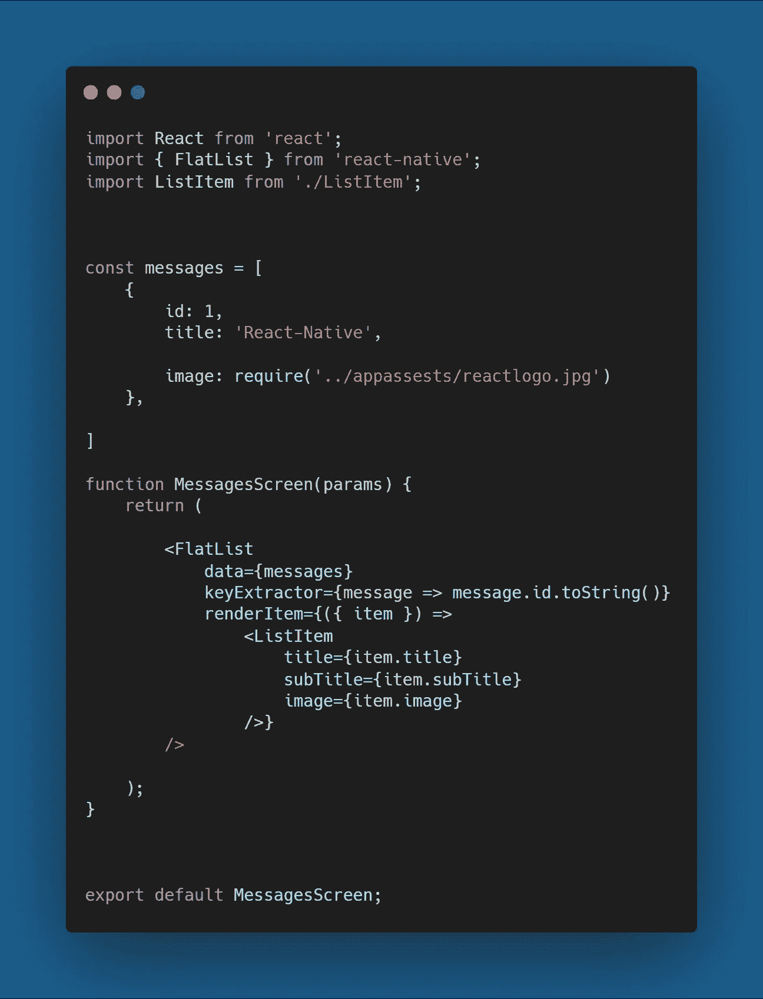
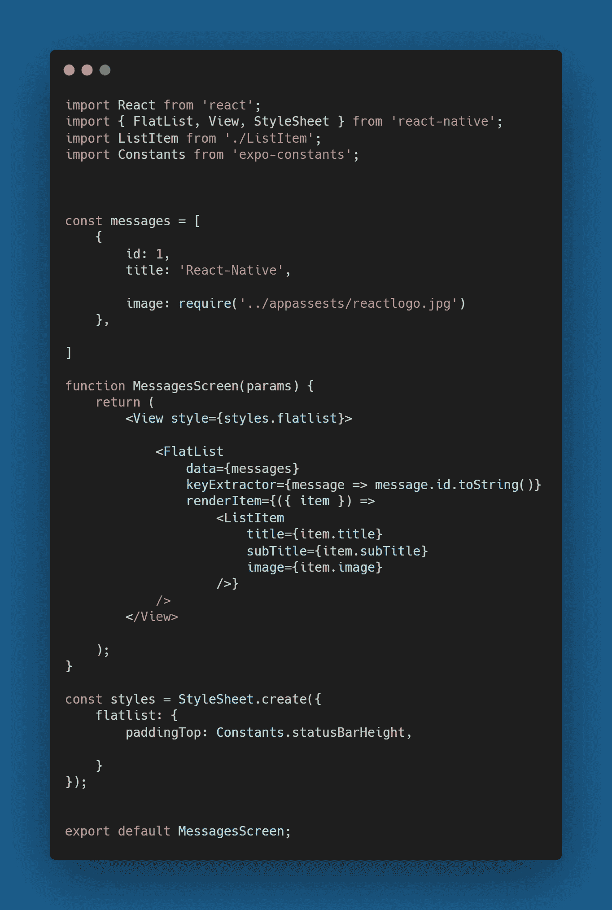
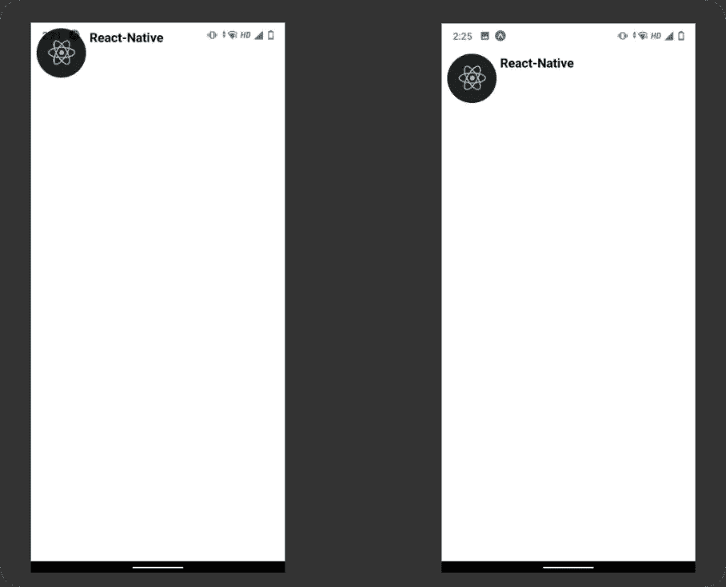
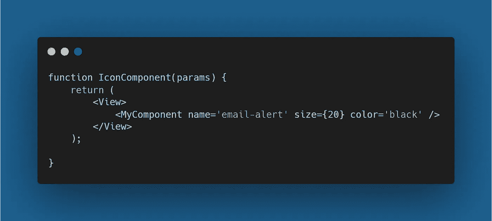
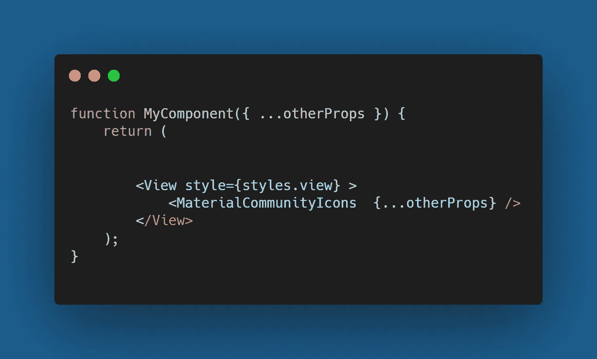

# 在 React Native 中构建更好组件的 4 个技巧

> 原文：<https://javascript.plainenglish.io/4-tips-for-building-better-components-in-react-native-acb1a000ec23?source=collection_archive---------6----------------------->

## 在构建 React 原生组件时，不要再浪费时间做重复的事情了

# 1.使用调色板

在每个 **React Native** 项目中，你绝对需要使用许多颜色，但是随着时间的推移，随着项目变得越来越大，到处使用颜色名称或命名你的颜色# **(例如# f4f5f 7)**会使管理项目变得更加困难。为了解决这个问题，开发人员使用了一种不同的方法，即在项目中制作调色板，每当需要将相同的颜色应用到项目中时，您可以简单地导入调色板并轻松使用它。

**比如:**

下面是如何在您的 **React Native** 应用程序中实现这一点。

以下是如何在 **colors.js** 文件中添加您的颜色:

**root>app>appassets>color.js**

现在，当您以这种方式完成了项目的设置后，您就可以很容易地导入这个文件并设计您的组件了。

> 注意:我已经将我的**资产**文件夹重命名为 **appassets。**

**Using the color palette in styling the Text Component.**

# 2.使用可重用组件

不仅仅是在 **React Native，**所有的**前端**框架都有许多模式来构建组件。在 **React Native** 中，你可以制作可重用的组件，这使得处理项目变得容易。

要创建可重用组件:

*   在组件中选择你想要动态改变的**道具**。
*   使用析构语法- **({})析构那些**属性**。**
*   确保为您的组件提供默认的**属性**，以避免在您忘记定义所有属性的情况下出现错误。

使用这三个简单的步骤可以为你提供一个非常棒的使用本地组件的体验。

***例如:***

在名为( **ResusableComponent** )的组件中，我传递了 3 个道具**图片、标题、副标题。**以后我们可以在组件之外的任何地方访问它。

**Reusable Component**

现在，每当我们需要在项目中使用这个组件时，我们可以简单地从外部传递**道具**。

**Our Reusable Component In Action**

# 3.使用 Expo 常量

Expo 提供了大量的工具，可以增强你的开发工作流程， **expo-constants** 在你必须制作可以在两个平台 **(iOS & Android)上运行良好的组件时使用。**

> 在你的 **React Native** 项目中安装 Expo-constants:***Expo I Expo-constants。***

每当我们构建一个跨平台的应用程序时，我们必须确保组件在两个平台上都能正常运行。expo-constants 通过提供与设备相关的所有数据使这一步变得更容易，*您将从下面的示例中更好地理解这一概念:*

我们有一个**平面列表**组件，它只是在设备上显示一个图像，但你可能会在 **Android** 上遇到一个错误，即没有**安全区域**，你的组件会呈现在你设备的顶部，我们从来不希望这样。

**FaltlList Component**

为了解决这个问题，我使用了 **expo-constants。**

**Using the statusBarHeight property from expo-constants**

我们使用 *expo-constants* 用几行代码就解决了这个问题。

# 4.可重用组件中的 Rest 运算符

正如我们所讨论的，构建可重用组件是在 **React Native** 项目中使用的最佳实践之一，如果您想要构建高度灵活的组件，那么 **JavaScript** 中的 rest 操作符非常有用。你所要做的就是定义 rest 操作符 **(…)。**

**比如:**

让我们有一个呈现图标的组件，要访问**图标**组件的所有**属性**，我们可以简单地使用 rest 操作符。

**Icon Component**

