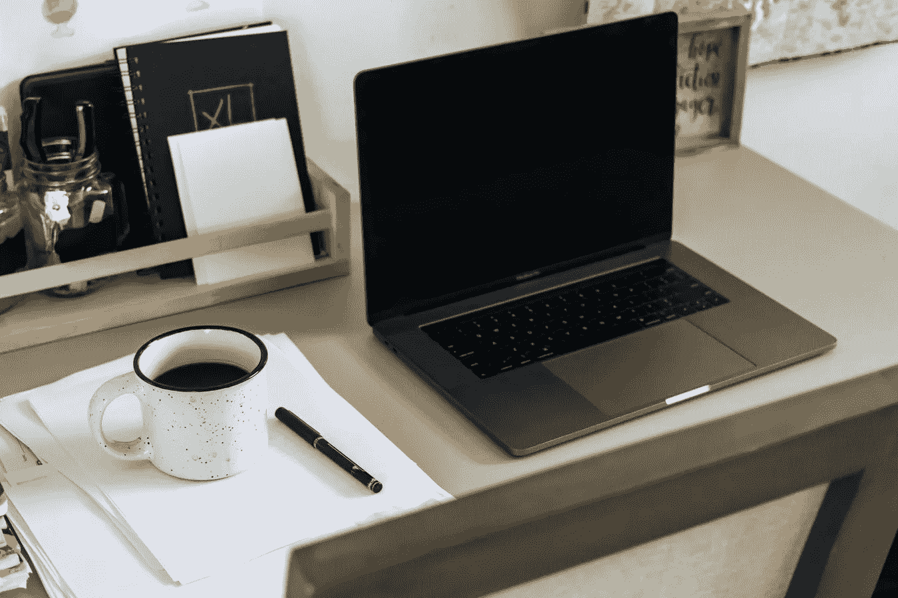
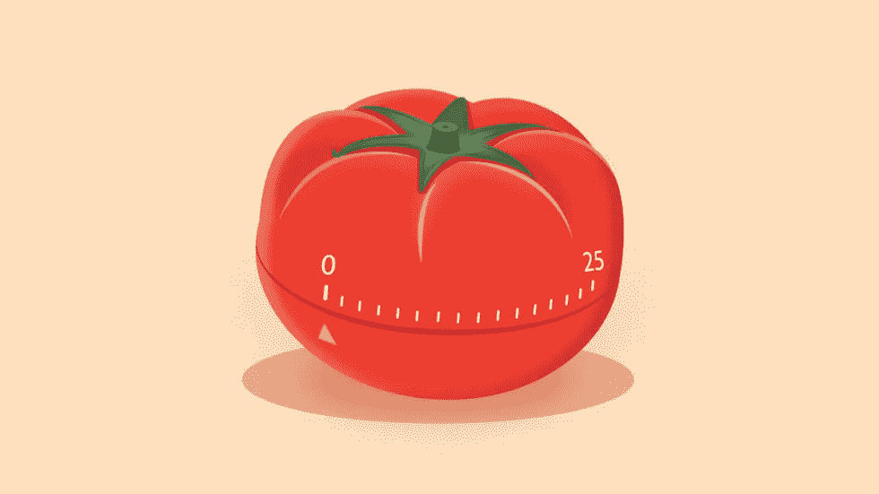
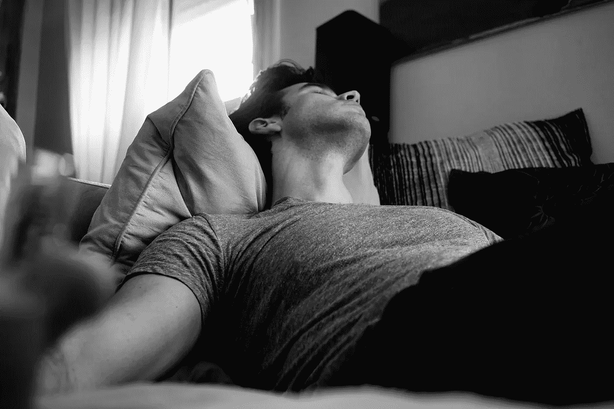
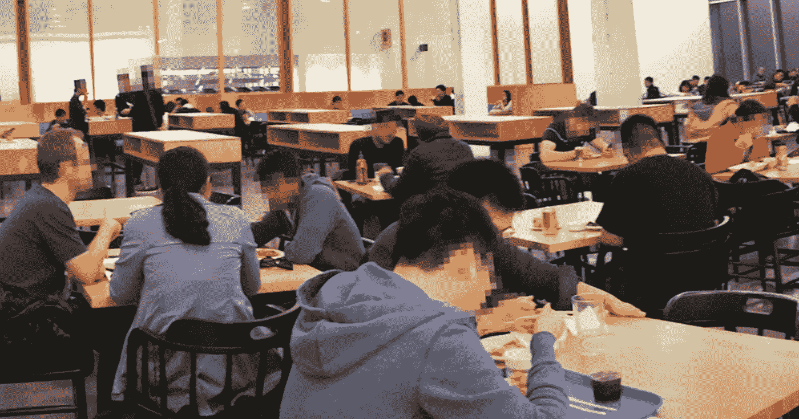
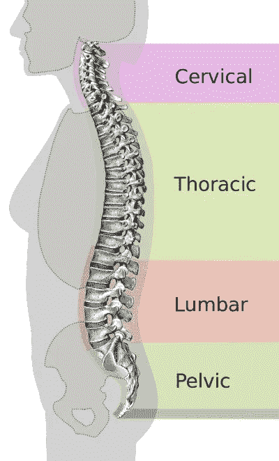

# 提高在家工作效率的 4 个技巧

> 原文：<https://javascript.plainenglish.io/4-tips-to-boost-work-from-home-productivity-54ecda8912ee?source=collection_archive---------17----------------------->

不管你喜不喜欢，在家工作已经成为我们大多数人的常态，而且毫无疑问将会持续很长时间。像生活中的所有事情一样，远程办公当然有它的好处，但它也带来了一系列的负面影响。

我经历了一个完整的循环，从第一次宣布在家工作时的兴奋，喜欢它，因为我可以每天午饭后小睡一会儿，到耗尽/打乱睡眠时间表，现在终于有了一个良好的平衡，以保持最高的生产力，同时有一个可怕的工作和生活平衡制度。

这里有一些关于如何在远程工作时最大化生产力的提示。

## #1 突发工作

传统上，一些研究建议使用番茄工作法，该方法利用 45 分钟工作和 15 分钟休息周期的技术。另一方面，其他一些研究建议 90 分钟的工作和 30 分钟的休息周期。

就我个人而言，我已经尝试和测试了这两种方法，发现最好的方法是介于两者之间的最佳点。我不认为我发明了它，但我喜欢称它为 *1 小时爆发*秒。这是因为 45 分钟太短了，似乎会扰乱你的流动*只是*当你进入工作节奏时，90 分钟太长了，会导致你的注意力和锐度下降。

我喜欢用 [pomofocus.io](https://pomofocus.io/) ，讽刺的是它是一个番茄计时器，但却将时间间隔设置为 1 小时工作时间和 20 分钟休息时间。该应用程序也很棒，因为当 1 小时结束时，它会发出柔和但可听见的警报，以防你仍在工作。

为了获得最佳体验，试着找到一个小时的播放列表，并随着计时器开始混音，这样当音乐开始时你的大脑就会同步，并在结束时慢慢消失。

> 没有科学证明，但它对我有用。😆

## #2 不要午睡

5 mins naps can turn into 20 and 20 can turn into an hour

如今，让我们的整个工作空间都在笔记本电脑的掌控之下也变得越来越普遍。由于空间有限，我们中的许多人也把书桌放在卧室里。考虑到这一点，当我们在家工作时，休息一下就变得容易多了。但这是一个严重的错误，它将动摇坏习惯，并最终失控。

我们以前在幼儿园时认为午睡是理所当然的，现在我们都后悔了。作为一个成年人，当你工作累得筋疲力尽，只想躺下来睡一觉时，没有什么比这更好的了。但是要警惕这个陷阱，不要上当。

晚上睡觉前，甚至不要触摸或躺在床上。如果情况真的很糟糕，你需要休息，那就直直地坐在椅子上，闭上眼睛 5 分钟。但是无论如何都要避免躺在床上。

如果可能的话，在卧室外面工作。

## #3 符合人体工程学的椅子

photo credits: TechLead’s Youtube Channel

背痛和腰痛是真实的。非常真实，但出于某种原因，我们大多数人选择忽视它，直到它回来纠缠我们。上图是脸书办公室里的*真实的*自助餐厅，然而不知何故，即使是在世界顶级公司，正确的坐姿和正确的人体工程学仍然被忽视和忽略。

我曾经认为，当我可以去沃尔玛花很少的钱买到一把看起来不错的椅子时，人们会疯狂地花上几千美元买一把椅子。

天哪，当我决定买一把符合人体工程学的椅子并亲自试用时，我错了吗？与普遍的看法相反，坐下时，我们的背*不应该完全挺直。*

如果你看上面的图表，你可以看到我们的脊椎在 **3 点**处弯曲。颈部和腰部向内弯曲，而胸部向外弯曲。当涉及到椅背的形状，以及购买符合人体工程学的椅子时，这一点非常重要。确保椅子在正确的位置弯曲，以正确定位和缓冲脊柱的自然弯曲。

你也不需要花上几千块买赫曼米勒和秘密实验室的椅子，只要买一把符合你背部的，你应该会很棒！

> 一个好的背会让你站在前面——蒂姆

## #4 晚上去散步

晚上散步被严重低估了，尤其是在家工作，因为我发现自己在一整天的辛苦工作后，躺在沙发上，穿上网飞，点外卖，奖励自己。

相反，在一整天都呆在室内之后，通常最好是从所有的电子设备中休息一下，进行一次*重置*来清理你的想法并放松下来。就我个人而言，我晚上去附近的餐馆跑步，在回家的路上买食物。

有时在跑步后，当我试着喘口气时，我会静静地坐几分钟，对我的一天进行一次小小的反思。这很好，因为你的一半心思都在努力恢复呼吸，这样你就不太可能被纷乱的思绪分散注意力。

## 结束语

在 WFH 期间，我学会了在工作和非工作时间之间取得健康的平衡，之后我发现这要愉快得多，尤其是当我有机会避免往返办公室的长途旅行、午餐时间的拥挤时&我将更多精力放在了自我发展上。

我希望这些建议能帮助你，因为它们帮助我欣赏远程工作，并更适应即将到来的新工作规范。WFH 不会很快去任何地方，所以让我们都努力去征服它，并充分利用它。

在那之前，保重。

定时（timing 的缩写）

请关注我，继续支持我的*写作生涯。*

*更多内容请看*[*plain English . io*](http://plainenglish.io/)