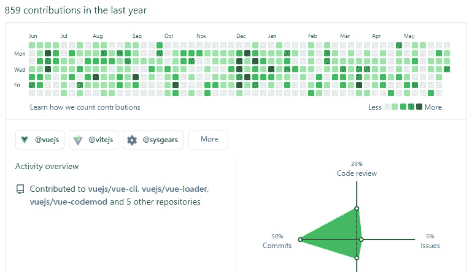
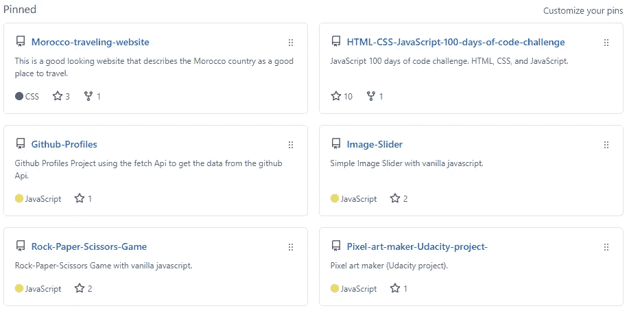
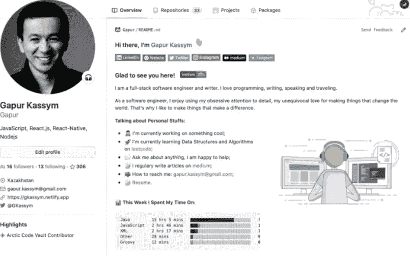

# 像专业人士一样创建令人印象深刻的 GitHub 个人资料的 4 个技巧

> 原文：<https://javascript.plainenglish.io/4-tips-to-create-an-impressive-github-profile-like-a-pro-ea712c976e07?source=collection_archive---------7----------------------->

## 如果你想建立一个令人印象深刻的 GitHub 档案，你需要考虑的事情。

Photo by [Roman Synkevych](https://unsplash.com/@synkevych?utm_source=medium&utm_medium=referral) on [Unsplash](https://unsplash.com?utm_source=medium&utm_medium=referral)

GitHub 是托管 Git 存储库和开源项目的最大流行平台之一。当然，大多数大型企业和开发人员都在他们的项目中使用 GitHub。

这个平台上充满了热爱编码和与世界分享他们的项目的开发人员。你可以在 GitHub 上找到很多能让你这个开发者印象深刻的简介。

作为一名软件开发人员，制作一份令人印象深刻的 GitHub 简介对你来说是非常有益的。这将为你的职业生涯打开许多大门和机会，尤其是如果你正在找工作的话。你申请的许多公司都想查看你的 GitHub 档案，看看你的代码和项目。

这就是为什么在这篇文章中，我会给你一些提示，如果你想制作一个令人印象深刻的 GitHub 简介，你需要考虑这些提示。所以让我们开始吧。

# 1.为开源做贡献

开源贡献是制作优秀 GitHub 档案的最佳方式之一。如果你不知道在 GitHub 上贡献开源，有很多网络资源。除此之外，如果你还是一个初学者，你不必从大型项目和功能开始。

只要找到一个你感兴趣的项目，开始寻找你可以添加的东西来改进这个项目。所以这是一个获得一些经验，把手弄脏的好方法。因此，当公司查看你的个人资料时，他们至少会看到你为一些项目做出过贡献和工作。

Capture by the author.

# 2.锁定您最喜爱的存储库

GitHub 让您能够在个人资料页面上固定存储库，这样当人们访问您的个人资料时，他们将首先看到这些存储库。这是一个展示你想要展示的东西的好功能。

Capture by the author.

# 3.管理和共享您的存储库

永远不要忘记管理您的存储库。确保为您的项目创建组织良好的存储库。添加细节、标签和描述，使存储库更具吸引力。

此外，为您的项目创建一个美观且有条理的自述文件，以便人们可以轻松了解您正在构建的项目。

Capture by the author.

除此之外，不要犹豫在社交媒体上与开发人员社区共享您的存储库。这是让存储库更受欢迎并获得一些反馈的好方法。

# 4.为您的个人资料添加自述文件

如果你想让你的 GitHub 简介看起来更漂亮，更有吸引力，一个 ReadMe 文件是非常有用的。这是用户访问您的个人资料时首先看到的内容。

以下是 GitHub 简介自述文件的一个示例:

Capture by the author.

如果你对如何创建一个令人敬畏的 GitHub 简介自述文件感到好奇，你可以看看下面这篇由 [Gapur Kassym](https://medium.com/u/bf97e5a35e12?source=post_page-----ea712c976e07--------------------------------) 撰写的文章。

 [## 如何创建一个出色的 Github 简介自述文件

### 最佳 GitHub README 存储库工具

javascript.plainenglish.io](/how-to-create-an-awesome-github-profile-readme-a474d5b45645) 

所以这是描述你的激情、技能和成就的好方法。

# 结论

如你所见，GitHub 是一个很好的平台，在这里你可以展示你作为开发者的技能。一定要确保你为开源项目做贡献，并注意你的个人资料。

感谢您阅读这篇文章。希望你觉得有用。

**更多阅读**

 [## 每个 Web 开发人员都必须知道的 7 个有用的终端命令

### 对开发人员有用的终端命令列表。

javascript.plainenglish.io](/7-useful-terminal-commands-every-web-developer-must-know-e9eeab6dd09a)  [## 8 个对 React 开发人员非常有用的 VSCode 扩展

### 每个 React 开发人员必备的 VSCode 扩展列表。

javascript.plainenglish.io](/8-extremely-useful-vscode-extensions-for-reactjs-developers-9b0da7de4f47) 

*更多内容尽在*[plain English . io](http://plainenglish.io/)