# 40 个网页设计免费组合模板

> 原文：<https://javascript.plainenglish.io/40-portfolio-templates-free-for-web-design-d0611a372763?source=collection_archive---------0----------------------->

今天，我们将一起了解用于网站设计和开发的漂亮、免费的作品集模板。

# 开发组合— Bootstrap 5 组合模板免费

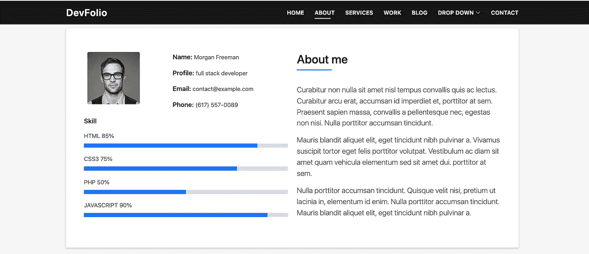

DevFolio — Bootstrap 5 portfolio template free

[演示](https://bootstrapmade.com/demo/DevFolio/)

[下载](https://bootstrapmade.com/devfolio-bootstrap-portfolio-html-template/)

# JohnDoe —免费单页作品集网站引导模板

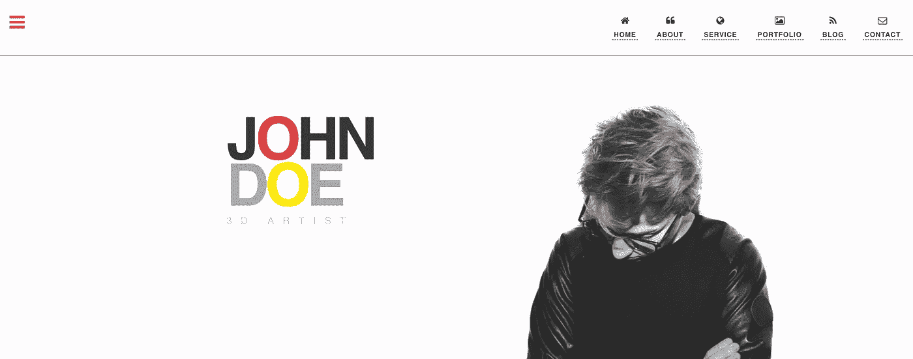

JohnDoe — Free One Page Portfolio Website Bootstrap Template

[演示](https://technext.github.io/JohnDoe/)

[下载](https://themewagon.com/themes/johndoe-free-one-page-portfolio-website-template/)

# 刺激——免费的 Web 开发人员组合模板

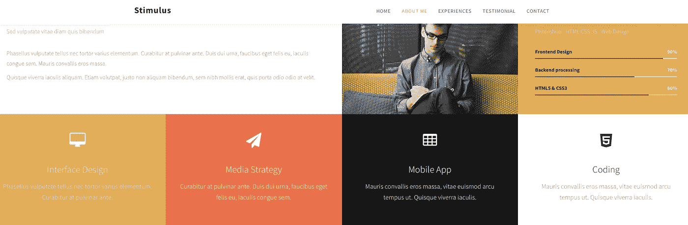

Stimulus — Web Developer Portfolio Template Free

[演示](https://templatemo.com/live/templatemo_498_stimulus)

[下载](https://templatemo.com/tm-498-stimulus)

# 奢华 HTML 组合模板免费

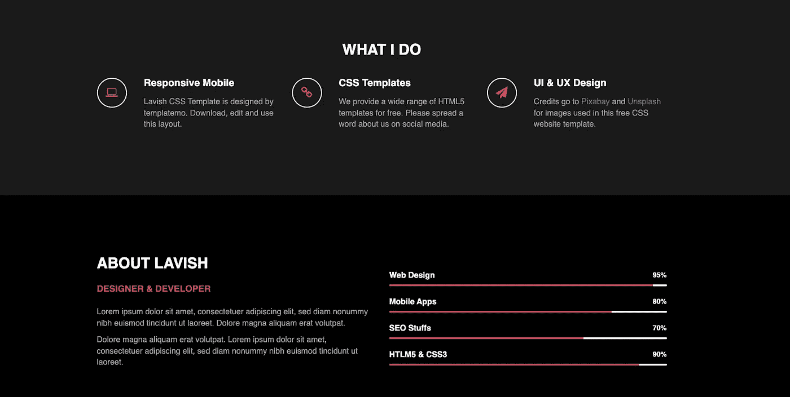

Lavish — HTML portfolio template free

[演示](https://templatemo.com/live/templatemo_458_lavish)

[下载](https://templatemo.com/tm-458-lavish)

# 配置文件 HTML 项目组合模板代码

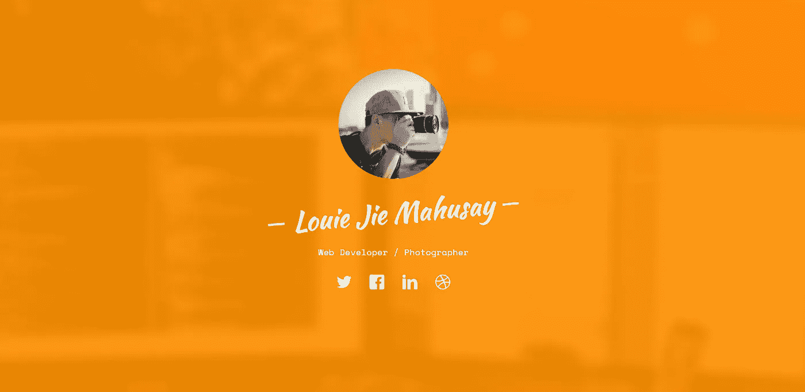

Profile — Html Portfolio Template Code

[演示](https://technext.github.io/profile/)

[下载](https://themewagon.com/themes/best-quality-free-portfolio-resume-bootstrap-template-download-profile/)

# 杰克逊 HTML5 组合模板免费

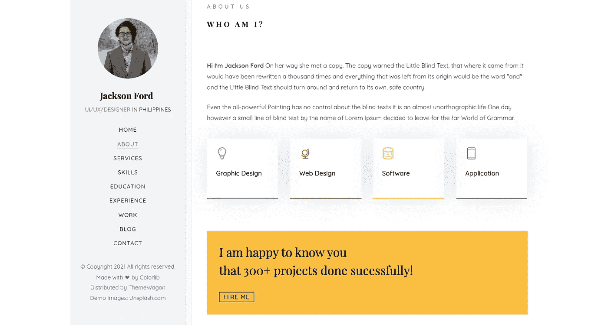

Jackson — HTML5 portfolio template free

[演示](https://technext.github.io/jackson/)

[下载](https://themewagon.com/themes/free-bootstrap-portfolio-website-template/)

# 爱洛—个人投资组合模板

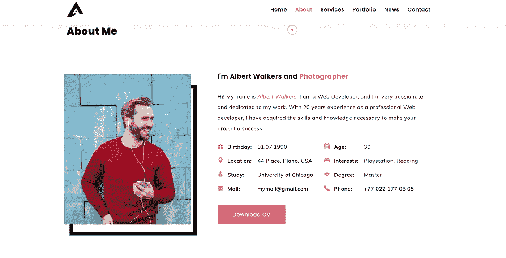

Arlo — Personal Portfolio Template

[演示](https://preview.themeforest.net/item/arlo-personal-portfolio-template/full_screen_preview/23175475?_ga=2.117459082.248853679.1640051566-1973834915.1632625071)

[下载](https://1.envato.market/gbJ50v)

# Folio —引导投资组合模板

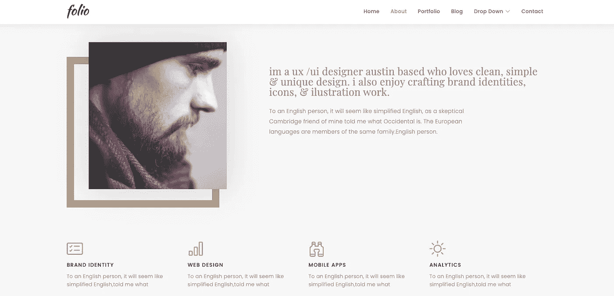

Folio — Bootstrap Portfolio Template

[演示](https://bootstrapmade.com/demo/Folio/)

[下载](https://bootstrapmade.com/folio-bootstrap-portfolio-template/)

# 简历—简单的 HTML 和 CSS 简历模板

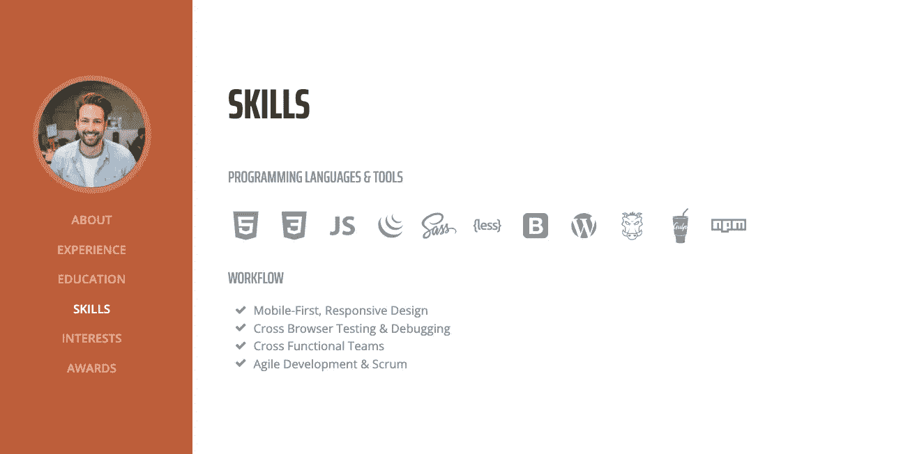

Resume — Simple HTML & CSS Resume Template

[演示](https://technext.github.io/resume-bootstrap4/)

[下载](https://themewagon.com/themes/free-bootstrap-4-cv-template-download/)

# Clark 免费单页 Bootstrap 4 HTML5 个人作品集网站模板

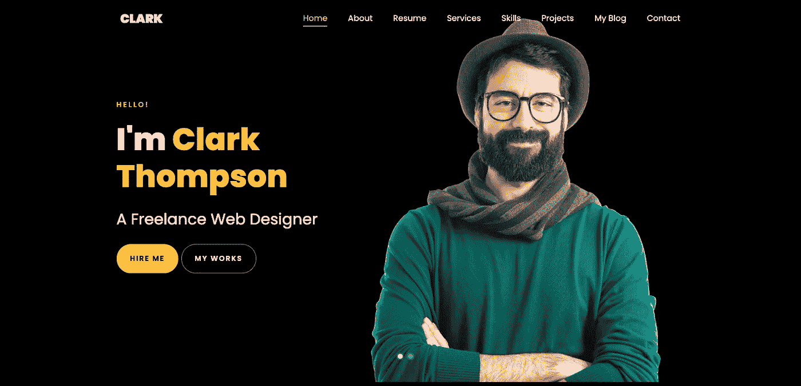

Clark — Free One-page Bootstrap 4 HTML5 Personal Portfolio Website Template

[演示](https://technext.github.io/clark/index.html)

[下载](https://themewagon.com/themes/free-one-page-bootstrap-4-html5-personal-portfolio-website-template-clark/)

# 个人-免费 HTML 模板

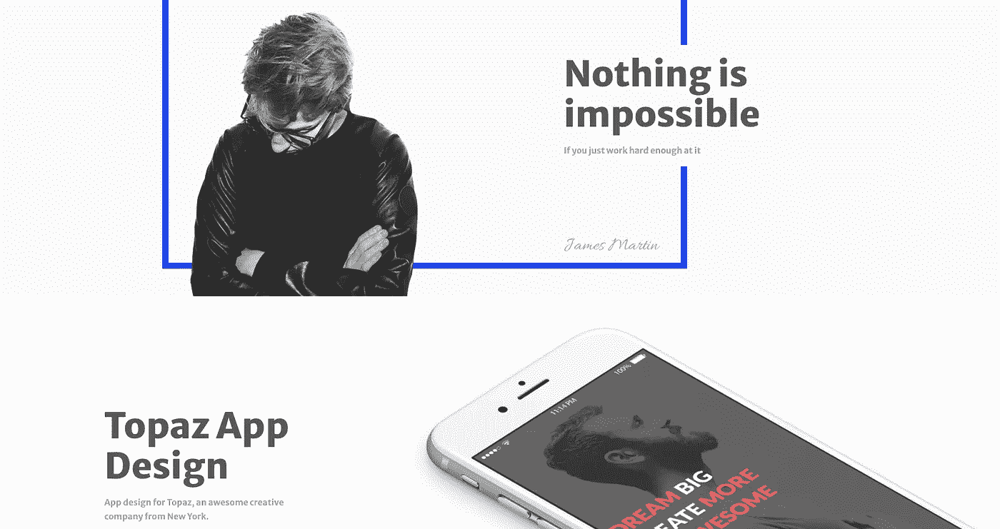

Personal — Free HTML Template

[演示](https://graphicburger.com/preview/html-templates/Personal/index.html)

[下载](https://graphicburger.com/personal-free-html-template/)

# 时尚的投资组合

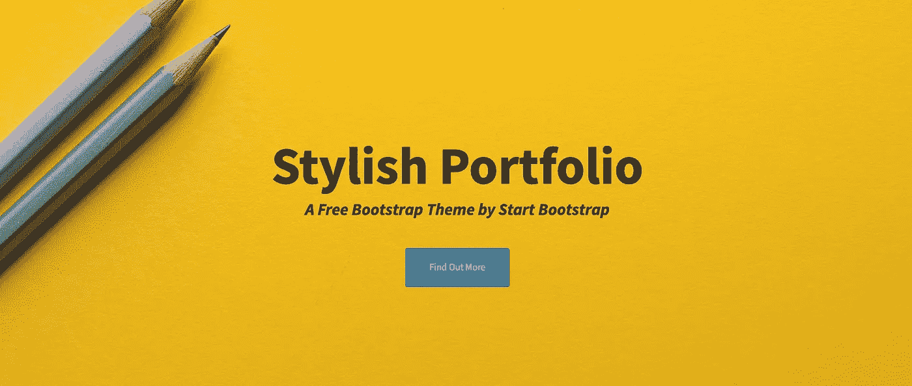

Stylish Portfolio

[演示](https://startbootstrap.com/previews/stylish-portfolio)

[下载](https://startbootstrap.com/theme/stylish-portfolio)

# 创意—简历模板 HTML CSS 免费下载

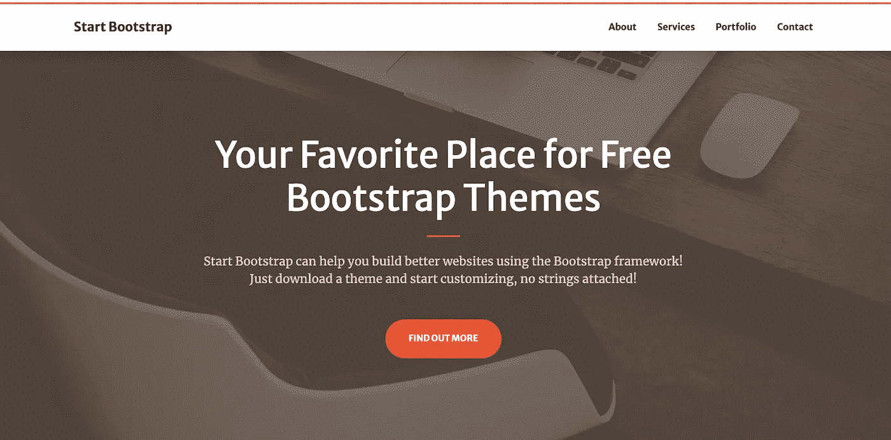

Creative — Cv Template Html Css Free Download

[演示](https://startbootstrap.com/previews/creative)

[下载](https://startbootstrap.com/theme/creative)

# 自由职业者-投资组合模板免费下载自举

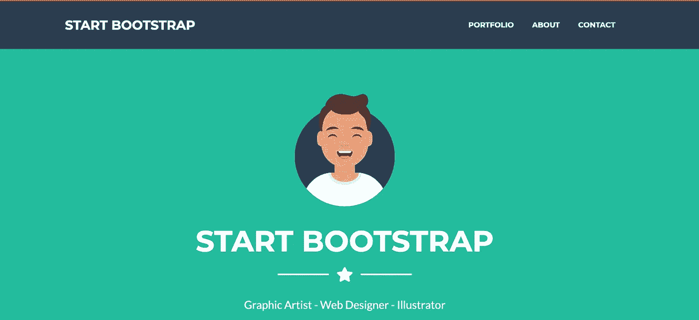

Freelancer — Portfolio Template Free Download Bootstrap

[演示](https://startbootstrap.com/previews/freelancer)

[下载](https://startbootstrap.com/theme/freelancer)

# InBio —个人投资组合

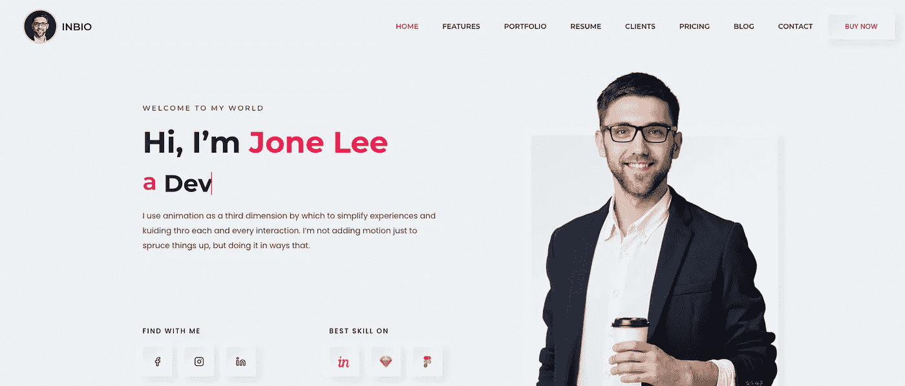

InBio — Personal Portfolio

[演示](https://preview.themeforest.net/item/inbio-one-page-personal-portfolio-template/full_screen_preview/33188244?_ga=2.88403864.248853679.1640051566-1973834915.1632625071)

[下载](https://1.envato.market/5bKzob)

# 个人自由投资组合引导模板

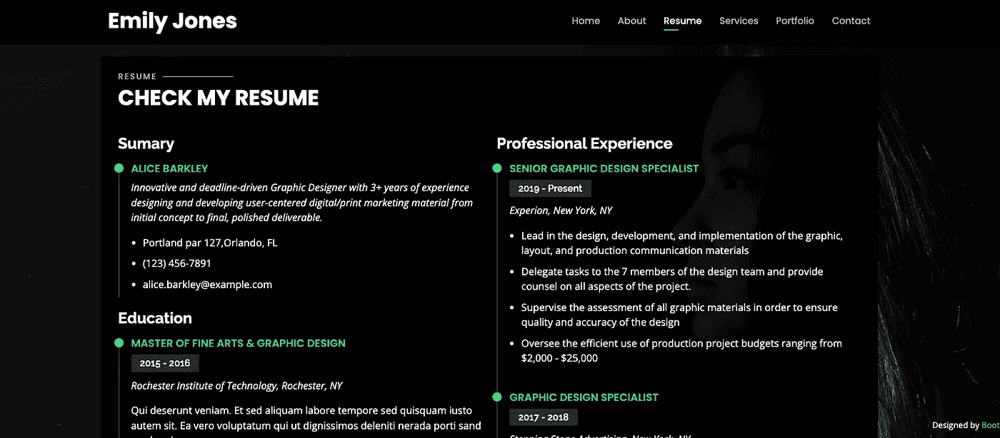

Personal — Free Portfolio Bootstrap Template

[演示](https://bootstrapmade.com/demo/Personal/)

[下载](https://bootstrapmade.com/personal-free-resume-bootstrap-template/)

# MyResume —自举简历和作品集模板

MyResume — Bootstrap Resume and Portfolio Template

[演示](https://bootstrapmade.com/demo/templates/MyResume/)

[下载](https://bootstrapmade.com/free-html-bootstrap-template-my-resume/)

# MeetMe —免费 HTML5 引导个人投资组合网站模板

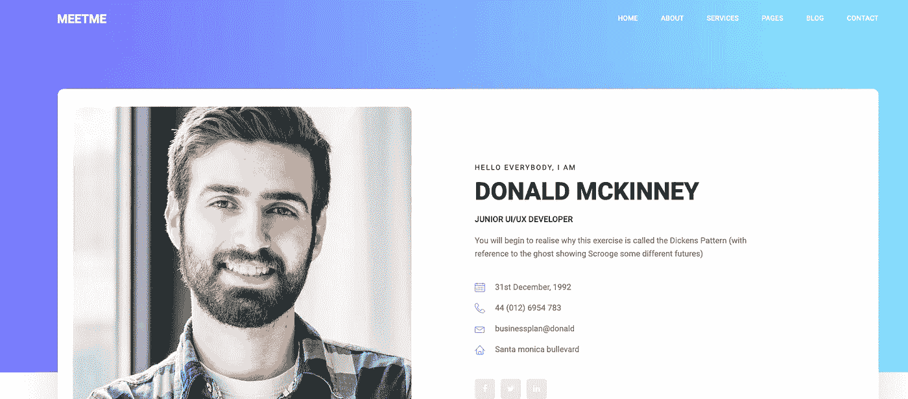

MeetMe — Free HTML5 Bootstrap personal portfolio website template

[演示](https://technext.github.io/meetme/index.html)

[下载](https://themewagon.com/themes/meetme-free-bootstrap-4-personal-portfolio-website-template/)

# 摄像师-摄像师网站模板免费

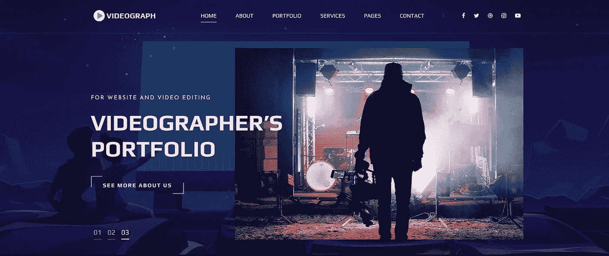

Videograph — Videographer Website Template Free

[演示](https://technext.github.io/videograph/index.html)

[下载](https://themewagon.com/themes/free-bootstrap-4-html5-portfolio-website-template-videograph/)

# iPortfolio —引导投资组合网站模板

iPortfolio — Bootstrap Portfolio Websites Template

[演示](https://bootstrapmade.com/demo/iPortfolio/)

[下载](https://bootstrapmade.com/iportfolio-bootstrap-portfolio-websites-template/)

# Ultra Profile 模板

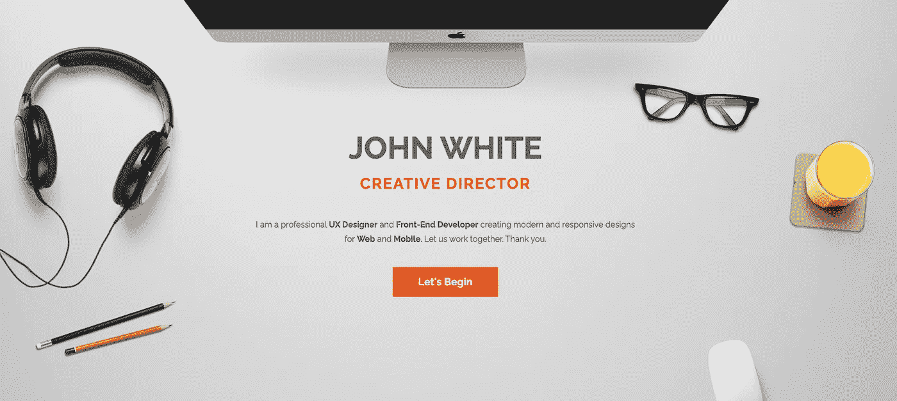

Ultra Profile Template

[演示](https://templatemo.com/live/templatemo_464_ultra_profile)

[下载](https://templatemo.com/tm-464-ultra-profile)

# Wink —多用途组合免费网站模板

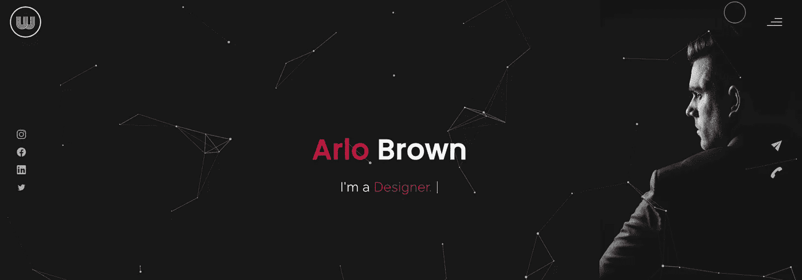

Wink — Multipurpose Portfolio Free Website Template

[演示](http://www.templatemonsterpreview.com/demo/112017.html)

[下载](https://www.templatemonster.com/website-templates/wink-multipurpose-portfolio-template-free-website-template-112017.html?aff=niemvuilaptrinh)

# ethereal——免费创意组合模板

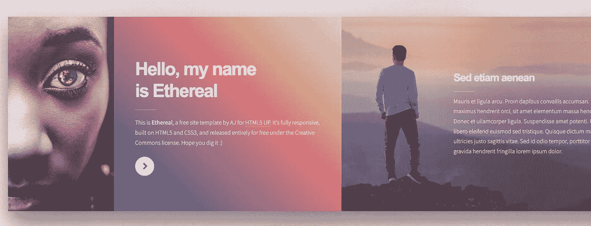

Ethereal — Creative Portfolio Template Free

[下载](https://html5up.net/ethereal)

# 四十—免费平面设计作品集模板

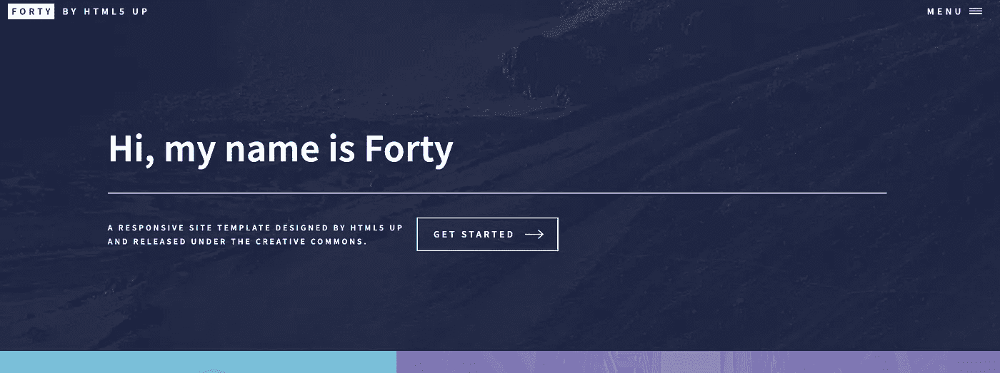

Forty — Graphic Design Portfolio Template Free

[下载](https://html5up.net/forty)

# Browny —前端开发人员组合模板

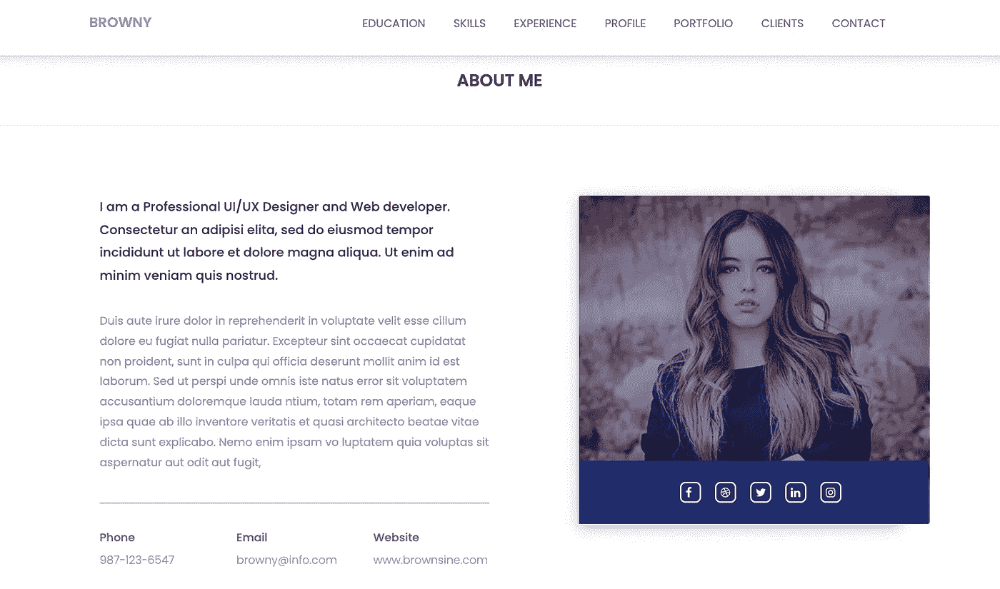

Browny — Front End Developer Portfolio Template

[演示](https://technext.github.io/browny/)

[下载](https://themewagon.com/themes/free-html5-personal-portfolio-website-template-browny/)

# Kards —免费的 HTML 个人响应卡模板

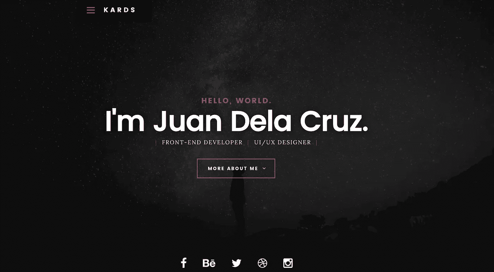

Kards — Free HTML Personal Responsive Card Template

[演示](https://technext.github.io/kards/)

[下载](https://themewagon.com/themes/personal-responsive-vcard-template/)

# Kross —网页设计作品集模板

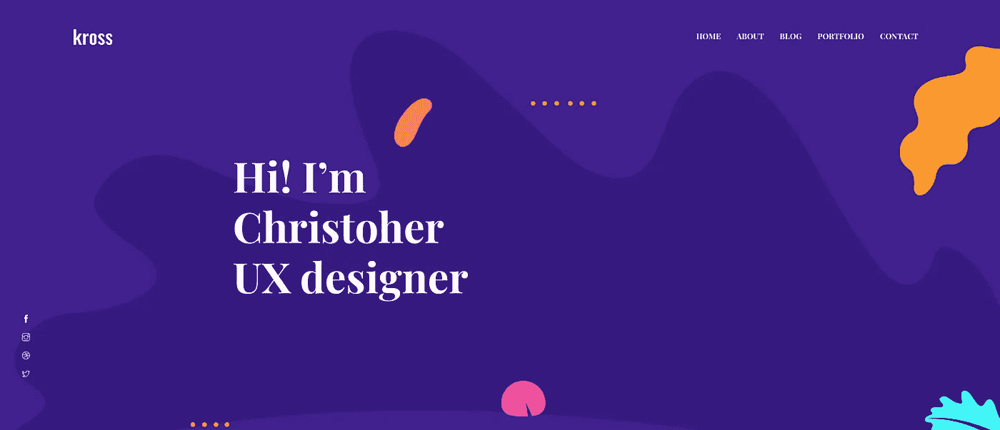

Kross — Web Design Portfolio Template

[演示](https://demo.themefisher.com/kross/)

[下载](https://themefisher.com/products/kross-creative-portfolio-template/)

# MARVEL 免费网页设计师作品集模板

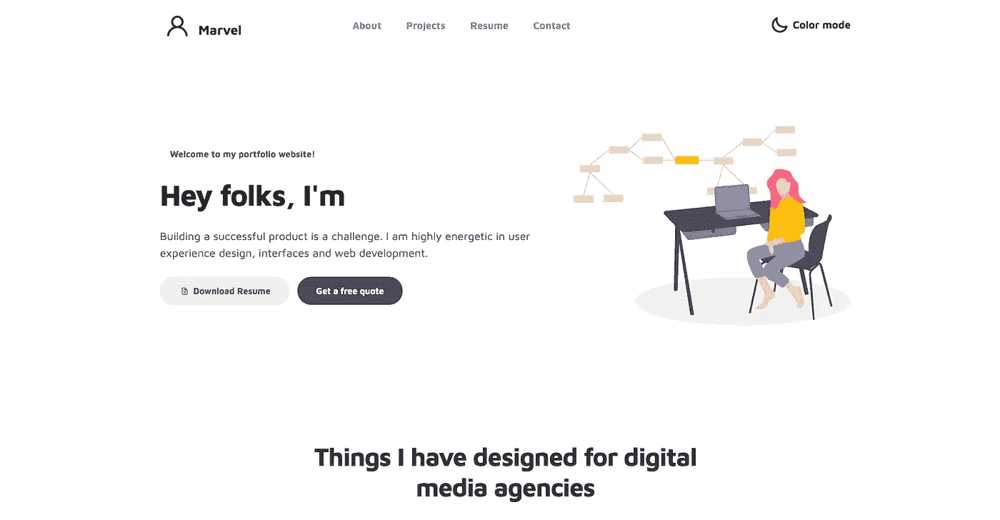

MARVEL — Web Designer Portfolio Template Free

[演示](https://www.free-css.com/assets/files/free-css-templates/preview/page270/marvel/)

[下载](https://www.free-css.com/free-css-templates/page270/marvel)

# VFolio —网页设计师作品集网站模板

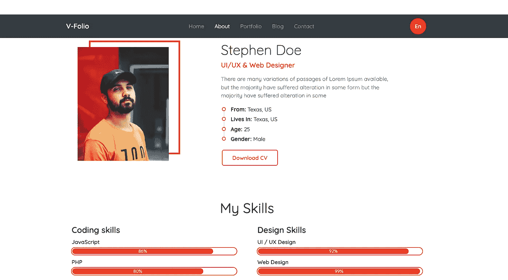

VFolio — Web Designer Portfolio Site Template

[演示](https://www.free-css.com/assets/files/free-css-templates/preview/page269/virtual-folio/)

[下载](https://www.free-css.com/free-css-templates/page269/virtual-folio)

# 优雅—平面设计师作品集网站模板

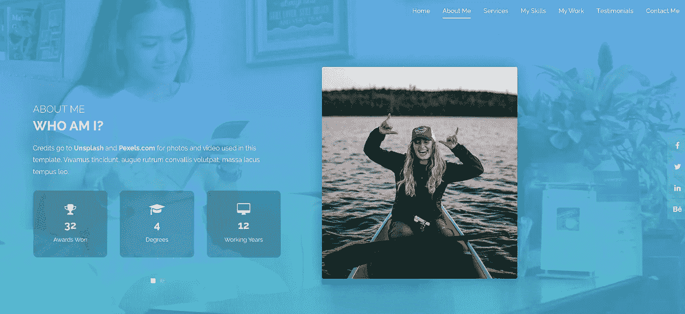

ELEGANCE — Graphic Designer Portfolio Website Templates

[演示](https://www.free-css.com/assets/files/free-css-templates/preview/page260/elegance/#slide02)

[下载](https://www.free-css.com/free-css-templates/page260/elegance)

# HYDRO —全栈 Web 开发人员组合模板

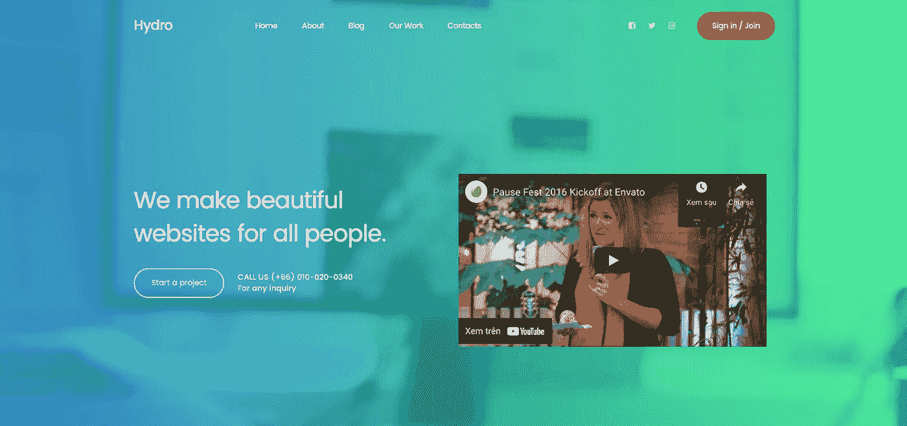

HYDRO — Full Stack Web Developer Portfolio Template

[演示](https://www.free-css.com/assets/files/free-css-templates/preview/page246/hydro/)

[下载](https://www.free-css.com/free-css-templates/page246/hydro)

# Noah 免费的 HTML5 个人登录页面模板

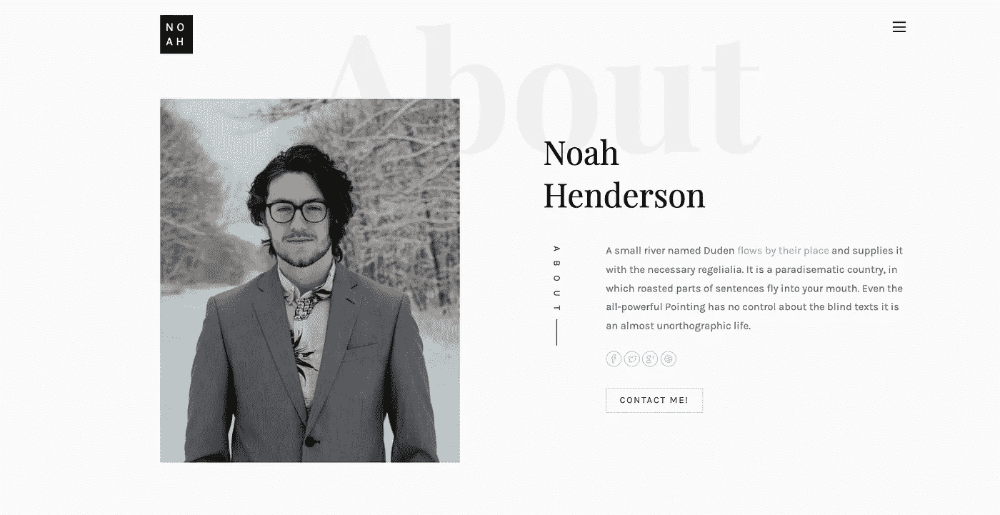

Noah — Free HTML5 Personal Landing Page Template

[演示](https://technext.github.io/noah/index.html)

[下载](https://themewagon.com/themes/free-html5-personal-landing-page-template-noah/)

# safs—2022 年网络开发者组合

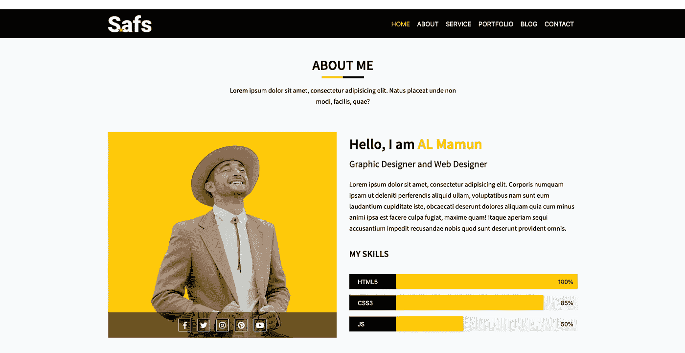

Safs — Web Developer Portfolio 2022

[演示](https://technext.github.io/safs/index.html)

[下载](https://themewagon.com/themes/safs-one-page-free-bootstrap-4-html5-personal-portfolio-website-template-web-developer/)

# Satner —免费的 Bootstrap 4 HTML5 Web 开发人员组合网站模板

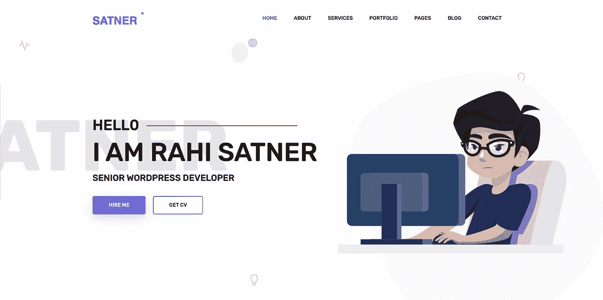

Satner — Free Bootstrap 4 HTML5 Web Developer Portfolio Website Template

[演示](https://technext.github.io/satner/index.html)

[下载](https://themewagon.com/themes/free-bootstrap-4-html5-web-developer-portfolio-website-template-satner/)

# 史蒂夫—免费的 HTML5 作品集网站

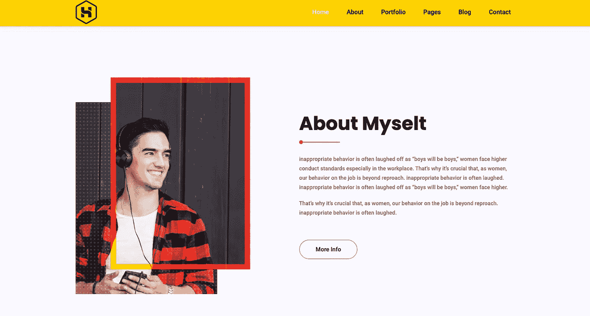

Steve — Free HTML5 portfolio website

[演示](https://technext.github.io/steve/index.html)

[下载](https://themewagon.com/themes/free-html5-portfolio-website-template-steve/)

# 展开— Web 开发人员组合模板引导

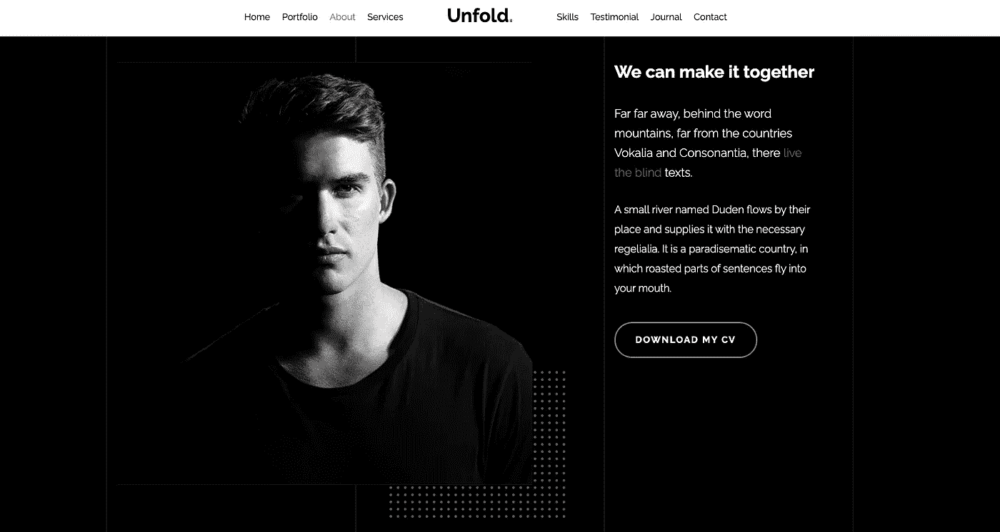

Unfold — Web Developer Portfolio Templates Bootstrap

[演示](https://technext.github.io/unfold/index.html)

[下载](https://themewagon.com/themes/free-bootstrap-4-html5-responsive-portfolio-website-template-unfold/)

# Minimus 个人投资组合网站模板免费

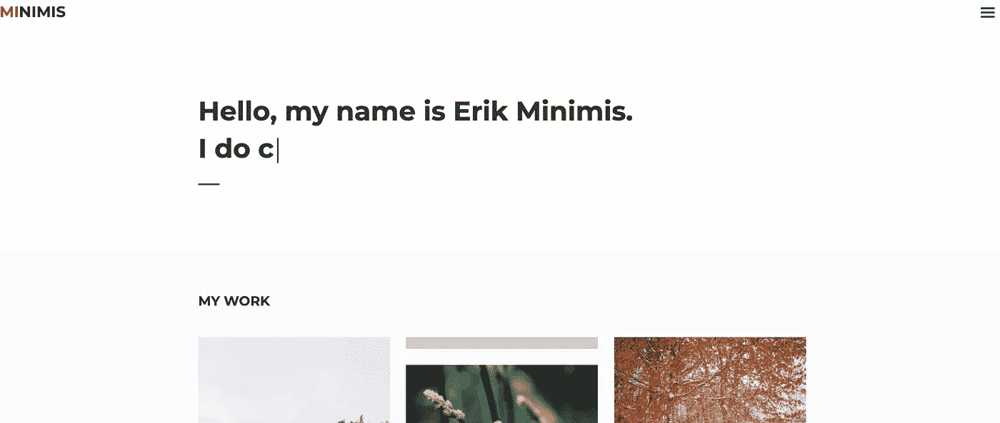

Minimus — Personal Portfolio Website Templates Free

[演示](https://technext.github.io/minimus/index.html)

[下载](https://themewagon.com/themes/free-responsive-personal-portfolio-template-download-minimus/)

# Melan 免费 Bootstrap 4 HTML5 个人作品集

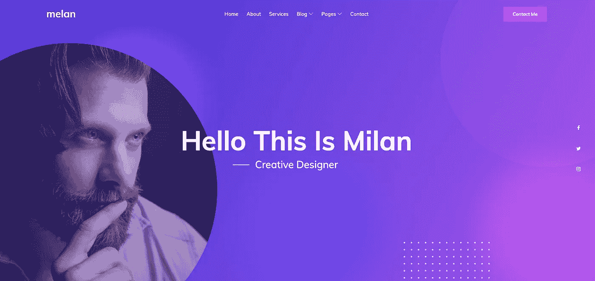

Melan — Free Bootstrap 4 HTML5 Personal Portfolio

[演示](https://technext.github.io/melan/index.html)

[下载](https://themewagon.com/themes/free-bootstrap-4-html5-personal-portfolio-website-template-melan/)

# 上镜-简单的个人投资组合模板免费

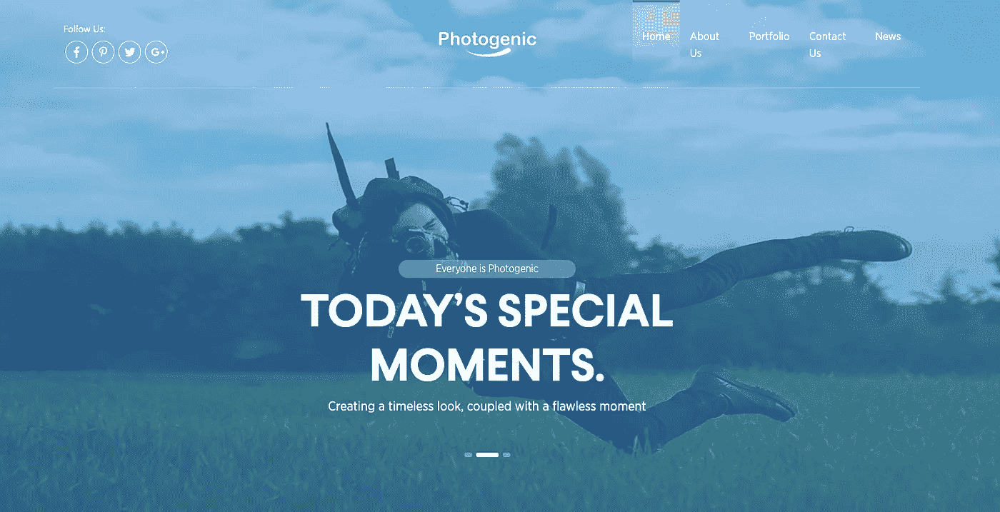

Photogenic — Simple Personal Portfolio Template Free

[演示](https://technext.github.io/photogenic/index.html)

[下载](https://themewagon.com/themes/free-html5-bootstrap-4-portfolio-website-template-photogenic/)

# 总结:

我希望文章能为你提供漂亮的、免费的、对网页开发和设计有用的作品集模板，如果你有任何问题，就发邮件，我会尽快回复。希望大家继续支持网站，让我能写出更多好文章。祝您愉快！

相关文章:

*   [Web 开发人员组合模板](https://us.niemvuilaptrinh.com/article/18-web-developer-portfolio-templates)
*   [下载免费网站模板的地方](https://us.niemvuilaptrinh.com/article/18-free-web-templates-for-web-design)
*   [免费的顺风 CSS 模板](https://us.niemvuilaptrinh.com/article/30-free-tailwind-css-templates)
*   [Udemy 上十大最佳网络开发课程](https://us.niemvuilaptrinh.com/article/top-10-best-web-development-courses-on-udemy)

## 进一步阅读

 [## 在组件中组合可重用的登录页面

### 最近，我们不得不创建一个登录页面，允许人们请求演示我们的产品。这一页是…

比特云](https://bit.cloud/blog/composing-reusable-landing-pages-in-components-l4mk36jk) 

*更多内容请看*[***plain English . io***](https://plainenglish.io/)*。报名参加我们的* [***免费周报***](http://newsletter.plainenglish.io/) *。关注我们关于*[***Twitter***](https://twitter.com/inPlainEngHQ)[***LinkedIn***](https://www.linkedin.com/company/inplainenglish/)*[***YouTube***](https://www.youtube.com/channel/UCtipWUghju290NWcn8jhyAw)***，以及****[***不和***](https://discord.gg/GtDtUAvyhW) *对成长黑客感兴趣？检查* [***电路***](https://circuit.ooo/) ***。*****