# 42 个面向前端开发人员的优秀 JavaScript 库和框架

> 原文：<https://javascript.plainenglish.io/42-good-javascript-libraries-and-frameworks-for-front-end-developer-5f110148e700?source=collection_archive---------1----------------------->

Photo by [Fotis Fotopoulos](https://unsplash.com/@ffstop?utm_source=medium&utm_medium=referral) on [Unsplash](https://unsplash.com?utm_source=medium&utm_medium=referral)

# 反应

React 是一个开源的 JavaScript 库，用于为 web 应用程序构建接口。它允许你用小的、独立的、可重用的代码创建复杂的 ui。此外，它是由脸书维护和开发的，所以您完全可以放心地在您的项目中使用这个库。有许多大公司在他们的网站上使用它，如脸书、推特、网飞、WhatsApp 等。

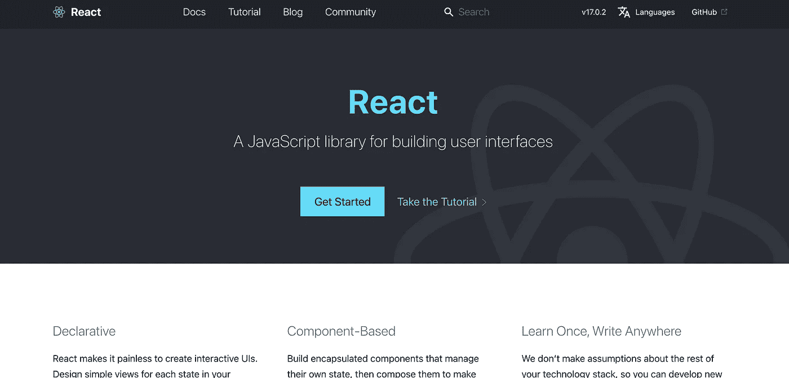

React.JS

[链接](https://reactjs.org/)

# vue . j

Vue.js 是一个免费的、紧凑的开源库，可以帮助你快速构建用户界面(尤其是对于单页面的 web 应用)。它是由尤雨溪(谷歌的一名程序员)在 2014 年开发的，并在 2019 年前端 JavaScript 框架排名中获得第二名。在我看来，Vue 的一些好处是它比其他框架更容易学习和吸收，文档非常详细并且容易理解。

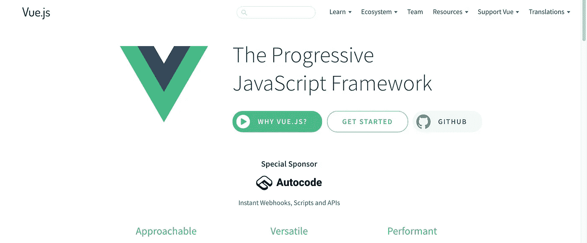

Vue.JS

[链接](https://vuejs.org/)

# 安古拉吉斯

AngularJS 和上面的两个框架一样，让你轻松构建 web 和移动应用。它被许多大公司如 Google、Forbes、IBM、Microsoft 等所信任和使用。

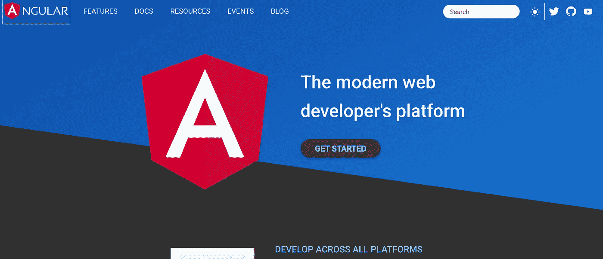

Angular.JS

[链接](https://angular.io/)

# jQuery

jQuery 是前端开发人员最常用的库之一。这是一个小型的、免费的开源库，为网站开发提供了许多有用的特性，如 AJAX、轻松操作 DOM (CSS、HTML)、处理事件、动画效果等。

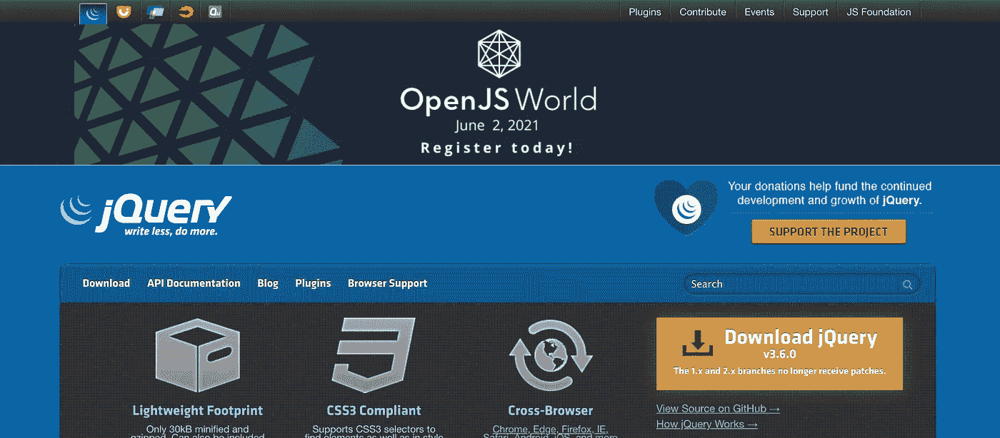

Jquery

[链接](https://jquery.com/)

# 洛达什

Lodash 帮助你轻松处理 JavaScript 中与数组、字符串、数字、对象相关的问题。

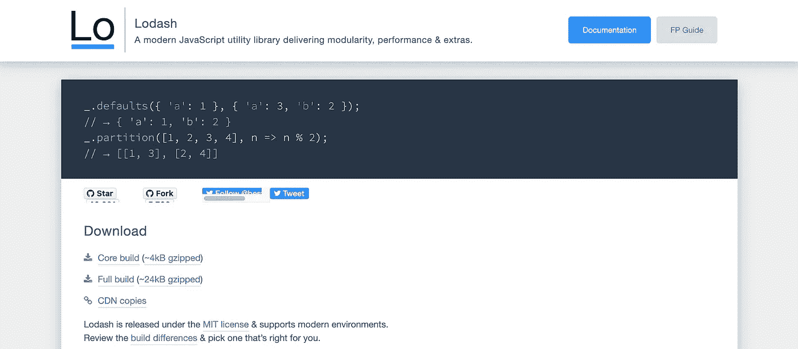

Lodash

[链接](https://lodash.com/)

# Anime.js

Anime.js 是一个库，通过使用 CSS 属性、SVG、DOM 属性和 JavaScript 对象，可以轻松地为网页构建快速动画。

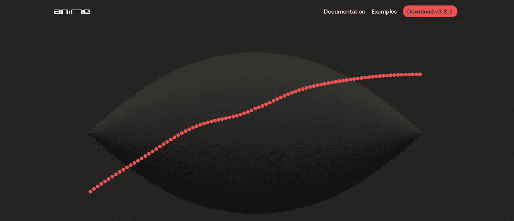

AnimeJS

[链接](https://animejs.com/)

# 美国歌剧协会(American Opera Society)

当用户滚动网页时，AOS 可以帮助你创建网站元素的动画效果。

AOS

[链接](https://michalsnik.github.io/aos/)

# 发出砰砰响声的物体

Popper 是一个用 JavaScript 编写的库，大小只有 3kB 左右，帮助你提高网站的速度，同时仍然保留工具提示需要的功能。它常用于现在流行的库，如 Bootstrap，Foundation，Material-UI。在我看来，它帮助我们解决了工具提示中的一个常见问题，即确定元素的位置，并尽可能好地在不同的设备屏幕上显示它。

Popper

[链接](https://popper.js.org/)

# 猫头鹰旋转木马 2

Owl Carousel 2 是一个开源库，可以帮助您轻松构建美观的旋转木马。它拥有 60 多种不同类型的转盘，支持移动设备上的触摸和拖放功能，以改善用户体验。它可以在许多不同的设备屏幕上响应，库被分成许多小模块，这有助于减少项目中使用的不必要的插件。

我喜欢这个库的一点是，它为每个函数都提供了许多详细的示例，使您可以轻松地设置和构建。Carousel 适合我的 web 项目，它具有自动播放功能、视频可用性、可定制的运动效果等。你可以在它的演示页面上看到更多！

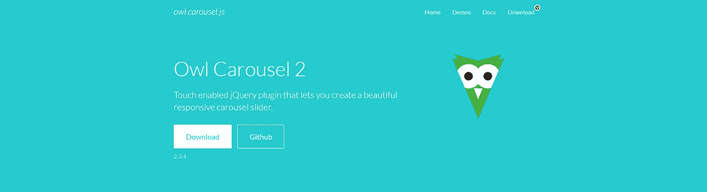

Owl Carousel 2

[链接](https://owlcarousel2.github.io/OwlCarousel2/)

# D3.js

D3.js 是一个 JavaScript 库，用于通过 SVG、Canvas、HTML 进行数据可视化和渲染。它是开源的，通过 npm 每周下载超过一百万次。以上数据可以帮助我们了解它的受欢迎程度。此外，它还提供了许多内置示例来帮助您学习如何将 D3.js 应用到您的网站中。然而，它也有一些限制，例如初学者很难使用它，或者它不能在 IE8 这样的老浏览器上工作。

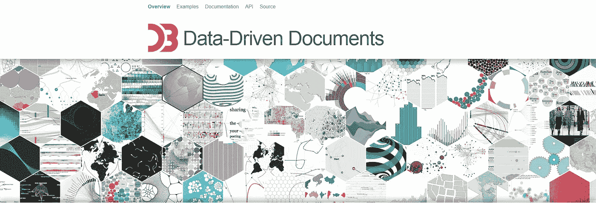

D3.js

[链接](https://d3js.org/)

# 黑暗模式

DarkModeJS 库帮助我们随着时间的推移自动进行 UI 更改。可以根据用户的要求切换模式。可以创建自己的 CSS 文件，自己对比，通过 DarkModeJS 设置。

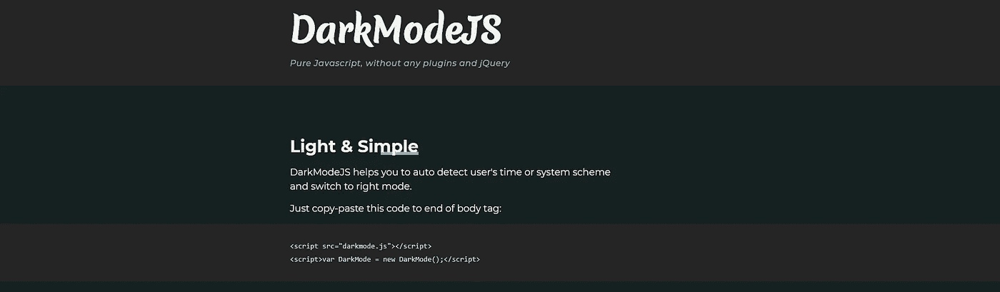

DarkModeJS

[链接](https://nickdeny.github.io/darkmode-js/)

# Chart.js

Chart.js 库帮助你为你的网站创建漂亮的图表。它有很多图表，并允许我们在使用该库时灵活地处理传递给图表的数据。它还会定期更新新版本，并在许多不同的设备屏幕上做出响应。

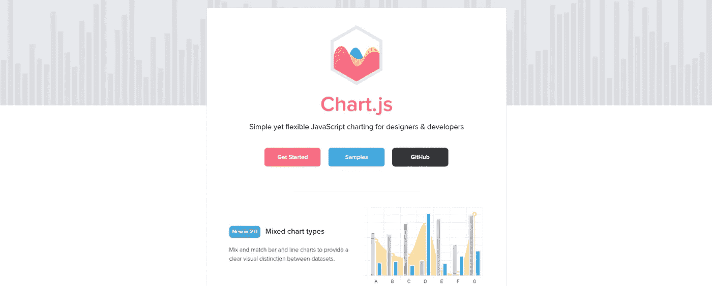

Chart.js

[链接](https://www.chartjs.org/)

# SweetAlert

SweetAlert 是一个开源库，可以帮助您快速构建具有高度美感和许多漂亮动作效果的网站通知。在我们的网站上使用它非常简单。您只需通过 CDN 调用 sweetalert.min.js 文件，并为消息定义基本属性，如标题(title)、文本(content)、图标。此外，您可以添加属性和其他功能，如按钮、通过 Ajax 呈现、使用 promise for modal 等。

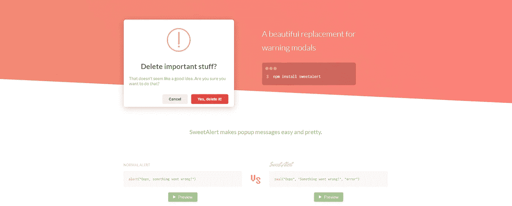

SweetAlert

[链接](https://sweetalert.js.org/)

# 高亮显示. js

Highlight.js 是一个用 JavaScript 构建的开源库，可以帮助你在网站上高亮显示代码，可以在浏览器和服务器上运行。该库的一些优点:它独立于任何框架；能够自动检测您网站上的语言；支持超过 189 种流行的编程语言；为网页上的代码段提供了另外 94 种样式。我喜欢这个库的一点是，您可以通过删除下载过程中不使用的编程语言来减小 highlight.js 的大小。对于服务器端，您可以使用 yarn 或 npm 来安装它。

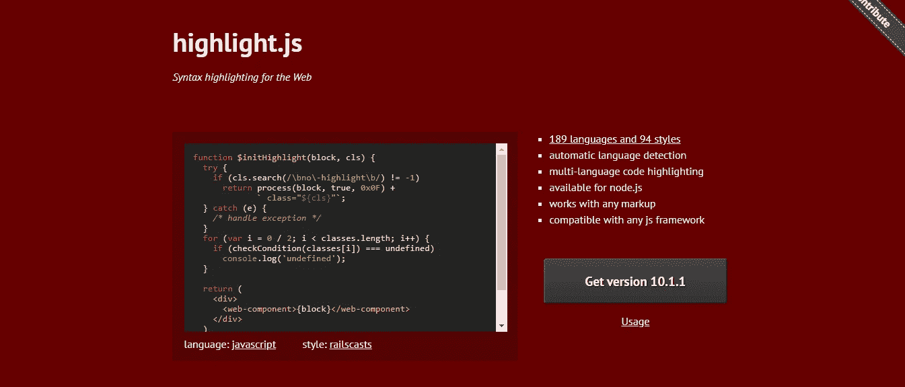

Highlightjs

[链接](https://highlightjs.org//)

# 视频

VideoJS 是一款基于 HTML5 视频平台构建的视频播放器，支持 YouTube 和 Vimeo 流媒体等多种格式。它是在 2010 年代中期开发的。数百名程序员参与了这个项目，超过 450，000 个网站正在使用这个库。VideoJS 的一些优点:设计美观，有许多主题可供选择，适合媒体播放器，可以在电脑和手机上运行，提供 100 多个插件来帮助您计算以及轻松添加新功能。

VideoJS

[链接](https://videojs.com/)

# Moment.js

Moment.js 使得用 JavaScript 处理日期和时间变得很容易。

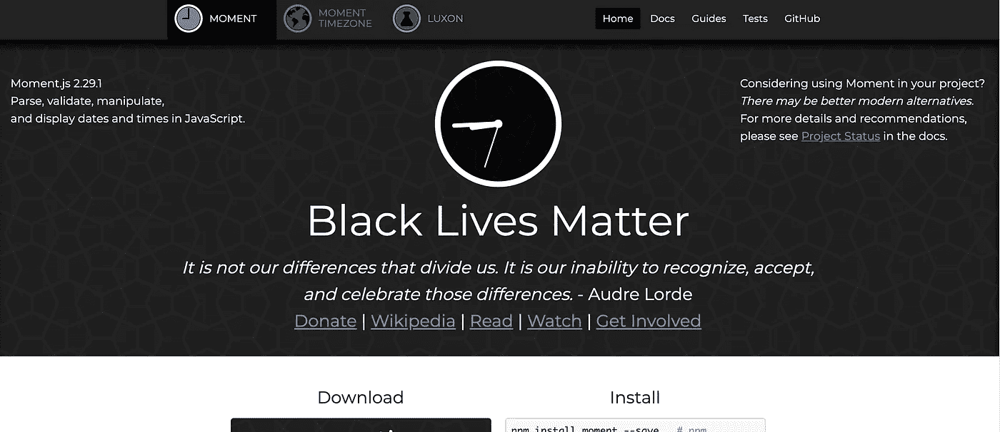

Momentjs

[链接](https://momentjs.com/)

# PixiJS

使用最快、最灵活的 2D WebGL 渲染器创建精美的数字内容。

PixiJS

[链接](https://www.pixijs.com/)

# 网络包

Webpack 是一个用于现代 JavaScript 应用程序的静态模块打包工具。

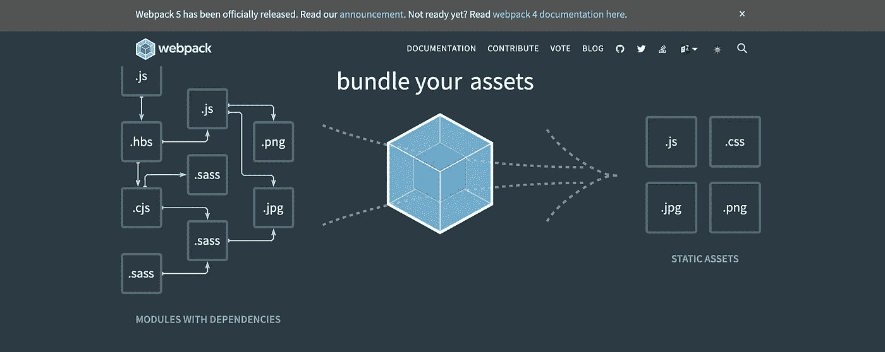

Webpack

[链接](https://webpack.js.org/)

# 全页. js

js 帮助你为网站创建全屏滚动。

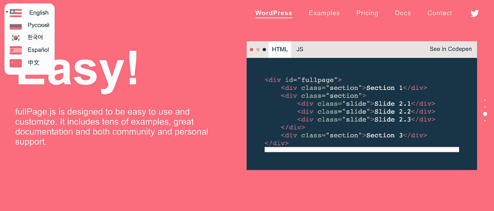

Fullpagejs

[链接](https://alvarotrigo.com/fullPage/)

# Howler.js

Howler.js 是一个开源的 JavaScript 库，大小只有大约 7KB，可以帮助你轻松地为网页创建和处理音频。通过 API 和 HTML5 音频的结合，它可以在许多不同的平台和 web 浏览器上运行，包括 IE9 和 Cordova。Howler.js 的一些优点:它可以通过模块化架构轻松扩展，支持大多数文件类型，如 MP3，MPEG，OPUS，OGG，OGA，WAV，AAC，CAF，M4A 等，它的自动缓存有助于提高网站的性能和服务器的带宽。此外，它还为您提供了许多属性来微调媒体播放器以适应网站，如确定初始音量、自动播放选项、动态歌曲重复等。

HowlerJS

[链接](https://howlerjs.com/)

# 砖石建筑

这是一个库，可以很容易地为你的网站创建复杂的网格布局(尤其是图像)。

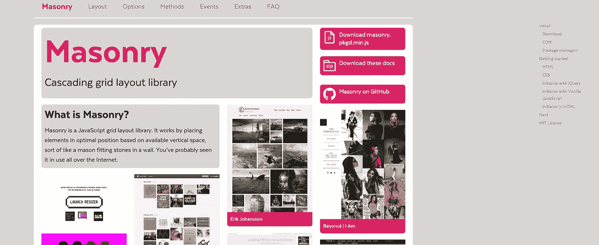

Masonry

[链接](https://masonry.desandro.com/)

# 全屏

Screenfull 有助于将元素或网页转为全屏模式。

screenfull

[链接](https://sindresorhus.com/screenfull.js/)

# 粒子. js

Particles.js 是一个免费的开源库，允许你为你的网站创建和优化漂亮的背景。

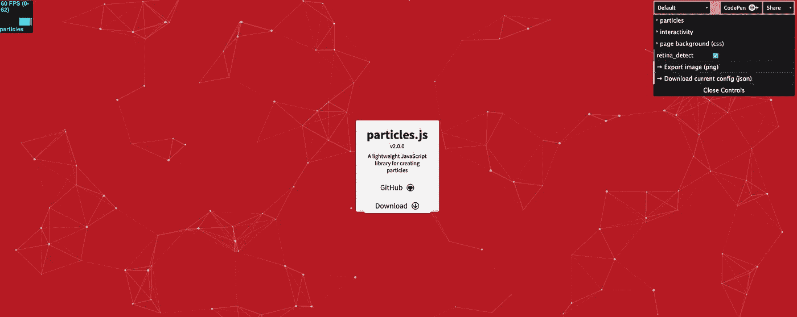

Particles

[链接](https://vincentgarreau.com/particles.js/)

# 传单

传单是一个开源的 JavaScript 库，用于在移动设备上与地图进行交互。

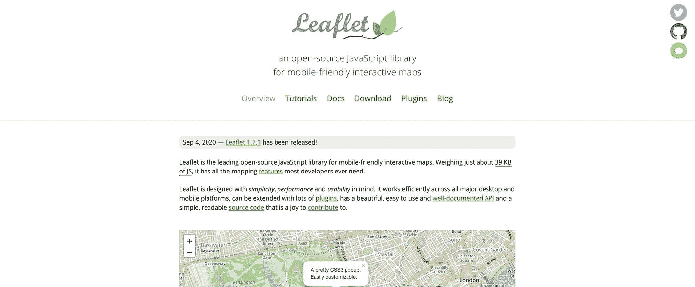

Leaflet

[链接](https://leafletjs.com/)

# 排序表

SortableJS 是一个 JavaScript 库，为 HTML5 增加了拖放功能。

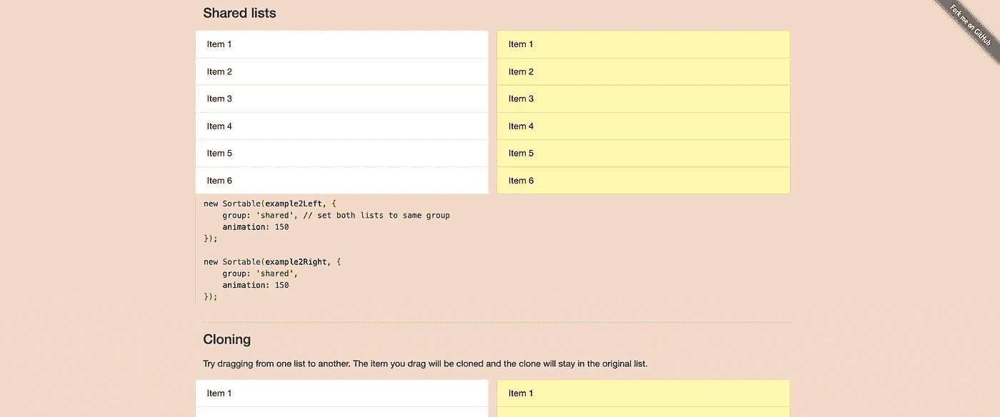

SortableJS

[链接](https://sortablejs.github.io/Sortable/)

# 剪贴板. js

剪贴板使得快速复制网页内容到剪贴板成为可能。

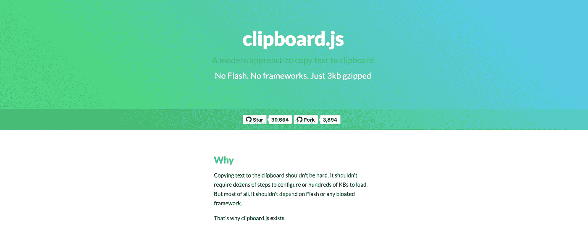

clipboard.js

[链接](https://clipboardjs.com/)

# 下划线. js

下划线. js 是一个 JavaScript 库，它为您提供了解决常见编程问题的有用函数。

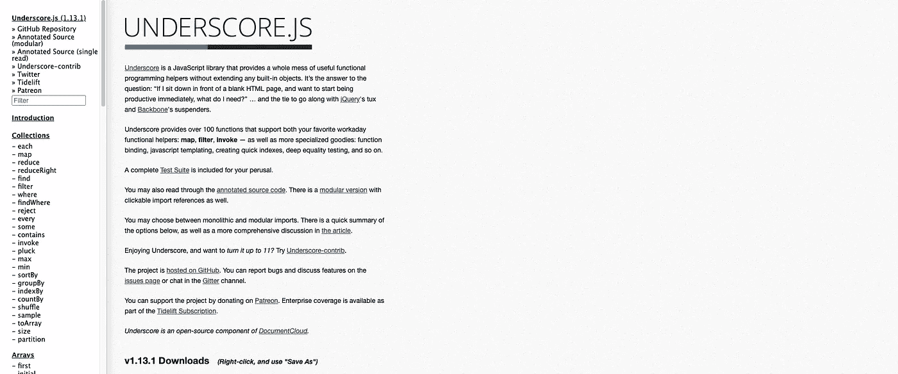

Underscore.js

[链接](http://underscorejs.org/)

# Cleave.js

Cleave 使得在用户输入信息时重新格式化`input`元素变得容易。

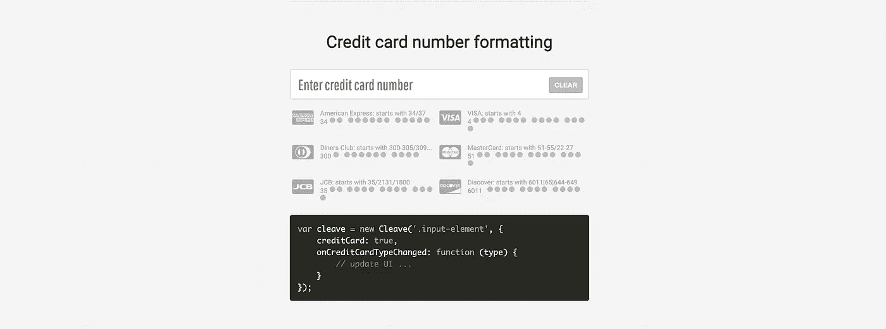

Cleave.js

[链接](https://nosir.github.io/cleave.js/)

# 分享

共享库让用户可以选择他们想要的网页文本，并立即分享到脸书或推特上。它的大小也很轻，只有 8KB 左右。

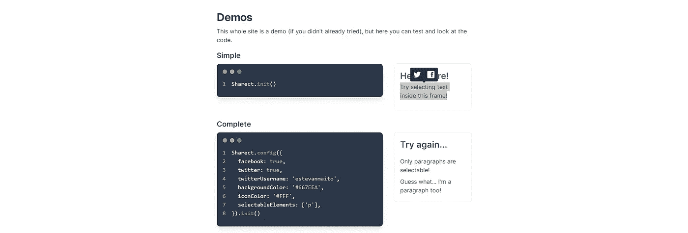

Share

[链接](https://estevanmaito.github.io/sharect/)

# Chardin.js

Chardin.js 库帮助我们在网页上显示组件的指令。它有助于解释更多关于组件功能的信息，使用户更容易理解和使用。

Chardin.js

[链接](https://heelhook.github.io/chardin.js/)

# 翻转

Flip 是一个插件，可以让你快速轻松地创建具有翻转效果的计数器。如果你需要创建活动计时器、促销、筹款活动，我认为这是最适合你的库。

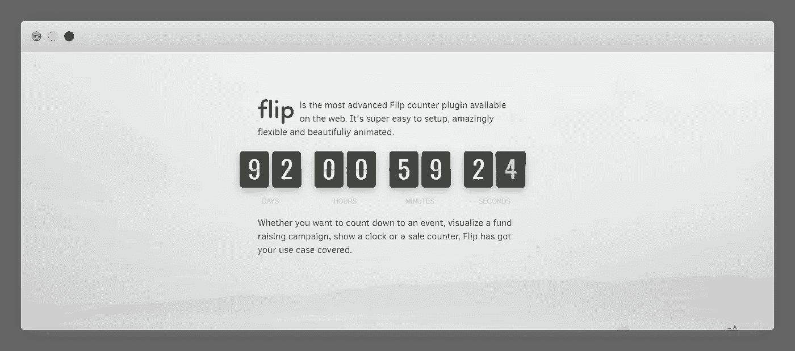

Flip

[链接](https://pqina.nl/flip/)

# 图像比较查看器

Image Compare Viewer 是一个用 JavaScript 构建的开源库，允许您直接在网页上比较两幅图像。它通常用于比较编辑前后的图像，以帮助用户有一个直观的外观，并更清晰地区分。

Image Compare Viewer

[链接](https://image-compare-viewer.netlify.app/)

# Notyf

Notyf 是一个 JavaScript 库，可以帮助你为大小只有 3KB 左右的网页创建 toast 通知。它在许多不同的设备屏幕上显示，并且易于与当今流行的 JS 框架一起使用，如 React、Angular、Aurelia、Vue 和 Svelte。

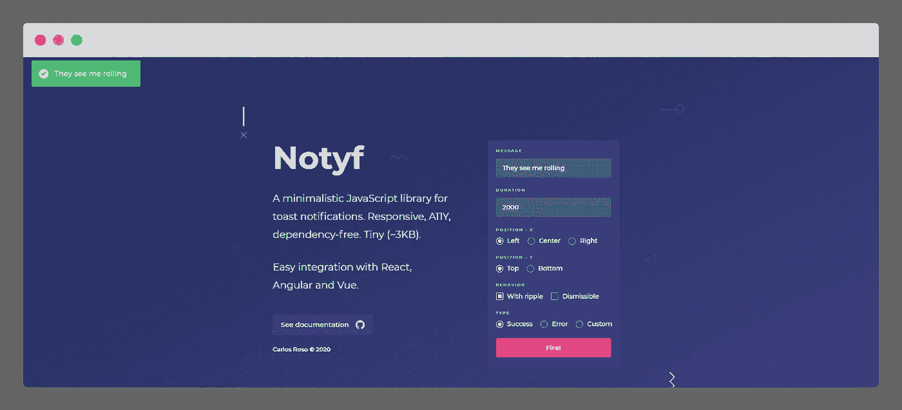

Notyf

[链接](https://carlosroso.com/notyf/)

# Dinero.js

Dinero.js 是一个 JavaScript 库，它提供了许多功能来帮助您工作和解决问题。网站上有与货币相关的话题。

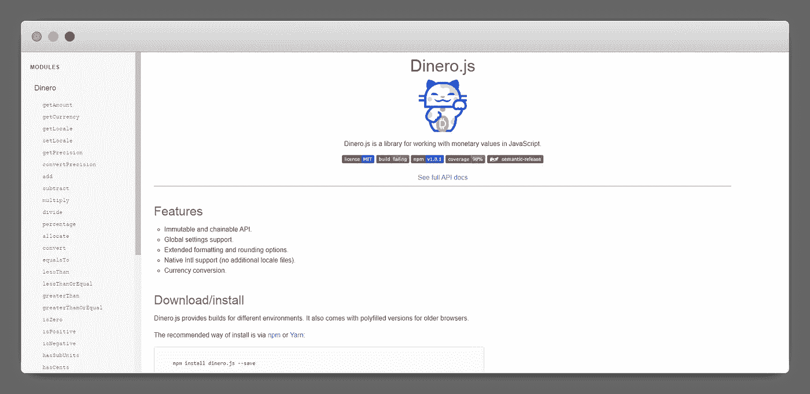

Dinero.js

[链接](https://dinerojs.com/)

# simpleParallax.js

js 是一个小型的开源 JavaScript 库。它将帮助你为你的网站图片创建一个简单易行的视差效果。

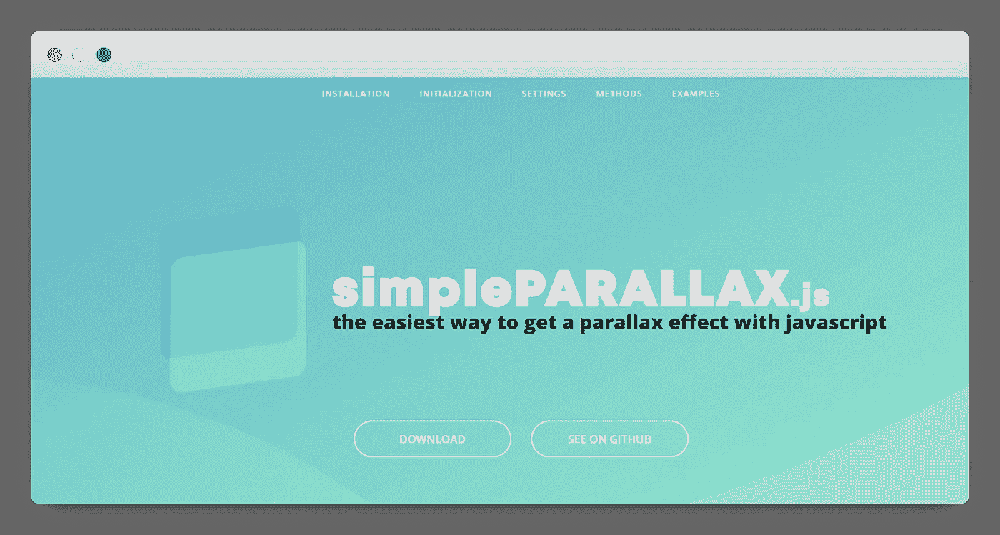

simpleParallax.js

[链接](https://simpleparallax.com/)

# 二重唱日期选择器

Duet Date Picker 是由 Duet Design Systems 开发的开源代码。它允许您轻松地为您的网站构建一个日期选择器组件，而无需任何额外的使用或任何额外的库。这个库中我喜欢的一些特性是深色和浅色主题。您可以设置允许用户选择的时间间隔，按区域设置日期等。

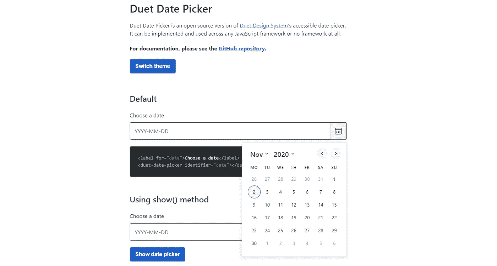

Duet Date Picker

[链接](https://duetds.github.io/date-picker/)

# 打印. js

Print.js 是一个紧凑的 JavaScript 库，它允许您直接在网页上打印文件，没有任何问题。不需要重定向或使用嵌入。它支持多种格式的打印，如 PDF、HTML(如表单)、图像、JSON 等。此外，它还可以在大多数流行的浏览器上运行，如谷歌 Chrome、火狐、Safari、Edge 和 Opera。

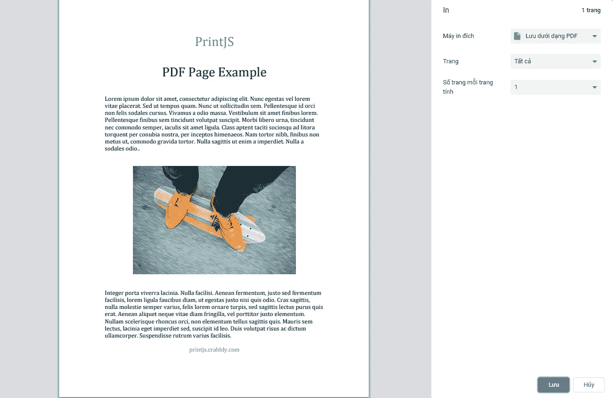

Print.js

[链接](https://printjs.crabbly.com/)

# 数学

Mathjs 是一个开源的数学库，在 Github 上有超过 10.5k 的 stars，用于 JavaScript 和 Node.js(运行在服务器端)。它为您提供了计算和处理许多不同数据类型的灵活性，如数字、大数、复数、分数、单位和矩阵。

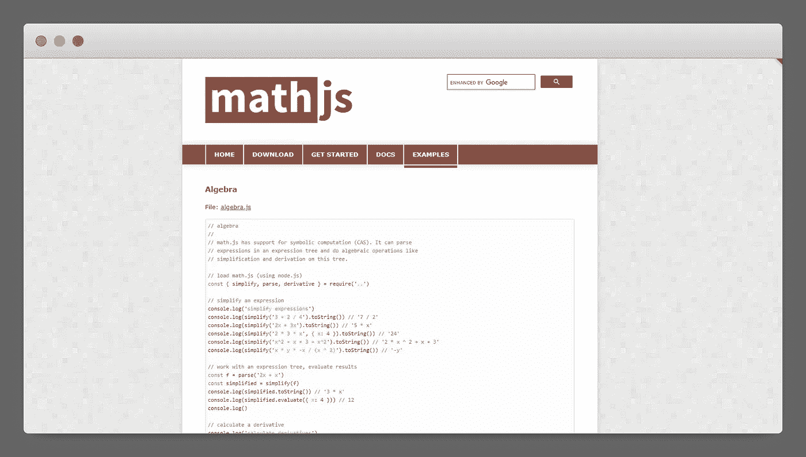

Math JS

[链接](https://mathjs.org/)

# 进度条

PROGRESSBAR 是一个用 JavaScript 构建的开源库，可以很容易地用不同类型的形状显示基于 BAR 的进度。如今，它在许多流行设备上都有响应。您也可以通过 npm、bower 或下载来轻松设置它。此外，它还有一整页关于我们可以在这个库中使用的功能的说明，以及一个带有预写代码的演示页，使您可以更容易地将其应用到您的网站上。

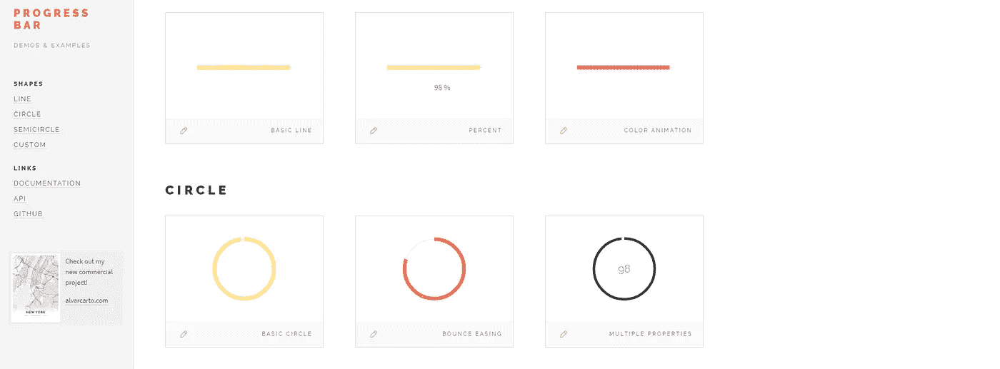

PROGRESS BAR JS

[链接](https://kimmobrunfeldt.github.io/progressbar.js/)

# 刺

Quill 是一个开源编辑器，因此可以随意将其用于所有类型的商业网站或非商业网站。它是建立了许多功能，如添加链接，图像，视频或更多。我喜欢 Quill 的一点是，它非常容易设置，可以在所有现代的、反应灵敏的网络浏览器上显示在多个设备屏幕上，并提供了使用时常见问题的详细教程。

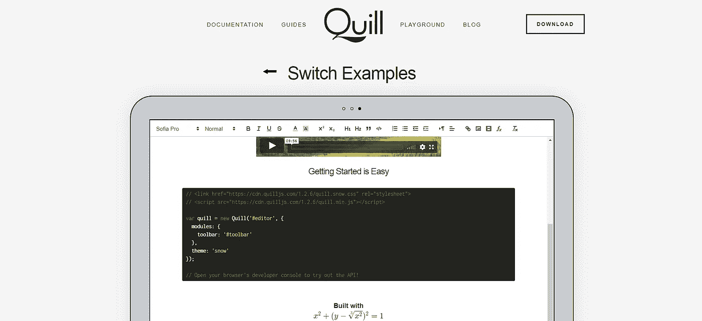

Quill

[链接](https://quilljs.com/)

# 验证。射流研究…

验证。JS 是一个开源库，它提供了一种在网站上检查 JavaScript 对象的方法。它的主要目标是在 JSON 表单中设置验证，并使它们可以在浏览器和服务器之间共享。它为我们提供了许多验证方法，如日期、电子邮件、格式、对象类型检查等。验证。JS 可以在两种环境下运行——浏览器和服务器(Node.js)。你可以在演示页面上看到更多的例子和用法。

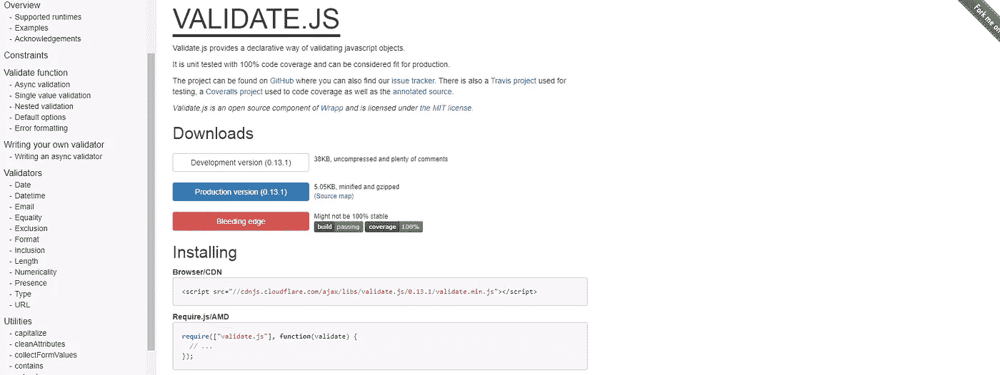

VALIDATE JS

[链接](https://validatejs.org/)

# 摩卡

Mocha 是一个广泛应用于 web 编程的框架，同时支持后端(Node.js)和前端。它帮助您简单而容易地执行异步测试。此外，它还拥有一个庞大的程序员支持社区，以及许多详细的说明和示例。公司，还有大型网站，都信任并使用它。

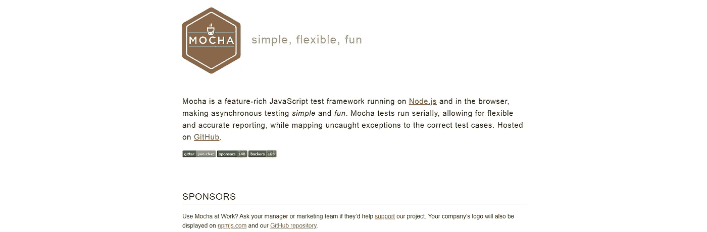

MochaJS

[链接](https://mochajs.org/)

# 摘要

我希望这篇文章能为你提供有用的网页设计和开发的 JavaScript 库。如果您有任何问题，只需发送电子邮件，我会尽快回复。希望再次见到你。请继续支持网站，以便我能写出更多的好文章。祝您愉快！

*   [Udemy 上十大最佳网络开发课程](https://us.niemvuilaptrinh.com/article/top-10-best-web-development-courses-on-udemy)

*更多内容请看*[***plain English . io***](http://plainenglish.io/)