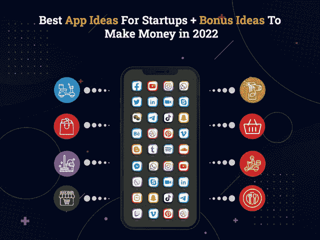

# 45+创业公司最佳应用创意+2022 年赚钱的额外创意

> 原文：<https://javascript.plainenglish.io/45-best-app-ideas-for-startups-bonus-ideas-to-make-money-in-2021-5d200a59a6d0?source=collection_archive---------0----------------------->

## 超过 45 个可能在 2022 年改变世界的创业公司移动应用创意

随着互联网使用的增加，毫无疑问，移动使用也增加了十倍，人们开始平均每天花 3 小时 55 分钟在手机上。

随着每一天的过去，数字不断扩大到下一个水平，移动应用程序开发正在成为一个蓬勃发展的行业。因此，如果你真的想成为这个竞争激烈的市场的一部分，并使你的业务更上一层楼，推出一个移动应用程序确实是更明智的做法。

你应该投资什么样的应用程序，需要多少预算，你的应用程序需要多长时间才能上市？这是你脑海中浮现的几个最常见的问题。

> 但是，不要担心，这个博客已经为你涵盖了所有的答案！

由于苹果应用商店和谷歌 Play 商店已经有数百万的应用程序，因此，你脑海中的一个大问题是，你将如何用移动应用程序征服市场？简单的答案是，创业都是关于一个伟大的想法！

但是将最好的、独特的、创新的想法推向市场似乎是最具挑战性的任务之一。因此，在分析了市场趋势、蓬勃发展的行业以及仍有创收空间的领域后，我们提出了优秀的应用程序创意，帮助您在 2022 年征服世界。

> 让我们从 45 个最佳应用程序开发创意开始，这些创意可以让您的业务飞速增长:

## **1。一款带语音指令的杂货点餐 App**

通过添加语音搜索命令功能来开发一款杂货订购应用程序，是 2022 年一个出色的初创应用程序创意。在新冠肺炎之后，如果有哪个行业见证了移动应用的突然转变，那就是食品和杂货配送行业。由于 Covid 和遵循社会距离的限制，人们被限制呆在家里。

但是，作为生活的基本需求，人们被迫或选择转向杂货应用程序，通过移动应用程序购买所有的杂货。但是在 [**移动应用程序开发公司**](https://www.xicom.biz/services/mobile-app-development/) 的合作下，你可以通过添加语音搜索命令来提供愉快的用户体验，从而使访问变得简单、容易和方便。

根据您的需求和业务目标，您可以投资 12，000 美元到 50，000 美元以上，开始使用一个杂货应用程序。

## **2。区块链计税 App**

不管你受过多少教育，有多熟练，在一秒钟内计算大量的数字对你来说总是一项耗费时间的任务。事实上，你的单个计算错误就可能造成数百万美元的损失。但随着区块链等新兴技术的出现，计算税收和开具发票已经成为最简单的活动，你可以在不犯任何错误的情况下完成。通过使用区块链技术公司开发的应用程序，用户可以很容易地确定他们一年需要缴纳多少税。

计税 app 是 2022 年赚钱的顶级手机 app 创意。无论是疫情还是一个正在崛起的经济体，商业部门都不会去任何地方，尽管对税收计算应用的需求将永远保持高需求。

创建这种类型的应用程序的初始成本将为 12，000 美元至 14，000 美元+。其余的你可以雇佣一个移动应用开发者来根据具体的业务需求进行实际的评估。

## **3。寻找灵活工作的应用程序**

毫无疑问，2020 年疫情的浪潮已经使人们失业，关闭了各种商店，使商业瘫痪，并给他们留下了零希望。因此，推出一个应用程序来帮助你找到按小时、兼职、全职、合同或项目计算的工作，对企业来说可能是一个创新的应用程序想法。

通过雇佣一家 [**应用程序开发公司**](https://www.xicom.biz/services/mobile-app-development/) ，你可以创建一个平台，招聘人员和候选人可以在这里见面并满足他们的需求。如果你有兴趣开发一个求职应用程序，那么你可以根据应用程序的复杂程度，从 8000 美元到 10000 美元以上的投资开始。

## **4。视频会议应用**

虽然每个人都被限制呆在室内，但企业和教育机构迫切需要视频聊天应用程序来保持相互联系。因此，对于正在寻找蓬勃发展的行业进行投资的企业来说，这是 2022 年有用的应用程序创意之一。确保您构建的视频会议应用程序具有所有功能，如文件上传、共享图像、笔记、使用云网络记录会议、加密、虚拟举手、屏幕共享等，使其成为一个重要的解决方案。

## **5。条码扫描 App**

在网购的热潮中，你们很多人买的都是折扣巨大的品牌产品。但有时，人们总会担心你是在以建议的价格购买原创产品还是复制品？因此，在 2022 年，开发条形码扫描应用程序可能是新兴企业的一个伟大的移动应用程序创意。你所需要的就是 [**雇佣一个应用程序开发者**](https://www.xicom.biz/solutions/hire-developers/) ，他可以利用条形码技术构建一个应用程序，并允许用户只需扫描产品，就可以在屏幕上立即获得详细信息。

*这是一个简单但有潜力的应用创意，所以根据应用的复杂程度，你会花费 10，000 美元到 12，000 美元以上。*

## **6。在线水烟和水烟配送 App**

建立一个在线水烟和水烟递送应用程序是可以让你的业务飞速增长的顶级应用程序之一。从订购水烟筒、煤到香料，所有这些都可以通过应用程序直接送到用户的家门口。通过雇佣移动应用程序开发公司，你可以创建一个应用程序，它有一个界面来管理广泛的产品选择、应用程序内支付、订单跟踪、购物车、产品交付等。

无论你是预算不足，还是想开始 10，000 美元以上的投资，在线水烟和水烟交付应用程序是最有潜力的应用程序之一，今天就开始吧！

## **7。水烟酒廊预订应用**

使用迪拜著名的 Shisha 休息室预订应用程序简化日常处理和预订。开发得当的贵宾室预订应用程序将帮助您更好地管理工作日和周末的预订和保留，而不会让您的客户在门口等待数小时。通过一个应用程序，水烟爱好者可以找到附近最好的休息室，并在他们喜欢的时间提前预订他们的桌子。

使用该应用程序的最大好处是，你可以要求客户通过使用应用程序内的钱包、多个支付网关进行预付款，或者兑换预订的会员忠诚度积分，作为回报，客户可以在之前的预订中获得额外的折扣。

如果你正在经营一家拥有室内和室外休息区的咖啡馆或酒廊，并希望在 2022 年扩大业务，那么开发一款水烟酒廊预订应用程序可能是你的顶级移动应用程序开发想法。

## **8。一个 App 用 AI 预定桌子**

> 用人工智能预订一张桌子是 2022 年可能改变世界的最好的应用程序想法之一！

在就餐区外面总是一个充满乐趣的活动，大多数人都喜欢在周末进行，但是如果你不得不为你的桌子等上好几个小时呢？当然，你不想破坏你的夜晚。因此，一个应用程序将帮助你在方便的时候在你最喜欢的餐馆或咖啡馆预订一张桌子，让你免去等待的麻烦。

你可以指定一家 [**软件开发公司**](https://www.xicom.biz/) ，它可以使用人工智能来更好地帮助你确定用户的选择、偏好和需求，并为预订提供最佳的附近建议。

## **9。汽车停车位预订 App**

随着 1.85 亿多辆注册车辆在街上行驶，在熙熙攘攘的城市中寻找安全的停车位已成为车主们头疼的工作之一。如果一个 app 可以让用户找到一个首选位置的停车位，并允许他们提前预订特定的时间段，会怎么样？

毫无疑问，这是 2022 年初创公司的顶级移动应用创意之一，可以帮助车主从一个地方搬到另一个地方，而不必担心停车问题。你可以雇用一个专门的移动应用程序开发人员，他们可以使用 GPS、热图、交通分析数据等来提供可靠的解决方案。

*随着汽车数量的快速增长，这种类型的应用完全有理由在* 2022 *保持流行。你只需要投资 10，000 美元到 12，000 美元以上，就可以开始使用基本的应用程序。*

## **10。按需汽车/自行车服务应用**

购买一辆汽车或自行车已经成为继买房之后的第二个主要目标，但是对你来说，保持保养和良好的状态总是一个大麻烦。一个可以让你预订洗车服务、自行车维修服务、汽车/自行车维修服务、现场汽车/自行车维修服务的应用程序，是 2022 年对创业公司最苛刻的应用程序想法之一。

雇佣一个移动应用程序开发者，他可以整合合适的技术和方法来帮助你推出一个成功的解决方案。

## **11。按需加油应用程序**

如果遇到塞车，你永远不知道什么时候燃料会用完。这可能是一个严重的问题，尤其是当你和家人在一起，或者去办公室，或者去旅行的时候。因此，如果你在石油行业、泵或汽车服务公司工作，那么开发按需燃油配送应用程序可能会成为 2022 年的一个趋势性移动应用程序想法。

作为许多国家的石油工业中心，按需加油应用程序可能是一个完美的投资商业理念。你可以 [**雇佣一个移动应用程序开发者**](https://www.xicom.biz/offerings/hire-mobile-developers/) ，他可以定制具有高级功能的应用程序，包括选择服务、安排时段、提前支付、评论和评级等等。

## **12。给一个区块链 App 评分赚钱**

为用户提供赚钱的机会，只需对在线区块链应用进行评级，这对于 2022 年推出的初创公司来说可能是一个绝妙的应用创意。

该应用程序将邀请用户查看新开发的应用程序。作为回报，应用程序将提供代金券、某些货币或礼物。你所需要的只是雇佣一个应用开发者，帮助你将应用理念转化为完美的解决方案。

## **13。预定新鲜食品应用**

无论你是一个饮食观察家或健康怪胎，每个人总是在新鲜食品的需要。雇佣一个能够创建基于位置的应用程序的移动应用开发者，列出当地所有以预算价格销售新鲜食品的商店。这可能是一个最好的小企业应用程序的想法。

## **14 .健康扫描应用**

通过定期体检来了解自己的健康状况一直是每个人的基本需求。但记住你的应用预约并安排好时间对每个人来说都是一项具有挑战性的工作。因此，开发一款健康扫描应用，让你能够选择健康顾问、上传健康报告、持续跟踪你的健康水平并随时通知你的预约，是 2022 年创业公司最棒的应用创意之一。

由于它集成了一个面向患者的面板、一个面向医生的面板和一个跟踪一切的管理面板，因此雇佣一个能够构建成功应用的移动应用开发者是明智之举。

## **15。在线辅导应用**

> 建立一个在线辅导应用程序是一个顶级的移动应用的想法为创业！

在如今这样一个学校停课、家长忙于处理日常事务的时代，孩子们迫切需要额外的帮助，以便更轻松地完成作业并向他们解释相关概念。所以雇佣一个软件开发者来 [**构建一个应用**](https://www.xicom.biz/services/mobile-app-development/) 列出了所有可以从附近雇佣的技能、经验和专业导师。

## **16 .费用管理应用**

在美国、阿联酋、英国、澳大利亚等地区，明智地花钱并记录自己的开支是一项艰巨的任务。另外，手动记录开销确实很烦人，而且几乎不可能做到。因此，创建一个应用程序，为您提供一个聪明的方法来投资您的钱，并以数字方式计算他们的费用，最大限度地减少麻烦。它可能是最具创新性的应用程序创意之一，可以帮助您以更好的方式管理所有费用，这样您最终可以节省一些费用。

## **17 .带 AI 的婚配 App**

*在一个拥有亿万人口的世界，寻找灵魂伴侣从来都不是一件容易的事情，所以这是* 2022 *中最好最简单的手机应用创意之一！*

现在，人们通过中间人为任何人寻找完美伴侣的日子已经一去不复返了。在数字化时代，一个约会结婚应用程序可以帮助你找到一个完美的伴侣或者一个愿意和你共度时光的朋友。你可以雇佣一个移动应用程序开发人员来构建一个带有人工智能的约会和婚姻应用程序，该应用程序将自动从所有社交媒体网络中检索用户的数据，并开始提供有相似之处的朋友建议。

一个应用程序进一步允许用户用一些评论、喜欢、景点、兴趣等对平台上的其他用户进行排名。当两个人用相同的评论或兴趣给彼此排名时，他们将被通知。这款应用程序开发使用的主要技术是人工智能，它有助于首先找到朋友，然后是潜在的约会对象，然后是婚姻服务。

## 18。增强现实电子商务商店

对于顾客和零售商来说，从网上平台购物并不是一个新概念。但多年来，这一概念受到了大肆宣传，并影响了各种新兴企业将其零售店迁移到电子商务平台。为了给你的业务增加优势，有必要推出一个采用增强现实技术的电子商务商店，并向顾客介绍虚拟试穿体验。

通过将 AR 技术集成到电子商务商店中，客户可以通过他们的屏幕在实时环境中确定产品的实际外观。通过 [**雇佣一个应用开发者**](https://www.xicom.biz/solutions/hire-developers/) ，你可以轻松利用这项技术，推出一个在线购物应用创意，帮助你赚取数十亿的利润。

## 19。食物规划和送餐应用

在快节奏的生活中，人们几乎没有时间坐下来决定他们必须吃什么来保持健康，并据此做饭。因此，考虑到 Android 应用程序开发解决方案，建立一个每天检查你的健康状况并建议你应该吃什么以保持健康的应用程序是很有意义的。

该应用程序将把你与健康饮食规划师和专业厨师博客联系起来，为你提供最佳健康提示。根据建议的饮食计划，你可以选择直接从应用程序点餐。创建一个食物计划和点餐应用程序是 2022 年商业应用程序的趋势之一。

## **20。基于虚拟现实的旅游应用**

有一段时间，旅行和旅游业似乎是全世界蓬勃发展的行业之一。但是新冠肺炎让游客的身体活动暂停了。但是开发一个基于虚拟现实的旅行和旅游应用程序是最具创新性的应用程序想法之一，可以帮助你恢复你的业务根基。

通过在应用程序中使用虚拟现实技术，旅行者可以通过应用程序进行虚拟旅行。他们只需要选择一个目的地，支付虚拟旅游费用，探索该地的景点、酒店、体育和餐馆，获得全新的旅行体验。

## **21。定制烹饪食谱 App**

这个应用程序的想法对那些甚至不知道烹饪基本知识、远离家庭生活、不得不自己做饭的人来说将是一个很大的帮助。这就是为什么开发一个定制烹饪食谱应用程序将是 2022 年初创公司的一个好主意，并有望在未来几年保持趋势。你所需要的就是 [**雇佣一个移动应用程序开发者**](https://www.xicom.biz/offerings/hire-mobile-developers/) ，他可以定义类别，并为每个食谱添加音频、文本和视频。

## 22。通过扫描照片找到产品的应用程序

你听说过这个概念吗？开发一个应用程序，通过扫描照片来帮助你在应用程序中找到产品，这可能是一个赚钱的顶级移动应用程序创意。

。你可以雇佣一个专门的开发人员，使用图像识别技术，通过手机摄像头直观地识别你要搜索的产品。

## **23。虚拟家居设计 App**

室内装饰是一项充满乐趣的任务，但如果你添加了与你所在区域不相称的东西，它很快就会变成一个大错误。所以在这里，你可以考虑启动一个应用程序，使你能够通过设置你房间的家具项目来虚拟设计应用程序。如果它看起来很适合您所在的地区，那么您可以点击该产品直接购买。这里面没有火箭科学。你需要雇佣一个具有 AR 知识的开发者，让这个概念对你来说实际上是可能的。

## **24。价格聚合器应用**

当你可以选择比较价格并以最便宜的价格购买产品时，即使是在最近的地方，谁还愿意多花钱呢？有许多应用程序可以在他们的平台上向你展示类似的产品，但价格聚合应用程序是顶级的移动应用程序之一，它作为一个平台，你可以获得产品的平台列表以及最佳价格。可以查一下，考虑从最便宜的选项买。

## **25。按需大麻供应应用**

> 开发按需大麻供应应用程序是 2022 年的一个趋势性移动应用程序想法！

有许多应用程序可以通过遵循所有法律程序来按需提供大麻。为了确保无缝按需交付大麻，添加了上传医疗处方的选项，以便于交付。在开发大麻交付应用程序之前，你需要确保你有在这些地区交付杂草的许可证。

## **26。照片和视频编辑应用**

随着社交媒体应用和视频分享应用的使用越来越多，上传图片和视频内容的魅力已经成为 2022 年的潮流引领者。启动一个应用程序，该应用程序提供广泛的照片和视频编辑工具选择，可以直接从移动应用程序中使用。对于创业公司来说，这可能是 2022 年的一个趋势应用创意。

## **27。声控手机定位 App**

*创建一个声控手机定位器应用程序可能是世界上最棒的手机应用程序创意！*

有一段时间，你把手机放在某个地方，或者他们把手机放在哪个口袋里。因此，这就是移动定位应用程序将帮助你找到一部语音激活的手机。当您使用密码时，语音激活将开启，并使您能够在短时间内找到电话。

## 28。书评

*书评是将在* 2022 *赚钱的顶级移动应用创意之一！*

这个世界上有数百万本书可以阅读，所以在不阅读整本书的情况下找到一本适合自己兴趣的书永远是一项艰巨的任务。一个评论书籍的应用程序将帮助读者删除对该书的简短评论和评级，以帮助其他读者了解哪些书籍更符合他们的兴趣。

## **29。直播视频流应用**

像网飞、亚马逊 prime 这样的应用程序是这个行业为数不多的巨头。但你可以将这一概念提升到一个新的水平，在应用程序中添加多个类别，并允许用户在自己选择的时间观看他们最喜欢的内容。通过每月订阅或每年计划，您可以轻松开始使用直播应用程序。你所需要的就是 [**雇佣一个软件开发者**](https://www.xicom.biz/offerings/hire-software-developers/) 来轻松地将你的应用想法变成一个完美的解决方案。

## 30。商业投资 App 创意

创业是一个伟大的商业计划。但是，如果你已经没有办法让你的投资翻倍了，该怎么办呢？不要担心，一个为你提供不同领域商业投资计划的应用程序可能是你最大的救星。移动应用程序开发者可以创建一个具有行业类别的基本应用程序，并允许用户通过设置预算和时间限制来开始探索这些想法。它可以成为 2022 年帮助你征服世界的有用 app 创意之一。

## 31。沙龙管理 App

管理您的沙龙预约是一项复杂的工作，因此您可以创建一个应用程序，允许客户提前与他们选择的专业人士进行预约，并进行应用内支付，以消除他们在纵容会议中的所有麻烦。这是最流行的应用理念之一，为无缝管理你的美容院提供了完美的解决方案。你可以选择聘请一家软件开发公司，它集成了所有的高级功能，并提供出色的用户体验。

## 31。酒吧管理 App

只需投资一款酒吧管理应用程序，即可无缝管理您的酒吧运营。一个 Android 应用程序开发者将创建一个应用程序，允许用户预订桌子，提前付款，选择他们的酒，并在早期预订时获得折扣。

## **32。思想探测器 App**

这将是一个充满乐趣的应用程序，你可以检测到这个人在使用社交媒体平台时的思维过程。这将有助于您确定用户在发送消息时的感受。它的应用对心理学家理解用户行为的要求非常高。在应用程序的帮助下，你可以获得基于研究的见解。如果你真的觉得这个应用创意很有创意，可以联系一下 [**手机应用开发公司**](https://www.xicom.biz/services/mobile-app-development/) 。

## **33。打车 App**

如果你已经对优步、Lyft 或 curb 的成功故事印象深刻，那么打车应用是初创公司在 2022 年投资的更独特的应用创意之一。嗯，这个概念是关于实时汽车共享应用程序，用户可以选择目的地，并确定到达最终目的地所需的估计时间。这段路程的费用将在旅行者之间平摊。

## **34。为特殊场合预订礼物的应用程序**

*这是* 2022 *创业公司的绝妙 app 创意之一！*

毫无疑问，有数以百计的东西可以作为礼物送给你的特别的人，但是根据场合找到合适的礼物总是一项具有挑战性的工作。因此，有一个应用程序可以为完美的场合推荐完美的礼物。用户需要添加性别、年龄、特殊场合的日期，这样他们可以提前两天提醒你，并开始倒计时，给出最佳礼物建议。

## **35。房产目录 App**

无论你是想购买还是出售房产，房产目录应用程序都会为你提供一个通用平台，在卖家和买家之间架起一座桥梁。雇用一个应用程序开发人员，他可以创建一个具有广泛属性选择的应用程序，根据位置、大小、内部、外部和价格进行排序。买家和卖家可以选择该房产，并检查该房产的联系方式和凭证，以及内部、位置、大小、外观和价格的图像。

## 36。送酒 App

一个酒类配送应用程序将把你和附近的人联系起来，让他们挑选葡萄酒或酒，并让你把它送到家门口。该应用程序将允许用户根据兴趣、位置和产品可用性进行联系。此外，客户可以选择通过应用程序或送货方式付款。你需要雇佣一家 [**移动应用开发公司**](https://www.xicom.biz/services/mobile-app-development/) ，帮助你将他们的创新应用理念转化为成功的商业解决方案。

## **37。玩具交换 App**

每个孩子都有特权拥有一大堆只在特定月份使用的玩具。一旦孩子长大了，那东西就没用了。因此，玩具交换应用程序将帮助您将玩具与适合您孩子年龄组的其他玩具进行交换，而不是将这些玩具存放在您的车库或为它们封锁一个房间。

对于 2022 年的初创公司来说，这可能是一个绝妙的应用创意，它允许用户选择孩子的年龄，并上传该类别下玩具的图片。感兴趣的家长可以联系你，作为回报，你有机会为你的孩子买一些其他的东西，让他们参与进来并得到娱乐。

## **38。商城导航 App**

在美国、阿联酋、新加坡或欧洲等拥有大型购物中心和多家商店的地区，很难找到商店的确切位置。因此，通过访问带有地理定位功能的商场导航应用程序，可以更容易地找到理想的商店、厕所和美食街，并以最快的路线到达他们选择的目的地。听起来很有趣？如果是，那么 [**雇佣一个移动应用开发者**](https://www.xicom.biz/offerings/hire-mobile-developers/) 来帮助你定制具有最佳特性的应用。

## **39。旅行计划 App**

世界上有成千上万的景点，每个地方都有自己的魅力。但问题是，你如何决定你应该在有限的预算下探索什么，以及在合适的季节应该去哪些地方？这就是旅行规划应用程序将帮助你在有限的预算下定制旅行计划的地方。你所需要的只是设置预算限制和选择偏好，然后应用程序将开始通过使用人工智能技术向你建议最佳计划。

## 40。健身和锻炼应用程序

如今，人们越来越沉迷于在餐馆和家里吃大量的快餐和加工食品，最终会增加血糖水平、血压、心脏问题或胃病。这就是你需要一个主要针对你身体核心的私人健身教练的地方。

一个健身应用程序会计算你摄入的卡路里，并向你推荐燃烧这些卡路里的最有效方法。最终结果是，你可以选择每周、每月或每年的计划，根据自己的舒适时间安排锻炼时间。一家移动 [**应用程序开发公司**](https://www.xicom.biz/services/mobile-app-development/) 可以帮助你探索这一创新应用程序创意的无数选项和功能。

## 41。家政服务预约 App

你永远不知道什么时候你会需要机器维修、管道工、医疗援助、家庭维修、保养或清洁服务。使用按需上门服务预订应用程序，您可以在一个解决方案中提供所有这些服务。允许用户使用该应用程序，并通过在线支付按需预订服务。一旦预订被确认，一个应用程序将通知用户专业人员将在你的地方花费多少时间，将使用什么产品以及谁将访问你的地方。

## **42。视频分享应用**

视频分享应用正在席卷全球，因为这类应用让用户长时间粘在他们的应用上。由于它通过使用应用内编辑工具提供了捕捉、编辑和上传视频内容的便利，因此，越来越多的内容创作者正在利用这些类型的应用。投资这种趋势性的应用程序开发理念可以被证明是一个成功的商业解决方案。

## **43。安全控制解决方案**

现在，您可以管理家中或办公室内的安全设备和装置的完全安全性。通过使用特定的密码，您可以保持设备的高度安全性。一个应用程序将允许你通过一个应用程序打开门，检查聊天或相机镜头等等。它可能是 2022 年创业公司投资的优秀应用程序创意之一。

## **44。在线医生咨询 App**

有一些严重的健康问题可以通过亲自去看医生来诊断，否则，你可以利用在线医疗服务来节省时间。在线医疗保健应用程序将为您提供各种健康问题的医生名单，并允许您预约和通过视频会议进行诊断。

## **45。基于人工智能的聊天机器人**

使用基于人工智能的聊天机器人的消费者援助应用程序可以为你的企业提供 24*7 的客户支持，对于 2022 年的初创公司来说可能是一个很好的想法。人工智能支持聊天机器人像人类一样行动，并立即回答所有的查询，而不会感到恐慌。聊天机器人将帮助用户了解他们将要购买的产品，以便将资金投入到正确的地方。用户不仅能得到诚实的评论，还能立即做出决定。

## **46。找租客 App**

出租你的房产是赚取额外收入的最好方法之一，但是去哪里为你的房产雇佣合适的、可信的、有能力的租户呢？一个寻找租户的应用程序将帮助你找到特定位置的租户，并核实他们的背景调查。

# **结论**

尽管每个人都使用手机，但他们 92%的移动时间花在浏览应用程序上。所以很明显，这个行业的未来很大程度上取决于开发一个用户友好的移动应用程序。聘请一家 [**移动应用开发公司**](https://www.xicom.biz/services/mobile-app-development/) 由于人工智能、区块链、机器学习、云计算、增强现实、虚拟现实等新兴技术正在为 2022 年移动应用的未来发展趋势铺平道路。

通过评估市场趋势和此类行业的未来增长，我们提出了 45+个可以在 2022 年征服世界的创新移动应用创意。但是，如果您对应用程序开发解决方案有任何疑问，或者对构建移动应用程序有任何想法，那么您可以 [**联系我们**](https://www.xicom.biz/contact/) 或者在下面提出疑问！

## 进一步阅读

 [## 创业失败的 5 个原因(以及网络数据如何阻止这种情况)

### 像光明数据这样的网络数据平台使创业公司能够在强大数据的帮助下做出明智的决策…

简明英语. io](https://plainenglish.io/blog/5-reasons-why-your-startup-might-be-failing) 

*更多内容请看*[***plain English . io***](https://plainenglish.io/)*。报名参加我们的* [***免费周报***](http://newsletter.plainenglish.io/) *。关注我们关于*[***Twitter***](https://twitter.com/inPlainEngHQ)[***LinkedIn***](https://www.linkedin.com/company/inplainenglish/)*[***YouTube***](https://www.youtube.com/channel/UCtipWUghju290NWcn8jhyAw)*[***不和***](https://discord.gg/GtDtUAvyhW) *。对增长黑客感兴趣？检查* [***电路***](https://circuit.ooo/) *。***