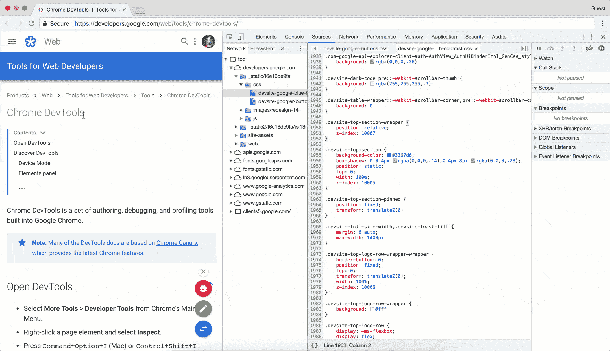

# 对 Web 开发初学者有用的 Chrome 开发工具

> 原文：<https://javascript.plainenglish.io/49-useful-tips-and-tricks-for-the-chrome-developer-tools-c9c166f5ebbd?source=collection_archive---------11----------------------->

## 你可以做的 49 个技巧和窍门。

Source: [Chrome Developer Tool](https://developers.google.com/web/tools/chrome-devtools/sources)

开发人员工具的各种功能以及与浏览器的良好集成，使 Chrome 成为 web 开发人员目前可能希望的最佳调试环境。

Devtools 真正伟大的地方在于它有许多让生活变得更简单的小事情。能够进行 JavaScript 分析和导出性能数据当然很方便。尽管如此，对于日常生活来说，超级书呆子的功能和面包黄油的功能不如小事重要。

我会在下面写下我脑海中出现的所有小事，我希望这些小事能早点展现给我。

# 一般

**1。停用缓存:**在设置中(点击右上方的齿轮图标)，可以在“停用缓存”下停用浏览器缓存。此停用仅适用于。同时，网页检查器也是打开的。

**2。缩放:**Web Inspector 是一个完全正常的 HTML 页面，所以也可以缩放。只需点击并使用键盘快捷键来放大/缩小文本。

**3。检查检查器:**如果检查器是一个正常的 HTML 页面，我们可以对其进行检查。打开一个网页检查器，然后 chrome://inspect 在另一个窗口调用它。在“其他”下，您将找到打开的检查器，并可以检查它。对于自定义样式尤其有用。

**4。自定义样式:**如果检查器是一个普通的 HTML 页面，我们可以检查它，我们也可以使用自己的样式。检查器的主体具有 ID -webkit-web-inspector，它可以用作特定于检查器的定制样式的名称空间。我个人用这个把字体设置大一点。

**5。主题**:如果检查器是一个普通的 HTML 页面，我们可以检查它并使用我们自己的风格，我们也可以使用完整的主题。

**6。覆盖**:在设置中(右下角网络检查器中的嵌齿轮)，有可以模拟各种设备的覆盖。这种模拟不仅仅是交换用户代理字符串:例如，浏览器的视窗也可以根据设备的尺寸进行缩放。非常实用的第一印象时，设计响应。你也可以在那里选择假的传感器数据和假的地理位置坐标。

**7。仿真打印:**在“仿真 CSS 媒体”下也有为 Chrome 指定媒体类型的选项例如，您可以设计页面的打印版本，而不必经常切换到真正的打印视图。当然，它也适用于其他媒体类型。

**8。键盘快捷键:**因操作系统而异，但可以在设置中的“快捷键”下查看。你应该和编辑器/IDE 里的快捷键有一样的技巧。

# **控制台**

**9。无所不在的控制台:**您实际上不需要在 Devtools 中有一个单独的控制台面板，因为控制台可以在其他面板的底部淡入。这可以通过点击相应的按钮(从左数第二个)或者按 ESC 键来完成。

**10。框架控制台:**控制台命令可以很容易地在(I)框架的上下文中执行。每个控制台下都有一个菜单，默认设置为“<顶框>”。如果页面上有框架，您可以在这里选择它们——控制台中的一个窗口意味着框架的窗口对象，而不再是父页面的窗口对象。

**11。保留控制台消息:**在设置中，控制台中的消息可以被赋予更长的寿命，并且“导航时保留日志”将在您导航该区域时保留。

**12。$ ():** 使用 CSS 选择器选择 JavaScript 控制台中的单个元素。示例:$(“body”)

**13。$$ ():** 使用 CSS 选择器选择 JavaScript 控制台中的多个元素。示例:$$('p.foo ')

**14。$ 0:** 在 JavaScript 控制台中可以找到对当前在“元素”面板中选择的 DOM 节点的引用。示例:console.log($0)

**15。$ 1、$ 2、$ 3、$ 4:** 元素选择历史。$ 1 是对$ 0 先前选择的元素的引用，$ 2 是对$ 1 先前选择的元素的引用，依此类推。

**16。$ _:** 记住上次在控制台中计算的表达式的结果。例如，1 + 2，如果您键入，您不仅可以立即得到 3back，而且这个值也可以在中找到，以便以后使用$_。

**17。检查():**在“元素”面板中选择传输元素的控制台功能。示例:检查(2 美元)

**18。console.dir ()** :虽然 log()DOM 节点显示节点的内容，但是 dir()将节点显示为包含所有属性的 JavaScript 对象。示例:console.dir($0)

**19。console.count ()** :如果你想计算并输出某件事情发生的频率，一个足够的 console.count()来输入一个字符串作为标识符；浏览器完成其余的工作。

**20。console.log()中的字符串替换:**托管架替换有几个占位符，其中包括其他变量作为字符串中的第一个参数。有%sa 替换格式为字符串，% dand % iformatted 为整数，%fa 浮点数，%oa DOM 和%Oa JavaScript 对象。示例:console . log(' Um % f gabes % d element '，Date.now()、document.childNodes.length)

**21。控制台中的 CSS。log():**占位符%ccan 可用于将 CSS 格式合并到控制台输出中。示例:console . log(“% CroT % cgRo”，“color:red”，“font-size:2em”)

**22。console.warn ():** 同样显示警告，也就是用适当的图标装饰。示例:console.warn('注意！')

**23。console.error ():** 显示错误本身，即带有适当的图标和堆栈跟踪。示例:(function foo(){ console . error(' Fail ')；})()

**24。Multi-console.log ():** 如果给 log 函数几个参数(并且不使用替换选项)，它们可以一次输出几个东西。示例:console.log('Foo '，42，[])

25。 **分组功能:**各种控制台消息可以组合成清晰、可折叠的组。只需从开始，然后记录所有可能的内容，并以结束群组。组可以嵌套，最初折叠的组可以用打开。console . Group(' Titel der Gruppe ')console . groupend()console . Group collapsed(' Group title ')

**26。事件监控:**如果您想知道某个事件是否正在发生，您不需要在任何文件中编写任何代码，因为控制台也会这么做。例如，您可以记录 body 元素上的每次点击:monitorEvents(document.body，' click ')

**27。定时:**控制台内置定时器功能。使用启动 ID 为的计时器，可以使用再次停止计时器。然后输出和之间的操作所用的时间。console . time(' Foo ')Foo console . time end(' Foo ')time()time end()

# 元素

**28。search:**Elements 面板自带搜索功能，可以快速搜索整个 DOM。例如，使用适当的组合键打开 Web Inspector 搜索，并搜索“< div”。CSS 选择器也在搜索框中工作:“div div”只查找至少有一个 div 祖先的 div 元素。XPath 也可以。

**29。拖拽& Drop:** 如果布局需要快速重排，3 在元素面板中拖拽元素到合适的位置就足够了。

30。强制元素状态:在元素的右键菜单中，有“强制元素状态”选项，可以永久设置元素。

31。编辑度量:双击后可以直接编辑度量框的值，而不需要通过 CSS。

32。保存样式更改:对现有样式规则或度量的更改可以很容易地持久化，因为检查器会自动将更改合并到 Sources 面板的相应条目中。更改后，您可以搜索并保存相关的 CSS 文件。

33。DOM breakpoints: 在“Break on …”下的元素的上下文菜单中，有一个为这个元素的修改设置断点的选项，这样如果属性或子元素被更改，调试器就会停止。然后可以在“DOM 断点”下的右边栏中再次删除这些断点要进行测试，请为属性更改设置一个 DOM 断点，并在控制台$0.classList.add('foo ')中执行它

# 网络

**34。排序时间线:**当然，在网络面板中，你可以根据请求的总时间或字母顺序对其进行排序。而且根据个人时间消耗特征的排序也是可能的！单击“Time”列的标题，根据延迟、持续时间或开始和结束时间对请求进行排序。

# 排除故障

**35。调试器语句:【JavaScript 代码内置的断点。它不仅适用于 Chrome，也适用于大多数浏览器。示例:if(should never occurrence){ debugger；}**

36。条件断点:在浏览器中设置的断点是否真正停止程序可以根据 JS 表达式的结果来决定。设置一个断点，打开上下文菜单并选择“编辑断点”，输入你选择的表达式，就这样——只有当所述表达式真返回时，程序才停止。

**37。断点操作:**你可以在条件断点中使用任何你想要的 JS 表达式。程序只有在返回 The 时才会停止。console.log()不会用它的返回值来停止程序，但是它会被执行。所以您可以在不使用编辑器的情况下将调用构建到代码中！(源)console.log()

**38。漂亮的打印:**如果你在源代码面板中调用一段缩小的 JavaScript 代码，Web Inspector 可以去除它的泡沫。为此，请使用左下角带尾夹的按钮。

**39。异常时中断:**Pretty Print 旁边的暂停按钮会导致浏览器在出现未处理的异常时冻结网站，这样就可以很容易地看到哪里出错了。

**四十。Error.stack:** Error 对象在 JavaScript stackthat 中有一个名为 JavaScript 的属性，可以直接用来以纯文本的形式收集堆栈跟踪。然后可以显示或记录这些信息。示例:try { existiertNicht()；} catch(err){ console . log(err . stack)；}

**41。观察表情:**你是否经常被抓到在控制台上写同样的命令？这也更容易:在“源”面板中的“监视表达式”下，可以存储几个表达式用于监视。过一段时间或重新加载后，只需单击刷新按钮，就可以一次性更新所有内容。

**42。xhr 和事件的断点:**在 Sources 面板中，还有一个为 xhr(所有请求或只对某些 URL 的请求)和事件设置断点的选项。为此，请使用调试器控制下的各个面板。

# 编码

**43。Deus Ex HTML:** 你需要一个快速的 HTML 页面来测试一些东西吗？只需打开一个新标签页和数据:text/HTML，<！doctype html >写入地址行。

**44。热交换:**在浏览器中对 JavaScript 文件所做的更改会立即生效，无需保存和重新加载页面。在源文件面板中打开文件，更改一些内容并应用更改(保存热键)。要进行测试，请更改此页面上的函数 foo！

45.片段:如果您想在 Devtools 中更频繁地运行相同的 JavaScript，您可以在浏览器中保留适当的片段。与任何其他代码片段一样，可以在源代码下的 Snippets 选项卡中直接创建和编辑这些代码片段。

46.Diffs:修补了源代码，但不知道所有的东西都被改变了？没问题:在文本编辑器的上下文菜单中，有“Local Modifications”项，可以用来调用一个不错的 diff。

# 扩展和库

47。[**LiveReload**](http://livereload.com/)**:**希望你们都已经在用了。如果不是:你做错了。

**48。**[**coffee console 2**](https://chrome.google.com/webstore/detail/coffeeconsole-2/kcdehbekjjicimoacajfpcpihajfnbfp?hl=en)**:**一个小 CS 控制台直接在 Web Inspector

49。 [**日志**](https://github.com/adamschwartz/log) **:** 通过 JS 库简单格式化的控制台日志记录。支持(一点点)降价！

我很想听听你能分享哪些关于 Chrome DevTool 的技巧和诀窍。:)