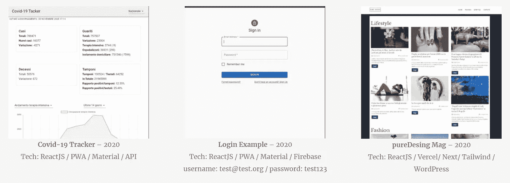
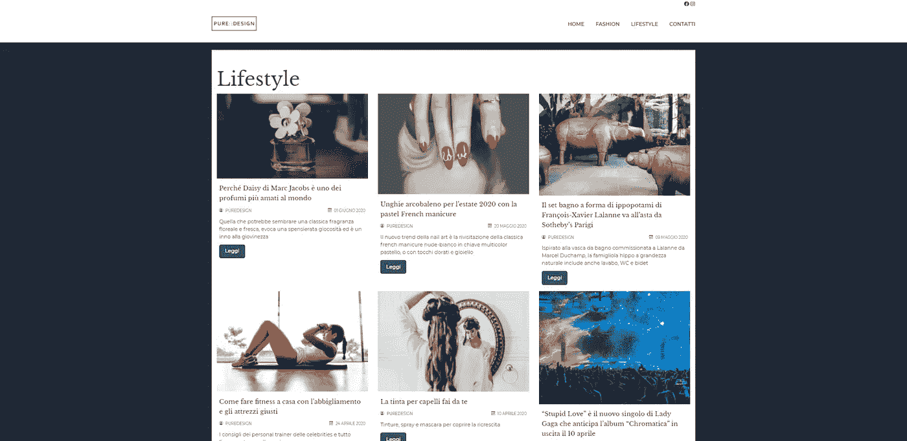
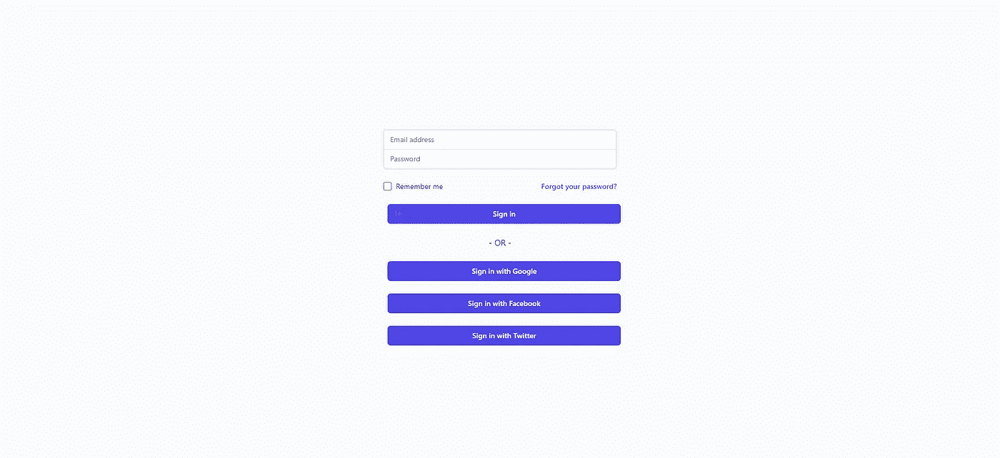
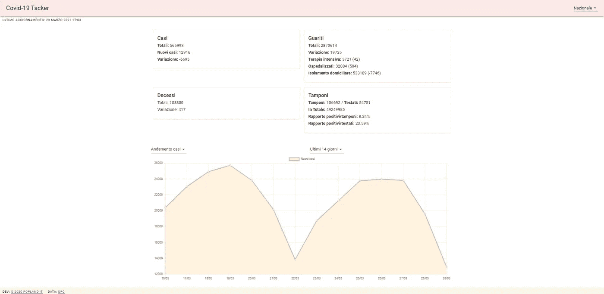

# React 产品组合的 5 个高级项目

> 原文：<https://javascript.plainenglish.io/5-advanced-project-for-your-react-portfolio-974f069d4746?source=collection_archive---------2----------------------->

有时，当建立一个投资组合时，我们很难决定向我们的潜在客户展示什么样的演示项目。一个完整的应用程序比一个应用程序的一个小但详细的部分更好吗？我应该专注于单一技术还是应该差异化？更多的问题浮现在脑海中，锁住我们，让我们拖延开始新的“演示”。

## 在我看来，演示项目应该遵循这些基本规则:

*   **做“真实的”人，面对现实生活中的问题**；你的潜在客户不在乎你是否能写出一份*待办事项清单*，她/他想评估你如何能找到满足他们需求的解决方案。避免待办事项，hello world，以及其他无用的 PWA。
*   **变美**；向他们展示你知道设计如何遵循功能，不要仅仅因为“重要的是我的代码”就把所有东西都放在 *Times New Roman* 里。在你的项目中使用 SCSS、CSS 和样式库(Bootstrap、Tailwind……)，以显示你知道何时以及如何使用它们。
*   **使用不同的技术**，不要拘泥于从 WordPress 网站获取数据或从 [SWAPI](https://swapi.dev/) 列出星球大战电影，实现 Firebase、Datastax、lambda 函数，以及公司在现实世界应用中使用的所有技术。

也就是说，这里有 5 个项目可以被认为是先进的(它们不容易实现，需要一些工作)，它们将展示你的工作，提高你的编码技能，让你学习新的东西。

# 1.无头 Wordpress

这是一个经典，但建立它很好。使用类别，大量的帖子，一些页面，作者，让它真实，不要因为“这是一个演示”就把东西从项目中删除。使用静态生成器(如 Gatsby 或 Next)为了性能，添加一个[实时搜索引擎](https://www.algolia.com/doc/guides/building-search-ui/going-further/server-side-rendering/react/)。部署它并使用 Webhook 进行构建和预览。用一个 CSS 框架把它变漂亮。

## 是时候发展了

应该在一周内完成

## 您将学到的内容:

*   无头 WordPress
*   使用反应式静电发生器的 SSR
*   用 CSS 框架设计样式
*   构建和部署
*   Webhooks

# 2.Firebase 登录

使用 [Google Firebase](https://firebase.google.com/) 构建完整的登录套件，具有注册、社交登录、密码提醒、处理错误、将用户数据保存在 app 上下文中；通过将新注册的用户保存到 Firestore 来扩展它；设计好它，让它以移动为先，并将完成的应用程序部署到 Firebase 主机上。项目越完整(错误处理、数据库规则等等)，就越容易在实际项目中重用它。

## 是时候发展了

一旦你掌握了 Firebase，它将需要几个小时来开发这个项目

## 您将学到的内容:

*   Firebase 授权、Firestore 和托管
*   上下文处理
*   Firebase-CLI
*   认证工作流程
*   NoSQL 实时数据库处理
*   创建工作样板

# 3.一款基于云的笔记应用，使用 Datastax

构建一个多用户应用程序，允许注册用户做笔记并保存在云中。利用 Astra Datastax 无服务器数据库处理您的数据(用户和内容)；通过开发一个 Express 中间件来扩展它，以便通过 API 访问数据。将 API 端点导出为无服务器 lambda 函数并部署它们

## 是时候发展了

这是相当困难的，尤其是如果你以前从未使用过 Datastax，从开始到结束至少需要 20 天

## 您将学到的内容:

*   Astra Datastax 无服务器数据库
*   从头开始的身份验证工作流
*   λ函数
*   快速中间件

# 4.构建微型电子商务解决方案

使用 [Snipcart](https://snipcart.com/) 和您选择的内容管理器(创建产品)，建立一个漂亮的电子商务网站，尝试为用户找到新的购物方式，释放 React JS 的力量以提供简化的购物体验，专注于前端，(使用静态生成器是一个优势)，因为大多数后端工作将由 Snipcart 负责。

## 是时候发展了

一旦你设置好并准备好你的产品，这个项目可以在不到一周的时间内完成

## 您将学到的内容:

*   狙击车
*   API 驱动的内容管理器
*   跳出框框思考
*   电子商务工作流程

# 5.新冠肺炎追踪器

找到一家新冠肺炎数据提供商(全球或本地)汇总其数据并呈现出来，让用户选择日期范围、要显示的数据、比较等，让他们能够保存自己喜欢的视图、显示图表、地图等

## 是时候发展了

几天后，你应该可以让你的项目上线了

## 您将学到的内容:

*   搜索和获取数据
*   聚集和操作数据
*   保存用户首选项
*   嵌入图形和地图

# 结论

这些可能看起来不像通常的演示项目，它们有点复杂和完整，但一旦完成，你肯定会学到你将在实际项目中使用的东西，而且这些项目中的一些可以在实际应用中重复使用