# 5 种高级反应模式

> 原文：<https://javascript.plainenglish.io/5-advanced-react-patterns-a6b7624267a6?source=collection_archive---------0----------------------->

*概述 5 种现代高级 React 模式，包括集成代码、优缺点以及在公共图书馆中的具体使用。*

像每个 React 开发人员一样，您可能已经问过自己以下问题之一:

*   我如何构建一个**可重用的**组件来适应不同的用例？
*   我如何用一个简单的 API 来构建一个组件，使其易于使用？
*   就 UI 和功能而言，我如何构建一个可扩展的组件？

这些重复出现的问题导致了整个 React 社区中的一些高级模式。

> 在本文中，我们将考虑 React 开发人员(您)为其他开发人员构建组件的情况。

我们将看到 5 种模式的概述。为了便于比较，我们将对它们使用相同的结构:

a.模式介绍
b .代码示例(基于一个简单的`Counter`组件)

> 代码可以在 github 上获得:[高级反应模式](https://github.com/alexis-regnaud/advanced-react-patterns)

c.利弊标准。基于两个因素:

*   [控制反转](https://kentcdodds.com/blog/inversion-of-control):给予使用你的组件的开发者的灵活性和控制水平。
*   实现复杂性:您和开发人员实现模式的难度。

e.公共图书馆在生产中使用该模式。

## 1.复合组件模式

这种模式使得创建表达性和声明性组件成为可能，同时避免了[道具演练](https://kentcdodds.com/blog/prop-drilling)。如果您想要一个可定制的组件，具有更好的关注点分离和可理解的 API，可以考虑使用这种模式。

**示例**

> Github: [复合组件](https://github.com/alexis-regnaud/advanced-react-patterns/tree/main/src/patterns/compound-component)

**优点**

*   降低 API 的复杂性:避免将所有的道具都塞在一个巨大的父组件中，并向下钻取到子 UI 组件。相反，道具被附在最有意义的`Counter`的孩子身上。

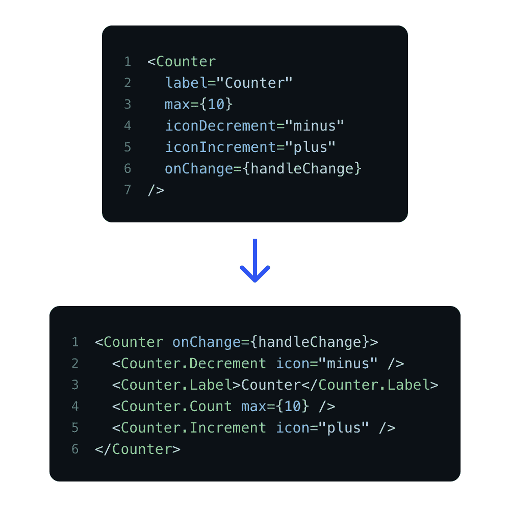

*   灵活的标记结构:通过允许创建各种案例来提供很大的 UI 灵活性。例如，开发人员可以很容易地改变`Counter`孩子的顺序，或者定义应该显示哪个孩子。

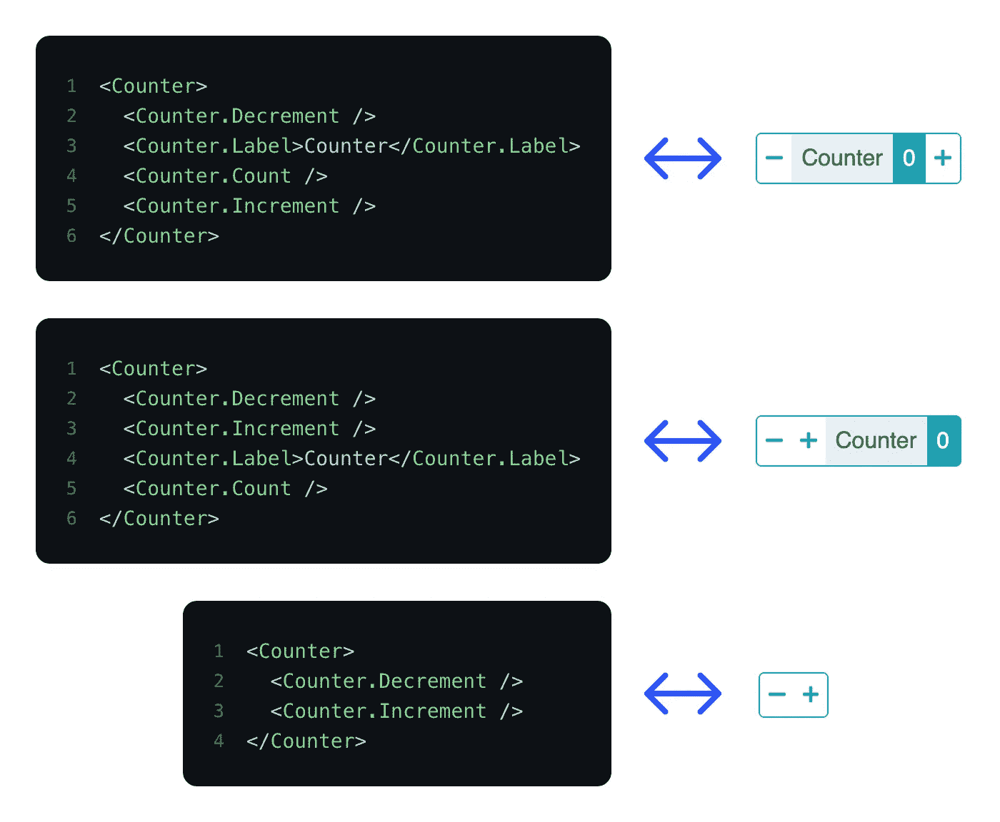

*   关注点分离:大部分逻辑集中在`Counter`中。上下文(`CounterProvider` + `useCounterContext`)用于在`Counter`的子节点间共享状态(`counter`)和处理程序(`handleIncrement()`、`handleDecrement()`)。这给了我们明确的责任分配。

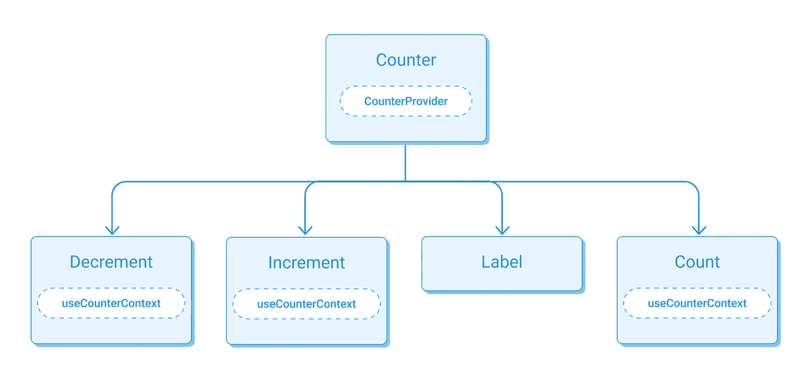

**缺点**

*   过多的 UI 灵活性:拥有这种级别的灵活性也会导致最初没有预料到的情况(例如:不需要的代码、错误的计数器子级顺序、缺少必需的子级)。
    根据您的使用情况，您可能不希望有太大的灵活性。

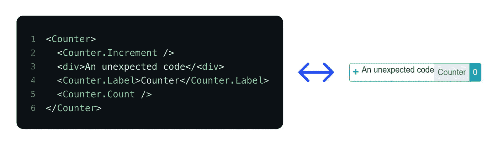

*   更重的 JSX:这种模式将增加 JSX 行数，尤其是当您使用 linter ( `EsLint` **)** 或 code formatted ( `Prettier`)时。
    从单个组件的规模来看，这似乎没什么大不了的，但从全局来看，这肯定会产生巨大的影响。

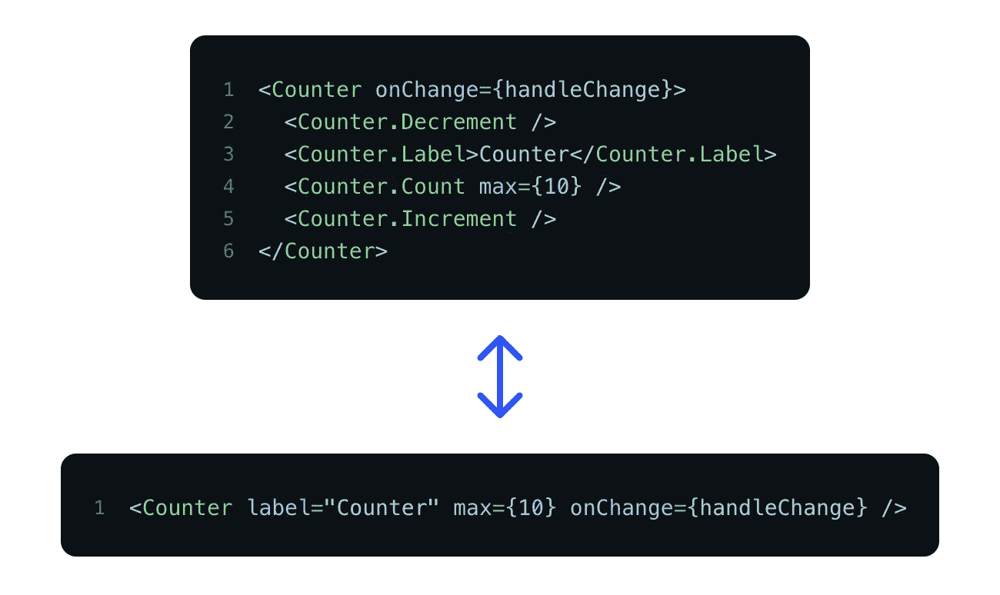

**标准**

*   控制反转:1/4
*   实施复杂性:1/4

**使用这种模式的公共图书馆**

*   [反应自举](https://react-bootstrap.github.io/components/dropdowns/)
*   [Reach UI](https://reach.tech/accordion)

## 2.控制道具模式

这种模式将您的组件变成了一个[受控组件](https://reactjs.org/docs/forms.html#controlled-components)。外部状态被作为“真实的单一来源”使用，允许开发人员插入他们自己的逻辑来修改默认的组件行为。

**示例**

> Github: [控制道具](https://github.com/alexis-regnaud/advanced-react-patterns/tree/main/src/patterns/control-props)

**优点**

*   给予更多的控制:由于开发人员控制主状态，他们可以直接影响`Counter`的行为。

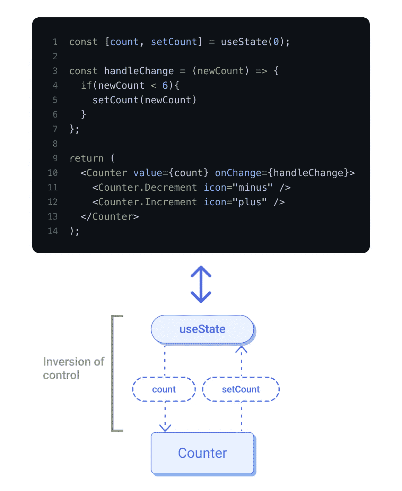

**缺点**

*   实现复杂性:以前，一次集成(`JSX`)就足以让组件工作。现在它分布在三个不同的地方(`JSX` / `useState` / `handleChange`)。

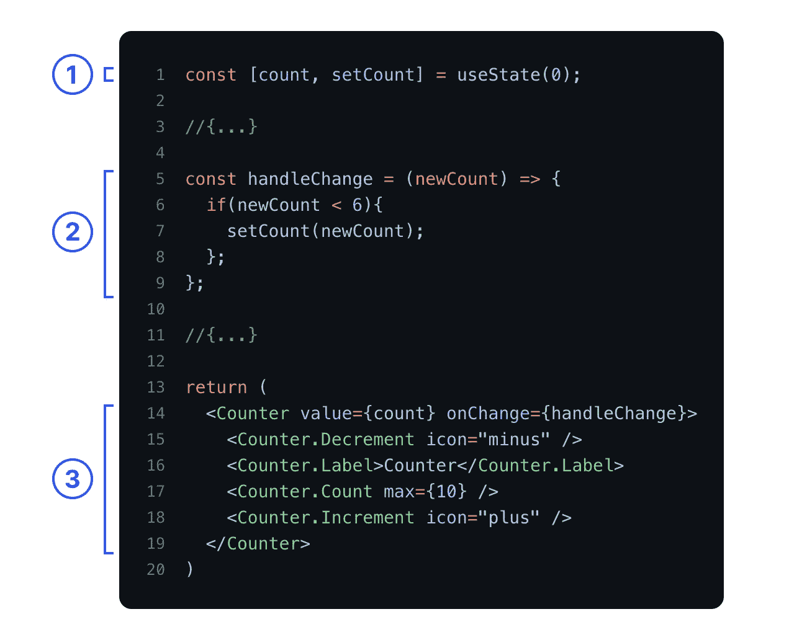

**标准**

*   控制反转:2/4
*   实施复杂性:1/4

**使用这种模式的公共图书馆**

*   [材料界面](https://material-ui.com/components/rating/#rating)

## 3.自定义挂钩模式

让我们在“控制的倒置”中更进一步:主逻辑现在被移动到一个自定义钩子中。这个钩子暴露了几个内部逻辑(`States`、`Handlers`)，这给了开发人员很大的控制权。

**示例**

> Github: [定制挂钩](https://github.com/alexis-regnaud/advanced-react-patterns/tree/main/src/patterns/custom-hooks)

**职业选手**

*   给予更多的控制:开发者可以在`useCounter`和`Counter`之间插入他们自己的逻辑，使得他们可以修改默认的`Counter`行为。

**Cons**

*   实现的复杂性:因为逻辑部分与渲染部分是分开的，所以由开发人员来链接两者。因此，有必要很好地理解`Counter`是如何工作的，以正确地实施它。

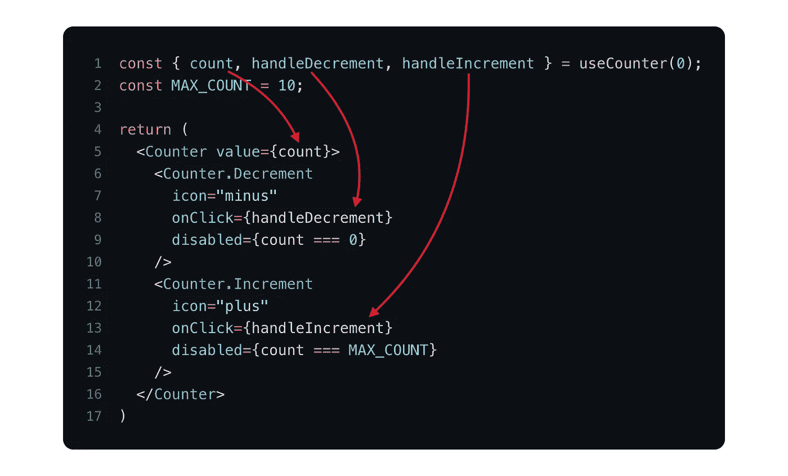

**标准**

*   控制反转:2/4
*   实施复杂性:2/4

**公共图书馆采用这种模式**

*   [反应表](https://react-table.tanstack.com/docs/examples/basic)
*   [反钩形](https://react-hook-form.com/api)

## 4.道具吸气剂模式

`Custom Hook Pattern`提供了很好的控制，但是它也使得组件更难集成，因为开发人员不得不处理大量的本地钩子道具并重新创建他这边的逻辑。

`Props Getters Pattern`模式试图掩盖这种复杂性。我们提供了一份`props getters`的入围名单，而不是暴露本土道具。

> 一个`getter`是一个返回很多道具的函数，它有一个有意义的名字，让开发者清楚哪个`getter`对应哪个 JSX 元素。

**示例**

> Github: [吸道具员](https://github.com/alexis-regnaud/advanced-react-patterns/tree/main/src/patterns/props-getters)

**优势:**

*   易用性:复杂性是隐藏的。开发者只需要将`useCounter`给出的正确的`getter`连接到正确的 JSX 元素。

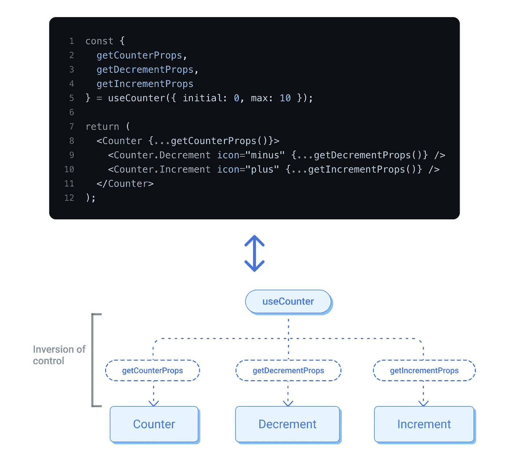

*   灵活性:过载`getter`的道具可以适应特定情况。

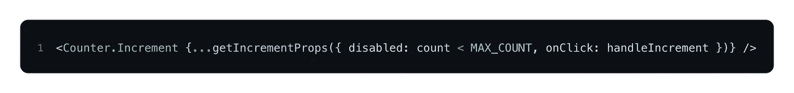

**缺点:**

*   缺乏可见性:`getters`带来了抽象，这使得组件更容易集成，但也更加不透明和“神奇”。开发人员必须很好地理解暴露的 getter 属性以及受影响的内部逻辑，以便正确地覆盖它们(`Typescript`应该有助于这一点)。

**标准**

*   控制反转:3/4
*   集成复杂度:3/4

**使用这种模式的公共图书馆**

*   [反应表](https://react-table.tanstack.com/docs/examples/basic)
*   [降档](https://github.com/downshift-js/downshift#usage)

## 5.状态缩减模式

控制反转方面最先进的模式。它为开发人员提供了一种改变组件内部操作方式的高级方法。代码类似于`Custom Hook Pattern`，但是增加了一个`reducer`传递给钩子。这个`reducer`可以重载组件的任何内部动作。

**例子**

> Github: [状态还原器](https://github.com/alexis-regnaud/advanced-react-patterns/tree/main/src/patterns/state-reducer)

> `State reducer pattern`可以与其他图案(`Compound components pattern`、`Custom hook pattern`和`Props Getters Pattern`)关联。在本例中，我们将它与`Custom hook pattern`一起使用。

**优点**

*   给予更多的控制权:在最复杂的情况下，使用`state reducers`是将控制权留给开发人员的最佳方式。所有内部`useCounter`的动作现在都可以从外部访问，并且可以被覆盖。

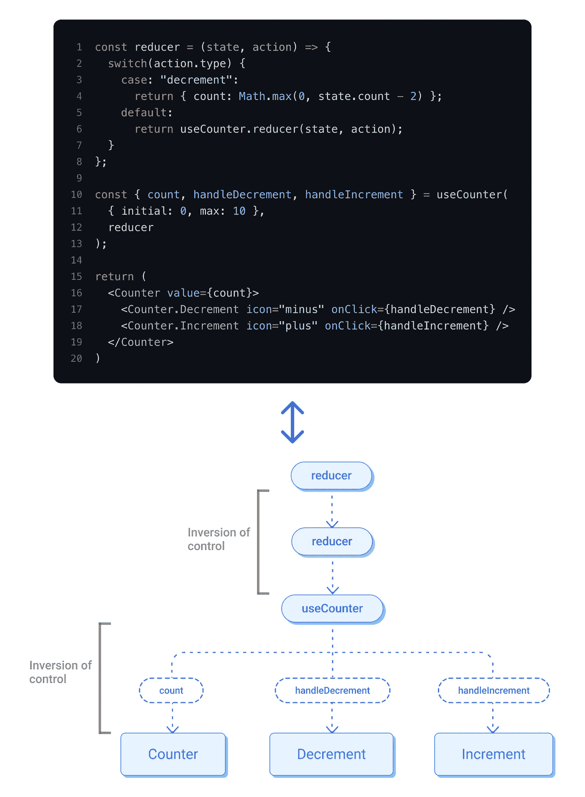

**缺点:**

*   实现的复杂性:对于您和开发人员来说，这种模式可能是实现起来最复杂的。
*   缺乏可见性:因为任何减速器的动作都可以改变，所以需要很好地理解组件的内部逻辑。

**标准**

*   控制反转:4/4
*   集成复杂度:4/4

**使用这种模式的公共图书馆**

*   [降档](https://github.com/downshift-js/downshift#statereducer)

## 结论

通过这 5 个高级反应模式，我们看到了利用“控制反转”概念的不同方式。它们为您提供了一种创建灵活且适应性强的组件的强大方法。

然而，我们都知道“强大的力量带来巨大的责任”。给开发人员越多的控制权，你的组件就会越远离“即插即用”的思维模式。这就是为什么你必须根据正确的需求选择正确的模式。

下图可以帮助您完成这项任务。它根据“集成复杂性”和“控制反转”对所有这些模式进行分类:

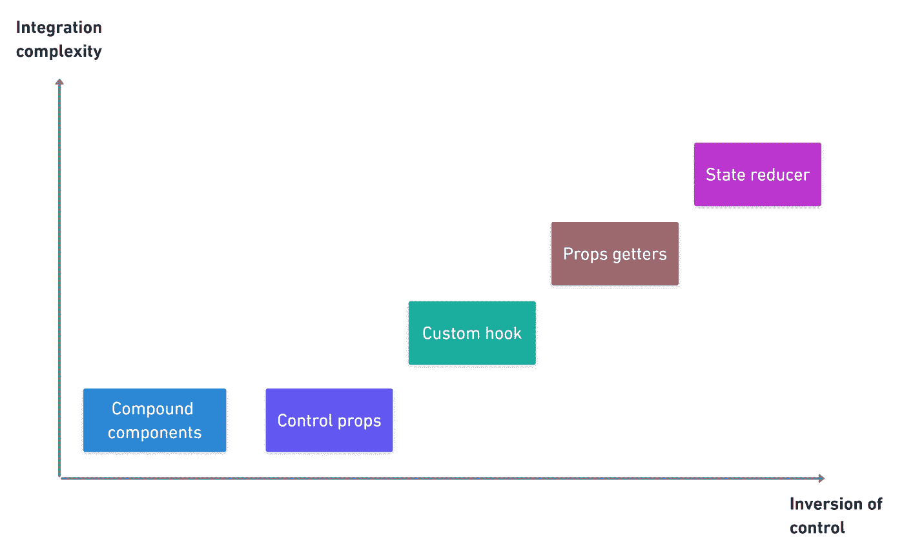

这篇文章的灵感主要来自于 React 社区(【https://kentcdodds.com/】)的著名开发人员[肯特·c·多兹](https://medium.com/u/db72389e89d8?source=post_page-----a6b7624267a6--------------------------------)的惊人工作。

感谢您的阅读。

## 进一步阅读

 [## 前端测试策略

### 定义测试的不同层次，并概述当前情况，以提出有效的…

itnext.io](https://itnext.io/front-end-testing-strategy-5fddfd463feb) 

*更多内容看* [***说白了就是***](https://plainenglish.io/) *。报名参加我们的* [***免费周报***](http://newsletter.plainenglish.io/) *。关注我们关于* [***推特***](https://twitter.com/inPlainEngHQ) ， [***领英***](https://www.linkedin.com/company/inplainenglish/) ***，***[***YouTube***](https://www.youtube.com/channel/UCtipWUghju290NWcn8jhyAw)***，以及****[***不和***](https://discord.gg/GtDtUAvyhW) *对成长黑客感兴趣？检查出* [***电路***](https://circuit.ooo/) ***。****