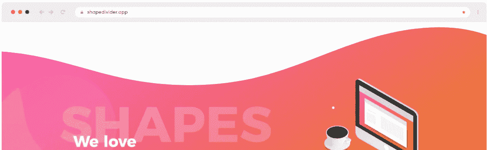
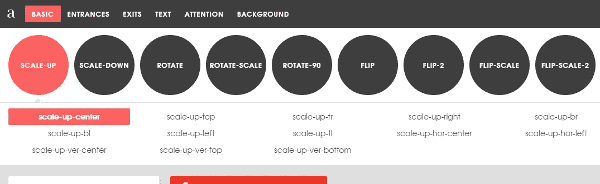
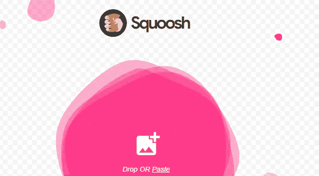
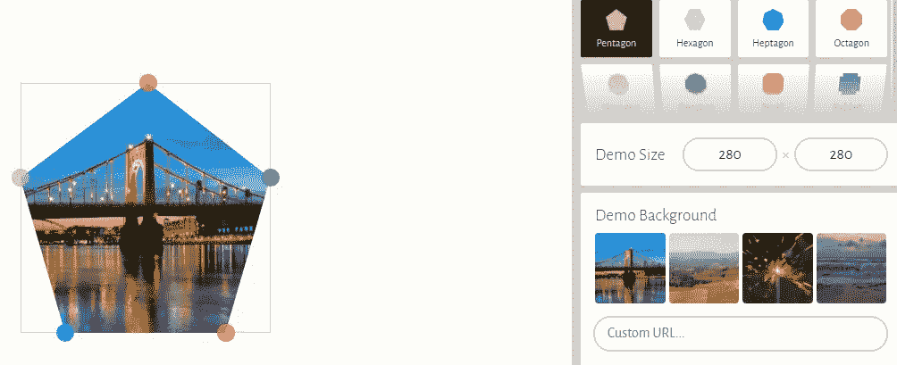
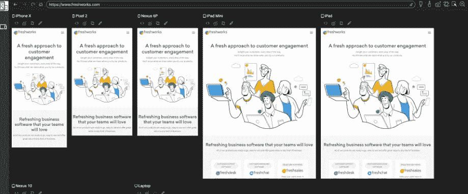

# 您可能需要使用的 5 款令人惊叹的前端开发应用

> 原文：<https://javascript.plainenglish.io/5-amazing-front-end-development-apps-you-probably-need-to-use-bf7629034403?source=collection_archive---------6----------------------->

## 有用的前端开发人员网络应用程序，帮助您的下一个项目。

Photo by [Zan](https://unsplash.com/@zanilic?utm_source=medium&utm_medium=referral) on [Unsplash](https://unsplash.com?utm_source=medium&utm_medium=referral)

# 介绍

作为一个前端开发人员，你会在网上找到很多工具来帮助你的开发过程。每天都有很多任务需要你去完成，所以使用一些工具是个不错的主意，这些工具可以加快你的开发速度，让你作为开发人员的生活变得更轻松。好的一面是你不需要支付任何费用，有很多免费的工具。

因此，在本文中，我们将为您提供一些有用的前端开发应用程序列表，这些应用程序将有助于您的下一个项目，并使您的生活更加轻松。让我们开始吧。

# 1.形状分割器

Shape Divider 是一个非常有用的应用程序，可以帮助你制作令人敬畏的背景形状，比如波浪、曲线等等。它还允许您为形状生成 CSS 代码或为您的项目导出 SVG 形状分割器。你可以去了解更多信息。

Capture by author.

# 2.泛灵论者

[Animista](https://animista.net/) 是一个很棒的应用程序，在这里你可以找到不同类型的动画模板，并为你想要的动画生成代码。如果你不想花很多时间尝试自己制作动画，这是非常有用的。

Capture by author.

# 3.Squoosh

[Squoosh](https://squoosh.app/) 是一个非常有用的网络应用程序，它让你能够用许多高级选项来压缩图像。它还有一个命令行界面，可以让你一次压缩很多图像。

Capture by author.

# 4.CSS 剪辑路径

CSS Clip-Path 是一个 web 应用程序，它提供了许多复杂的几何形状，你可以在应用程序上编辑它们，并为它们生成 CSS。如果你想给你的项目添加一些很酷的形状，这是一个非常有用的应用程序。

Capture by author.

# 5.响应地

[响应式](https://responsively.app/)是一个很棒的应用程序，可以让你更快地构建响应式布局。它有很多特性，在处理响应式设计时会节省你的时间。你可以去了解更多信息。

Capture by author.

# 结论

正如你所看到的，所有这些应用程序都是免费使用的，它们帮助你节省了大量时间，加快了你的开发过程，最大限度地提高了生产力。

感谢您阅读这篇文章。希望你觉得有用。

**延伸阅读**

 [## 你可能不知道的 5 个很棒的 CSS 特性

### 每个 web 开发人员都应该知道的有用的 CSS 特性。

javascript.plainenglish.io](/5-awesome-css-features-that-you-probably-dont-know-63f90e66562) 

*如果你对 JavaScript 和 web 开发相关的更有用的内容感兴趣，可以* [*订阅*](https://mehdiouss.ck.page/) *我的快讯。*