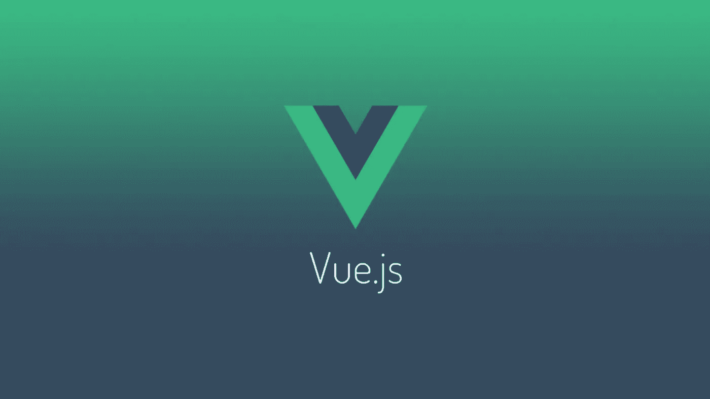
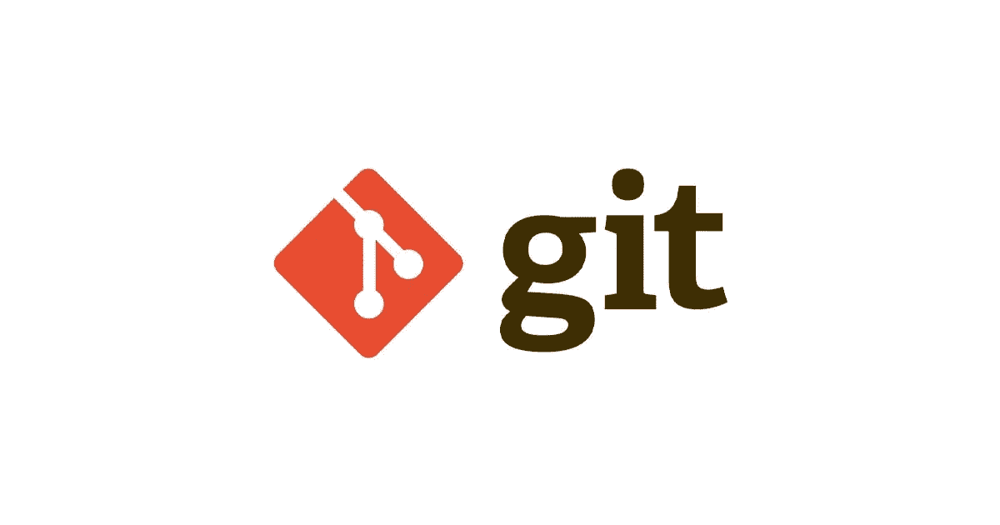
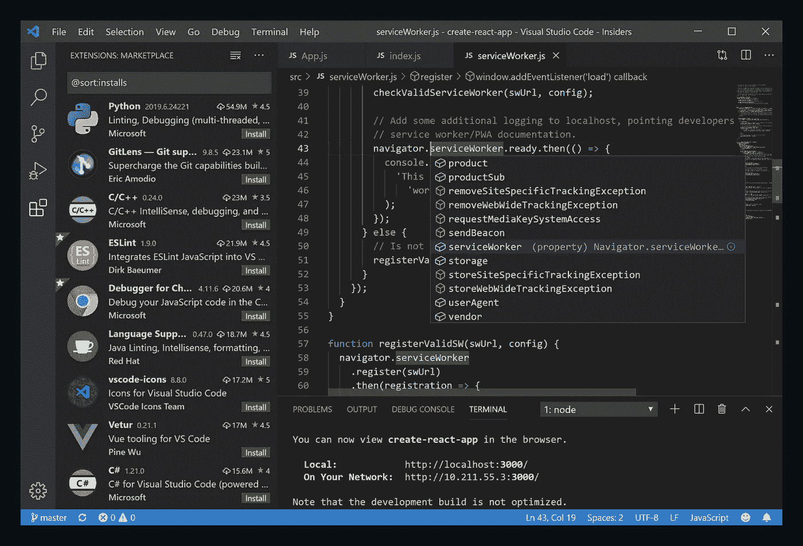
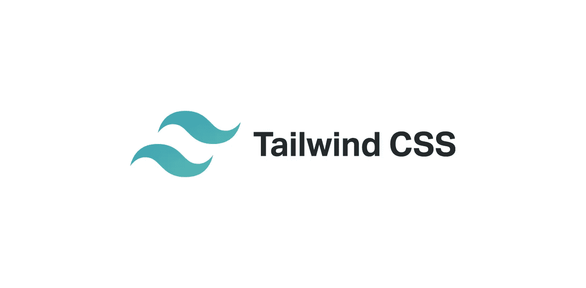

# 我不能没有的 5 个惊人的开源工具

> 原文：<https://javascript.plainenglish.io/5-amazing-open-source-tools-i-cant-live-without-b743a744f927?source=collection_archive---------12----------------------->

## 我离不开的惊人的开源工具

Photo by Intuit

开源软件催生了各种令人惊叹的项目和工具，帮助打破枯燥的东西，顺利完成许多工作。它的美妙之处在于所有这些工具都是免费和开源的。你可以直接为这些惊人项目的未来做出贡献。

在这篇文章中，我将介绍一些我最常用的、令人惊叹的免费开源工具，我发现这些工具非常好用。这些工具中的大部分，我每天都在使用，并帮助改善我的一般工作流程。

## **1。Vue.js**

Image by [**Keyul**](https://dev.to/keyul)

Vue.js 是一个开源的前端 JavaScript 框架，用于构建用户界面和单页面应用。它由尤雨溪创建，并由他和其他活跃的核心团队成员维护。自从我开始学习 Vue.js 以来，我发现它在构建独特强大的用户界面方面非常强大和令人惊叹。

我的大多数前端项目都是在 Vue.js 中完成的，在开发用户界面时，这个工具对我来说非常神奇。Vue.js 及其开源生态系统，包括 web 扩展和框架，对我来说总是很方便。

你可以在这里查看 Vue.js 开源项目 [***。***](https://github.com/vuejs/vue)

## **2。Git**

Image by Chilli Codes

Git 是一个免费的开源分布式版本控制系统，旨在快速高效地处理从小到大的各种项目。Git 非常强大，学习 git 对我的职业生涯很有帮助。每天，我在协作项目和我的 GitHub 上使用 git。

Git 对我的职业生涯很有影响，我每天都在使用它。你可以在这里查看 Git [***。***](https://git-scm.com/)

## **3。勇敢**

Image by Firstpost

Brave 是由 Brave Software，Inc .开发的免费开源 web 浏览器。Brave 是一款注重隐私的浏览器，在默认设置下会自动阻止在线广告和网站跟踪器。

从 chrome 浏览器出来，我发现 Brave 相当快，很少关注隐私。Brave 无疑是我日常使用的软件之一。Brave 在我的机器上也没有太多问题，也没有发现什么问题。Brave 还提供了一些有史以来最好的开发者浏览器体验，包括令人惊叹的调整和用户界面。

你可以在这里查看勇敢的 [***。***](https://github.com/brave/brave-browser)

## **4。Visual Studio 代码**

Image from Visual Studio Code

Visual Studio Code 是一个重新定义和优化的代码编辑器，用于构建和调试现代 web 和云应用程序。Visual Studio 代码是免费的，基于开源构建。到处跑。

在我用过的大多数代码编辑器中，visual studio 占据了第一位，因为它提供了令人惊叹的开发者阅读、编写和编辑代码的体验。我发现这些代码编辑器的一些令人惊叹的特性包括令人惊叹的终端、广泛的扩展、内置 Git、运行和调试以及其他令人惊叹的特性。

你可以在这里查看 GitHub [***中的 Visual Studio 代码。***](https://github.com/microsoft/vscode)

## **5。顺风 CSS**

Image by Jens van Wijhe

Tailwind CSS 是一个实用优先的 CSS 框架，用于构建和编写漂亮的 UI 和设计。我的大部分前端工作完全是在 tailwind CSS 上完成的，而且我用这个框架设计界面非常棒。

Tailwind 允许您在 HTML 元素中包含所有可用的样式属性。虽然由于许多类直接应用于一个元素，它可能有点混乱，但它非常漂亮，而且处理起来很快。

你可以在 GitHub 的 [***上查看这个框架。***](https://github.com/tailwindlabs/tailwindcss\)

## **结论**

这些是我日常使用最多的一些免费和开源项目。感谢您花时间通读这篇文章。

你最常用的令人惊叹的免费开源工具是什么？

## **更多阅读内容**

 [## 作为开发人员，用技术写作赚钱的 5 种方法

### 作为一名开发人员，我对通过技术写作赚钱的真实体验

javascript.plainenglish.io](/5-ways-to-make-money-with-technical-writing-as-a-developer-fffd263a37ed)  [## 如何为技术写作产生文章想法

### 我产生文章想法的方法

javascript.plainenglish.io](/how-to-generate-article-ideas-for-technical-writing-4184e779f506) 

*更多内容请看*[***plain English . io***](http://plainenglish.io/)