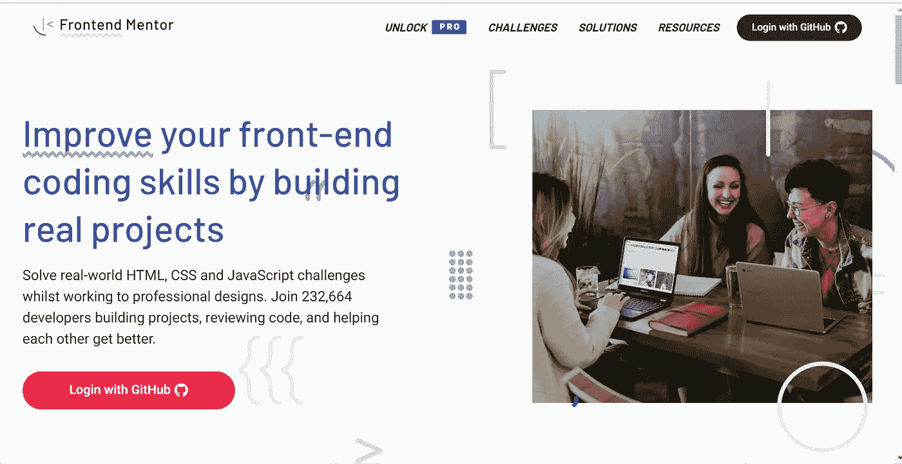

# 5 个惊人的资源来提高你的 CSS 技能

> 原文：<https://javascript.plainenglish.io/5-amazing-resources-to-ace-your-css-skills-cd11baee7714?source=collection_archive---------7----------------------->

## 帮助您提高前端技能的资源

Image by [Mohit](https://medium.com/u/da968086e185?source=post_page-----cd11baee7714--------------------------------)

级联样式表(CSS)在前端开发中起着重要的作用。与此同时，CSS 可能很难改进，有许多属性需要学习。

如果你想提高你的布局质量呢？使用 CSS，您可以构建漂亮的布局和可转换的前端页面。有这么多的资源可以学习，你有时会不知所措，不知道从哪里学，学什么。

在这篇文章中，我将分享一些惊人的资源来帮助你提高你的 CSS 技能和布局质量。

## **1。前端导师**

Frontend Mentor Homepage-Image by Author

Frontend mentor 是一个提供挑战的网站，可以通过构建真实的项目来提高您的前端技能。在进行专业设计的同时，解决现实世界中的 HTML、CSS 和 JavaScript 挑战。

前端导师提供必要的资产来帮助你通过挑战的挑战。它还提供了额外的功能和封面的保费挑战。

没有比用代码弄脏你的手并尝试将设计变成现实更好的学习方法了。通过他们的免费挑战，你可以大幅提高你的前端技能。

你可以在这里查看 [***网站***](https://www.frontendmentor.io/) *。*

## **2。CSS-招数**

CSS Tricks Homepage-Image by Author

CSS-Tricks 实际上是关于建立网站和所有必要的，主要是从前端的角度来看。

这也是互联网上令人惊叹的 CSS 策划资源之一。甚至从他们的设计中，你可以从他们的网站中感受到 CSS 的美。

他们还提供与互联网上不同主题相关的 CSS 文章。

你可以查看他们的网站 [***这里***](https://css-tricks.com/) *。*

## **3。Sitepoint**

Sitepoint Homepage-Image by Author

Sitepoint 是整个互联网上学习任何技术相关内容的最佳资源之一。从文章博客帖子到教程，他们有广泛的资源可供选择。

他们有有用的 CSS 内容来帮助你提高你的前端技能。

你可以查看他们的网站 [***这里***](https://www.sitepoint.com/html-css/css/) *。*

他们也有一个平行的 YouTube 频道，分享惊人的资源。你可以在这里查看**。**

## ***4。W3School***

**

*W3School Homepage-Image by author*

*W3School 也是另一个令人惊叹的网站，它提供了广泛的与互联网编程相关的内容。*

*它们提供免费资源和基于浏览器的代码编辑器学习体验。*

*从他们的网站上，我们创造了简化和互动的学习体验。*

*学习 web 开发应该易于理解，并且适用于任何地方的任何人！W3Schools 是一所面向 web 开发人员的学校，涵盖了 web 开发的所有方面:*

*您可以在这里访问网站**。***

## ****5。谷歌网页设计师****

****

**Goog Web Designer-YouTube page- Image by author.**

**谷歌网页设计器是一个基于视频的学习与网页和设计相关的神奇事物的地方。这个频道不仅为学习 CSS，也为学习与设计相关的概念提供了惊人而有用的资源。**

**你可以在这里 *查看他们的 YouTube 频道 [***。***](https://www.youtube.com/c/googlewebdesigner/videos)***

## ***结论***

*感谢您阅读这篇文章，希望对您有用。*

*你发现了哪些非常有用的 CSS 学习资源？*

*如果你觉得我的内容有用，而你不是媒体会员，你可以在这里获得你的媒体会员资格[(媒体推荐链接)，无限制地访问所有内容，并支持我们作为作家。](https://amjohnphilip.medium.com/membership)*

***更读***

* [## 作为一名技术作家如何为开源做出贡献

### 加入#Hacktoberfest，作为技术作家做出贡献

javascript.plainenglish.io](/how-to-contribute-to-open-source-as-a-technical-writer-bb708245480c)  [## 什么时候是停止称自己为“初级”开发人员的合适时机？

### 停止称自己为初级开发人员的最佳时机是什么？

javascript.plainenglish.io](/when-is-the-right-time-to-stop-calling-yourself-a-junior-developer-ba9d4a281f0d) 

*更多内容请看*[***plain English . io***](http://plainenglish.io/)*