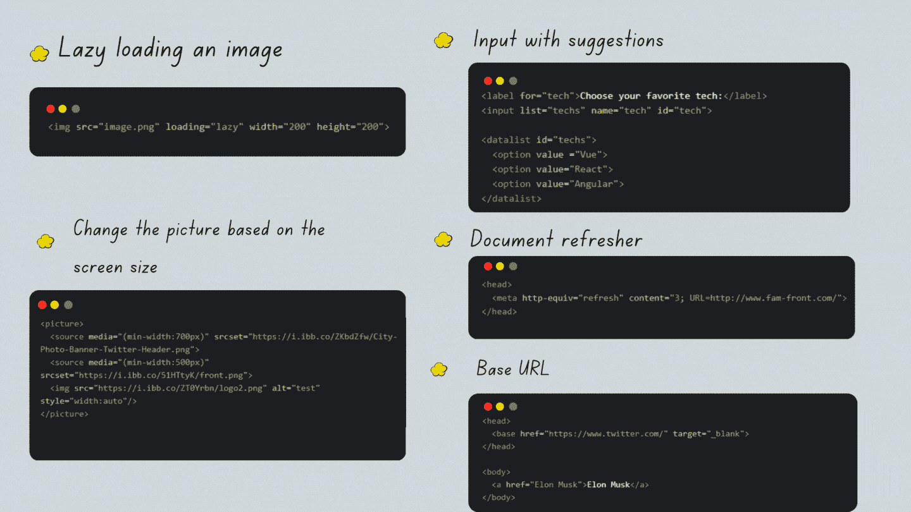

# 每个 Web 开发人员都应该知道的 5 个 HTML 技巧

> 原文：<https://javascript.plainenglish.io/5-awesome-html-tricks-every-web-developer-should-know-11eb3b234d37?source=collection_archive---------16----------------------->

## 发现这些技巧，节省你自己实现它们的时间！


By FAM

# 1.延迟加载图像

你听说过懒装路线或者组件吗？图像也是如此。它们也可以是懒惰装载的。这将防止在屏幕上立即加载所有你并不真正需要的图像，从而加快你的应用程序的加载时间。由于它每次显示的图像数量，这也用在介质上！

```

```

**举例:**

# 2.根据屏幕尺寸更改图片

HTML 图片标签非常强大，你可以选择不同宽度的多张图片，而不是只有一张图片可以缩放。这将使你的应用变得智能，给用户一个积极的体验。


Change the picture based on width.

**举例:**

**找到下面的工作示例:**

# 3.提出建议。是的，用 HTML 是可能的

有时候，客户需要一个带有建议的输入框。您可以用 HTML 做到这一点，而无需自己实现自动完成解决方案。毕竟，当它已经存在于 HTML 中时，为什么还要费心去做呢？

**举例:**

**找到下面的工作示例:**

# 4.文档刷新者

文档刷新程序用于在给定的秒数内将用户重定向到提供的 URL。在下面的例子中，我们在 3 秒钟内刷新并重定向到我的网站^^'.

# 5.基本 URL

当所有的 URL 都以相同的基地址开始时，您可能必须考虑使用 HTML Base 标记来避免每次都重复 URL 基。

**回顾一下:**



By FAM


By FAM

亲爱的读者，我希望这是明确和有用的。我希望你和你的家人无论在哪里都平安无事！坚持住。明天会更好！

**让我们联系一下** [**中**](https://medium.com/@famzil/)**[**Linkedin**](https://www.linkedin.com/in/fatima-amzil-9031ba95/)**[**脸书**](https://www.facebook.com/The-Front-End-World)**[**insta gram**](https://www.instagram.com/the_frontend_world/)**[**Youtube**](https://www.youtube.com/channel/UCaxr-f9r6P1u7Y7SKFHi12g)**或**********

****[www.fam-front.com](http://www.fam-front.com/)****