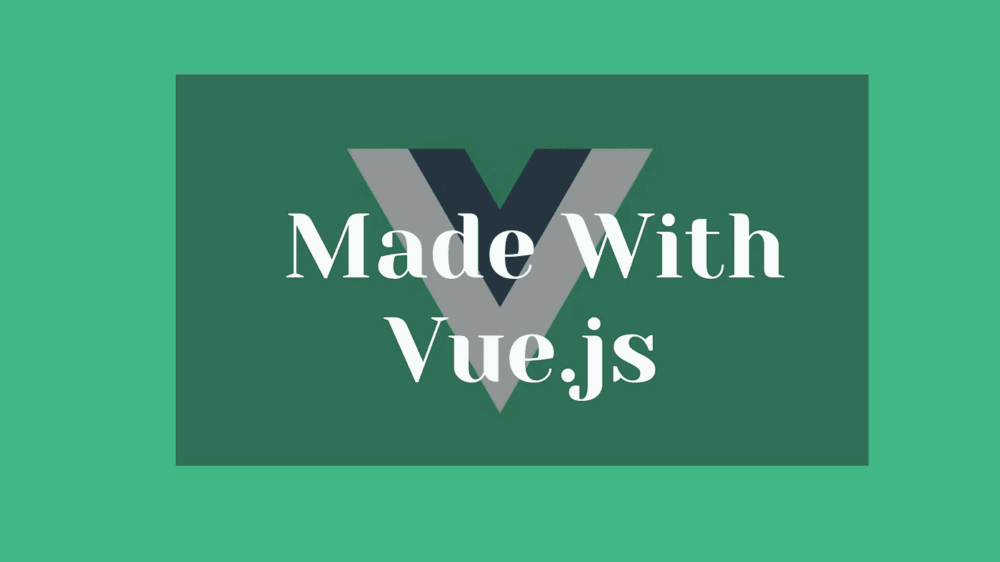
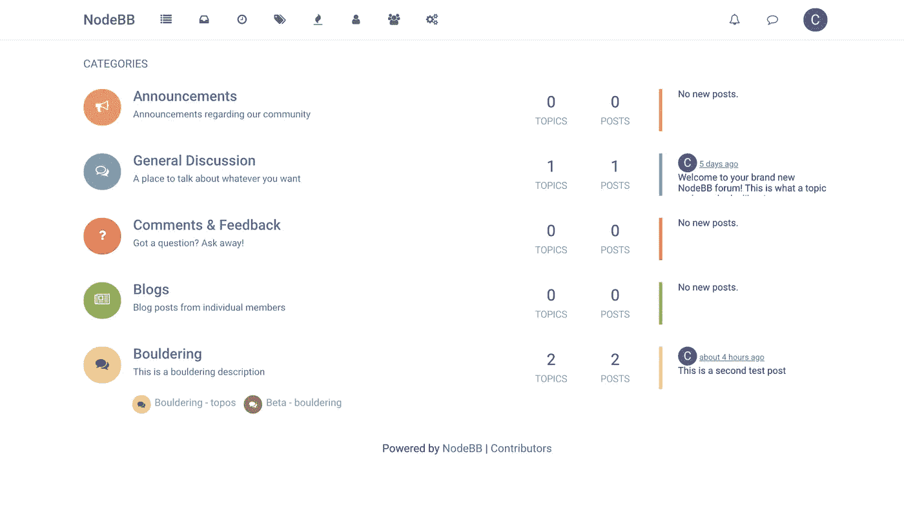

# 为了掌握 Vue.js，您应该构建 5 个非常棒的中级项目

> 原文：<https://javascript.plainenglish.io/5-awesome-intermediate-projects-you-should-build-to-master-vue-js-519a1d11018?source=collection_archive---------4----------------------->

## 通过构建这些项目来提升你的 Vue.js 技能

Image by [John Philip](https://medium.com/u/c2cdb19c0977?source=post_page-----519a1d11018--------------------------------)

构建项目是掌握给定工具的细节的最好方法之一。掌握 Vue.js 也没什么不同。虽然 Vue.js 有一个相当简单的学习曲线，但它需要时间来掌握这个惊人的前端框架的基础和工作。

当你想更深入地理解给定的技术时，超越基础是关键。这篇文章强调并策划了一些令人惊奇的项目，你可以构建这些项目来更好地理解 Vue.js。

在这篇文章中，你将看到一些你可以构建的中间项目来引导你理解这个工具的一些惊人的功能。我也把给定的项目链接到一些相关的课程来帮助指导你。

## **1。论坛申请**

Image by [Sam Williams](https://medium.com/u/d0f2a4eac469?source=post_page-----519a1d11018--------------------------------)

这种应用和其他论坛或者课程平台很像。伴随着大量的功能和组件，你会学到更多 Vue.js 的基础知识之外的东西。

你将学到什么

**基本面**

*   使用 Vuex 的 Vue CLI、路由器和状态管理
*   权限和受保护的路线
*   第三方认证
*   实时数据库和云功能
*   部署
*   应用程序架构和最佳实践

**高级话题**

*   创建 Vue 插件
*   代码拆分
*   对旧浏览器的支持
*   搜索引擎优化和预渲染
*   扩展 Vuejs 应用的性能

-使用 RxJS 进行反应式编程

可以去看看这个课程 [***Vuejs 大师班。***](https://vueschool.io/courses/the-vuejs-master-class)

## **2。作品集博客网站**

Design by Shuvo

拥有一个投资组合是非常有益的。作品集是展示你的技能和展示你一直在构建的酷项目的好方法。如今，一份好的投资组合就像你的在线简历。建立你的投资组合是一个学习新事物的好方法，同时建立对你自己有很多好处的东西。

你可以更进一步，把你的作品集放在一起，建立一个博客版块。有许多惊人的 Vue.js 资源可以帮助你建立惊人的投资组合。从 NuxtJS，Vue Press，Gridsome，Nuxt-content 仅仅是你可以用来充实你的博客的一些神奇的 Vue.js 工具。

**你将学到什么**

*   从用户界面/UX 的角度构建
*   响应性
*   将自己标榜为开发人员

**你能包括什么**

*   行动号召(雇用我，获取报价)
*   成就/奖励/认可。
*   博客版块
*   链接到您的社交网站

如果你被卡住了，你可以在这里 查看一些惊人的 Vuejs 组合资源 [***。***](https://vuejsexamples.com/6-best-vue-portfolio-templates-for-developers/)

## **3。聊天应用程序**

Photo by hackernoon.com

一个很实用的聊天应用。今天，我们在网络平台上花费了大量的时间，有时我们通过聊天信息平台分享我们的想法。构建这样一个应用程序对于理解事物是如何工作的非常实用。

这个聊天应用程序还可以让你了解一些网络套接字如何在用户之间提供无缝交互。

**你将学到什么**

*   WebSockets & Socket.io
*   跨平台支持 Android、iOS、Mac、Windows 和 web
*   文本、照片、视频和音频消息共享。
*   使用内置相机应用程序分享照片
*   端到端加密(E2EE)

你可以利用 Vue.js 上的这个免费的[***freeCodeCamp***](https://www.youtube.com/watch?v=ifOzAyR1cG4)教程来学习和构建这样一个项目。

## **4。网站克隆(热门网站克隆)**

Photo by Acodez

克隆一个受欢迎的网站对于理解事物是如何工作的非常有帮助和鼓励。寻找解决方案和方法来实现与网站相关的某些功能也是一项挑战。一些最好的克隆网站可以是 YouTube、网飞、Gmail、Twitter、Instagram 和其他一些受欢迎的网站。

这些流行的网站有很多功能和特性，可以挑战你成为一个更好的开发者。

**你将学到什么**

*   贯彻他人的设计思想
*   寻找解决各种问题的方法
*   实现功能

建立一个网站克隆也是一个挑战自己的好方法，在原有网站中植入相同的功能。

## **5。电子商务网站**

Photo by [Nataliya Vaitkevich](https://www.pexels.com/@n-voitkevich?utm_content=attributionCopyText&utm_medium=referral&utm_source=pexels) from [Pexels](https://www.pexels.com/photo/white-iphone-5-with-green-case-8939516/?utm_content=attributionCopyText&utm_medium=referral&utm_source=pexels)

电子商务不断发展，如今它正在窥视在线空间。建立一个电子商务网站将包括有一个购物车与各种产品的电子商务网站，用户可以产品的购物车，并删除到购物车。

**你将学到什么**

*   认证/授权
*   支付集成
*   状态管理

你可以看看他的教程，为你提供一个建立 [***电子商务网站***](https://www.youtube.com/watch?v=oWt4jYThJCo) 的指南。

## **结论**

构建这些应用程序对于理解 Vuejs 如何在幕后工作以及其他与之相关的复杂主题非常方便。

我们可以构建一些应用程序来掌握 Vue.js，这些应用程序包括:

*   论坛应用
*   作品集博客网站
*   聊天应用程序
*   热门网站克隆
*   电子商务网站

## **更读**

 [## 如何构建一个普通的 JavaScript 架子鼓

### 了解如何使用普通 JavaScript 创建架子鼓

javascript.plainenglish.io](/how-to-build-a-vanilla-javascript-drum-kit-23cab75b1ebc)  [## 如何优化你的网站速度

### 加速您的网站以提高性能并实施最佳实践

javascript.plainenglish.io](/how-to-optimize-your-website-for-speed-96b6b42857ed) 

*更多内容看*[***plain English . io***](http://plainenglish.io/)