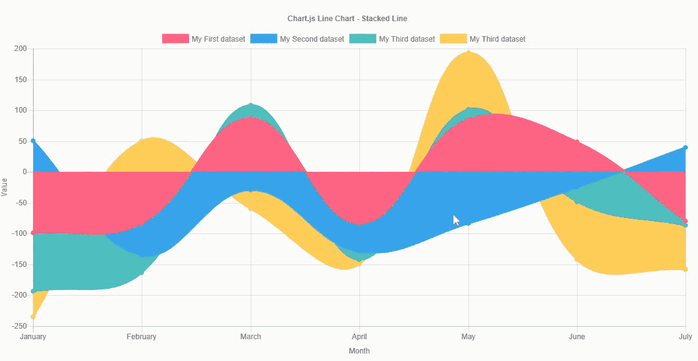
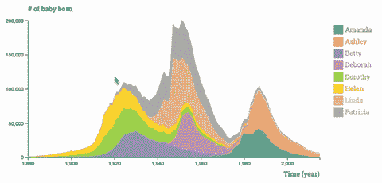
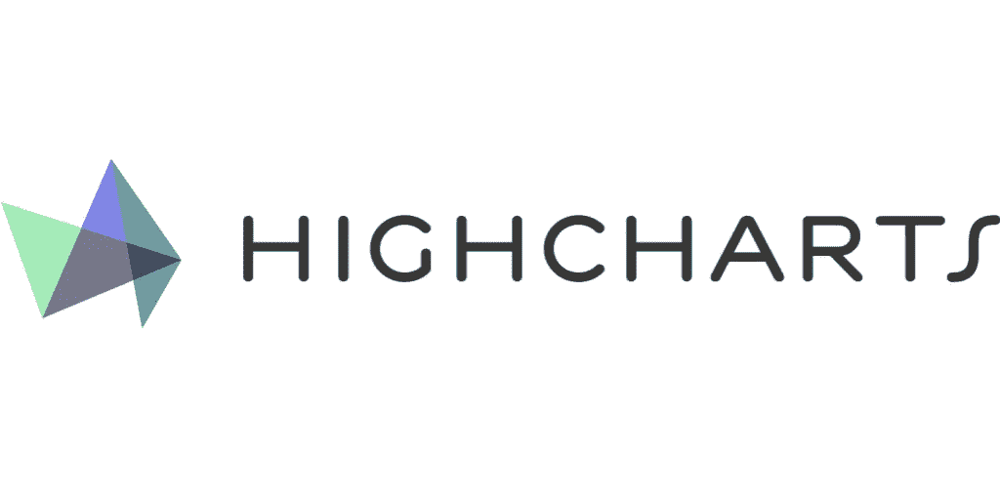
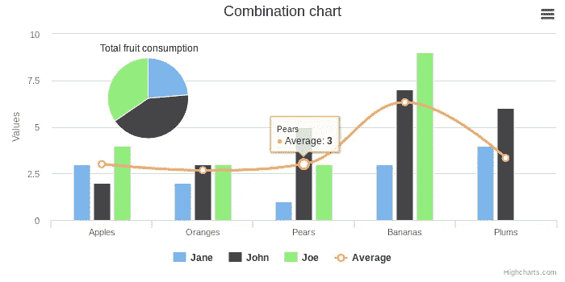
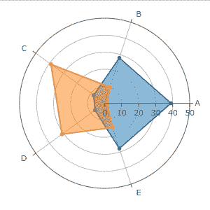

# 用于数据可视化的 5 个超棒的 JavaScript 库

> 原文：<https://javascript.plainenglish.io/5-awesome-javascript-libraries-for-data-visualization-837aea38c574?source=collection_archive---------11----------------------->


Photo by [Luke Chesser](https://unsplash.com/@lukechesser?utm_source=medium&utm_medium=referral) on [Unsplash](https://unsplash.com?utm_source=medium&utm_medium=referral)

如今，我们创建的几乎每个应用程序都需要或使用数据来改进提供给用户的功能。有时，我们能提供给用户的最令人惊奇的东西是数据本身，尤其是当它以一种美观的方式呈现时。然而，解释表格和数字图表总是令人疲惫不堪，手工制作它们既费时又愚蠢。

数据可视化来拯救我们了。它可以是一门艺术，也可以是一门科学。但是互联网上有无数免费的图书馆，找到合适的图书馆是很困难的。

为了帮助您开始并轻松地将漂亮的数据可视化添加到您的应用程序中，我们整理了一系列优秀的、易于使用的图表库，它们体现了这些元素的完美平衡，而不会太笨拙或太困难。

# C3。JS:


简单而灵活的 JavaScript 图表对于设计人员和开发人员来说，使用 Chart.js 很容易上手。所需要的只是页面中包含的脚本以及呈现图表的单个

<canvas>节点。</canvas>

```
<canvas id="myChart"></canvas>
```

现在我们有了可以使用的画布，我们需要在页面上包含 Chart.js。

```
<script src="https://cdn.jsdelivr.net/npm/chart.js@2.8.0"></script>
```

Chart.js 的学习曲线非常简单，不同的动画选项是它的最佳特性之一，任何开发人员都可以通过多种方式来实现这一要求，而且它对各种屏幕尺寸和媒体要求的兼容性也非常好。



# D3js:


D3 帮助您使用 HTML、SVG 和 CSS 将数据变得生动。D3 对 web 标准的重视使您可以获得现代浏览器的全部功能，而无需将自己束缚于专有框架，将强大的可视化组件和数据驱动的 DOM 操作方法结合起来。

要直接链接到最新版本，请复制以下代码片段:

```
<script src="https://d3js.org/d3.v6.min.js"></script>
```

D3 为通过 JavaScript 创建数据的可视化和图表提供了很好的功能。它还能很好地与基于它的其他包装器如 C3 和 NVDA 一起工作。



# 高图表:



Highcharts JS 是一个基于 SVG 的 JavaScript 图表库，支持面向旧浏览器的 VML 和 canvas，使开发人员可以轻松地向任何规模的 web 和移动项目添加交互式图表。

如下所示，在您的 web 页面的`<head>`部分包含 JavaScript 文件。

```
<script src="https://code.highcharts.com/highcharts.js"></script>
```

Highcharts API 非常灵活，基于精心设计的完全可定制的设置，可以调整图表的细节。它还支持响应式设计，这意味着您可以定义屏幕尺寸特定的配置，它将负责它在不同设备上的外观。由于它的官方 highcharts-angular 包装器，它可以与 Angular 集成。



# Plotly-js:


普洛特利。JS 交互式图表很棒，这些图表很漂亮，使用 Dash Bootstrap 组件使得设计用户界面变得非常容易。不用学习 JavaScript 和 React 是不可思议的。

要使用它，请将下载的脚本包含在 HTML 文档中的标签的末尾之前:

```
<head>
	<script src="plotly-latest.min.js"></script>
</head>
```

它很有意义，看起来很棒，使用起来很有趣，而且你还拥有开源的所有特性。



图表制作者:


图表专家。Js 是一个图表库。它提供了基于媒体查询、简单响应图表的简单配置覆盖机制。

启动和运行的最快方法是使用 Chartist.js CSS 文件。CSS 从 Sass 文件编译而来，默认的类名也在 JavaScript 库中配置。然后，您可以覆盖默认样式或修改 CSS 文件。

```
<**head**> <**link** rel=”stylesheet” href=”bower_components/chartist/dist/chartist.min.css”> </**head**> <**body>** <! — Site content goes here ! → <**script** src=”bower_components/chartist/dist/chartist.min.js”></**script**> </**body**>
```

这个图书馆很轻，很容易建立。它没有任何其他依赖，这使得它非常容易配置和使用。它的开源和文档可读性很强，对任何开始定制它的人来说都很清楚。最重要的是，它利用了 SVG，使得图表对象像 DOM 对象一样方便。您可以使用 DOM 钩子按照自己的方式设计它。它提供了基本的图表。

*这篇文章发表在普通编码员上。*