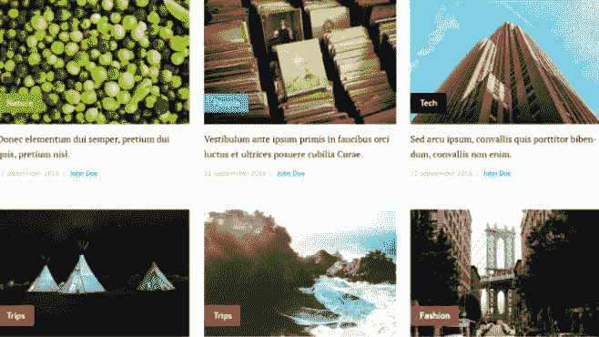

# 每个全栈开发人员都应该构建的 5 个令人敬畏的项目

> 原文：<https://javascript.plainenglish.io/5-awesome-projects-every-full-stack-developer-should-build-d50ff91d1654?source=collection_archive---------1----------------------->

## 激动人心的全栈项目，提高您的编码技能。

Photo by [Mohammad Rahmani](https://unsplash.com/@afgprogrammer?utm_source=medium&utm_medium=referral) on [Unsplash](https://unsplash.com?utm_source=medium&utm_medium=referral)

构建项目始终是提高技能、实践知识和成为优秀开发人员的最佳方式。你看多少教程，读多少书，听多少播客都没关系。不去实践，不去建设项目，永远不会有进步。

这也是逃离教程地狱的好方法。构建牛逼项目的过程可以让你不用一直看教程。这对你的投资组合也很重要。拥有令人敬畏的项目能给你带来机会，帮助你的职业生涯更上一层楼。

在本文中，我将为您提供一些作为开发人员可以构建的全栈项目列表。所以让我们开始吧。

# 1.电子商务网站

如今，许多企业和企业家正在转向电子商务世界。如今，拥有创建强大的高转化率电子商务网站的技能和能力是非常重要的。

Photo by [Igor Miske](https://unsplash.com/@igormiske?utm_source=medium&utm_medium=referral) on [Unsplash](https://unsplash.com?utm_source=medium&utm_medium=referral)

通过建立一个电子商务网站，你会学到很多东西。如果你想掌握全栈 web 开发，这是一个很好的项目。该项目不必复杂，只是一个简单的网站，用户可以浏览不同类别的不同产品。您还必须添加一个购物车系统，以便用户可以将产品添加到购物车并购买它们。除此之外，您还需要添加一些功能。

# 2.博客网站

这也是一个很好的项目，你可以添加到你的投资组合。如今，每个网站都需要一个博客。作为一名全栈开发人员，知道如何构建是一项技能。

Capture by the author.

该网站应该有一个主页，一个帖子页，和一个联系页面。您可以使用 CSS grid 为您的博客文章创建网格布局。因此，用户将看到您发布的博客文章，并单击每一篇文章转到博客文章的内容页面。

对于这种类型的项目，有许多技术可以选择。选择一个你熟悉的适合你需求的就行了。

# 3.聊天应用程序

这是大家都在谈论的全栈项目之一。这是一个很好的项目，可以让你作为一个全栈开发者学到很多技能。

Photo by [Rami Al-zayat](https://unsplash.com/@rami_alzayat?utm_source=medium&utm_medium=referral) on [Unsplash](https://unsplash.com?utm_source=medium&utm_medium=referral)

您可以创建一个好看的聊天 web 应用程序，用户可以在这个应用程序中实时地私下聊天。用户也应该需要有能力创建一个帐户和聊天组。

这个项目可以让你学到很多东西，比如实时数据传输、认证、安全等等。同样，您可以使用任何您想要的技术堆栈。现在流行的是 Mern stack，但是如果你熟悉的话，你也可以使用 React 和 Firevbase+firestore。

# 4.缩放克隆

2020 年，因为封锁，大家都开始用 Zoom 了。这是目前流行的视频会议应用程序。

Photo by [Chris Montgomery](https://unsplash.com/@cwmonty?utm_source=medium&utm_medium=referral) on [Unsplash](https://unsplash.com?utm_source=medium&utm_medium=referral)

如你所见，你还可以创建一个缩放克隆，允许用户使用他们的麦克风和网络摄像头进行实时群组交流。这是一个很好的项目，可以帮助你提高初学者的水平。对于这种类型的项目，最受欢迎的科技公司是 Socket.io/WebRTC。

# 5.社交媒体应用

如今，每个人都在使用至少一个社交媒体网络应用。如果想掌握全栈开发，这也是非常推荐的项目。这里的挑战是创建一个社交媒体应用程序(web 或移动)，用户可以在其中创建一个帐户，并与使用该应用程序的其他用户进行互动。

Photo by [Timothy Hales Bennett](https://unsplash.com/@timothyhalesbennett?utm_source=medium&utm_medium=referral) on [Unsplash](https://unsplash.com?utm_source=medium&utm_medium=referral)

用户应该能够发布帖子和评论，搜索和添加朋友，并与其他用户聊天。如果你愿意，还可以添加一些额外的功能。因此，通过建立这个项目，你将学到很多东西，如应用程序的性能，安全性，UX，等等。您还可以选择自己熟悉的任何技术组合来满足需求。

# 结论

正如您在上面的列表中所看到的，如果您想掌握全栈开发，可以构建一些有用且受欢迎的项目。通过构建这些，我保证作为一名开发人员，你会学到很多东西并提高你的编码技能。因为俗话说，熟能生巧。

感谢您阅读这篇文章。希望你觉得有用。

**延伸阅读:**

 [## 7 个有用的 CSS 备忘单来提高你的技能

### 一个很棒的 CSS 备忘单列表，你可以作为一个 web 开发者使用。

javascript.plainenglish.io](/7-useful-css-cheat-sheets-to-improve-your-skills-66d7d3a7cc8)  [## 10 个令人敬畏的前端开发工具来提高您的生产力

### 你可能需要用到的有用的前端开发工具。

javascript.plainenglish.io](/10-awesome-front-end-development-tools-to-boost-your-productivity-b1d2efc4c4ba) 

*更多内容尽在*[***plain English . io***](http://plainenglish.io)