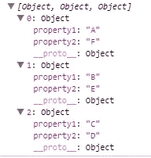
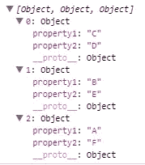

# JavaScript 中排序对象数组的 5 种基本方法

> 原文：<https://javascript.plainenglish.io/5-basic-methods-to-sort-an-array-of-objects-in-javascript-cc65321291af?source=collection_archive---------9----------------------->

## JavaScript 备忘单 2021

## 如何按属性对对象数组进行排序？


Photo by [Kelly Sikkema](https://unsplash.com/@kellysikkema?utm_source=medium&utm_medium=referral) on [Unsplash](https://unsplash.com?utm_source=medium&utm_medium=referral)

作为一名开发人员，很难记住语法、方法和其他东西。当你工作或编码时，手边有一个列表是很好的。

出于这个原因，我想出了一些在需要时可以派上用场的文章(这样你就可以保存它们)。

今天，我们将讨论对数组中的项目进行排序的不同方法。

# 1.创建方法

我们可以创建一个比较值的函数，并根据传递给它的属性提供排序结果。

```
function sortFunction(property) {
    var sortOrder = 1;
    return function(a, b) {
        var result =
            a[property] < b[property] ? -1 : a[property] > b[property] ? 1 : 0;
        return result * sortOrder;
    };
}//datavar data = [{
        property1: 'A',
        property2: 'F'
    },
    {
        property1: 'B',
        property2: 'E'
    },
    {
        property1: 'C',
        property2: 'D'
    }
];
```

让我们测试一下这个函数，

```
data.sort(sortFunction('property1'));console.log(data);
```

它会给出这样的输出，



不同的房产也一样，

```
data.sort(sortFunction('property2'));console.log(data);
```



# 2.本地比较

其中一个一行程序可以完成类似上面的功能。

```
data.sort((a, b) => a.property1.localeCompare(b.property2));
console.log(data);
```

# 3.排序功能

```
data.sort((a, b) =>
    a.property2 < b.property2 ? -1 :
    Number(a.property2 > b.property2)
);console.log(data);
```

# 4.下划线库

```
var ndata = _.sortBy( data, 'property2' );
```

# 5.洛达什图书馆

```
const ndata= _.sortBy(data, 'property2');
```

如果我们有嵌套的对象呢？

```
const data = [{
        data: {
            key1: 'abc',
            age: 48
        }
    },
    {
        data: {
            key1: 'bvc',
            age: 36
        }
    },
    {
        data: {
            key1: 'wer'
        }
    },
    {
        data: {
            key1: 'ber',
            age: 32
        }
    }
];const test= _.sortBy(data, ['data.age']);
console.log(test);
```

反过来也可以这样做

```
const test = _.reverse(_.sortBy(data, ['data.age']));
```

**参考文献**

[](https://stackoverflow.com/questions/1129216/sort-array-of-objects-by-string-property-value) [## 按字符串属性值对对象数组排序

### 由于您可能会遇到像这个数组这样更复杂的数据结构，我将扩展这个解决方案。更多…

stackoverflow.com](https://stackoverflow.com/questions/1129216/sort-array-of-objects-by-string-property-value) 

# 你可以看看我以前的文章

*更多内容尽在*[*plain English . io*](http://plainenglish.io/)