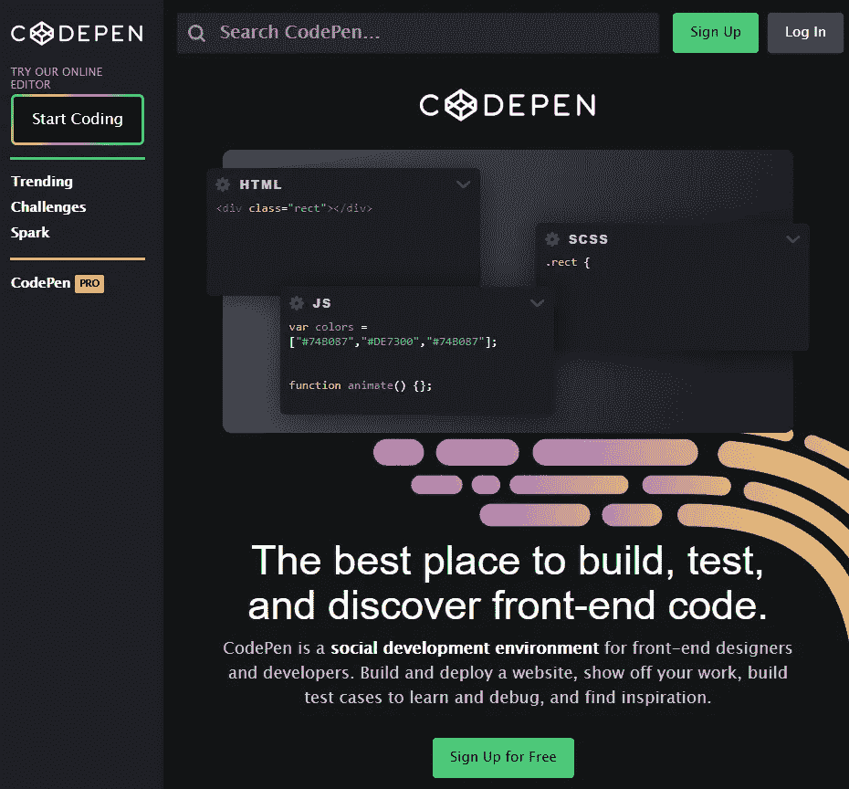
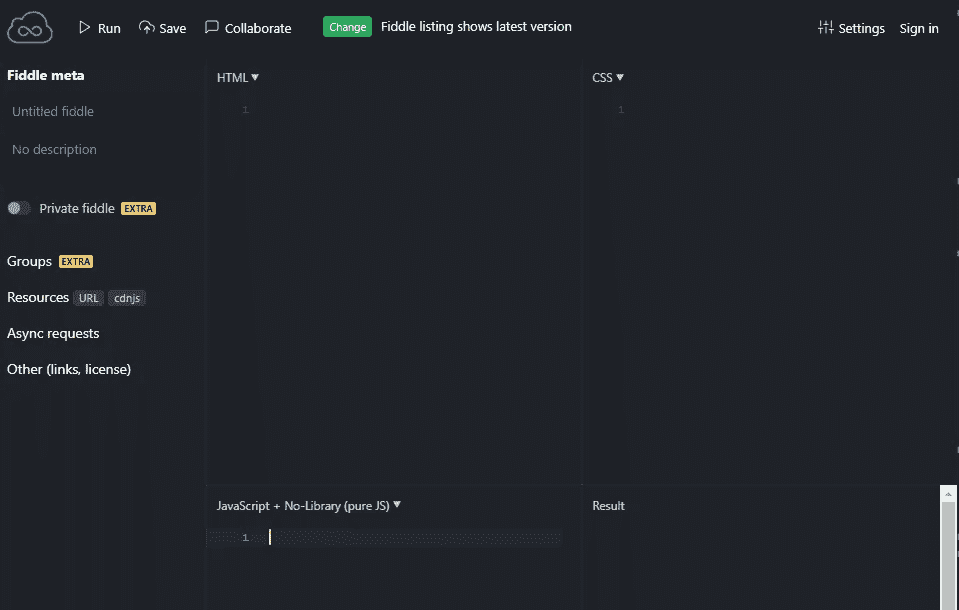
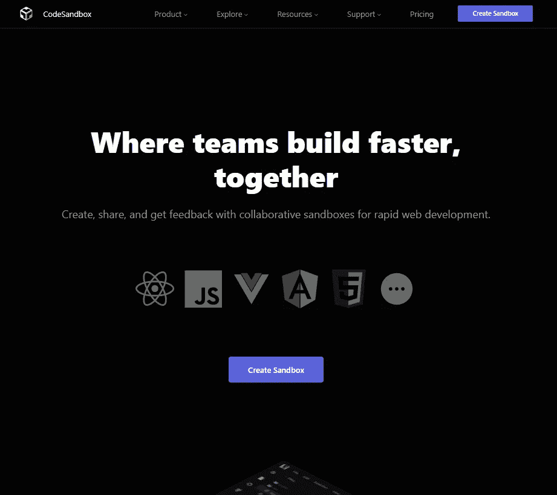
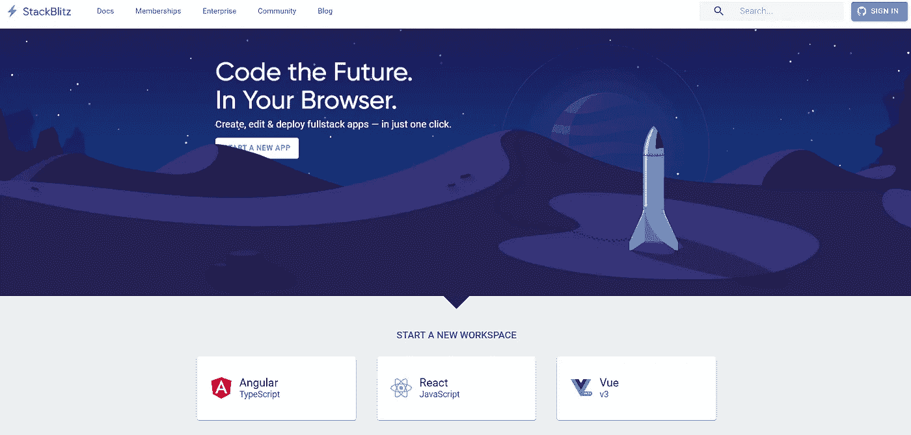

# 4 个最好的免费在线代码编辑器

> 原文：<https://javascript.plainenglish.io/5-best-free-ides-on-the-internet-b5602d41bf68?source=collection_archive---------8----------------------->

## 无需进一步安装即可在线编码、测试和共享

By [FAM](http://www.fam-front.com)

免费的在线 ide 对我们开发者来说只是一种祝福。对于新的初级开发人员，这可能不是推理，因为您可能已经在使用它们了。但是对于老开发者来说，我们不得不在一段时间内用老方法生活。

在我们购买 IDE 或安装市场上的免费 IDE 之前，让我来告诉你吧。我们根据将要使用的技术来安装和配置编辑器。我们对具有不同配置和技术的其他应用程序重复这一步骤。我们花时间配置东西，而不是实际编写应用程序。你不会马上看出区别。你需要保存并刷新浏览器——真是浪费时间。

现在仍然是这种情况，但在为一个任务或客户项目工作几个月时，这是正常的。现代的在线编码方式对好奇的人来说是一个真正的促进，他们渴望知识和发现新的技术，而不用花费精力和时间在配置和安装等次要的事情上。

我希望你会喜欢并聪明地使用这 5 个最好的免费在线软件 ***。***

准备好了，我们走！

# 1.Codepen.io

 [## 密码笔

### 一个在线代码编辑器、学习环境和社区，用于使用 HTML、CSS 和 JavaScript 的前端 web 开发…

codepen.io](https://codepen.io/) 

**CodePen** 是一个面向前端设计师和开发者的社交开发环境。构建和部署网站，展示您的工作，构建测试案例以供学习，并与他人分享。

**用于:**

*   创建名为`'Pens'`的代码片段
*   专注于 HTML、CSS 和 JavaScript 的代码和展示

codepen.io

# 2.Jsfiddle.net

 [## JSFiddle

### 使用 JSFiddle 代码编辑器在线测试您的 JavaScript、CSS、HTML 或 CoffeeScript。

jsfiddle.net](https://jsfiddle.net/) 

**JsFiddle** 这么受欢迎。我认为它是在 StackOverflow 上显示解决方案最常用的 IDE。

**用于:**

*   快速展示和测试 HTML、CSS 和 JavaScript 代码。
*   获取 HTML、CSS 和 JS 代码片段。

JsFiddle.net

# 3.Codesandbox.io

 [## CodeSandbox:用于快速 Web 开发的在线代码编辑器和 IDE

### 无需设置超快速多人游戏更新实时共享沙盒无需设置-使用模板启动新项目…

codesandbox.io](https://codesandbox.io/) 

Codesandbox 是一个免费的在线编辑器，用于快速的网络开发。这个 IDE 太强大了。你可以快速制作原型，尝试一些解决方案，并与客户分享你的建议。

**使用它在桌面或任何其他设备上创建以下内容:**

*   静态网站
*   全栈 web 应用
*   角分量、反作用分量、Vue 分量…等等。

codesandbox.io

# 4.Stackblitz.com

 [## web 应用程序的在线代码编辑器。由 Visual Studio 代码提供支持。-斯塔克布里兹

### 编辑描述

stackblitz.com](https://stackblitz.com/) 

Stackblitz 是一个免费的在线 IDE。帮助您创建、编辑和部署全栈应用。启动新应用和新工作空间。

**用它来:**

*   创建静态网站(HTML，CSS)
*   利用当今的技术(Angular、React、Vue 等)创建动态全栈应用。)
*   与他人快速共享您的应用。
*   使用特定技术(如 Typescript、Angular、React workspace 和其他技术)创建自定义工作空间。

Stackblitz.com

# 结论

就是这个！每个人都有自己的喜好，所以一个一个去发现，选择那个让你成为更好的开发者。我希望这是清楚和有用的。*我希望你和你的家人无论在哪里都平安无事！坚持住。明天会更好！*

谢谢你，❤

**让我们在** [**中**](https://medium.com/@famzil/) **，**[**Linkedin**](https://www.linkedin.com/in/fatima-amzil-9031ba95/)**，** [**脸书**](https://www.facebook.com/The-Front-End-World) **，**[**insta gram**](https://www.instagram.com/the_frontend_world/)**，或者**[**Twitter**](https://twitter.com/FatimaAMZIL9)**。**

***更多内容请看*[***plain English . io***](http://plainenglish.io)**