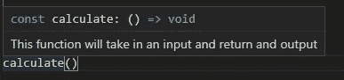

# 让您的代码更上一层楼的 5 个最佳实践

> 原文：<https://javascript.plainenglish.io/5-best-practices-to-take-your-code-to-the-next-level-2abfb0c43925?source=collection_archive---------19----------------------->

让我们面对现实吧，我们都写了一些质量不高的代码。是时候解决这个问题了，因为干净的代码对您和您的同事都有帮助。让我们直接进入您应该知道的最佳实践！

Photo by [Artem Podrez](https://www.pexels.com/@artempodrez?utm_content=attributionCopyText&utm_medium=referral&utm_source=pexels) from [Pexels](https://www.pexels.com/photo/cheerful-woman-having-video-call-via-laptop-4492135/?utm_content=attributionCopyText&utm_medium=referral&utm_source=pexels)

# 🤷‍♂️好变量命名

好吧，这个应该在你的单子上。变量和函数的名称应该尽可能清晰。这样，任何阅读您的代码的人都知道正在发生什么。看看下面的例子，看看你更喜欢哪个。

# 🚀快速失败

快速失败最佳实践是一个有趣的实践。

根据维基百科，

> 在系统设计中，**故障快速**系统是指在其接口处立即报告任何可能指示故障的情况的系统。

简而言之，这意味着如果你知道它会失败，你应该尽快退出你的功能。让我们看看这个社交媒体应用程序的伪代码示例。

在我们的示例中，我们将尝试向数据库中添加一篇帖子。看看这个例子，我们能改进什么？

看不出有什么不对吗？好吧，假设有人设法在请求正文中没有内容的情况下获得了一个请求。在这种情况下，我们会对我们的数据库做一个不必要的调用，因为我们得到了用户，即使我们知道我们不能发表文章。

如果我们使用故障快速原理重写这条路径，它将如下所示。

我们要做的第一件事是检查我们需要的数据是否都存在。如果请求中没有所有数据，我们可以快速失败，为其他请求打开资源。

# 💬清晰的评论

不要误解我的意思，到处发表评论没有错。
如果你刚刚创建的函数需要 5 行以上的注释，也许是时候重写这个函数了。

*   不要过度描述，你的同事也有阅读代码的能力
*   不要多余，解释一次

## 文档字符串非常酷

听说过文档串吗？这是大多数编程语言的一项功能，它为您提供了编写 IDEs 可以提取的注释的能力。这样，集成开发环境可以为函数的用户提供更多的信息。

在 JavaScript 中，文档字符串如下所示:

并在编辑器中给出以下结果:

# 🔧SRP，单一责任原则

> 单一责任原则(SRP)是一种计算机编程原则，它规定计算机程序中的每个模块、类或函数都应该对该程序功能的单个部分负责，并且应该封装该部分。

永远不要让一个函数做任何事情。想想看，这在过去曾经成功过吗？可能不会，它会创建大量的代码块，没人能理解。

一个实际的物理工具也可以做一件事。锤子是锤钉子的好工具，但是如果你需要在螺丝上钻孔，你可能需要另一个工具。

你写的函数应该遵循同样的原则，它们应该做一件事，而且只做一件事！让我们来看看这个简单的例子，看看如何构建一个程序，它接受像`6–4`这样的字符串并返回结果。

通过将我们的功能分解成不同的功能，我们不仅使代码更具可读性，还增加了可重用性。如果我们想给我们的程序添加一个新的功能，需要使用`parse_input()`中的代码，我们可以直接使用这个功能，而不用重复代码。

# 🧐不要害怕使用变量

链接函数和避免变量可能会让你看起来像一个专家，但对于其他任何人来说都是一种痛苦。

看看这个例子，你希望在你的代码库中遇到哪一个？

在我看来，这 5 个最佳实践是最重要的！让我知道哪个是你最喜欢的，哪个是我错过的。😉

有创业的一天！💜

*更多内容尽在*[***plain English . io***](http://plainenglish.io/)