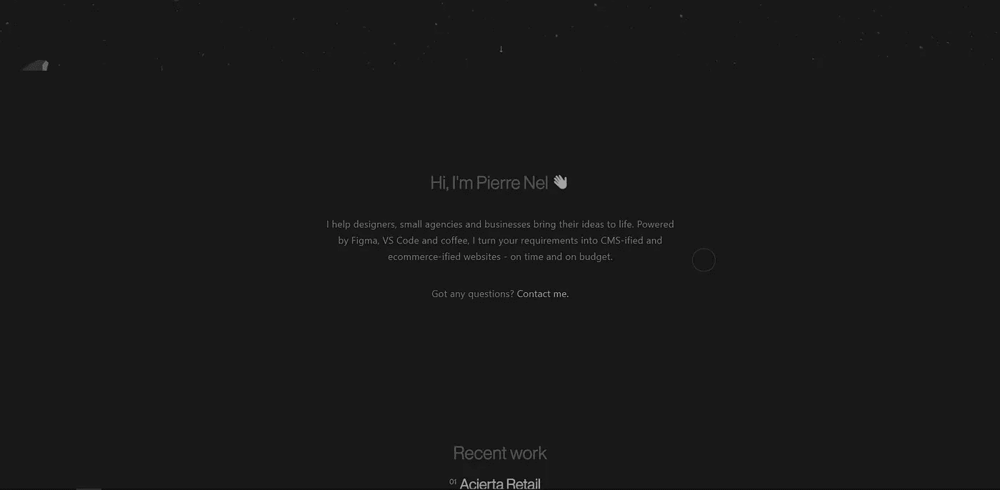

# 启发你下一个网站的 5 个博客组合

> 原文：<https://javascript.plainenglish.io/5-blog-portfolios-to-inspire-your-next-website-1a4129324262?source=collection_archive---------17----------------------->

## 你正在努力建立你的网站组合吗？使用这些网站来激发你的下一个网站组合。

Photo by [Scott Graham](https://unsplash.com/@homajob?utm_source=medium&utm_medium=referral) on [Unsplash](https://unsplash.com?utm_source=medium&utm_medium=referral)

获得一个完美的博客作品集总是一件痛苦的事情。即使是制作精良的投资组合中的佼佼者，在开发人员中也会有不同的意见。

通常，你将不得不开发和重塑你的投资组合。这证实了拥有一个完美制作的投资组合总是不真实的，因为你总是不得不反复改变它。

这篇文章不是为了给你提供最好的投资组合，但是它可以给你一些建议，帮助你敲开外壳，打造一个好的投资组合。

我已经从每个作品集里收集了一些建议，并整合到你的下一个网站作品集里。

我访问了许多作品集博客网站，其中一些吸引了我的眼球，也许它们也会吸引你。

这些组合博客站点的开发和设计确保了标准技术在具有完美 UI/UX 的 web 开发中的示范性实现和用例。

## **1。Julian.com**

Julian.com

这个网站组合充分利用了最新的网络技术，制作完美，甚至适用于移动设备；该设计适合每一个现代网页设计实践。

## 关键要点

*   字体、颜色和图像/图标的使用
*   单词内容
*   可读性
*   明暗模式特征
*   UI/UX

该网站由 Webflow 构建，设计独特。

博客部分非常完美，用词生动，有很好的指导方针。

如果您想查看网站，您可以通过此链接访问 julian.com[。](/julian.com)

## **2。Oliur.com**

Oliur.com

这个由 Oliur 设计的网站简洁明了。该网站很优雅，大量使用了空白，完美地使用了颜色和图像。

**关键要点**

*   颜色、图像和字体的使用
*   空白的使用
*   简单、简约的设计
*   可读性
*   黑暗和光明模式特征

该网站已经实现了黑白颜色的完美使用。另一方面，简单的动画和空白给了网站一个辉煌的外观。

你可以在这里访问作品集网站博客[**https://oliur.com/blog/.**](https://oliur.com/blog/)

## **3。奥拉卢。开发**

Olaolu.dev

这个组合网站是独一无二的，实现了流畅的动画和良好的像素使用。

该网站很好地利用了网页字体和完美的颜色组合。

**关键要点**

*   颜色、图像和字体的使用
*   可读性
*   流畅的动画
*   空白的使用
*   单词内容

这个网站是和 Gatsby 一起开发的，是一个优秀的作品集博客网站。

您可以访问投资组合网站博客这里[**https://olaolu.dev/shelf/.**](https://olaolu.dev/shelf/)

**4。Marc.dev**

Marc.dev

这个网站组合是由马克巴克斯。这个网站组合是用 Nuxt 开发的，Nuxt 是一个 Vue.js 框架。

**关键要点**

*   颜色的使用
*   使用的单词内容
*   使用的样式和动画
*   可读性
*   黑暗和光明模式特征

我最喜欢这个作品集网站的一点是博客部分制作得非常精巧。此外，冒着听起来有偏见的危险，这个网站的黑暗模式几乎接近完美，冷暗的颜色不会给眼睛带来太大的压力。

如果你想查看这个投资组合网站，请使用下面的链接[**https://marc.dev/blog**](https://marc.dev/blog)

## **5。Pierre.io**

Perre.io

Pierre 的这个网站是一个简约的作品集网站。这个网站已经实现了深色和主题的使用，带来了优雅和惊人的外观。

**关键要点**

*   颜色和字体的使用
*   空白的使用
*   简单、简约的设计
*   可读性
*   黑暗模式特征

您可以通过此链接访问网站[**https://pierre.io/**](https://pierre.io/)

## **结论**

感谢您阅读本文到目前为止；如果你觉得这篇文章有趣，请在评论区告诉我并分享。

你也可以评论你感兴趣并推荐的作品集博客网站。

## **更多阅读:**

 [## 用这些 GitHub 库赢得技术面试

### 利用这些存储库来赢得您接下来的技术和编码面试

javascript.plainenglish.io](/ace-your-technical-interviews-with-these-github-repositories-65a426b599a8) 

*更多内容请看*[*plain English . io*](http://plainenglish.io/)