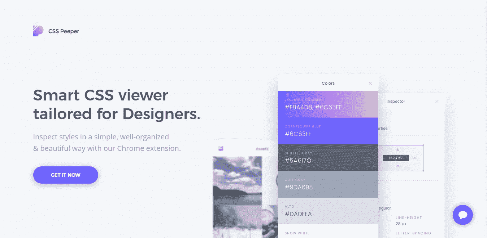
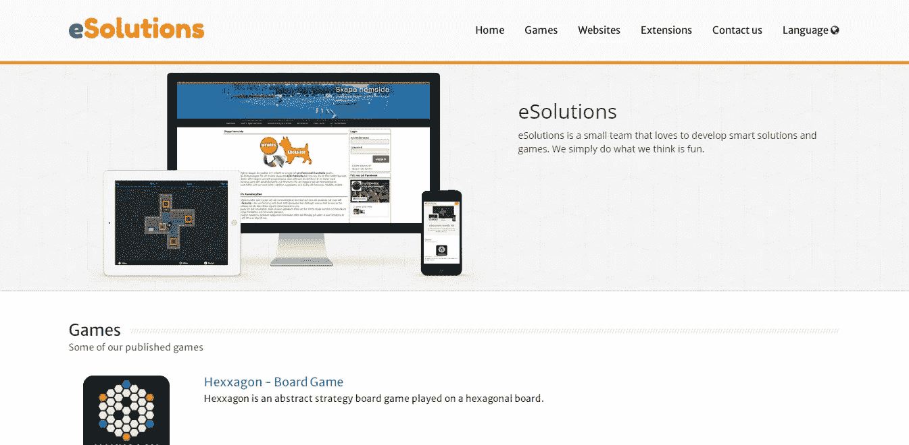
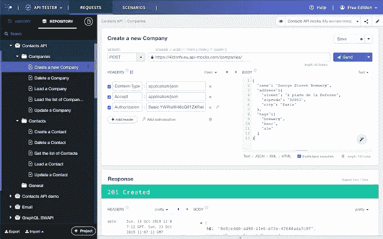
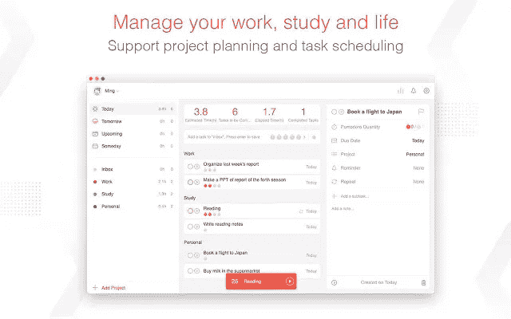
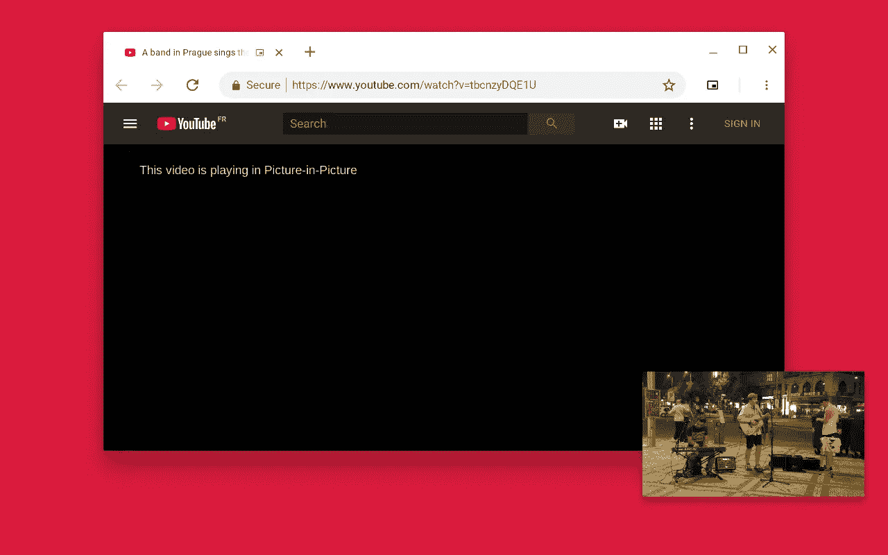

# 5 个 Chrome 扩展来加速你的开发

> 原文：<https://javascript.plainenglish.io/5-chrome-extensions-to-speed-up-your-development-70350aaf2e3?source=collection_archive---------20----------------------->

## 5 个有用的 Chrome 扩展，帮助开发者提高工作效率，完成更多工作。

Photo by [Luca Bravo](https://unsplash.com/@lucabravo?utm_source=medium&utm_medium=referral) on [Unsplash](https://unsplash.com?utm_source=medium&utm_medium=referral)

知道完成工作的正确和最好的工具总是令人兴奋和厌倦的。

作为开发人员，我们需要正确的工具，这些工具不仅能正确地完成工作，还能提高我们的工作效率，帮助我们更好地管理时间。

我们拥有大量的工具和资源，事实证明，对我们大多数人来说，找到合适的工具很困难。

在这篇文章中，我们将看看 chrome 扩展，它们可以加速我们的开发过程，同时提高我们的生产力。

## **1。CSS 窥视者**

CSS Peeper website-screenshot by author

顾名思义，这个工具在分析和调试网站、对象和颜色中的 CSS 样式时非常有用。CSS 很神奇，有很多超能力。对包括我在内的一些人来说，使用它有时会很忙乱。

调试 CSS 甚至更困难，会让你痛苦地抓着自己的头发。CSS peeper 通过我们的 Chrome 扩展，以一种简单、组织良好、美观的方式更容易检查样式。

查看[这里](https://chrome.google.com/webstore/detail/css-peeper/mbnbehikldjhnfehhnaidhjhoofhpehk?hl=en)

## **2。响应式网页设计测试器**

Responsive Web Design Tester — screenshot by author

有没有想过开发之后，你的网站在各种平台和屏幕宽度下会是什么样子？

随着手机和小屏幕的出现，拥有一个响应迅速的网站不仅是必要的，而且对于希望用户拥有最佳移动体验的人来说也是关键。

这个 chrome 扩展可以用来测试你的网站在不同屏幕宽度下的外观。

看看这个扩展[这里](https://chrome.google.com/webstore/detail/responsive-web-design-tes/enhcpefphhaiikpobimgcakinhabgiib?hl=en)

## **3。Talend API 测试器—免费版**

Talend API Tester- screenshot by author

Talend 允许与 REST、SOAT 和 HTTPS API 进行交互。这个 chrome 扩展对开发人员创建后台应用程序和 API 是有益的。

它还提供各种功能，例如发送和检查请求。验证 API 行为也是它提供的功能之一。

主要特点:

*   通过直观易用的 UI 与 REST 或简单的 HTTP APIs 进行交互。
*   查看和搜索您的通话记录。编辑并重新发送历史记录中的请求。
*   将您的请求保存并组织到项目和服务中。
*   使用自定义变量、安全性和身份验证构建动态请求。
*   使用不同的视图(raw，pretty，preview)可视化和检查不同格式(JSON，XML，HTML，images…)的响应
*   用断言验证响应(状态、头、XML 和 JSON 主体、响应时间……)
*   轻松导入您的 Postman 集合、Swagger / OAS / OpenAPI 和 HAR (HTTP Archive)

## **4。聚焦待办事项:番茄定时器&待办事项列表**

Focus To-Do: Pomodoro Timer & To Do List — screenshot by author

Focus To-Do 结合了 Pomodoro 计时器和任务管理，这是一个基于科学的应用程序，它将激励你保持专注并完成任务

这种扩展利用了番茄工作法来提高生产率。

有了扩展，你可以计划你的时间和你想做的事情。它能让你把你的任务分解成更小的可管理的任务，让你做得更少，做得更多。你可以利用短暂的休息，这将确保你更有效率。

点击查看

## **5。画中画扩展(通过谷歌)**

Picture-in-Picture Extension (by Google)

这个扩展是 Google 团队自己开发的。

画中画使您可以在其他窗口上方的浮动窗口中观看视频。有了这个扩展，你可以在做其他事情的同时看一些视频、谈话、会议或者教程。

更像是一举两得。

键盘快捷键:alt+p(MAC OS 上的⌥ + P)

来看看[这里](https://chrome.google.com/webstore/detail/picture-in-picture-extens/hkgfoiooedgoejojocmhlaklaeopbecg)

## **最终想法**

这是 5 个有用的 Chrome 扩展，可以帮助开发者提高工作效率，完成更多工作。

如果你喜欢读这篇文章，并且认为其他人也会喜欢，不要犹豫，分享出来。

如果你觉得我漏掉了一个，请不要犹豫，评论出来。

## **更多阅读内容**

 [## 作为一名开发人员，我在构建投资组合时学到了什么

### 你也可以从中学习。

javascript.plainenglish.io](/what-i-learned-while-building-my-portfolio-as-a-developer-26a20873517b)  [## 5 个鼓舞人心的网站来提升你的网站或投资组合设计

### 设计灵感网站。

javascript.plainenglish.io](/5-inspirational-websites-to-boost-your-website-or-portfolio-design-f8de753869cd) 

*更多内容请看*[***plain English . io***](http://plainenglish.io/)