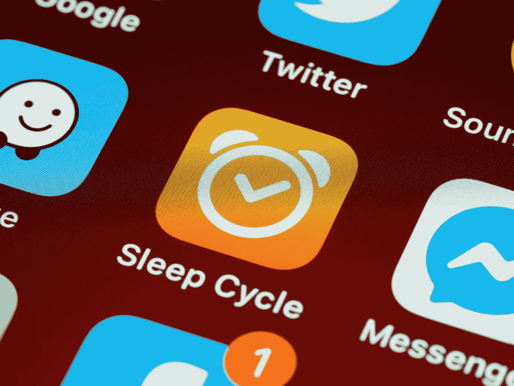
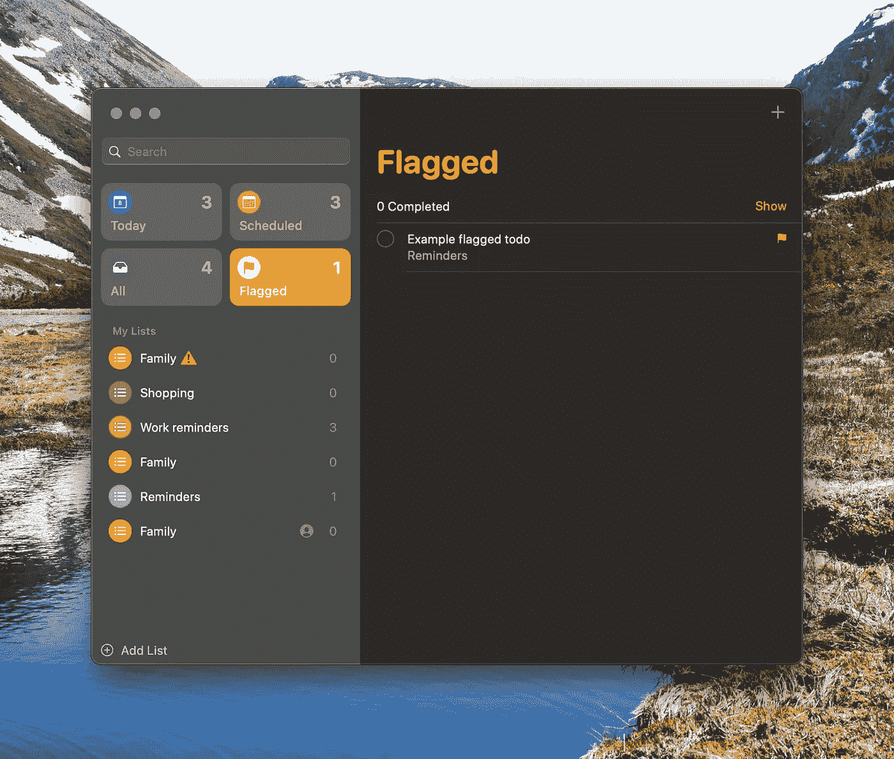
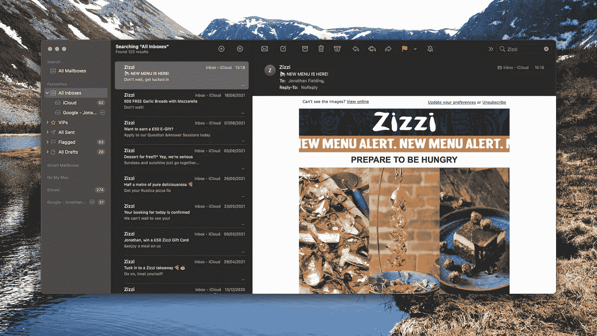
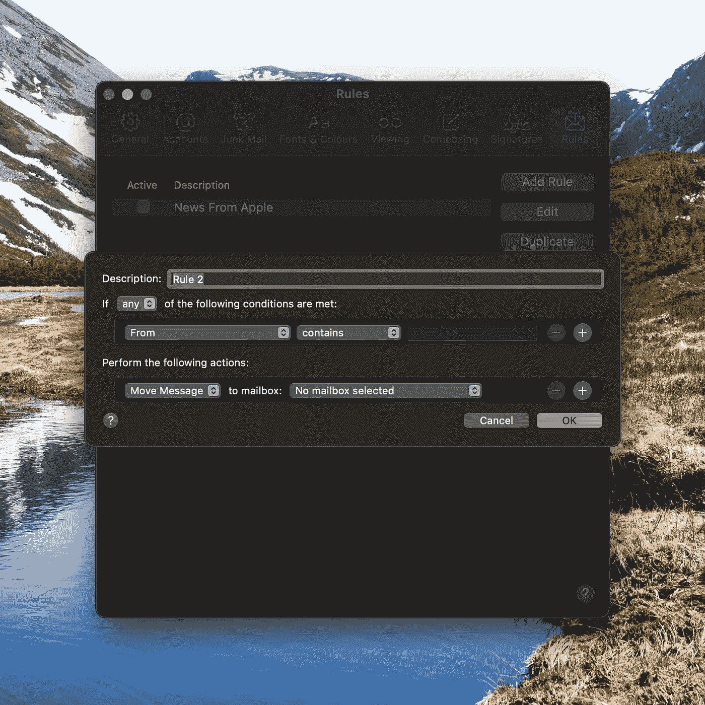
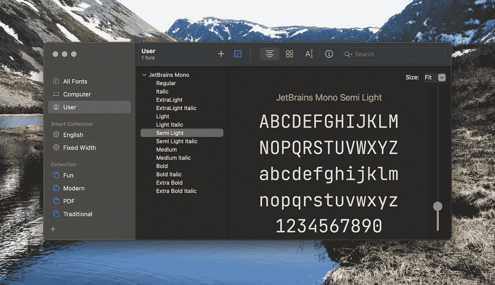
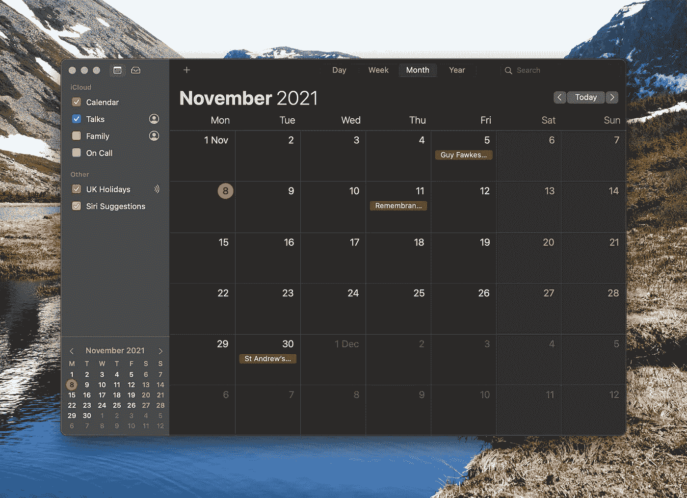
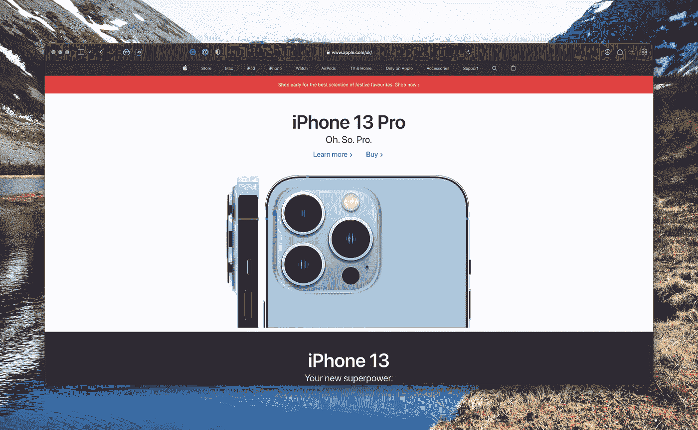
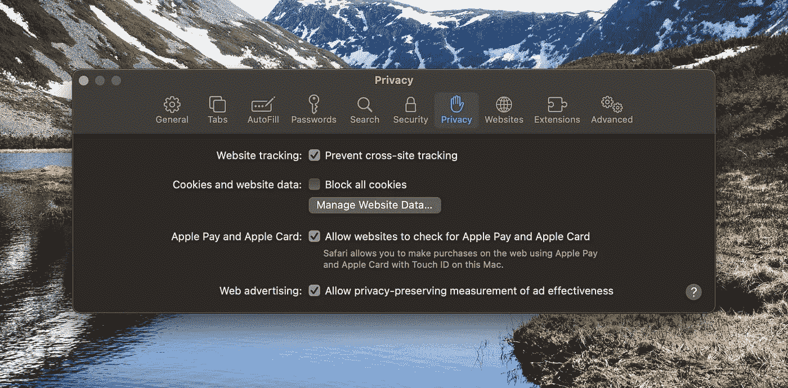
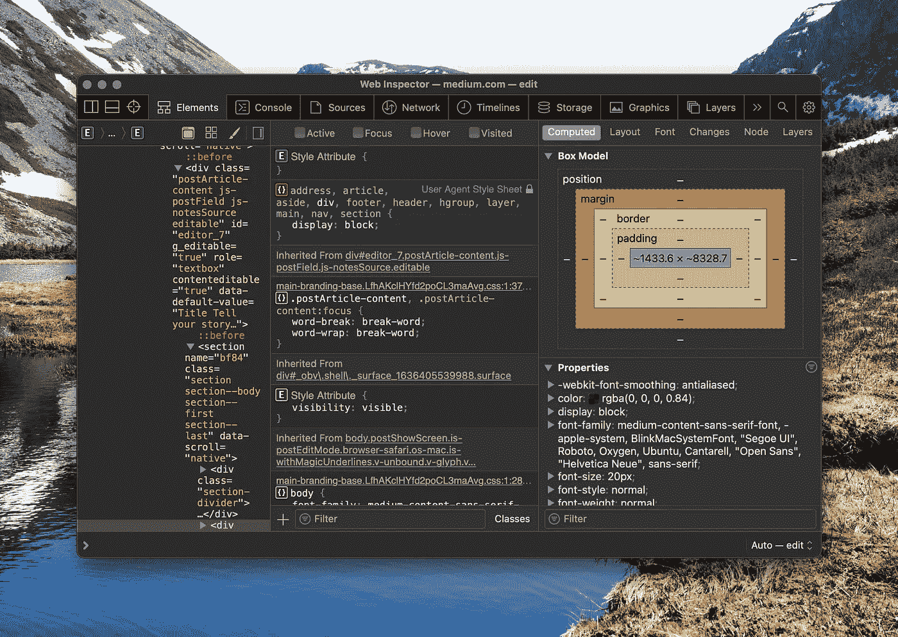

# 作为软件工程师，您需要使用的 5 个默认 Mac 应用程序

> 原文：<https://javascript.plainenglish.io/5-default-mac-applications-you-need-to-be-using-as-a-software-engineer-f5b0dd7aa4f9?source=collection_archive---------4----------------------->

Photo by [Brett Jordan](https://unsplash.com/@brett_jordan?utm_source=unsplash&utm_medium=referral&utm_content=creditCopyText) on [Unsplash](https://unsplash.com/s/photos/apps-mac?utm_source=unsplash&utm_medium=referral&utm_content=creditCopyText)

我之前写过一篇文章，列举了“作为一名软件工程师，你需要的 5 个 Mac 应用程序”——这是我迄今为止最受欢迎的帖子，我还没能超过它。

在考虑了如何跟进之后，我想我应该写一篇文章，重点谈谈苹果电脑自带的应用程序。所以，今天，我分享这一部分。

# 1.提醒

Screenshot of Mac Reminders App by Author

你的 Mac 附带的第一个应用程序是内置的提醒应用程序，我想引起大家的注意，它于 2011 年首次随 Mac OS 附带。

作为一个基本的待办事项列表，提醒让你能够轻松地创建、完成和删除你的待办事项。除此之外，它还增加了定时提醒和基于位置的提醒等功能，我个人认为这些功能在我回家后需要记住做一些事情时非常有用。

额外的好处是，提醒应用程序将与 iPhone 上的提醒应用程序完美同步，这样你就可以一直带着你的待办事项列表。其他待办事项应用程序将支持某些内容，但需要额外的应用程序。

作为开发者，你也可以使用 AppleScript 来编写提醒应用程序，这意味着你可以编写代码来自动添加、管理甚至删除提醒。

# 2.邮件

Apple Mail Application Screenshot by Author

接下来是久经考验的邮件应用，它一直是我阅读邮件的最爱。

这是一个相当简单的电子邮件客户端，有一个漂亮干净的界面，非常容易上手。它具有你对现代电子邮件客户端的所有期望，比如标签、VIP(你不想错过的人发来的邮件)和垃圾邮件分类。

作为一名开发人员，我最喜欢的特性之一是创建规则的能力。当然，它支持将电子邮件分类到邮箱和发送回复等常见功能，但我认为最令人兴奋的功能是编写 **AppleScript 脚本**的能力，它可以针对你收到的电子邮件运行代码。这意味着您可以为您的电子邮件客户端编写定制的自动化程序，例如一个脚本，它可以将您收到的任何图像转储到一个文件夹中，或者根据电子邮件正文中的属性重定向电子邮件。

Rules interface in Mac OS Mail

# 3.字体册

Screenshot of the Mac Font Book application by Author

作为软件工程师，我发现另一个非常有用的工具是字体册应用程序。它让您可以在 Mac 上安装、移除和管理字体。

作为一名开发人员，我发现这个工具非常有用，可以帮助我找到在我创建的网站上可以使用的字体的灵感。它清晰的界面让我可以快速预览数百种不同粗细的字体。

# 4.日历

Screenshot of Apple Calendar by Author

作为一名开发人员不仅仅是写代码，你会发现自己经常参加一堆会议。为了帮助你管理时间，有一个好的日历应用程序是很好的，这样你就知道什么时候你有时间集中注意力，什么时候你需要参加会议。

苹果日历应用程序是填补这一角色的一个很好的候选人，它允许你管理你的日历，并允许你为个人和工作日记设置多个日历。此外，随着最近对 Mac OS Monterey 上的通知的更新(以及 iOS 上的相应变化)，对通知何时出现有了更多的自定义，因此您可以将工作日历通知限制为仅工作时间。

与邮件应用程序类似，日历应用程序也可以使用 AppleScript 编写脚本，使您能够创建、管理和删除日历条目。在我的个人邮件设置中，我将它设置为将我收到的电子邮件中的科技事件添加到日历中，这样我就可以在我有空的时候看到是否有任何事件。

# 5.旅行队

Screenshot of Safari

我要推荐的最后一个应用是苹果自己的网络浏览器 Safari。

虽然向一群可能会使用 Chrome、Firefox 甚至 Brave 的软件工程师推荐 Safari 可能会引起争议，但我希望在抛弃本文的其余部分之前，您能让我证明这一点。

我要说的前几个原因是为什么你应该把 Safari 作为一个终端用户来使用。

苹果对谈论他们对用户隐私的看法并不陌生，他们的网络浏览器是其中的关键部分。它具有先进的跟踪检测和阻止技术，旨在降低大型科技公司在互联网上跟踪你的能力。在我看来，这是一件大事:虽然我没有什么可隐瞒的，但我不认为谷歌需要知道我从 Ocado 购买了什么杂货。

Apple’s Safari Privacy Settings

除了他们对隐私的立场，Safari 还专注于可用性和性能。虽然浏览器可能不具备 web 平台的所有最新功能，但它实现的任何功能都可以提供良好的性能，这通常意味着页面可以更快地加载。这也意味着该浏览器的设计非常高效，与 Chrome 相比，它提供了更好的电池性能。

从开发者的角度来看，Safari 提供了自己的一套 devtools，允许你分析和调试你正在处理的页面。以我的经验来看，考虑到 Chrome 开发工具已经变得如此复杂，使用 Safari 工具会令人耳目一新。

Safari Dev Tools

当连接到 iPhone 时，也可以使用这些相同的 DevTools 来调试 iOS Safari 页面。

我不会争辩说 Safari 是完美的，我会在 Chrome 中使用的一些扩展明显缺失，但是当我在工作 Mac 上使用 Chrome 时，我倾向于在我的个人 Mac 上使用 Safari。

# 概括起来

Mac OS X 附带了一些非常简单但有效的应用程序，它们开箱后将为您提供出色的用户体验，而无需您一打开箱子就将一大堆东西下载到笔记本电脑上。

毫无疑问，你可以使用更多功能丰富的应用程序，对我来说，内置应用程序的简单性是吸引我的地方。虽然苹果并不总是正确的，但总的来说，他们对简单性的追求是他们产品吸引我的地方。

让我知道你喜欢使用 Mac 附带的哪些应用程序，如果你喜欢这篇文章，我鼓励你关注我，这样你就可以阅读更多我的帖子。

如果你想支持我的帖子，并且你还不是 Medium 的成员，那么请随意加入 https://jonthanfielding.medium.com/membership。

*更多内容尽在*[***plain English . io***](http://plainenglish.io/)