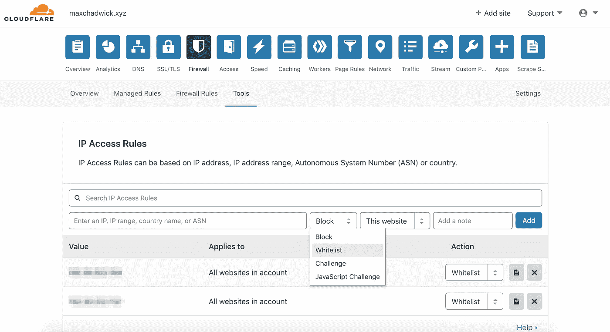
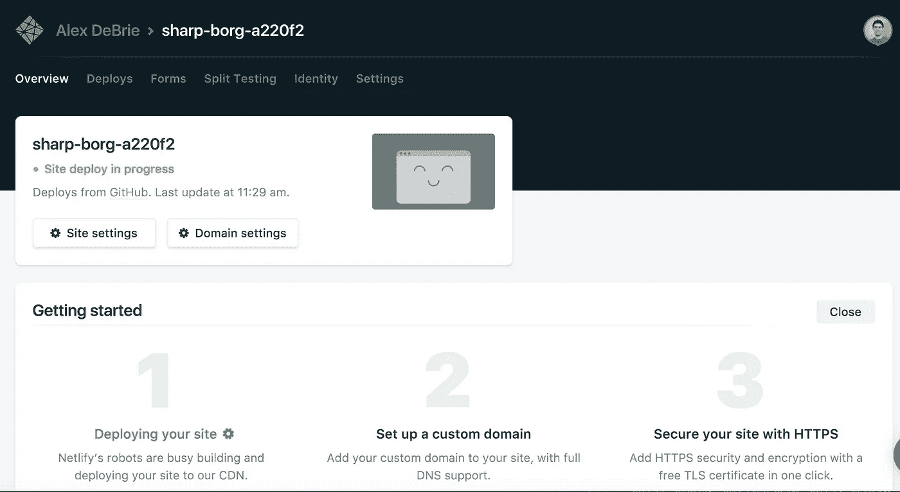
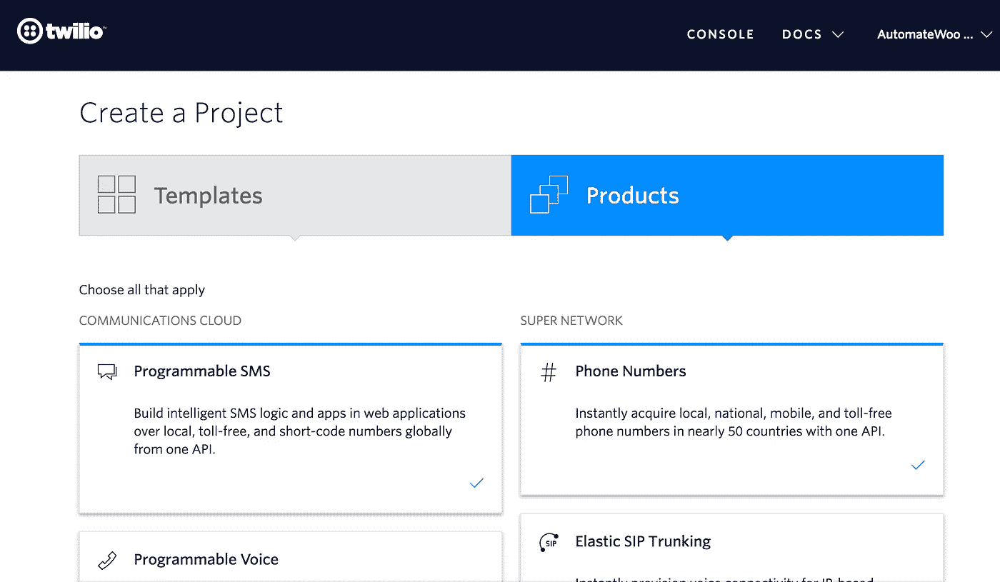
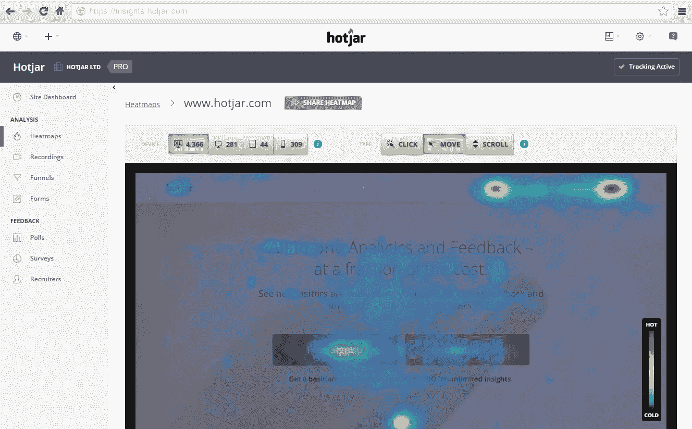
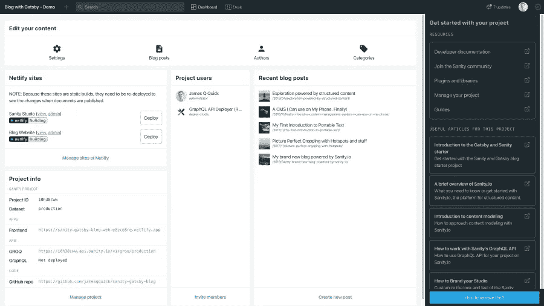

# Web 开发人员的 5 个基本工具

> 原文：<https://javascript.plainenglish.io/5-essential-third-party-tools-for-web-developers-cc4b3d04f924?source=collection_archive---------10----------------------->

[https://unsplash.com/photos/EhTcC9sYXsw](https://unsplash.com/photos/EhTcC9sYXsw)

如今，*软件生态系统*充满了**不可或缺的** **工具**，每当我们想要构建新的东西，或者只是改进已经实现的东西时，我们都依赖这些工具。

我对所有*实用*和可能*被低估的* **平台**做了一个简短的总结，帮助我克服了任何困难。它们可能不是专门为前端开发而设计的，但是对于我们这些在这个领域工作的人来说，它们肯定会很方便。

# 1.云耀斑

## 这是什么？

*   Cloudflare 是一个**内容交付网络(CDN)** ，在**服务器**和**客户端**之间充当*中介*，由分布在 **100 多个** **国家**的数百个数据中心组成
*   如果你想让你的网站快速加载，CDN 可以通过在世界各地分布和设置几个服务器，从离访问者最近的服务器向他们提供服务

## 它能有什么帮助？

*   对 **SSL** ( **HTTPS** )的现成支持
*   DNS 管理:他们运营着世界上最高性能的 DNS 网络
*   **带 **Magic Transit** 的本地网络保护**:除了为网站提供 DDoS 保护，它还通过一款名为 Magic Transit 的产品直接向企业提供这种保护，这款产品可以将企业的全球网络保护规模提升到理想水平
*   能够为资产&自动**缩小**您的**静态资产**设置**浏览器缓存到期**
*   自定义**页面规则**用于设置**重定向**、**总**、 **HTTPS** 等
*   **网络日志**和**分析报告**:数据的使用方式和流动方式，因此用户可以进行调整以优化其内容的交付
*   **无服务器代码部署**:客户可以利用 **Cloudflare Workers** ，而不必投资自己的基础设施
*   **Cloudflare 应用**如聊天机器人、小工具等

Cloudflare user dashboard

阅读更多信息来源:

 [## 关于 Cloudflare 你需要知道的一切(有些你不知道)— WHSR

### Cloudflare 最广为人知的是内容交付网络(CDN)。今天，它已经超越了这一点，并提供了一系列…

www.webhostingsecretrevealed.net](https://www.webhostingsecretrevealed.net/blog/security/everything-you-need-to-know-about-cloudflare/)  [## 使用 Github & Cloudflare 设置网站的图解指南

### 易于设置，即时部署，免费 HTTPS，HTTP2/SPDY 支持，自定义重定向，浏览器缓存过期，HTTP 安全…

medium.com](https://medium.com/free-code-camp/an-illustrated-guide-for-setting-up-your-website-using-github-cloudflare-5a7a11ca9465)  [## 什么是 Cloudflare，为什么您的网站需要它？Freelancer.com

### 如果你的网站是你业务的核心，你希望它尽可能的快速、可靠和安全。毕竟…

www.freelancer.com](https://www.freelancer.com/articles/web-development/cloudflare#) 

# 2.网络生活

## 这是什么？

*   定义它的最简单的方法是根据它的核心目的:一个静态虚拟主机解决方案，但是它已经变得比 T3 更 T2 了

## 它能有什么帮助？

*   **通过*命令行*或*拖放&轻松部署***您的网站:每次部署都是一个独特的版本，不会被破坏，只会在每次迭代中被替换，因此您可以随时回滚到以前的版本
*   **通知&永久链接**基于不同的部署事件:谁得到**事件**的通知，比如一个部署的*开始*，当一个部署*成功*失败，是*锁定*还是*解锁*——这些还包括一个**链接**到那个*特定的* *版本*
*   ****分支部署** —您可以选择是只部署您的*生产*分支、*所有*分支，还是*一些已命名的*分支:每个分支将在**子域**中可用，其名称源自其所属分支的名称**
*   ****A/B 测试、多变量测试**或**分割测试:**你可以将你的流量分割到你喜欢的任意数量的*分支*，定义流量的*百分比*应该流向哪里**
*   ****上下文构建命令:**定制部署中的内容和环境，以适应不同的上下文，例如*准备*、*测试*和*生产***

****

**Netlify user dashboard**

**阅读更多信息来源:**

** [## 10 大惊喜网络功能

### 一段时间以来，我一直热衷于网络购物。事实上，我变得如此热情，以至于最近加入了这家公司。

medium.com](https://medium.com/netlify/10-netlify-features-to-surprise-and-delight-225e846b7b21)  [## 网络平台——现代网络开发的产品

### 新白皮书—利用 Headless Commerce 和 Jamstack 提高性能和转化率。立即下载！网络生活…

www.netlify.com](https://www.netlify.com/products/) 

# 3.特维利奥

## 这是什么？

*   [**CPaaS**](https://www.nextiva.com/blog/what-is-cpaas.html) 行业的知名领导者，或者他们称之为**云通信平台**——为您的网络和移动应用添加消息、语音和视频的构建模块

## 它能有什么帮助？

*   使用他们的 **API** 很容易将集成到你的项目中
*   他们的**产品**可以分为**四个**大类**和**
*   **解决方案** : **Twilio Flex** (完全可编程[云联络中心平台](https://getvoip.com/call-center-software/))和 **Twilio SendGrid 营销活动**(基于 UI 的电子邮件营销工具)
*   **通道 API(**可嵌入当前应用和工具的单点沟通通道**):短信**、**语音**、**聊天**、**视频**、**传真**、WhatsApp 的 **API、SendGrid Email API**
*   **服务(**通过提供 AI 消息传递、身份验证和全渠道通信管理来保护和改善流行的通信渠道): **Authy** 、**查找**、**自动驾驶**、T **wilio 对话、验证**
*   **超级网络(**提供企业级基础设施以增加连接和通信): **Twilio 电话号码**， **SMS/MMS 短码，弹性 SIP 中继**

Twilio docs

阅读更多信息来源:

 [## 为什么您需要 Twilio 来构建一个强大的交流平台| Agilie 应用程序开发公司…

### 有效的沟通对任何企业的成功都是必不可少的:这是与你的同事保持联系的唯一方法

agilie.com](https://agilie.com/en/blog/why-you-need-twilio-to-build-a-high-power-communication-platform)  [## twilio 2020 年的定价、计划和功能:近距离观察他们的产品| GetVoIP

### Twilio 是一个基于云的通信平台，采用积木式方法为公司提供…

getvoip.com](https://getvoip.com/blog/2020/07/21/twilio-pricing-and-plans/) 

# 4.热罐

## 这是什么？

*   **行为分析软件**对于任何在线销售的企业来说*有助于了解网站用户的行为*

## 它能有什么帮助？

*   **看看人们如何与你的网站互动**，**调查**访问者**是否在他们的**旅程**，中遇到问题**或**问题**收集**顾客对你的网站体验的直接反馈**
*   **热图** : *人们如何通过展示 ***热点*和*冷点*互动点***与个人网站页面互动(这反过来帮助你注意到趋势和优化机会，在你希望的地方推动更多的参与)
*   **会话记录:** *重建*您的用户在网站上的 ***旅程*** ，这样您可以观察用户**如何在**周围移动，他们在浏览时*点击了什么*或*忽略了什么*，以及他们在途中是否遇到了任何*问题*或*障碍*
*   **调查:**帮助你从访问者那里收集**反馈**，发现他们对你的*产品、品牌和网站体验的看法*
*   **传入反馈:**一个**小工具**，可以安装在你网站的任何页面上，让用户有机会留下*评论*，而不会被*主动提示*

Hotjar heatmaps

阅读更多信息来源:

 [## Hotjar vs 谷歌分析？为什么你两者都需要

### 如果你来到这里认为你必须在谷歌分析和 Hotjar 之间做出选择，让我们打断你一下:Hotjar…

www.hotjar.com](https://www.hotjar.com/blog/hotjar-vs-google-analytics/#what-is-hotjar)  [## Hotjar 评论:它们是一个受欢迎的工具，但这意味着它们是好的吗？

### Hotjar 是最新的分析工具之一，旨在帮助营销人员更好地了解他们的用户。考虑到…

www.ventureharbour.com](https://www.ventureharbour.com/hotjar-review/)  [## Hotjar 是什么？你应该使用它的 4 个理由

### 你已经知道:对你的用户最好的就是对你的企业最好的....但是你有正确的信息来…

www.hotjar.com](https://www.hotjar.com/blog/what-is-hotjar/) 

# 5.理智. io

## 这是什么？

*   顶级 [**无头 CMS 平台**](https://www.sanity.io/blog/headless-cms-explained) 之一:通过其*实时*、*云托管*API 和*可定制开源*编辑环境，将*结构化内容*交付到任何数字设备或应用程序中

## 它能有什么帮助？

*   **Sanity Studio、**开源 **headless 实时 CMS** ，可以用 JavaScript 和 React 定制:卓越的*编辑特性、块内容、结构构建器*和一个*仪表板插件*
*   **API 优先模式**，允许通过 API 访问内容:*读取*，*编写、查询和修补* **文档**，还允许部署 **GROQ** 和**graph QL API**到*查询内容*
*   **最新技术栈**:所有数据*即时同步，*使用 PostgreSQL、ElasticSearch、JavaScript&React；它不在数据库中保存 HTML、XML 或富文本，而是在 **rational object structures** 中；附带 JavaScript、HTML 和 PHP 客户端，允许使用任何前端框架
*   用户友好的**无头内容模型:**使*内容编辑人员、视觉和交互设计人员*和*技术专业人员*能够协作构建信息架构，而*前端开发人员*能够通过*API 即时访问*内容字段，从而节省他们的精力

Sanity project dashboard

阅读更多信息来源:

 [## 采用 Headless CMS Sanity.io | Fingent 博客的 5 个令人信服的理由

### 在我们最近的白皮书中，我们指出客户体验将取代价格和产品成为关键品牌…

www.fingent.com](https://www.fingent.com/blog/5-convincing-reasons-to-adopt-the-headless-cms-sanity-io/)  [## 健全| Jamstack

### Sanity.io 是结构化内容的平台。它附带了一个名为 Sanity Studio 的开源编辑环境…

jamstack.org](https://jamstack.org/headless-cms/sanity/)  [## 2 分钟解释无头 CMS

### 您应该采用更新的“无头”内容管理方法吗？或者坚持使用传统的整体系统…

www.sanity.io](https://www.sanity.io/blog/headless-cms-explained) 

# 结论

感谢您的阅读，如果您有任何问题或建议，请随时在评论区写下。期待听到大家的想法！干杯！

你也可以看看我的其他相关文章:

 [## 解释了 20 个 HTML 和 CSS 概念

### 我一直对网页开发的视觉方面充满热情，在谈到…

medium.com](https://medium.com/javascript-in-plain-english/html-css-concepts-you-might-have-missed-7f49893daaaf)  [## 2021 年你需要的 JavaScript Cheatsheet

### 我很确定我不是唯一一个在面试中遇到一些不舒服的技术问题并感到…

medium.com](https://medium.com/javascript-in-plain-english/a-javascript-cheatsheet-you-need-in-2020-d81b3dd89e09)**