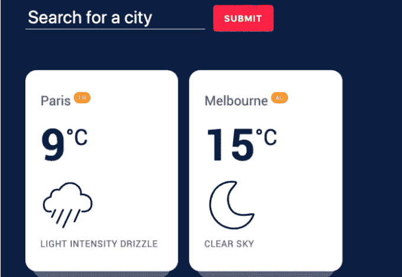
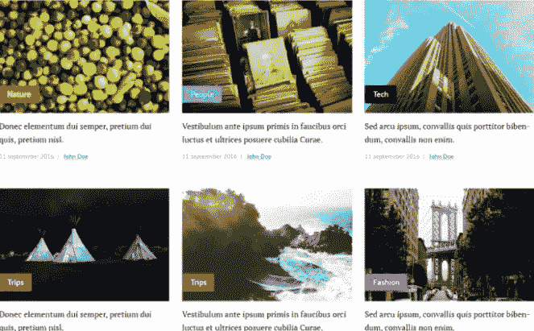

# 所有初级开发人员都应该构建的 5 个 React 项目

> 原文：<https://javascript.plainenglish.io/5-exciting-reactjs-projects-for-all-junior-frontend-developers-eb7f28098ab4?source=collection_archive---------2----------------------->

## 作为一名前端开发人员，您应该构建令人敬畏的 React 项目。

Photo by [Mohammad Rahmani](https://unsplash.com/@afgprogrammer?utm_source=medium&utm_medium=referral) on [Unsplash](https://unsplash.com?utm_source=medium&utm_medium=referral)

React 是一项非常重要的技能，作为一名 web 开发人员，你应该具备这项技能。它允许您轻松构建令人印象深刻的高性能 web 应用程序。除此之外，React 在开发人员工作甚至自由职业项目方面的需求也很高。

学习 React 并不容易，有很多概念需要你去了解。然而，如果您构建项目，那么学习 React 对您来说会变得容易得多。作为开发人员，构建项目是提高任何技术技能的最佳方式。

这就是为什么在这篇文章中，我会给你一些 React 项目的列表，你可以作为一个初级前端开发人员来构建。所以让我们开始吧。

# 1.登录页面

作为初学者，使用 React 构建任何类型的登录页面都是一个很好的学习方法。这个项目更侧重于构建 UI 并使其具有交互性。登录页面应该有一个导航栏，一个英雄部分，也许是一个英雄滑块，还有其他部分取决于登录页面的类型，当然还有页脚。

如果你不是一个优秀的设计师，你可以在网上寻找现有的设计来获得一些灵感。查看[前端练习](https://www.frontendpractice.com/) *(链接外部媒体)*以获得一些可以使用 React 构建的登录页面示例。

你也可以寻找其他现有的登录页面，如网飞登录页面，星巴克，特斯拉，等等。这种类型的项目表明你对 React 很熟悉，你可以用它创建好看的登录页面。

# 2.天气应用

它不必是一个复杂的天气应用程序。只是一个简单的应用程序，使用第三方 API 根据日期和用户位置显示天气数据。

这个项目表明您能够在 React 中正确地使用第三方 API。此外，尽量让它看起来对用户有吸引力，并做出响应。您还可以添加额外的功能，如搜索位置和显示特定位置的天气、黑暗模式功能等。

Capture by the author.

# 3.购物清单应用程序

如果你有兴趣在未来创建复杂的电子商务网站，这是一个很好的项目。通过使用 React，您可以构建一个令人印象深刻的购物清单应用程序，来管理要购买的产品列表。

用户可以将产品添加到购物车中，并能够删除它们和计算价格。您可以添加尽可能多的功能，比如设置购买的产品数量、过滤产品、身份验证等等。

要构建这个项目，您可以使用 create-react-app 工具和 react 挂钩来实现 UI 和功能。还可以使用 Context API 或 Redux 作为项目的状态管理。

Capture by the author from Udemy.

# 4.电影应用程序

通过使用 React 挂钩、上下文 API、React 路由器和 MovieDB API，您可以构建一个吸引人的电影应用程序。

电影应用程序在主页上管理电影列表。用户可以点击每部电影，并进入一个新的页面，显示该特定电影的所有细节。除此之外，用户还可以搜索特定的电影。

同样，你可以添加更多的功能，比如按类别过滤电影、黑暗模式、认证等等。此外，尝试使用 CSS 或任何其他样式工具使应用程序在视觉上吸引人。

该项目将展示您能够使用第三方 API、React 路由和状态管理。

这里有一个例子:

Pen by the author from [Codepen](https://codepen.io/).

# 5.博客网站

你可以只用 React 来创建一个博客。然而，要有一个 SEO 友好的博客，总是建议在 React 上使用静态站点生成器，比如 Gatsby 或 NextJS。

这些静态站点生成器的优势在于它们超级快速并且对 SEO 友好。因此，建立博客是了解 React 及其生态系统的一个好方法。这是一个令人印象深刻的项目添加到您的投资组合。

Capture by the author.

# 结论

如您所见，这些都是提高 React 开发人员技能的好项目。您将学习许多关于 React 的概念，并且在构建这些项目之后，您将会更加熟悉它。所以要尽可能多的练习。

感谢您阅读这篇文章。希望你觉得有用。

**更多阅读:**

 [## 面向所有前端开发人员的 7 款出色的 API

### 您的下一个项目可能需要的有用的 API。

javascript.plainenglish.io](/7-awesome-apis-for-all-frontend-developers-a06c1057661)  [## 用例子解释 JavaScript 中的动态导入

### 如何在 JavaScript 中轻松使用动态导入？

javascript.plainenglish.io](/dynamic-imports-in-javascript-explained-with-examples-c2122743e5ac) 

*更多内容尽在*[***plain English . io***](http://plainenglish.io)