# 有助于为您的用户提供最佳体验的 5 款免费工具

> 原文：<https://javascript.plainenglish.io/5-free-tools-that-help-deliver-the-best-experience-to-your-users-a8430750f2be?source=collection_archive---------17----------------------->

# 消除挫折感，在 JavaScript 错误发生时跟踪它们

> 我用这个已经快两年了，它帮助我识别了一些真正的错误。

客户端错误可能是一场无声的噩梦。即使是大男孩有时也会在他们的网站上出现错误，这阻碍了目标转换。如果不被发现，你会失去很多时间。

这就是问题所在。有一个免费的计划对一个小网站来说足够了，它可以保存数据 7 天。一个付费的计划是可用的，其中数据保存 60 天，加上它包括 5 个席位。

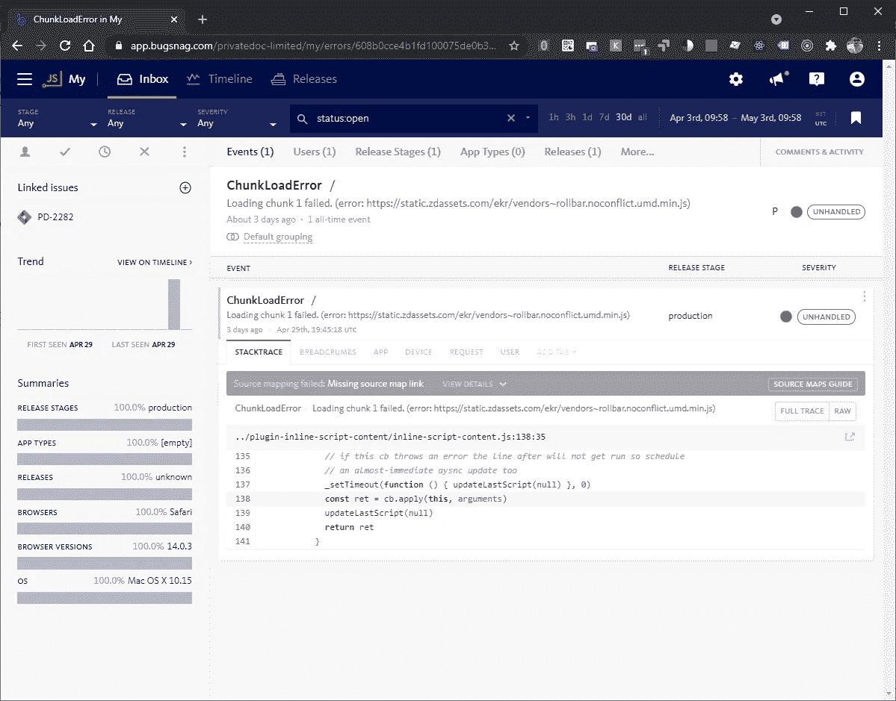

[BugSnag](https://www.bugsnag.com/), great for catching JS errors

时间线特性有助于识别错误开始发生的时间，然后可以追踪到发布。尤其是当你使用版本控制的时候。

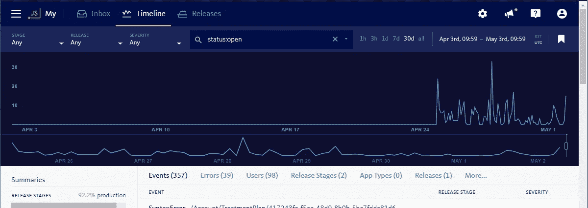

Timeline

真的很好装。使用标签管理器部署标签或在您的站点上粘贴一些代码。

查看更多: [BugSnag](https://www.bugsnag.com/)

# 留意用户是如何使用你的网站的

> 你无法改善你不知道会出错的事情。观察用户与你的网站互动提供了很好的第一手反馈。使用像 HotJar 这样的工具来实现这一点。

在 **HotJar** 上有一个免费计划，足以让你继续下去，你每天可以记录 2000 次页面浏览。

**观看访客的录像**

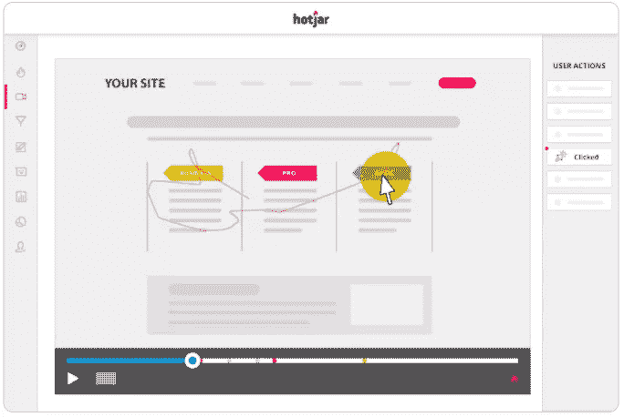

Screen recording

**生成热图**

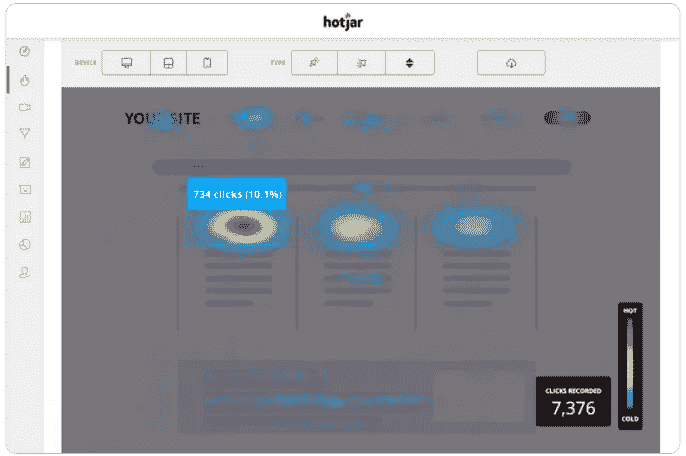

Heatmaps

它很容易安装，添加标签到您的网站手动或谷歌标签管理器。

在这里找到:[https://www.hotjar.com/](https://www.hotjar.com/)

# 用谷歌优化尝试新事物

**Google Optimize** 是一个方便的在线工具，可以帮助你创建 AB 测试、CSS & HTML 测试、横幅广告的实验，在一定比例的用户会话上运行定制的 JavaScript。

除了使用 Google Tag Manager (GTM)将 optimize 标签添加到您的网站或粘贴到您的代码中之外，这是一种零代码的方式来处理您的网站版本，以查看它如何影响您的目标。

optimize variant 编辑器将允许您快速处理元素或向页面添加全局 JavaScript 或 CSS 更改。

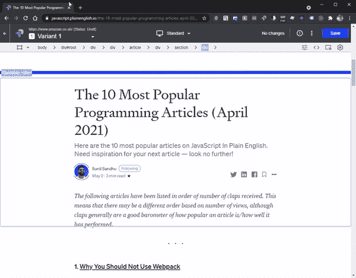

Google Optimize editor

> 你可以在任何网站上进行试验，但是你只能将改变部署到你控制的网站上。

当你建立了你的变体，你可以设定目标，选择有多少比例的观众可以看到这个实验，你甚至可以选择更高级的方式来触发你在谷歌分析中获得的数据的实验。

设定好目标后，在实验运行几天后回来看看这些变化产生了什么影响。

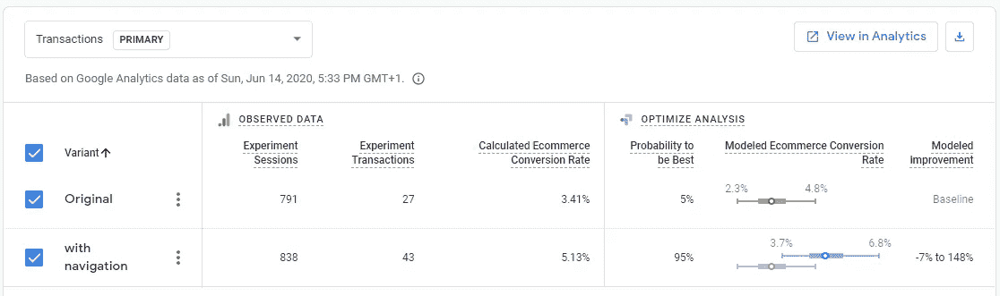

Example goal output.

点击这里了解更多:[https://optimize.google.com/optimize/home/](https://optimize.google.com/optimize/home/)

# 生成漂亮的颜色主题

> 让我们面对现实吧，一个好的开发人员和一个好的设计人员之间确实有差距。有时候你只需要一套漂亮的颜色，你不会花太多时间在色轮上设计出一套互补的颜色。

Coolors.co 是我最喜欢的主题生成器。我特别喜欢你构建的主题被分配了一个唯一的 URL，你可以把它作为评论粘贴到你的 CSS/LESS/SCSS 中。

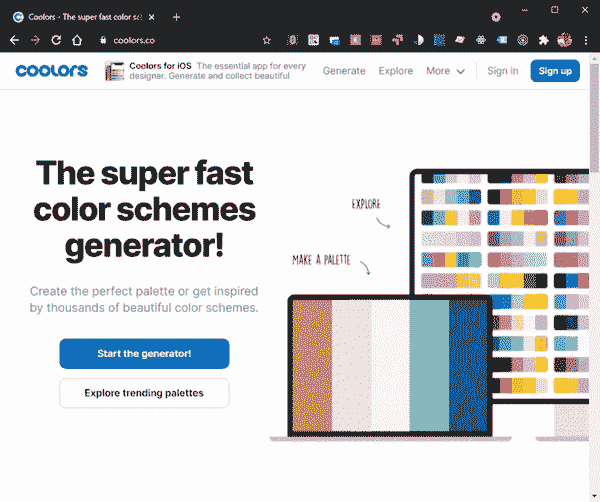

Coolors.com homepage

有很多很酷的功能，开始时你可以一直按[space]来生成一个随机的调色板，直到你看到吸引你眼球的东西…

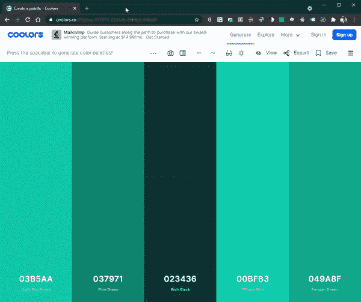

…或者探索流行的调色板，这些预建的主题将帮助您找到良好起点的灵感:

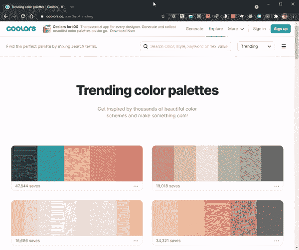

通过创建一个帐户来保存你的主题，或者如果你不喜欢，那么只需选择一个导出选项(复制网址是我的最爱)。

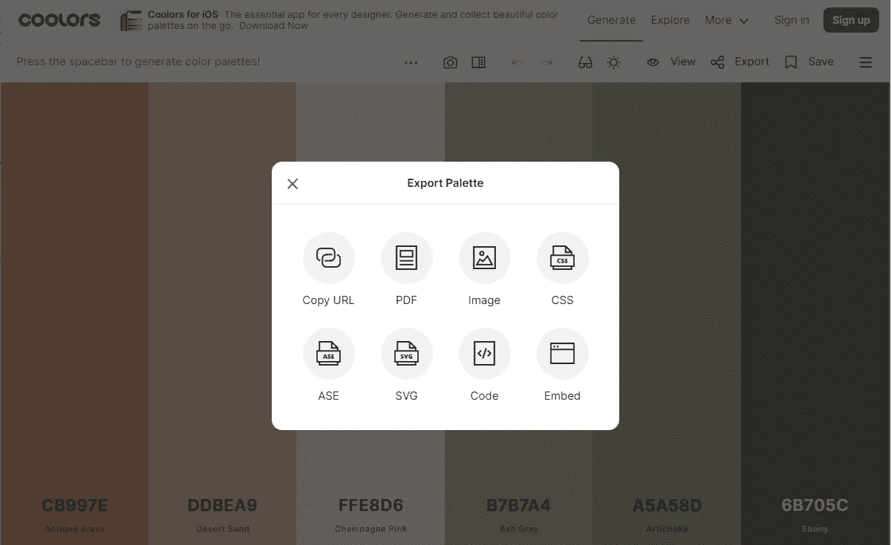

看它的行动:【Coolors.co 

# 灯塔计分计算器

> **有没有想过你的 PageSpeed insights 优化对你的总体分数有什么影响？**

我们花了很长时间在我们的一个网站上对抗 CLS，这是我的一个真正的 bugbear。当我们到达零度 CLS 时，我们都在庆祝。事实证明，CLS 是对你的总分影响最小的因素之一。

**Lighthouse 计分计算器**是一个方便的工具，可以帮助你理解计分计算。你可以亲自体验一下它的滑块。

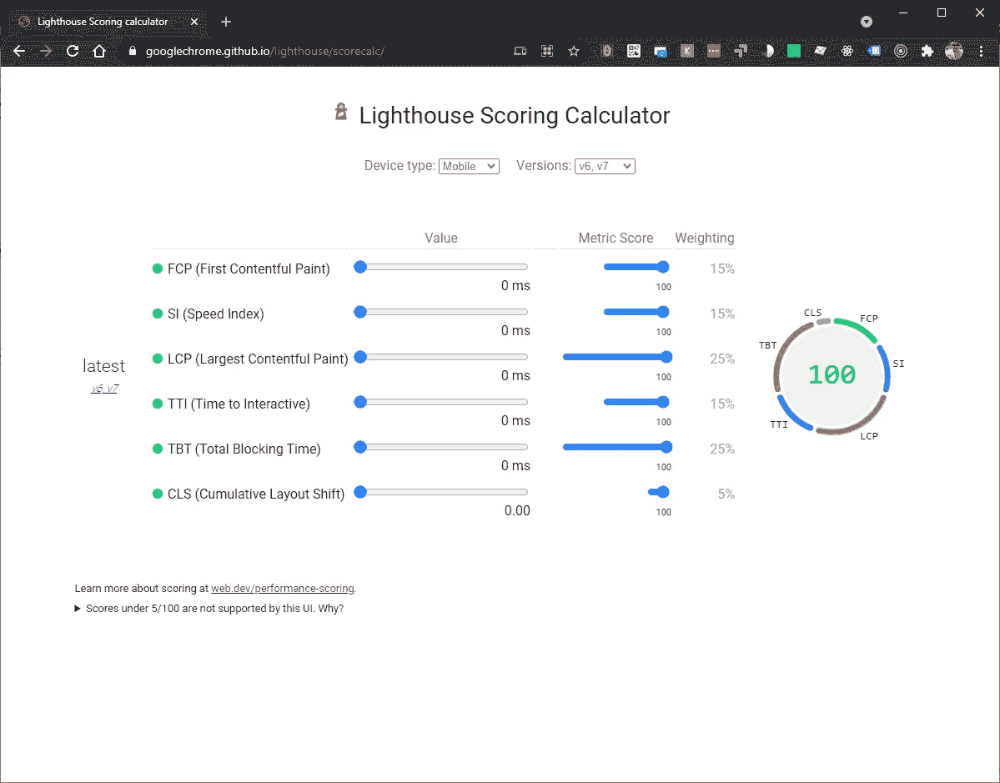

看这里:[https://googlechrome.github.io/lighthouse/scorecalc/](https://googlechrome.github.io/lighthouse/scorecalc/)

# 概述

这里列出了本文中提到的 5 种工具。如果你想推荐一些其他的好工具，请在下面的评论中添加它们。

JavaScript bug 跟踪: [BugSnag](https://www.bugsnag.com/)

访客录音:[https://www.hotjar.com/](https://www.hotjar.com/)

实验:[https://optimize.google.com/optimize/home/](https://optimize.google.com/optimize/home/)

颜色生成:[Coolors.co](https://coolors.co/)

页面速度计分计算器:[https://googlechrome.github.io/lighthouse/scorecalc/](https://googlechrome.github.io/lighthouse/scorecalc/)

## 还提到

谷歌标签管理器:[https://tagmanager.google.com/](https://tagmanager.google.com/)

[*更多内容尽在 plainenglish.io*](http://plainenglish.io/)