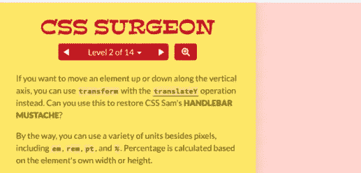

# 学习 CSS 概念的 5 个有趣游戏

> 原文：<https://javascript.plainenglish.io/5-fun-games-to-learn-css-concepts-34fdbdd0d00a?source=collection_archive---------6----------------------->

## 这里有一些有用的游戏，可以帮助你理解 CSS 的概念。

Photo by [Folu Eludire](https://unsplash.com/@dejeludire?utm_source=medium&utm_medium=referral) on [Unsplash](https://unsplash.com?utm_source=medium&utm_medium=referral)

# 介绍

谈到 CSS，有很多概念你需要知道。有时，当通过阅读书籍、观看视频或其他什么方式以正常方式学习时，事情可能会变得无聊。这就是为什么有一些特殊的方法来学习东西是一件好事。其中一种特殊方式是玩教育游戏，因为它们可以帮助您同时学习和练习。除此之外，它们使事情更容易记住。

在本文中，我们将为您列出一些有趣且有用的游戏，这些游戏将帮助您学习和练习 CSS 概念。让我们开始吧。

# 1.Flexbox Froggy

Flexbox Froggy 是一款令人惊奇且有用的游戏，你可以通过有趣的方式学习和练习 CSS flexbox。它涵盖了 24 个不同级别的 flexbox 属性。这个游戏是由 [Codepip](https://codepip.com/) 创建的，它在过去帮助我很容易地学习 CSS flexbox。

[Flexbox Froggy](https://flexboxfroggy.com/).

如果您感兴趣，可以在这里查看[。](https://flexboxfroggy.com/)

# 2.网格花园

网格花园也是一款令人敬畏的游戏，由 [Codepip](https://codepip.com/) 创建，它以一种有趣的方式帮助学习和练习 CSS 网格概念。它涵盖了 28 个不同级别的 CSS 网格属性。如果你在理解 CSS 网格方面有困难，或者你只是想玩得开心，我真的推荐这个游戏。

[Grid Garden](https://cssgridgarden.com/).

如果您感兴趣，请访问[网站](https://cssgridgarden.com/)。

# 3.CSS 就餐者

这个游戏是由[卢克·帕克霍尔斯基](https://github.com/flukeout)创造的，它是关于不同的 CSS 选择器的。它有 32 个不同的级别，你可以通过学习来掌握 CSS 中的选择器。

[CSS Diner](https://flukeout.github.io/).

如果您想了解更多信息，请访问[网站。](https://flukeout.github.io/)

# 4.CSS 外科医生

这个令人敬畏的游戏教你如何用 CSS 变换以有趣的方式缩放、旋转和移动元素。同样，这个游戏也是由 [Codepip](https://codepip.com/) 创建的，目的是介绍使用 CSS 变换来修改网页元素的基本原理。

[CSS Surgeon](https://codepip.com/games/css-surgeon/).

如果您感兴趣，可以查看[网站](https://codepip.com/games/css-surgeon/)。

# 5.Flexbox 防御

这个游戏也是关于 CSS flexbox 的，它涵盖了 12 个不同级别的 flex 属性。Flexbox Defense 是由钱宁艾伦创造的，这是一个非常有趣的游戏，你可以试试。

[Flexbox Defense](http://www.flexboxdefense.com/).

如果你想去看看，这里是[网站](http://www.flexboxdefense.com/)。

# 结论

如你所见，这些教育游戏真的很有趣。他们以令人兴奋的实用方式教你 CSS 概念，帮助你容易地记住这些概念和属性。

感谢您阅读本文，希望您觉得有用。

# 更多阅读

*如果你对 JavaScript 和 web 开发相关的更有用的内容感兴趣，也可以* [*订阅*](https://mehdiouss.ck.page/) *我的快讯。*

*下面是另一篇有用的文章，请点击链接查看:*

 [## 在 React 中使用 UseEffect 提取数据

### 通过真实的例子了解 React UseEffect。

medium.com](https://medium.com/javascript-in-plain-english/fetching-data-with-useeffect-in-react-604ed53edffe)