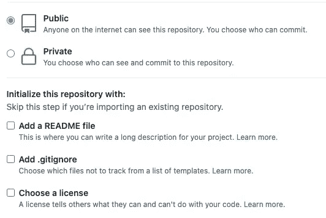
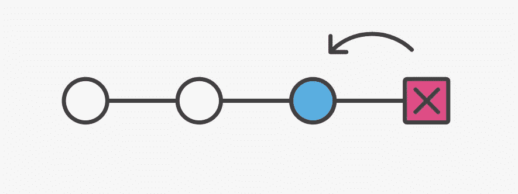

# 我发现最有用的 6 个 Git 实践

> 原文：<https://javascript.plainenglish.io/5-git-practices-i-found-most-useful-af7410f390dd?source=collection_archive---------10----------------------->

## Git 初始化、重命名、隐藏、重置和重置

## 除了普通的工作流程之外，这些是我发现在工作中非常有用的 Git 实践


Photo by [Fotis Fotopoulos](https://unsplash.com/@ffstop?utm_source=medium&utm_medium=referral) on [Unsplash](https://unsplash.com?utm_source=medium&utm_medium=referral)

> 先决条件

1.  您必须在本地机器上安装 Git。你可以按照[官方文档](https://git-scm.com/book/en/v2/Getting-Started-Installing-Git)来做。
2.  有一个 [Github](https://github.com/) 账户(免费版就够了)。

# 1.在您的项目中启动 Git，并将其发布到 Github

你可能已经独自工作一段时间了。而有一天你需要和别人分享或者合作。也许你的主管想看看你一直在做什么，也许有新员工会分担你的工作量，或者你只是想分享你的工作！本练习由两部分组成，启动 Git 并将您的项目发布到 Github。

首先，您需要在项目的根目录中启动 Git。

```
$cd root/path/to/project
$git init
```

这将在目录中创建一个隐藏文件夹`.git`，其中包含 Git 用来跟踪项目的元数据和版本历史。下一步是告诉 Git 提交内容。这里我们使用`-A`来包含这个项目目录中的所有文件。

```
$git add -A
```

现在，您已经准备好进行第一次提交了。

```
$git commit -m 'This is the first commit. Add all files'
```

本地工作已经完成。让我们转移到 Github。我们需要的非常简单，一个新的存储库。在创建阶段，您可以将其公开或私有，可以有也可以没有`README`和`.gitignore`文件。



Image from [Github](https://github.com/)

创建存储库后，您可以通过 HTTPS 或 SSH 将此存储库添加为您的远程存储库:

```
$git remote add origin https://github.com/{usrname}/{repo_name}.git
```

最后，将本地存储库的上游设置为刚刚添加的远程存储库。

```
$git push --set-upstream origin main
```

## 1.1 .gitignore

我花了一段时间才真正明白这个文件是用来做*的。* `.gitignore` 是一个纯文本文件，Git 使用它来标识那些不应该跟踪和包含在提交中的文件。换句话说，只要你的文件名在`.gitignore`里，就不会出现在修订里。它通常用于虚拟环境、敏感数据(如凭据)或缓存文件等。当您创建资源库时，Github 上有许多适合不同环境的模板。

# 2.重命名分支

这是我发现自己经常使用的另一种常见做法。有时你会意识到给分支机构命名有一定的规则，或者有时你会觉得原来的名字不够有代表性，或者有错别字，等等。

使用`git branch -m`重命名您的分支非常简单。

```
$git branch -m {old_branch_name} {new_branch_name}
```

这只会更改本地的分支名称。如果您已经将分支推送到 remote，那么您还必须运行以下命令来更改 remote 上的名称。

```
$git push origin -u {new_branch_name}# This resets the upstream branch, don't forget to delete the old branch$git push origin -d {old_branch_name}
```

# 3.撤消最近的提交



Image from [Altassian](https://www.atlassian.com/git/tutorials/undoing-changes)

很常见的情况是，您已经提交并更改了分支，但是之后想要撤销提交。别担心，在 Git 中，我们总是可以退一步，回到我们渴望的点。

我们使用`git reset`来撤销提交。如果您还想删除该提交中所做的所有更改，请使用`--hard`。如果您只想对提交做一些调整，并保留那些更改，请使用`--soft`。

```
# This will keep the changes untouched
$git reset --soft HEAD~1# This will remove all the changes in this commit
$git reset --hard HEAD~1 
```

# 4.隐藏

通常，为了做其他的工作，你不得不检查你的分支，而没有到达一个你乐意提交你的工作的地方。你肯定不想一切从头再来。藏起来才是你要找的。隐藏将保存您所有的更改，并将工作树恢复到最近的`HEAD`提交。如果你有未被追踪的文件要隐藏，就需要`-u, --untracked-files`。可以在末尾添加可选注释。

```
$git stash save -u 'stash message'
```

你在其他事情上工作了一段时间，最后回来继续你离开的地方。但是你忘了你做了什么，忘了藏了什么。要查看所有现有的仓库，运行

```
$git stash list
```

栈被命名为`stash@{0}`、`stash@{1}`、`stash@{2}`等。要检查单个存储，请使用

```
$git stash show stash@{0}
```

`apply`和`pop`都用于将存储区中的更改带回工作树，不同的是`apply`会保留存储区，而`pop`不会。

```
$git stash apply stash@{0} 
#stash@{0} is kept after bringing back changes$git stash pop stash@{0}   
#stash@{0} is deleted after bringing back changes
```

`git stash pop`等于运行`git stash apply` + `git stash drop`。要删除所有隐藏，请运行

```
git stash clear 
```

# 5.交互式 rebase

在`git rebase`命令后添加一个`-i`，代表交互，将打开一个文本编辑器，允许您修改提交历史。它看起来像这样:

`$git rebase -i {The_branch_you_rebase_on}`

```
pick dd113af This is the first commit
pick ca101aa This is the second commit
pick 4448c6c This is the third commit# Rebase dc50ea8..4448c6c onto 4448c6c (4 commands)
#
# Commands:
# p, pick <commit> = use commit
# r, reword <commit> = use commit, but edit the commit message
# e, edit <commit> = use commit, but stop for amending
# s, squash <commit> = use commit, but meld into previous commit
# f, fixup <commit> = like "squash", but discard this commit's log message
.
.
.
.
. 
```

最新提交在底部，最早提交在顶部。下面你可以看到很多命令，你可以用它们来'*'重写*'提交历史。每个命令后的描述已经很清楚了。您只需要用您想要应用的命令更改提交前的“*选择*”。这里有一篇很棒的文章在实践中展示了其中的一些。

请注意，当您编辑提交时，您基本上是抛弃旧的提交并创建新的提交。你在重写仓库的历史。如果你是这个部门唯一的工作人员，这没什么大不了的。但是如果其他人从你修改的提交中分支出来，他们就会被搞砸，因为那个提交已经不存在了。因此，在重新设定基数时，要非常确定自己在做什么，并保持谨慎。

# 6.检查他人的分支机构

这在合作中很常见。有时你不得不审查其他人的 PR，或者你的同事向你伸出手，请你看一看他们的代码。无论什么原因，你都需要进入别人的分支。首先，必须将该分支推送到 Github。然后，您设置一个本地分支，它通过在`git checkout`之后添加`— track`来跟踪远程分支。

```
$git checkout --track origin/{other people's branch on remote}
```

***我的 Git 系列故事:***

[针对初学者的 Git 和 GitHub 介绍](https://medium.com/swlh/an-intro-to-git-and-github-for-beginners-157c4374deff)

[带代码示例的实际操作 Git 工作流](https://towardsdatascience.com/hands-on-git-workflow-with-code-example-a89ec2b3110b)

[Rebase 和 Merge 的区别](https://towardsdatascience.com/the-differences-between-rebase-and-merge-30c91cd18f30)