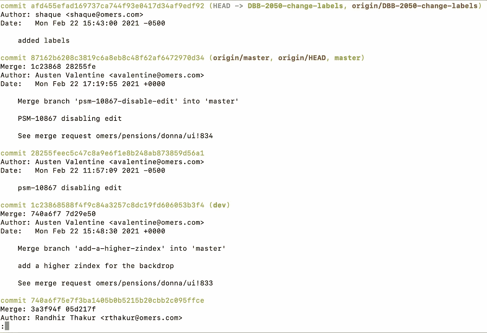
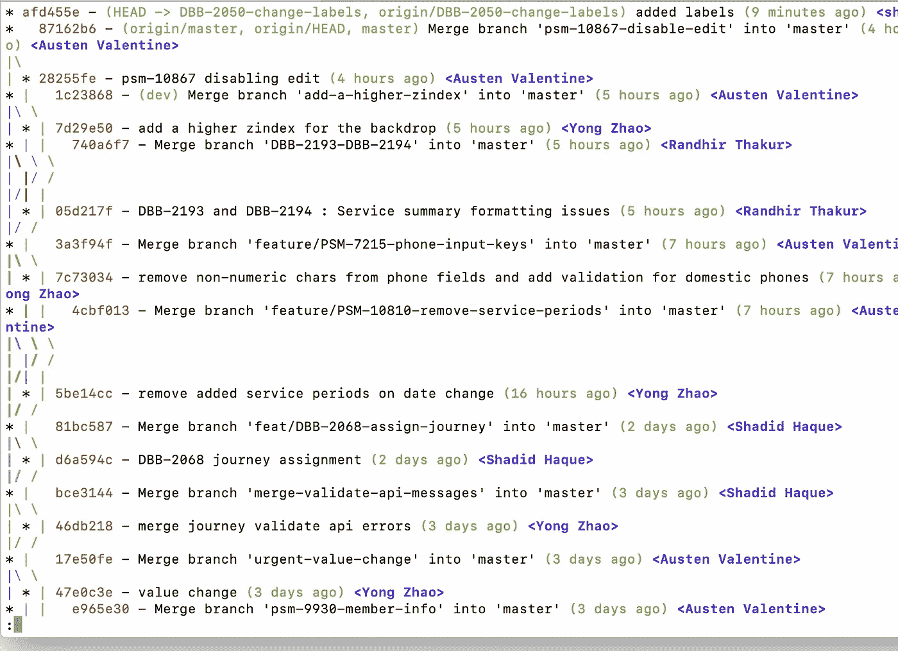

# 每个开发人员都应该知道的 5 个 Git 技巧

> 原文：<https://javascript.plainenglish.io/5-git-tricks-every-developer-should-know-about-53a74632464c?source=collection_archive---------12----------------------->


Photo by [Joppe Spaa](https://unsplash.com/@spaablauw?utm_source=unsplash&utm_medium=referral&utm_content=creditCopyText) on [Unsplash](https://unsplash.com/s/photos/tricks-girl?utm_source=unsplash&utm_medium=referral&utm_content=creditCopyText)

作为软件开发人员，版本控制在我们的日常工作中扮演着重要的角色。在这篇文章中，我们将讨论 5 个 git 技巧和窍门，它们将提高你的生产力，改善你的工作流程，让你成为一个全面的 git 忍者。让我们开始吧:

# 1.删除所有本地 git 分支，但保留 master

您经常处理许多特性，每个特性都需要您创建一个单独的分支。在某些时候，你会有很多你不需要的本地分支。作为一名开发人员，我一直都有这个问题。我想去掉除了 **master/main** 以外的所有分支。下面的命令将完成这个任务。

```
git branch | grep -v “master” | xargs git branch -D
```

# 2.如何在 Git 中撤销最近的本地提交？

这恰好是关于堆栈溢出的最常见的问题之一。假设你犯了一个错误，现在你必须撤销它。

这是我最近做的一个 git 提交，我想撤销它

```
git commit -m “this was a mistake”
```

我可以通过运行**git reset-hard<commit-hash>来重置到任何以前的提交，但这将覆盖我的本地更改(我在本地文件中所做的更改)。我们可以做得更好。**

使用下面的命令，我们可以只撤销最近的提交，而不改变工作树(我们在磁盘上对其进行了更改的文件)。

```
git reset HEAD~
```

运行完这个之后，我们可以像往常一样运行 git add 和 git commit 命令。

```
git add .
git commit -m “some message
```

# 3.终端上更好的 git 日志可视化

您以前肯定使用过“git log”命令。它打印出终端中所有的版本控制历史。



git log output

正如您在上面的输出中看到的，我们可以看到提交历史。我们可以用下面的 git 命令让这更直观

```
git log — graph — pretty=format:’%Cred%h%Creset -%C(yellow)%d%Creset %s %Cgreen(%cr) %C(bold blue)<%an>%Creset’ — abbrev-commit
```

现在，这将打印以下内容:



git log 2

如您所见，这样我们在终端中记录了更多的信息。您还可以通过相关的提交来观察最近的行更改。只要在前一条命令的末尾传入一个 ***-p*** 标志即可。

```
git log --graph --pretty=format:'%Cred%h%Creset -%C(yellow)%d%Creset %s %Cgreen(%cr) %C(bold blue)<%an>%Creset' --abbrev-commit -p
```

# 4.如何从本地和远程删除 git 分支？

这一个是非常自明的。要在本地删除 git 分支，我们可以运行以下命令

```
git branch -d <name of your branch>
```

如果想删除分支而不检查合并状态，使用 ***-D*** *。*

现在，要从远程删除分支，您可以运行以下命令

```
git push origin --delete <your remote branch name>
```

# 5.如何从另一个存储库中挑选

假设我们想要应用来自另一个存储库的一些更改。我们可以通过运行以下命令来做到这一点。

```
git fetch <remote-git-url> <branch> && git cherry-pick SHA1
```

## 结论

我希望您喜欢学习这些 git 技巧。今天到此为止，下次再见！

**参考文献:**

[*https://stack overflow . com/questions/927358/how-do-I-undo-the-most-recent-local-commits-in-git*](https://stackoverflow.com/questions/927358/how-do-i-undo-the-most-recent-local-commits-in-git)

[*https://coder wall . com/p/sgpksw/git-cherry-pick-from-another-repository*](https://coderwall.com/p/sgpksw/git-cherry-pick-from-another-repository)